# Terapia Narrativa Computazionale (Narrative Therapy with AI)

**Summary**: Formalizzazione e trasposizione dei principi clinici ed epistemologici della Terapia Narrativa (sviluppata da Michael White e David Epston) all'interno di architetture di intelligenza artificiale basate su Large Language Models. Il paradigma si focalizza sulla decostruzione delle narrazioni sature di problema (*problem-saturated narratives*), sull'esternalizzazione del disturbo, sulla co-autorialità (*re-authoring*) e sulla ri-tessitura della rete relazionale (*re-membering*).
**Sources**: `2507.20241v2.pdf`
**Last updated**: 2026-08-27
---

## Epistemologia e Presupposti Teorici

La **Terapia Narrativa** (White & Epston, 1990; White, 2007) affonda le proprie radici nel costruzionismo sociale e nella psicologia narrativa (Bruner, 1985; Sarbin, 1986). L'esperienza umana non è considerata un insieme oggettivo di sintomi da diagnosticare e correggere meccanicamente, ma una **trama di significati co-costruiti attraverso il racconto di sé**.

Quando un individuo si trova in una condizione di disagio psicologico, la sua esperienza viene frequentemente colonizzata da una **narrazione satura di problema (*problem-saturated narrative*)**:
- La persona identifica se stessa con il problema (*"Io sono un fallito"*, *"Sono una persona ansiosa e incapace"*).
- Vengono ignorate sistematicamente tutte le esperienze pregresse che contraddicono questa visione negativa.
- L'individuo perde il senso di *agency* (capacità di azione intenzionale sul proprio destino).

La trasposizione computazionale di questo approccio (Feng et al., 2025) mira a superare i limiti dei chatbot di supporto emotivo convenzionali, che si limitano a offrire validazione affettiva e consigli generici, implementando invece una vera guida strutturata alla trasformazione narrativa.

```mermaid
flowchart LR
    subgraph DominantStory ["Narrazione Dominante Satura di Problema"]
        D1["Fusione: Persona = Problema"]
        D2["Cecità verso le Eccezioni"]
        D3["Perdita di Agency"]
    end

    subgraph TherapeuticBridge ["Processo di Terapia Narrativa Computazionale"]
        B1["1. Posizione De-centrata ma Influente"]
        B2["2. Esternalizzazione del Problema"]
        B3["3. Mappatura & Ricerca di Unique Outcomes"]
        B4["4. Re-authoring (Paesaggi Identità e Azione)"]
        B5["5. Re-membering (Tessitura Relazionale)"]
    end

    subgraph AlternativeStory ["Nuova Narrazione Alternativa & Preferita"]
        A1["Distanziamento: 'Il problema è il problema'"]
        A2["Riconoscimento di Valori e Risorse"]
        A3["Agency, Progettualità Futura ed Empowerment"]
    end

    DominantStory --> TherapeuticBridge --> AlternativeStory
```

---

## Principi Guida Tradotti in Vincoli Computazionali (Prompting & Policy)

Per allineare un modello linguistico ([[large-language-models]]) alla conduzione di colloqui di terapia narrativa, il sistema deve incorporare specifiche direttive etico-cliniche:

### 1. Atteggiamento "Decentered yet Influential"
- Il terapeuta artificiale non si pone come un'autorità diagnostica o un dispensatore di soluzioni preconfenzionate (*decentered*). La competenza sulla vita del paziente risiede esclusivamente nel paziente stesso.
- Al contempo, il terapeuta è metodologicamente direttivo (*influential*): formula domande aperte, curiose e strategiche che guidano l'esplorazione verso territori inesplorati della storia di vita.

### 2. Esternalizzazione del Problema (*Externalization*)
- Il linguaggio deve costantemente separare l'identità del cliente dal problema: *"Il problema è il problema; la persona non è il problema"*.
- L'agente guida la personificazione o la nominazione metaforica del disturbo (es. *"La Rabbia"*, *"L'Ombra del Dubbio"*, *"Il Giudice Interno"*), mappando in quali contesti interviene e quali danni procura alle aspirazioni del paziente.

### 3. Ricerca di Esiti Unici (*Unique Outcomes*) e Re-authoring
- Rilevazione attiva di eccezioni ed eventi passati in cui il paziente non ha subito passivamente l'influenza del problema.
- Sviluppo del doppio panorama:
  - **Landscape of Action**: Ricostruzione dettagliata degli eventi, delle decisioni e delle azioni concrete associate all'esito unico.
  - **Landscape of Identity / Consciousness**: Esplorazione dei valori, delle intenzioni profonde, delle speranze e del tipo di persona che emerge da quell'eccezione.

### 4. Conversazioni di Ri-membramento (*Re-membering*)
- L'identità è considerata un'associazione relazionale (*"club of life"*). L'agente stimola la riflessione su figure significative (familiari, maestri, amici o figure simboliche) che hanno contribuito a plasmare i valori positivi del paziente o sulle quali il paziente stesso ha avuto un impatto trasformativo.

### 5. Consapevolezza dei Discorsi Sociali e Culturali
- Riconoscimento che molte convinzioni disfunzionali derivano da costrutti sociali dominanti (aspettative di genere, imperativi di produttività, standard estetici o genitoriali rigidi). L'agente aiuta a decostruire tali narrazioni culturali imposte dall'esterno.

---

## Confronto: Chatbot Tradizionali vs Terapia Narrativa Computazionale

| Dimensione Clinica | Chatbot di Supporto Emotivo Generico | Agente di Terapia Narrativa Computazionale (INT) |
| :--- | :--- | :--- |
| **Postura Terapeutica** | Fornitore di consigli, empatia passiva, diagnosi implicita. | *Decentered yet influential*: ascolto curioso, co-autorialità. |
| **Rapporto con il Problema** | Interiorizzato (*"Come puoi gestire la TUA ansia?"*). | Esternalizzato (*"Cosa cerca di farti credere l'Ansia quando si presenta?"*). |
| **Progressione Intra-seduta** | Stazionaria: cicli ripetuti di sfogo e conforto (*Reassuring loop*). | Dinamica: progressione strutturata da *Trust Building* a *Re-membering*. |
| **Obiettivo Clinico** | Riduzione immediata del distress sintomatico. | Trasformazione dell'identità narrativa ed emancipazione personale. |
| **Monitoraggio Efficacia** | Punteggi di empatia o gradimento superficiale. | Rilevazione quantitativa di *Innovative Moments* ([[innovative-moment-assessment]]). |

---

## Impatto e Sintesi di Dati di Addestramento (Dataset NTConv)

L'adozione della terapia narrativa computazionale non solo migliora l'interazione diretta, ma consente di generare dataset sintetici ad altissima fedeltà clinica:
- L'architettura [[interactive-narrative-therapist]] è stata impiegata per sintetizzare il dataset **NTConv** (in corrispondenza 1:1 con il dataset ESConv).
- Modelli open-weight addestrati su dialoghi strutturati con principi di terapia narrativa dimostrano superiori capacità di ascolto, generazione di domande maieutiche e guida non invasiva nei compiti di supporto emotivo reale.

---

## Related pages
- [[feng-et-al-2025]]
- [[interactive-narrative-therapist]]
- [[innovative-moment-assessment]]
- [[process-of-change]]
- [[simulazione-pazienti-ai]]
- [[rag-in-psicoterapia]]
- [[human-in-the-reasoning]]
- [[ai-assisted-psychotherapy]]
