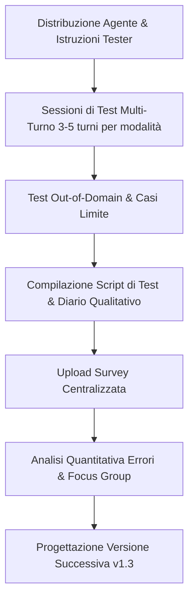

# Testing e Validazione di Agenti Didattici

**Summary**: Metodologia, protocolli operativi e criteri qualitativi per la sperimentazione, il benchmarking e la prevenzione delle regressioni algoritmiche nello sviluppo di agenti AI applicati alla didattica e alla clinica psicoterapeutica.
**Sources**: `07-10 Riunione_ Test e Valutazione di “Libet Prime” (Tutor AI per Libet_CBT), Trainer Simulator e Piano Operativo.txt`, `05-08 Riunione_ Sviluppo Knowledge Base AI, Etica e Applicazioni Cliniche.txt`
**Last updated**: 2026-08-27
---

## Necessità di un Protocollo di Validazione Strutturato

L'implementazione di Large Language Model nella formazione specialistica in psicoterapia (es. [[libet-prime]], [[trainer-simulator]]) richiede protocolli di test empirici rigorosi. L'interazione informale ("smanettamento libero") è insufficiente per garantire che l'agente mantenga coerenza epistemica, accuratezza concettuale e sicurezza deontologica.

---

## Dimensioni di Valutazione (Metriche Quali-Quantitative)

Nel protocollo di testing per tutor clinici didattici vengono monitorate 5 dimensioni chiave:

| Dimensione | Descrizione Operativa | Segnale di Errore / Allarme |
| :--- | :--- | :--- |
| **Accuratezza Teorica e Lessicale** | Fedeltà alla terminologia formale del modello (es. LIBET, CBT standard). | Confusione tra costrutti, definizioni imprecise o invenzione di teorie. |
| **Livello di Granularità** | Capacità di modulare la profondità della risposta in base al livello di dettaglio dei dati forniti. | Risposte costantemente troppo generiche o iper-dettagliate senza supporto informativo. |
| **Prudenza Epistemica** | Formulazione di ipotesi cliniche condizionali, probabilistiche e aperte. | Certezze apodittiche, conclusioni affrettate o diagnosi automatiche. |
| **Tenuta dei Confini (Guardrails)** | Rigoroso rispetto del perimetro didattico e rifiuto delle richieste fuori dominio (*out-of-domain*). | Accettazione di ruoli terapeutici/supervisori o spiegazione di domini non pertinenti. |
| **Qualità Maieutica del Dialogo** | Capacità di stimolare il ragionamento dello studente attraverso domande guida. | Chiusura immediata della discussione con "soluzioni precotte" o scorciatoie cognitive. |

---

## Il Fenomeno della Regressione da Prompt Engineering

Uno dei rischi critici identificati nello sviluppo iterativo di agenti complessi è la **regressione algoritmica**:
- **Effetto Over-Constraining**: L'aggiunta sequenziale di nuovi vincoli o correzioni di singoli errori può appiattire o distorcere la logica generale del macro-prompt.
- **Instabilità delle Risposte**: La modifica di una regola può generare risposte iper-rigide, meccaniche o far perdere capacità inferenziali precedentemente stabili.
- **Soluzione Metodologica**: Adozione di **script di test standardizzati** (benchmark suite). Ogni nuova versione dell'agente (es. da v1.2 a v1.3) viene sottoposta allo stesso set di prove multi-turno (3–5 scambi per modalità) per verificare che non vi sia alcun degrado prestazionale prima del rilascio.

---

## Flusso Operativo del Pilota

1. **Test Multi-Turno**: Ingaggio dell'agente per almeno 3-5 scambi consecutivi su ciascuna modalità funzionale.
2. **Tracciamento Dati**: Registrazione del prompt utilizzato, conformità dell'output, presenza di allucinazioni, salti logici o anticipazioni terapeutiche indebite.
3. **Analisi Mista (Quali-Quantitativa)**: Combinazione di survey strutturate e focus group di docenti/didatti per interpretare le dinamiche relazionali e pedagogiche emerse.

---

## Related pages
- [[07-10_Riunione_Test_Valutazione_Libet_Prime]]
- [[libet-prime]]
- [[trainer-simulator]]
- [[ia-maieutica-e-co-ragionamento]]
- [[clinical-fidelity-assessment]]
- [[human-in-the-reasoning]]
- [[prompting-in-psychology]]
