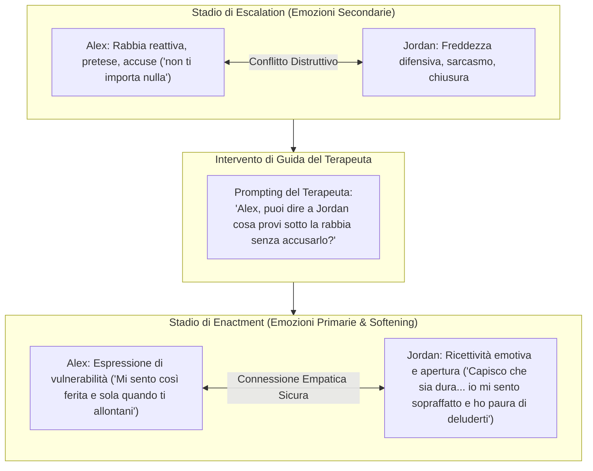

# Simulazione dell'Enactment Terapeutico ed Espressione di Vulnerabilità

## Definizione Operativa
- Modellizzazione e riproduzione computazionale dell'**Enactment (Messa in Atto)**, un intervento terapeutico strutturato e guidato dal clinico (particolarmente centrale nella Terapia di Coppia Focalizzata sulle Emozioni - EFT e nella Terapia Strutturale di Minuchin) in cui i partner vengono invitati a rivolgersi direttamente l'uno all'altro per comunicare bisogni affettivi ed emozioni primarie anziché parlare tramite il terapeuta.
- **Processo di Softening e Transizione Emotiva:**
  1. **Da Emozioni Secondarie Reattive a Emozioni Primarie Vulnerabili:** Nelle fasi di *Escalation*, i partner manifestano emozioni secondarie difensive (rabbia, risentimento, disprezzo, chiusura). Durante l'Enactment guidato dal terapeuta, gli agenti attivano prompt specifici che ammorbidiscono le pretese (*softening*) ed esprimono sentimenti nucleari vulnerabili (dolore per la disconnessione, paura dell'abbandono, senso di solitudine, vergogna, bisogno di vicinanza).
  2. **Interazione Guidata Diadica:** Gli agenti riducono il tono accusatorio, sospendono le recriminazioni passate e si aprono all'ascolto empatico della sofferenza dell'altro, creando una nuova esperienza emozionale correttiva (*corrective emotional experience*).

## Evidenze dalla Letteratura
- **Impatto sull'Alleanza e sull'Esito Clinico:** La ricerca sui processi in EFT (Johnson & Greenman, 2006; Woolley et al., 2012) dimostra che gli eventi di *softening* durante gli enactment costituiscono i predittori più robusti del successo terapeutico e della ricostruzione di un attaccamento sicuro.
- **Riconoscimento e Fedeltà nella Simulazione:** Nello studio di validazione tecnica, lo stadio di Enactment generato dagli agenti ha raggiunto una precisione del 100% e un accordo sostanziale ($\kappa = 0.723$, F1 = 0.84) rispetto alle annotazioni umane, dimostrando che gli agenti sono in grado di attenuare la reattività aggressiva su sollecitazione clinica (Wang, Chen et al., 2026).
- **Valore Didattico per i Terapeuti:** I clinici partecipanti hanno evidenziato che la simulazione permette ai tirocinanti di sperimentare la delicata transizione dall'escalation all'enactment, imparando a calibrare il tempismo degli inviti al dialogo diretto e a verificare se i partner sono pronti ad aprirsi senza ricadere immediatamente nelle accuse (Wang, Chen et al., 2026; Andersson et al., 2006).

**Riferimenti Bibliografici:**
- Wang, C., Chen, A., Bao, C., Jin, S., Swartz, H., Wu, T., Kraut, R. E., & Zhu, H. (2026). Simulating Couple Conflict: Designing A Multi-Agent System for Therapy Training and Practice. *arXiv preprint arXiv:2601.10970v2*. https://arxiv.org/abs/2601.10970
- Johnson, S. M., & Greenman, P. S. (2006). The Path to a Secure Bond: Emotionally Focused Couple Therapy. *Journal of Clinical Psychology*, 62(5), 597–609.
- Woolley, S. R., Wampler, K. S., & Davis, S. D. (2012). Enactments in couple therapy: Identifying therapist interventions associated with positive change. *Journal of Family Therapy*, 34(3), 284–305.
- Andersson, L. G., Butler, M. H., & Seedall, R. B. (2006). Couples’ experience of enactments and softening in marital therapy. *The American Journal of Family Therapy*, 34(4), 301–315.

## Relazioni
- Vedi anche: [[wang-chen-et-al-2026]], [[demand-withdraw-multi-agent-dynamics]], [[sense-plan-act-therapy-simulation]], [[stage-structured-dialogue-control]], [[simulated-therapeutic-alliance]], [[clinical-fidelity-assessment]]
