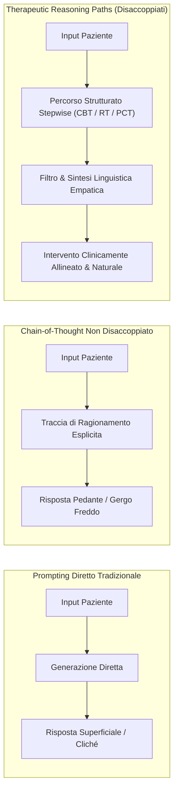
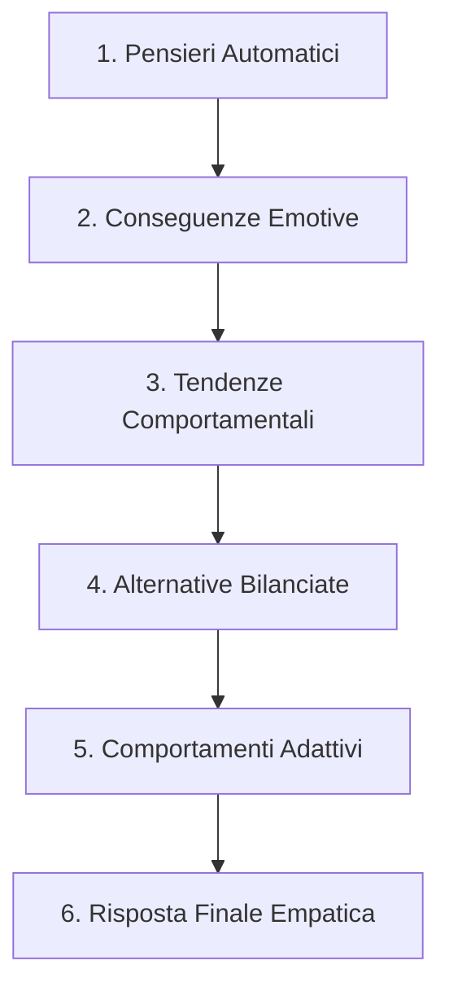

# Percorsi di Ragionamento Psicoterapeutico (Therapeutic Reasoning Paths)

**Summary**: Metodologia di ingegneria del ragionamento per modelli linguistici applicati alla salute mentale, basata sulla scomposizione dei protocolli psicoterapeutici (CBT, Reality Therapy, Person-Centered Therapy) in sequenze procedurali esplicite (*stepwise reasoning paths*). Tale approccio disaccoppia la traccia inferenziale clinica interna dal testo empatico finale, prevenendo risposte generiche, moralistiche o pedanti e garantendo elevata aderenza teorica.
**Sources**: `2510.03913v1.pdf` (Abbasi & Naderi, 2025: *PsychoLexTherapy: Simulating Reasoning in Psychotherapy with Small Language Models in Persian*), `2507.20241v2.pdf` (Feng et al., 2025: *Interactive Narrative Therapist*)
**Last updated**: 2026-08-27
---

## Il Problema del Ragionamento Superficiale nell'IA Clinica

Nei sistemi conversazionali standard orientati al supporto emotivo, i modelli generativi tendono a generare risposte basandosi esclusivamente sulla similarità superficiale dei pattern linguistici (*surface-level mimicry*):
- **Consolazioni Generiche e Cliché**: Il modello si limita a frasi rassicuranti (*"Capisco il tuo dolore, andrà tutto bene"*) prive di progressione verso il cambiamento.
- **Intrusione Analitica (Pedanteria Clinica)**: Quando si applicano tecniche di Chain-of-Thought (CoT) standard senza filtri, la traccia analitica viene riversata direttamente nel messaggio rivolto all'utente, trasformando il tono in un'analisi didascalica e fredda che distrugge l'alleanza terapeutica.
- **Mancanza di Fedeltà di Modello**: L'assenza di vincoli procedurali porta il modello a mescolare indicazioni contraddittorie provenienti da paradigmi clinici eterogenei.

I **Therapeutic Reasoning Paths** introducono una sequenza formale di passaggi inferenziali che guidano il modello a pensare come un terapeuta prima di formulare la risposta verbale.

---

## I Tre Percorsi Procedurali di PsychoLexTherapy

### 1. Percorso CBT (Cognitive Behavioral Therapy) - 6 Fasi
Modella la decostruzione e ristrutturazione della triade cognitiva di Beck (pensiero-emozione-comportamento):

1. **Estrazione dei Pensieri Automatici Negativi (*Automatic Thoughts*)**: Identificazione delle cognizioni distorte, assolute e rigide sottostanti la narrazione del paziente (es. *"fallisco sempre in tutto"*).
2. **Inferenza delle Conseguenze Emotive (*Emotional Consequences*)**: Mappatura degli stati affettivi derivati da tali pensieri (es. vergogna, disperazione, colpa).
3. **Proiezione delle Tendenze Comportamentali (*Behavioral Tendencies*)**: Simulazione delle reazioni probabili indotte dal binomio pensiero-emozione (es. isolamento, evitamento, reazioni aggressive difensive).
4. **Generazione di Alternative Bilanciate (*Balanced Alternatives*)**: Formulazione di pensieri alternativi realistici, ragionevoli e culturalmente coerenti volti a ridurre la sofferenza soggettiva.
5. **Derivazione di Strategie Comportamentali Adattive (*Adaptive Behaviors*)**: Identificazione di micro-azioni pratiche e graduali volte a testare la validità delle nuove credenze.
6. **Sintesi in Risposta Terapeutica**: Integrazione di tutte le informazioni in un messaggio caldo, discorsivo e privo di tecnicismi clinici.

---

### 2. Percorso Reality Therapy (RT) - 5 Fasi
Basato sui principi della teoria della scelta di Glasser, focalizza l'attenzione sulla responsabilità personale (*agency*) e sull'appagamento dei bisogni umani primari:

1. **Identificazione dei Bisogni e Desideri Fondamentali (*Core Needs & Wants*)**: Estrazione dei motori motivazionali primari (amore/appartenenza, potere/valore personale, libertà, sicurezza, divertimento).
2. **Analisi dei Comportamenti Attuali (*Current Behaviors*)**: Esame analitico delle scelte d'azione attuali del paziente per verificare se avvicinano o allontanano dai bisogni identificati.
3. **Valutazione Critica delle Conseguenze (*Behavioral Consequences*)**: Riflessione sull'efficacia e sui costi emotivi delle scelte attuali (es. *"essere ostinato mi difende temporaneamente ma mi allontana dagli altri"*).
4. **Pianificazione di Comportamenti Alternativi (*Alternative Behaviors*)**: Elaborazione di piani d'azione realistici, progressivi e orientati all'autonomia.
5. **Integrazione in un Messaggio Responsabilizzante**: Formulazione di un riscontro non-giudicante che favorisca la motivazione intrinseca e l'impegno verso il cambiamento.

---

### 3. Percorso Person-Centered Therapy (PCT) - 3 Fasi
Ispirato alla terapia centrata sulla persona di Carl Rogers, prioritarizza l'ascolto riflessivo e l'accettazione positiva incondizionata:

1. **Riflessione Empatica e Comprensione Emotiva (*Empathic Reflection*)**: Analisi profonda dello stato affettivo del paziente e rispecchiamento verbale per trasmettere accoglienza e sicurezza (*"mi sento ascoltato e riconosciuto"*).
2. **Domande Esplorative per l'Autoconsapevolezza (*Exploratory Questioning*)**: Formulazione di quesiti aperti e non inquisitori che invitano il paziente ad approfondire il significato personale della propria esperienza.
3. **Risposta Supportiva Non-Direttiva**: Sintesi conclusiva che restituisce al cliente il ruolo di protagonista del proprio processo di autocomprensione.

---

## Confronto con Architetture Alternative

| Dimensione | Prompting Generico | Chain-of-Empathy (CoT) | Multi-Agent Debate | Therapeutic Reasoning Paths |
| :--- | :--- | :--- | :--- | :--- |
| **Allineamento Clinico** | Basso (1,24/10) | Medio-Basso (1,70/10) | Buono (7,92/10) | **Eccellente (8,34/10)** |
| **Coerenza Strutturale** | Bassa (2,92/10) | Bassa (1,62/10) | Buona (7,08/10) | **Eccellente (8,76/10)** |
| **Naturalezza & Umanità** | Superficiale (2,50/10) | Meccanico/Freddo (3,95/10) | Polifonico/Verboso (5,21/10) | **Fluente & Caldo (6,04/10)** |
| **Costo Computazionale** | Minimo | Basso | Molto Elevato (molteplici agenti) | **Ottimizzato per SLM On-Device** |
| **Rischio di Allucinazione** | Alto | Medio (rottura della catena) | Medio-Basso | **Minimo (vincoli a checklist)** |

---

## Concetti Correlati

- [[psycholextherapy-framework]]: L'architettura globale che implementa questi percorsi.
- [[on-device-slm-mental-health]]: Come i piccoli modelli eseguono sequenze inferenziali complesse.
- [[memory-augmented-therapeutic-dialogue]]: Integrazione del profilo utente nei percorsi di ragionamento.
- [[cbt-dialogue-systems-and-tools]]: Sistemi conversazionali dedicati alla CBT.
- [[stepwise-cot]]: Metodologie di Chain-of-Thought guidate da regole procedurali.
