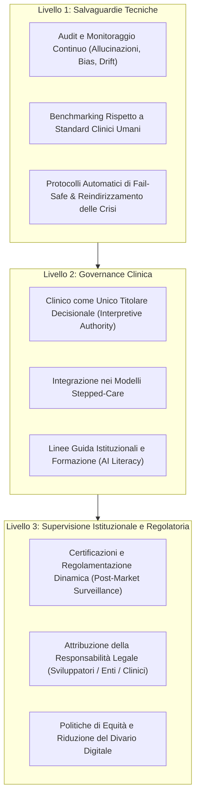

# Three-Layer Governance Framework (AI in Mental Health)

**Summary**: Modello di governance a tre livelli (Salvaguardie Tecniche, Governance Clinica, Supervisione Istituzionale e Regolatoria) ideato per guidare l'integrazione sicura, etica ed equa dell'intelligenza artificiale nel counseling psicologico e nei servizi di salute mentale.
**Sources**: Erdemir & Sumbas (2026) - `10.1177_00469580261438322.pdf`
**Last updated**: 2026-08-27
---

## Definizione e Modello Teorico

Il **Three-Layer Governance Framework** (Erdemir & Sumbas, 2026) nasce per superare la dicotomia tra ottimismo tecnologico ingenuo e allarmismo etico nell'adozione dell'IA in salute mentale. Il framework struttura l'integrazione tecnologica su tre livelli interdipendenti e non negoziabili, fondandosi sul paradigma *"Integration Rather Than Replacement"* (l'IA come strumento di potenziamento della cura centrata sull'umano, non come sostituto del clinico).

---

## I Tre Livelli Fondativi

### 1. Livello 1: Salvaguardie Tecniche (*Technical Safeguards Layer*)
Garantisce la solidità algoritmica, l'affidabilità e la trasparenza prima e durante l'uso clinico:
- **Validazione Pre-deployment Rigorosa**: Misurazione dei tassi di errore e delle allucinazioni statistiche.
- **Benchmarking Clinico**: Confronto continuo delle performance del modello rispetto a criteri gold standard di terapeuti umani esperti.
- **Audit per Bias e Instabilità**: Monitoraggio regolare per prevenire il decadimento delle prestazioni (*model drift*) e distorsioni sistematiche.
- **Meccanismi di Spiegabilità (*Explainability*)**: Integrazione di percorsi logici tracciabili e indicatori di confidenza.
- **Protocolli di Escalation Automatica (*Fail-Safe Crisis Protocols*)**: Rilevamento immediato di contenuti suicidari o distress acuto con interruzione dell'elaborazione automatica e trasferimento istantaneo al clinico o ai servizi d'emergenza.

### 2. Livello 2: Governance Clinica (*Clinical Governance Layer*)
Garantisce la centralità del giudizio clinico umano e l'accountability professionale:
- **Ausilio Decisionale (*Decision Support Tool*)**: L'IA opera solo per coadiuvare la formulazione, l'analisi e la documentazione, senza alcuna autonomia terapeutica primaria.
- **Autorità Interpretativa Esclusiva**: Il clinico abilitato mantiene la piena titolarità su diagnosi, valutazione del rischio e piano di trattamento.
- **Protocolli Istituzionali d'Uso**: Definizione chiara di contesti appropriati, controindicazioni (es. psicosi attiva, traumi dissociativi non stabilizzati) e standard di documentazione in cartella.
- **Formazione e AI Literacy**: Inclusione dell'alfabetizzazione sull'IA nei curricula accademici per addestrare i counselor a valutare criticamente gli output computazionali.

### 3. Livello 3: Supervisione Istituzionale e Regolatoria (*Policy & Institutional Oversight Layer*)
Regola l'ecosistema sanitario a livello macro per tutelare la sicurezza pubblica e i diritti del paziente:
- **Regolamentazione Adattiva**: Adozione di modelli di sorveglianza post-commercializzazione (*post-market surveillance*) capaci di monitorare modelli generativi probabilistici in costante evoluzione.
- **Delineazione Chiara della Responsabilità Giuridica**: Definizione non ambigua delle responsabilità in caso di esito avverso tra programmatori/fornitori di tecnologia, istituzioni sanitarie ed esercenti la professione.
- **Equità nell'Accesso**: Politiche sanitarie pubbliche che incentivano strumenti multilingue, economicamente sostenibili e validati su popolazioni eterogenee, evitando che l'innovazione aumenti le disuguaglianze sociali.

---

## Implicazioni Pratiche e CBT
- **Setting CBT Ibrido**: L'adozione del framework consente di implementare assistenti digitali per il monitoraggio dei compiti a casa (schede ABC, diari dei pensieri disfunzionali) all'interno di un perimetro validato e sicuro.
- **Prevenzione della "Moral Crumple Zone"**: Stabilire standard chiari tutela il clinico dal diventare l'unico responsabile passivo di fallimenti generati da sistemi opachi.

---

## Related pages
- [[erdemir-sumbas-2026]]
- [[stepped-care-ai-integration]]
- [[technical-vulnerabilities-llm-counseling]]
- [[simulated-empathy-vs-authentic-presence]]
- [[algorithmic-bias-and-digital-inequalities]]
- [[human-in-the-reasoning]]
- [[digital-therapeutic-alliance]]
- [[clinical-fidelity-assessment]]
