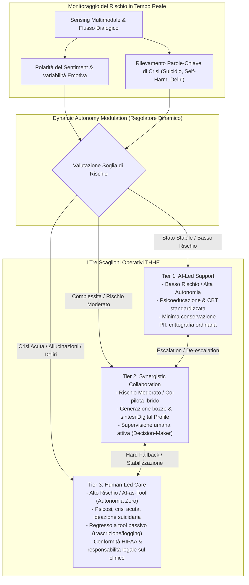

# Tiered Human–AI Healing Ecosystem (THHE)

## Definizione Operativa
- Il **Tiered Human–AI Healing Ecosystem (THHE)** è un modello sistemico di governance, interazione e delivery clinica formalizzato da **Ma, Chen e Yang (2026)** per strutturare la cooperazione sicura, etica e scalabile tra esseri umani e agenti intelligenti nella salute mentale.
- **Modulazione Dinamica dell'Autonomia (*Dynamic Autonomy Modulation - DAM*):** Il principio cardine del THHE risiede nella calibrazione in tempo reale dell'autonomia dell'IA in funzione del **rischio clinico contingente** anziché delle sole etichette diagnostiche statiche. Pazienti con diagnosi lievi possono manifestare improvvisi scompensi acuti, mentre quadri clinici moderati possono beneficiare di moduli automatizzati supervisionati.
- **Utilità Clinica e CBT:** Struttura un modello *stepped-care* adattivo in cui compiti a bassa intensità (psicoeducazione CBT, ristrutturazione di distorsioni cognitive ordinarie, compilazione di diari ABC) sono erogati autonomamente dall'agente (Tier 1), compiti a media complessità sono gestiti in co-piloting con sintesi di profili digitali (Tier 2), e situazioni di emergenza/psicosi revocano l'autonomia generativa della macchina per restituire il pieno comando al clinico umano (Tier 3).

---

## Architettura e Articolazione dei Tre Livelli (*Tiers*)

### 1. Tier 1: AI-Led Support (Autonomia Piena / Rischio Lieve)
- **Target Clinico:** Utenti con distress emotivo sub-clinico, disturbi dell'adattamento lievi, bisogni di psicoeducazione, igiene del sonno o potenziamento delle abilità di coping.
- **Criteri di Ingresso:** Punteggi di polarità del sentiment stabili entro intervalli di sicurezza; totale assenza di indicatori di autolesionismo, ideazione suicidaria o disancoraggio dalla realtà.
- **Meccanismo Operativo:** L'agente IA (AI-A) opera in modo autonomo impiegando protocolli evidence-based strutturati (es. interventi CBT conversazionali come validato nell'RCT di *Therabot*; Heinz et al., 2025).
- **Privacy e Governance:** Crittografia standard dei flussi comunicativi, minimizzazione estrema dei dati di identificazione personale (*Personally Identifiable Information - PII*), consenso informato sull'interazione con un sistema algoritmico.

---

### 2. Tier 2: Synergistic Collaboration (Collaborazione Sinergica / Rischio Moderato)
- **Target Clinico:** Casi che presentano una complessità psicologica intermedia, distress persistente, quadri ansioso-depressivi moderati o difficoltà che richiedono giudizio interpretativo sfumato.
- **Meccanismo Operativo:** L'IA assume il ruolo di **co-pilota clinico** (*clinical copilot*):
  - Elabora e sintetizza il **Profilo Digitale (*Digital Profile*)** del paziente a partire dalle interazioni longitudinali e dai dati di monitoraggio.
  - Propone bozze di intervento, schede di ristrutturazione cognitiva personalizzate e alert predittivi di fluttuazione dell'umore.
  - **Autorità Decisionale:** Il clinico umano mantiene l'esclusiva titolarità delle decisioni terapeutiche, approvando, modificando o respingendo i suggerimenti della macchina (*Human-in-the-loop*).
- **Monitoraggio Transferale:** Valutazione attiva della relazione utente-IA per evitare attaccamenti disfunzionali o fenomeni di compiacenza patologica.

---

### 3. Tier 3: Human-Led Care (Cura Guidata dall'Umano / AI-as-Tool / Alto Rischio)
- **Target Clinico:** Episodi depressivi maggiori gravi, ideazione o pianificazione suicidaria, comportamenti autolesivi acuti, sintomi psicotici attivi (deliri, allucinazioni) e rapido deterioramento del sentiment.
- **Criteri di Trigger e Fallback:** L'identificazione di parole-chiave di crisi (*suicide, kill myself, hearing voices, surveillance*), l'emersione di disallineamenti cognitivi o instabilità stocastica provoca l'**interruzione istantanea dell'autonomia generativa dell'agente**.
- **Regresso a Strumento Passivo (AI-T):** L'IA viene retrocessa a strumento ausiliario di supporto documentale (trascrizione automatica della seduta, sintesi cronologica dei sintomi, estrazione di dati clinici strutturati).
- **Privacy e Deontologia:** Archiviazione ad altissima sicurezza conforme a normative sanitarie stringenti (HIPAA / GDPR per dati particolari ex Art. 9), con la responsabilità medico-legale (*chain of liability*) pienamente ancorata al professionista sanitario supervisore.

---

## Confronto Strutturale dei Tre Livelli

| Caratteristica | Tier 1: AI-Led Support | Tier 2: Synergistic Collaboration | Tier 3: Human-Led Care |
| :--- | :--- | :--- | :--- |
| **Livello di Rischio** | Lieve / Sub-clinico | Moderato / Complesso | Alto / Emergenza Psichiatrica |
| **Ruolo dell'IA** | Agente autonomo generativo (AI-A) | Co-pilota clinico / Assistente analitico | Strumento passivo (AI-T) |
| **Autonomia Decisionale** | Alta (entro protocolli validati) | Condivisa (decisione finale al clinico) | Zero (autonomia revocata) |
| **Ruolo del Clinico** | Supervisore asincrono / di sistema | Co-terapeuta / Titolare del piano di cura | Guida esclusiva dell'intervento |
| **Regime di Privacy** | Minima PII, cifratura ordinaria | Conservazione clinica protetta | Conformità rigorosa HIPAA / GDPR |
| **Responsabilità Legale** | Consenso utente / Fornitore software | Istituzione sanitaria / Clinico supervisore | Clinico curante abilitato |

---

## Salvaguardie Tecniche e Limiti Epistemici

1. **Vulnerabilità di RAG e XAI:**
   - I sistemi *Retrieval-Augmented Generation* (RAG) riducono le allucinazioni ma restano esposti a **"allucinazioni ancorate" (*grounded hallucinations*)**, generate da sovraccarico di contesto o recupero di linee guida parziali.
   - I metodi di *Explainable AI* (XAI, es. SHAP e LIME), concepiti per modelli lineari/tabulari, faticano a spiegare le traiettorie semantiche non lineari degli LLM.
2. **Necessità della Presenza Umana:** Nel THHE, gli strumenti tecnologici fungono da meccanismi di ausilio e non da garanzie assolute di sicurezza; la presenza del terapeuta umano resta l'unico "ancoraggio di realtà" (*Reality Anchor*) in grado di invalidare i circoli allucinatori e fornire una vera sintonizzazione affettiva.
3. **Requisiti per l'Ingegnerizzazione Futura:** Per trasformare il THHE da modello concettuale a protocollo operativo testabile, la ricerca clinica e computazionale deve:
   - Stabilire soglie numeriche precise per la varianza del sentiment.
   - Fissare metriche di latenza massima per il passaggio di consegne (*handover latency*) dall'IA al clinico umano.
   - Definire interfacce visive human-centered per la gestione in tempo reale degli alert clinici nei Tier 2 e 3.

---

**Riferimenti Bibliografici:**
- Ma, A., Chen, J., & Yang, Z. (2026). From Tool to Agent: A Semi-Systematic Review of Human–AI Alignment and a Proposed Tiered Healing Ecosystem for Mental Health. *Healthcare*, 14(6), 820. https://doi.org/10.3390/healthcare14060820
- Heinz, M. V., Mackin, D. M., Trudeau, B. M., Bhattacharya, S., Wang, Y., Banta, H. A., ... & Jacobson, N. C. (2025). Randomized trial of a generative AI chatbot for mental health treatment. *NEJM AI*, 2, AIoa2400802.
- Kim, Y., Jeong, H., Park, C., Park, E., Zhang, H., Liu, X., et al. (2025). Tiered agentic oversight: a hierarchical multi-agent system for AI safety in healthcare. *arXiv preprint arXiv:2506.12482*.
- Xie, Z., Wang, H., Dai, L., Wang, Z., Song, H., & Qian, J. (2026). Ethical issues in multi-agent AI systems for healthcare: a narrative review. *Frontiers in Public Health*, 14, 1792627.

---

## Relazioni
- Vedi anche: [[healthcare-14-00820]], [[power-safety-paradox]], [[tiered-autonomy-in-clinical-ai]], [[three-layer-governance-framework]], [[stepped-care-ai-integration]], [[modello-centauro-clinico]], [[simulated-empathy-vs-authentic-presence]], [[rlhf-safety-therapeutic-conflict]], [[ai-psychosis]]
