# Trade-Off tra Conversazione e Ragionamento nei Modelli Linguistici Clinici

**Summary**: Fenomeno empirico evidenziato nei sistemi multi-agente per la salute mentale, caratterizzato dalla divergenza tra le prestazioni dei Large Language Model (LLM) ottimizzati per la fluidità conversazionale ed empatica e quelli addestrati specificamente per il ragionamento logico-deduttivo e la diagnosi differenziale.
**Sources**: `2508.11398v2.pdf` (Ozgun et al., CIKM 2025: *Trustworthy AI Psychotherapy: Multi-Agent LLM Workflow for Counseling and Explainable Mental Disorder Diagnosis*)
**Last updated**: 2026-08-27
---

## Inquadramento e Definizione

Nel panorama dei [[large-language-models]], si osserva una crescente specializzazione architetturale e di addestramento:
1. **Modelli Conversazionali / Dialogue-Optimized** (es. Meta Llama-4-scout-17b, Mistral-Saba-24b): Ottimizzati tramite RLHF e dataset dialogici per massimizzare la naturalezza comunicativa, la sintonizzazione empatica, la gestione del registro e la coerenza multi-turno.
2. **Modelli di Ragionamento / Reasoning-Optimized** (es. Qwen-QWQ-32b, modelli basati su catene di pensiero esplicite CoT): Ottimizzati tramite *reinforcement learning* per l'inferenza logica passo-passo, il problem-solving complesso e l'ancoraggio deduttivo a regole formali.

L'applicazione di questi modelli al setting clinico (screening, diagnosi psichiatrica e psicoterapia) ha messo in luce un marcato **trade-off funzionale tra realismo conversazionale e accuratezza diagnostica**.

```mermaid
graph LR
    subgraph Conversational_Models ["Modelli Conversazionali (Llama-4, Mistral-Saba)"]
        C1["Alta Empatia & Registro Clinico Caldo"]
        C2["Ottima Valutazione Rubrica (4.26 - 4.41 / 5)"]
        C3["Bassa Accuratezza Diagnostica (F1: 63 - 65%)"]
        C4["Razionali Opachi / Black-box"]
    end

    subgraph Reasoning_Models ["Modelli di Ragionamento (Qwen-QWQ-32b)"]
        R1["Qualità Conversazionale Minore (-9.23%)"]
        R2["Massima Accuratezza Diagnostica (F1: 77.0%)"]
        R3["Eccellente Esplicabilità Step-by-Step"]
        R4["Ancoraggio Rigoroso ai Criteri DSM-5 (A-E)"]
    end

    Conversational_Models <--> |"Trade-Off Funzionale"| Reasoning_Models
```

---

## Evidenze Sperimentali (Ozgun et al., 2025)

Lo studio comparativo su 8.000 dialoghi clinici standardizzati ha quantificato questa dicotomia su tre dimensioni analitiche:

### 1. Realismo del Dialogo ed Empatia
- **Llama-4-scout-17b** e **Mistral-Saba-24b** ottengono le valutazioni più elevate da parte dei revisori LLM basati su rubrica clinica (punteggi medi compresi tra **4.26 e 4.41 su 5**), dimostrando eccellente sensibilità empatica, tono professionale e capacità di esplorare i domini DSM in modo naturale. Llama-4 registra inoltre il miglior indice di leggibilità (Flesch Reading Ease = 61.67).
- **Qwen-QWQ-32b** ottiene punteggi inferiori (3.64–4.23 su 5, circa **9.23% peggiore**), riflettendo uno stile conversazionale più rigido, formale o talvolta meccanico.
- **GPT-4.1-Nano** registra un netto decadimento qualitativo nel dialogo (1.89–2.54 su 5, con un divario del **-48.91%** rispetto ai leader), risultando inadatto alla conduzione dell'intervista clinica.

### 2. Accuratezza Diagnostica e Gestione dei Casi Complessi
- **Qwen-QWQ-32b** domina l'accuratezza diagnostica con un'accuratezza del **70%**, Recall del **72%** e **F1-Score del 77%**. Nei disturbi ad alta complessità e sovrapposizione sintomatica come il *Disturbo dell'Adattamento*, Qwen-QWQ è l'unico modello a raggiungere un F1 del **40.25%**, laddove tutti i modelli conversazionali collassano al di sotto del 3%.
- **Llama-4** e **Mistral-Saba** si fermano rispettivamente a F1 del **65%** e **63%**, fallendo frequentemente nella diagnosi differenziale di disturbi affettivi e comorbilità.

### 3. Esplicabilità e Tracciabilità del Razionale
- I modelli di ragionamento generano spontaneamente catene di inferenza numerate, citando le frasi letterali del paziente e collegandole direttamente alle clausole dei criteri (es. Criteri A–E del DSM-5).
- I modelli conversazionali tendono a generare razionali riassuntivi generici privi di tracciabilità delle prove (*black-box justification*).

---

## Implicazioni Architetturali: Verso Sistemi Multi-Agente Eterogenei

La conclusione fondamentale sul piano ingegneristico e clinico è che **nessun singolo modello LLM attuale è ottimale per tutte le fasi del processo clinico**:

| Ruolo Clinico | Requisito Principale | Modello Ideale | Architettura Raccomandata |
| :--- | :--- | :--- | :--- |
| **Therapist Agent** | Empatia, sintonizzazione, naturalezza, non-giudizio | Modello Conversazionale (es. Llama-4, Mistral) | Workflow Multi-Agente Distribuito |
| **Client Agent** | Realismo psicologico, espressione emotiva spontanea | Modello Conversazionale | Persona-conditioned Prompting |
| **Diagnostician Agent** | Logica deduttiva, aderenza nosografica, esplicabilità | Modello di Ragionamento (es. Qwen-QWQ) + RAG | RAG-Grounded Stepwise Reasoning |

Questo modello disaccoppiato consente di sfruttare i punti di forza complementari delle diverse famiglie di LLM, garantendo al contempo un'esperienza relazionale calda per l'utente e un'analisi diagnostica rigorosa e trasparente per il team clinico.

---

## Pagine Correlate
- [[dsm5agentflow]]: Architettura del workflow multi-agente per la simulazione e la diagnosi clinica.
- [[explainable-mental-disorder-diagnosis]]: Trasparenza, evidenze semantiche e razionali diagnostici.
- [[synthetic-clinical-dialogues]]: Generazione di dataset sintetici per benchmarking multi-modello.
- [[ozgun-et-al-2025]]: Sintesi completa della pubblicazione CIKM 2025.
- [[large-language-models]]: Fondamenti teorici ed evoluzione dei modelli linguistici.
- [[ai-clinical-decision-support]]: Sistemi intelligenti di supporto alle decisioni in sanità.
- [[modello-centauro-clinico]]: Integrazione collaborativa umano-macchina nel setting terapeutico.
