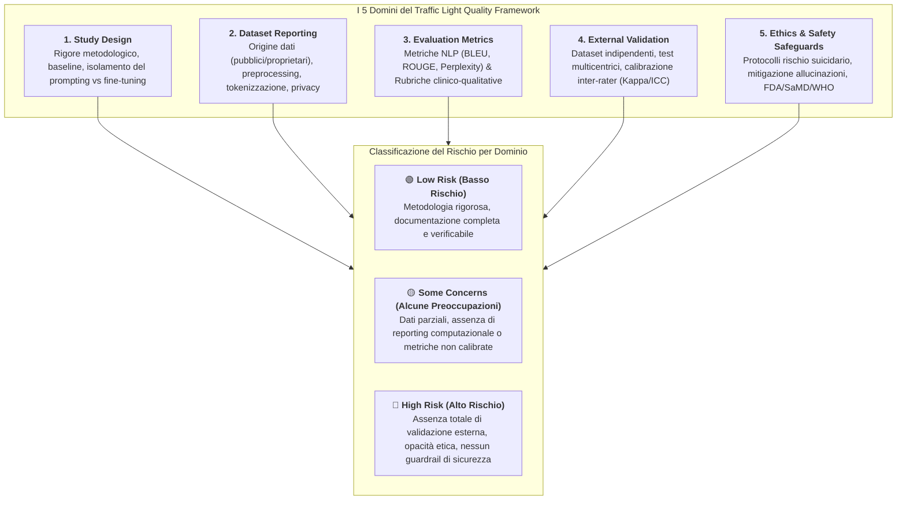
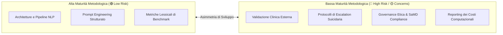

---
tags: [traffic-light-framework, quality-appraisal, risk-of-bias, prisma-2020, clinical-nlp, evaluation-methodology, ethics-reporting, external-validation, mental-health-ai]
source_papers: ["ai_v5i1e80348.pdf"]
---

# Traffic Light Quality Appraisal Framework per l'IA in Salute Mentale

## Definizione Operativa
- Il **Traffic Light Quality Appraisal Framework** (Quadro di Valutazione della Qualità a Semaforo) è una metodologia strutturata di valutazione della qualità metodologica e del rischio di bias specificamente progettata per analizzare chatbot e sistemi di intelligenza artificiale per il counseling e la salute mentale, introdotta e validata sistematicamente da Cho et al. (2026; *JMIR AI*, doi: 10.2196/80348).
- **Utilità Clinica e Metodologica:** Supera i limiti delle griglie di valutazione generiche per trial medici (es. Cochrane RoB 2) o per modelli puramente computazionali, integrando in un unico schema a semaforo (**Low Risk / Verde**, **Some Concerns / Giallo**, **High Risk / Rosso**) 5 domini cruciali per la trasferibilità clinica e la sicurezza dei sistemi basati su [[large-language-models]] (LLM):
  1. *Study Design* (Disegno dello studio);
  2. *Dataset Reporting* (Trasparenza e tracciabilità dei dati di training);
  3. *Evaluation Metrics* (Adeguatezza delle metriche computazionali e umane);
  4. *External Validation* (Validazione esterna indipendente e generalizzabilità);
  5. *Ethics & Safety Reporting* (Salvaguardie etiche, gestione del rischio suicidario e conformità regolatoria).

---

## I Cinque Domini Metodologici Dettagliati

### 1. Study Design (Disegno dello Studio)
- **Criteri di Valutazione:** Chiarezza degli obiettivi clinici, coerenza tra architettura tecnica e target nosografico, definizione di gruppi di controllo/baseline appropriati (es. zero-shot vs fine-tuned, modello base vs modello specializzato).
- **Esito nella Revisione Cho et al. (2026):** Dominio a rischio prevalentemente basso (**65% Low Risk**, 35% Some Concerns), riflettendo la solidità dell'ingegneria software e dell'impostazione computazionale.

### 2. Dataset Reporting (Rendicontazione dei Dataset)
- **Criteri di Valutazione:** Tracciabilità della fonte dei dati (dataset aperti vs raccolte proprietarie), disclosure delle procedure di anonimizzazione e consenso informato per le trascrizioni di colloqui clinici, trasparenza sulle tecniche di tokenizzazione e data augmentation.
- **Esito:** Prevalentemente a basso rischio (**90% Low Risk**), grazie all'ampio riutilizzo di benchmark pubblici accademici (*PsyQA*, *Counsel-Chat*, *SmileChat*, *HOPE*), sebbene permanga opacità nel 30% di studi basati su dati clinici privati.

### 3. Evaluation Metrics (Metriche di Valutazione)
- **Criteri di Valutazione:** Coerenza interna delle metriche NLP impiegate (BLEU, ROUGE, BERTScore, distinct-n, METEOR), definizione operativa delle rubriche qualitative umane (scala CARE, empatia, aderenza terapeutica) e presenza di annotatori esperti indipendenti.
- **Esito:** Valutato formalmente a basso rischio (**90% Low Risk**) per l'accuratezza computazionale, pur evidenziando a livello teorico il limite delle metriche lessicali nel cogliere la competenza psicoterapeutica autentica.

### 4. External Validation (Validazione Esterna Indipendente)
- **Criteri di Valutazione:** Test del sistema su coorti di dati o popolazioni di utenti completamente indipendenti da quelle di addestramento; valutazione inter-culturale e multi-linguistica; calcolo dell'accordo tra giudici (*inter-rater reliability*, Cohen's Kappa, intraclass correlation).
- **Esito (Criticità Marcata):** **90% degli studi ha ricevuto una valutazione negativa** (80% Some Concerns, 10% High Risk). Quasi nessun sistema è stato testato al di fuori del contesto specifico di laboratorio o della singola istituzione promotrice.

### 5. Ethics & Safety Safeguards (Salvaguardie Etiche e di Sicurezza)
- **Criteri di Valutazione:**
  - Presenza di un protocollo operativo per il rilevamento e l'escalation immediata di emergenze psichiatriche (ideazione suicidaria, autolesionismo, violenza);
  - Mitigazione verificata di allucinazioni diagnostiche e risposte inappropriate;
  - Audit formali contro bias sociodemografici e discriminazioni algoritmiche;
  - Conformità a normative sui dispositivi medici (*Software as a Medical Device - SaMD*) e linee guida etiche internazionali (WHO, OECD, APA).
- **Esito (Area di Massimo Rischio):** **85% degli studi presenta vulnerabilità critiche** (**30% High Risk**, **55% Some Concerns**, solo 15% Low Risk). L'etica e la sicurezza rimangono dichiarazioni d'intento prive di implementazione architetturale verificabile.

---

## Pattern di Asimmetria Metodologica

L'applicazione del Traffic Light Framework evidenzia una netta polarizzazione nello sviluppo dei sistemi di IA per la salute mentale:

- **La "Trappola della Consistenza Tecnica":** I ricercatori tendono a massimizzare le dimensioni facilmente misurabili in laboratorio (loss, accuratezza lessicale, perplessità), trascurando le dimensioni complesse ma indispensabili per l'adozione clinica (affidabilità diagnostica, sicurezza in situazioni di crisi acuta, privacy longitudinale).
- **L'Impatto sulla Traduzione Clinica:** Questa asimmetria spiega perché, a fronte di centinaia di pubblicazioni di successo in conferenze di intelligenza artificiale, l'effettiva integrazione di chatbot LLM nei servizi sanitari accreditati sia ancora pressoché inesistente.

---

## Raccomandazioni per il Reporting Standardizzato in DMHI

Sulla base del Traffic Light Framework, ogni futuro studio su sistemi conversazionali per la salute mentale dovrebbe soddisfare i seguenti requisiti minimi di trasparenza:

1. **Disclosure Totale di Dati e Prompt:** Pubblicazione dei prompt di sistema completi, delle tassonomie di tagging e delle pipeline di preprocessing.
2. **Doppia Valutazione (NLP + Psychometrics):** Affiancare alle metriche linguistiche valutazioni cliniche basate su scale psicometriche validate (PHQ-9, GAD-7, CTRS, WAI) con calcolo obbligatorio dell'affidabilità inter-rater.
3. **Safety Architecture Specification:** Descrivere in dettaglio l'albero decisionale o il modulo agentico dedicato all'interruzione del dialogo e all'invio ai servizi d'emergenza umani in caso di rischio imminente.
4. **Compute and Carbon Footprint Reporting:** Rendicontare parametri, latenza media di inferenza, requisiti hardware e costi per sessione per permettere valutazioni di sostenibilità economica e sanitaria.

---

## Riferimenti Bibliografici
- Cho, H. N., Wang, J., Hu, D., & Zheng, K. (2026). Large Language Model–Based Chatbots and Agentic AI for Mental Health Counseling: Systematic Review of Methodologies, Evaluation Frameworks, and Ethical Safeguards. *JMIR AI*, 5, e80348. https://doi.org/10.2196/80348
- Page, M. J., et al. (2021). The PRISMA 2020 statement: an updated guideline for reporting systematic reviews. *BMJ*, 372, n71.
- Stern, J. A., et al. (2019). RoB 2: a revised Cochrane risk-of-bias tool for randomized trials. *BMJ*, 366, l4898.
- World Health Organization. (2024). *Ethics and governance of artificial intelligence for health: Guidance on large multi-modal models*. WHO Guidelines Approved by the Guidelines Review Committee.

---

## Relazioni
- [[ai_v5i1e80348]]: Systematic review di Cho et al. (2026) in cui il framework è introdotto.
- [[clinical-readiness-gap-in-mh-chatbots]]: Il divario di prontezza clinica evidenziato dal framework.
- [[counseling-benchmarks-evaluation]]: Metodologie avanzate di benchmarking clinico per LLM.
- [[three-layer-governance-framework]]: Quadro di governance etica e sicurezza a tre livelli.
- [[evidence-adoption-gap-ai-mental-health]]: Divario tra diffusione massiva ed evidenze cliniche controllate.
- [[validita-psicometrica-llm]]: Discrepanza tra affidabilità statistica e validità psicometrica reale.
- [[software-as-a-medical-device-salute-mentale]]: Inquadramento normativo per la certificazione medica del software.
- [[audit-bias-llm-clinici]]: Metodologie per l'audit dei bias e delle disparità algoritmiche.