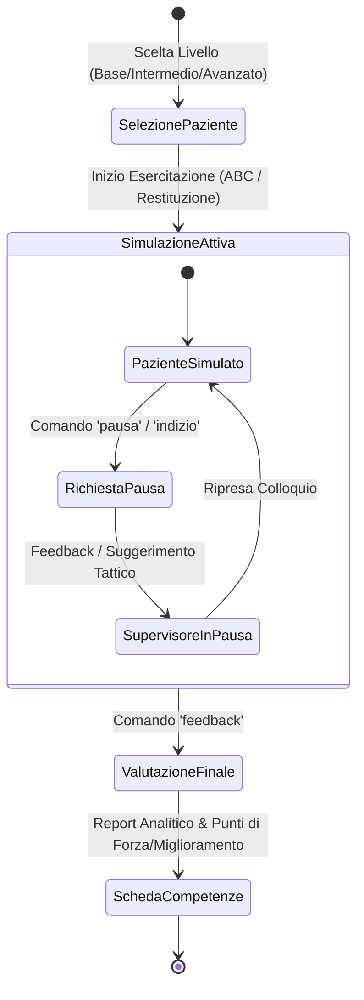

# Trainer Simulator

**Summary**: Agente AI conversazionale orientato alla simulazione clinica e al training esperienziale di colloqui terapeutici, formulazione del caso (ABC e ABC Libet) e valutazione oggettiva delle competenze per allievi di psicoterapia.
**Sources**: `07-10 Riunione_ Test e Valutazione di “Libet Prime” (Tutor AI per Libet_CBT), Trainer Simulator e Piano Operativo.txt`, `05-08 Riunione_ Sviluppo Knowledge Base AI, Etica e Applicazioni Cliniche.txt`
**Last updated**: 2026-08-27
---

## Definizione e Ruolo Didattico

**Trainer Simulator** (noto anche come *Interview Trainer*) è un agente specializzato basato su Large Language Model progettato per affiancare la formazione pratica in psicoterapia attraverso **esercitazioni cliniche simulate**.

A differenza di agenti di tipo tutor-didattico (come [[libet-prime]]), che operano a livello metacognitivo e concettuale, il Trainer Simulator si colloca nella dimensione dell'**allenamento esperienziale e role-play**, consentendo all'allievo di condurre un colloquio strutturato con un paziente virtuale e ricevere una supervisione formativa contestuale e finale.

---

## Architettura e Meccanica di Simulazione

L'agente opera assumendo dinamicamente diversi ruoli e gestendo la simulazione attraverso comandi operativi specifici:

### 1. Ambito di Esercitazione Clinica
Il simulatore copre le fasi cardine della concettualizzazione cognitivo-comportamentale e del modello LIBET:
- Conduzione dell'assessment e ricostruzione dell'episodio critico (**ABC cognitivo standard**).
- Approfondimento dei meccanismi di mantenimento e piani di protezione/prevenzione (**ABC Libet**).
- Conduzione della **restituzione della formulazione del caso** al paziente.

### 2. Libreria dei Pazienti Virtuali e Livelli di Difficoltà
- **Libreria Pazienti**: Dotazione iniziale di 10 profili standardizzati (con anamnesi, schemi nucleari e stili relazionali definiti).
- **3 Livelli di Difficoltà**:
  - *Base*: Paziente collaborativo, eloquio lineare, accessibilità emotiva immediata.
  - *Intermedio*: Eloquio parzialmente vago, minimizzazioni, lievi difese e deviazioni di tema.
  - *Avanzato*: Resistenze elevate, forte rigidità personologica, vaghezza difensiva, sfide all'alleanza di lavoro.

### 3. Comandi di Controllo e Ruoli Operativi
- **Ruoli dell'Agente**:
  - *Paziente simulato*: Recita coerentemente il personaggio mantenendo i bias clinici assegnati.
  - *Supervisore in pausa*: Interrompe la finzione su richiesta per offrire spunti, suggerimenti o ristrutturazioni.
  - *Valutatore finale*: Stila il resoconto oggettivo post-sessione.
- **Comandi Interattivi**:
  - `inizia`: Avvia la sessione clinica con il paziente scelto.
  - `pausa`: Sospende la simulazione per riflettere sull'andamento.
  - `indizio`: Fornisce un suggerimento su quale domanda o direzione esplorativa intraprendere.
  - `riformula`: Aiuta a riformulare un intervento comunicativamente inefficace.
  - `feedback`: Conclude l'esercizio e genera la valutazione multidimensionale.

---

## Sistema di Valutazione e Rubric di Competenze

Al termine della simulazione, l'agente non esprime un giudizio generico ma produce un'analisi analitica basata su griglie di competenze cliniche strutturate:
1. **Accuratezza metodologica**: Corretta identificazione di A (evento), B (credenze/pensieri), C (emozioni/comportamenti) e dei piani LIBET.
2. **Qualità dell'alleanza e micro-abilità**: Uso di validazione empatica, ascolto non giudicante, precisione nelle domande socratiche.
3. **Punti di forza e aree di miglioramento**: Evidenziazione di passaggi efficaci ed errori tipici (es. salti inferenziali, anticipazioni premature, collusione con le resistenze del paziente).

---

## Related pages
- [[07-10_Riunione_Test_Valutazione_Libet_Prime]]
- [[libet-prime]]
- [[simulazione-pazienti-ai]]
- [[testing-e-validazione-agenti-didattici]]
- [[human-in-the-reasoning]]
- [[clinical-fidelity-assessment]]
- [[digital-therapeutic-alliance]]
