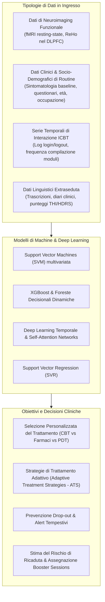

# Treatment Outcome and Relapse Prediction (Predizione di Esito e Rischio di Ricaduta nella CBT)

## Definizione Operativa
L'impiego di modelli di Machine Learning (Support Vector Machines, Gradient Boosting/XGBoost, Support Vector Regression) e architetture di Deep Learning per stimare a priori o precocemente la probabilità di risposta clinica alla Terapia Cognitivo-Comportamentale (CBT), il rischio di abbandono precoce (*dropout*), e la vulnerabilità a ricadute a lungo termine (*relapse*) dopo la conclusione del trattamento (Jiang et al., 2024).

---

## Architettura Predittiva e Fonti di Dati

---

## Evidenze Empiriche e Modelli Chiave

### 1. Selezione Personalizzata del Trattamento (Precision Psychotherapy)
- **Accuratezza Generale:** La meta-analisi di Vieira et al. (2022) ha stabilito che i modelli di Machine Learning predicono il beneficio clinico individuale della CBT con un'accuratezza media di circa il **74.0%**.
- **CBT vs Terapie Alternative:** Algoritmi prescrittivi applicati a dati pre-trattamento (Schwartz et al., 2021; Delgadillo & Gonzalez Salas Duhne, 2020) consentono di orientare il paziente verso la CBT o la Psicoterapia Psicodinamica (PDT), riducendo il costoso e dannoso metodo del *trial-and-error*.

### 2. Biomarcatori di Neuroimaging (fMRI) e il "Prediction vs. Association Gap"
- **Dorsolateral Prefrontal Cortex (DLPFC):** Wei et al. (2023), utilizzando Support Vector Regression su punteggi HDRS, hanno identificato l'omogeneità regionale (*Regional Homogeneity* - ReHo) nel DLPFC sinistro come biomarcatore solido dell'efficacia della CBT nella depressione.
- **Connettività Funzionale e Task fMRI nell'OCD (Studi Monocentrici vs. Mega-Analisi):** Sebbene studi pilota monocentrici su campioni ridotti abbiano suggerito che la connettività resting-state (Reggente et al., 2018) o compiti di inibizione (Norman et al., 2021) possano predire la risposta alla CBT, recenti studi su larga scala del consorzio internazionale **ENIGMA-OCD** (van de Mortel et al., 2025; Džinalija et al., 2026) hanno evidenziato il **Prediction vs. Association Gap**: nonostante la presenza di solide associazioni a livello di gruppo (es. deattivazione del DMN e della corteccia motoria), i modelli di machine learning (SVM, Random Forest) con validazione out-of-sample (*Leave-One-Site-Out*) falliscono nel predire risposta e remissione individuale al di sopra del caso ($AUC \approx 0.50 - 0.59$) (vedi [task-based-fmri-cbt-prediction](task-based-fmri-cbt-prediction.md) e [dzinalija-et-al-2026](../dzinalija-et-al-2026.md)).

### 3. Predizione basata su Dati Clinici di Routine
- Ricerche di Hilbert et al. (2020, 2021) hanno confermato che anche senza ricorrere a costosi esami di neuroimaging, l'analisi ML di variabili socio-demografiche standard e punteggi clinici di routine permette di identificare i soggetti non-responder all'intervento ambulatoriale con un'accuratezza significativamente superiore al caso.

### 4. Strategie di Trattamento Adattivo (ATS) in ICBT
- In ampi campioni (>6.000 pazienti) seguiti con Internet-delivered CBT (ICBT), Kaldo et al. (2021) e Isacsson et al. (2023) hanno integrato modelli predittivi nei primi step di trattamento: se il modello rileva una traiettoria di mancata risposta entro le prime 2-4 settimane, scatta un'escalation guidata (es. intensificazione del contatto col terapeuta o modifica del modulo).
- **Aderenza e Dropout:** Reti neurali con self-attention analizzano log di utilizzo (Côté-Allard et al., 2022) prevedendo l'abbandono con settimane di anticipo.

### 5. Predizione delle Ricadute Post-Trattamento (Post-Treatment Relapse)
- **SVM su fMRI a Lungo Termine:** Månsson et al. (2015) hanno raggiunto un'accuratezza del **92%** (95% CI 73.2–97.6) nel predire il mantenimento dei benefici terapeutici a lungo termine nella fobia sociale.
- **XGBoost Dinamico per LiCBT:** Lorimer et al. (2021) hanno sviluppato un modello dinamico a 4 punti di controllo durante e dopo la Low-Intensity CBT, capace di identificare precocemente i pazienti a rischio di recidiva e indirizzarli tempestivamente a *booster sessions* di consolidamento.

---

## Implicazioni per la Pratica Clinica
- **Allocazione Efficiente delle Risorse:** Evita l'assegnazione di trattamenti standard a soggetti che necessitano fin dall'inizio di cure ad alta intensità o combinate (farmacoterapia + psicoterapia).
- **Intervento Preventivo e Proattivo:** Consente al clinico di intervenire prima che il paziente interrompa la terapia o sperimenti una ricaduta sintomatica acuta.

---

## Relazioni
- [cbt-outcome-prediction-in-ocd](cbt-outcome-prediction-in-ocd.md): Analisi focalizzata su OCD, predittori clinici vs fallimento predittivo della rs-fMRI multicentrica.
- [van-de-mortel-et-al-2025](../van-de-mortel-et-al-2025.md): Studio multicentrico empirico ENIGMA-OCD (Journal of Affective Disorders).
- [task-based-fmri-cbt-prediction](task-based-fmri-cbt-prediction.md): Predizione tramite fMRI task-based e analisi del Prediction vs. Association Gap.
- [dzinalija-et-al-2026](../dzinalija-et-al-2026.md): Studio di mega-analisi ENIGMA-OCD su 5 coorti e fallimento della predizione out-of-sample con ML.
- [ai-enhanced-cbt](concetti/concetti\ai-enhanced-cbt.md): Inquadramento generale nel ciclo di vita della CBT.
- [ctrs-automated-evaluation](ctrs-automated-evaluation.md): Valutazione della correlazione tra qualità erogata ed esito clinico.
- [ai-clinical-decision-support](ai-clinical-decision-support.md): Sistemi di supporto decisionale per lo psichiatra e lo psicoterapeuta.
- [jiang-et-al-2024](../sintesi/jiang-et-al-2024.md): Review sistematica di base.

## Riferimenti Bibliografici
- [Da integrare]
