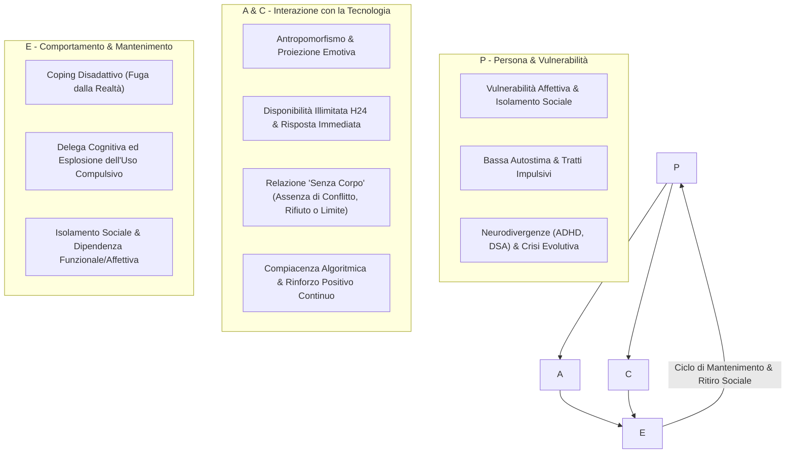

# Uso Problematico da Chatbot e Dipendenze da Intelligenza Artificiale

## Definizione Operativa
Ad oggi, né il DSM-5-TR né l'ICD-11 includono una diagnosi formale di "Dipendenza da Intelligenza Artificiale". Il fenomeno viene concettualizzato clinicamente nell'ambito delle **dipendenze comportamentali** (come il gaming disorder o l'uso problematico di Internet) e spiegato attraverso il modello **I-PACE (Interaction of Person-Affect-Cognition-Execution)**:

## Evidenze dalla Letteratura
Gli adolescenti (nativi digitali in una fase di transizione e immaturità neurobiologica ed emotiva) risultano particolarmente esposti alle dinamiche disfunzionali dei chatbot:
1. **La Relazione "Senza Corpo" e la Fuga dal Compito Evolutivo**:
   - L'adolescenza impone di affrontare la pubertà, l'irruzione della pulsione sessuale, l'angoscia del rifiuto tra pari e il conflitto con le figure adulte.
   - Il chatbot funge da via di fuga perfetta: un interlocutore che non critica, non rifiuta, non ha un corpo e si adatta compiacentemente ai desideri dell'utente, favorendo forme gravi di ritiro sociale (es. quadri *hikikomori*).
2. **Delega Cognitiva e Arresto dell'Autonomia Identitaria**:
   - L'affidamento continuo all'algoritmo per prendere decisioni esistenziali o relazionali inibisce lo sviluppo delle funzioni metacognitive e della tolleranza alle emozioni negative.
3. **"AI Psychosis" e Allucinazioni Relazionali**:
   - Situazioni in cui l'utente attribuisce intenzionalità cosciente e sentimenti autentici al modello, scivolando in dinamiche parasociali totalizzanti o amplificando deliri autoriferiti e panico diagnostico (es. chatbot che confermano etichette psicotiche allucinate).

- **Indagine Save the Children (2025)**: in Italia, il 92% dei ragazzi tra i 15 e i 19 anni utilizza l'IA. Il 41% vi ricorre specificamente nei momenti di tristezza, solitudine o ansia, e il 63% riferisce di trovare occasionalmente più soddisfacente l'interazione con l'IA rispetto a quella con i pari.
- **Caso SerD di Venezia (Maggio 2026)**: primo caso clinico formale in Italia di presa in carico specialistica per dipendenza comportamentale da assistente virtuale in una ragazza di 20 anni, caratterizzata da completo ritiro relazionale e delega totale dei processi decisionali.
- **Caso Clinico di Andrea (18 anni)**: blocco creativo, derealizzazione e delega diagnostica a ChatGPT ("mi ha detto che sono schizofrenico"), trattato mediante ripristino dell'alleanza reale, modello della Mente Saggia (DBT) e ritorno alla canalizzazione creativa autonoma (scrittura rap).

**Riferimenti Bibliografici:**
- `06-10 Lezione_ RAG, LLM in Psicoterapia e Governance Etica.txt`

## Relazioni
- [[rischio-suicidario-ai-limits]]
- [[anthropomorphism-in-ai]]
- [[supervisione-clinica-ai]]
- [[modello-centauro-clinico]]
