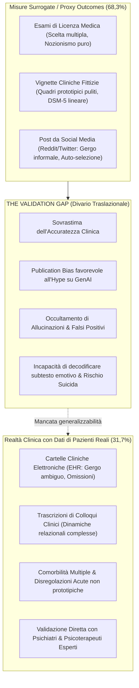
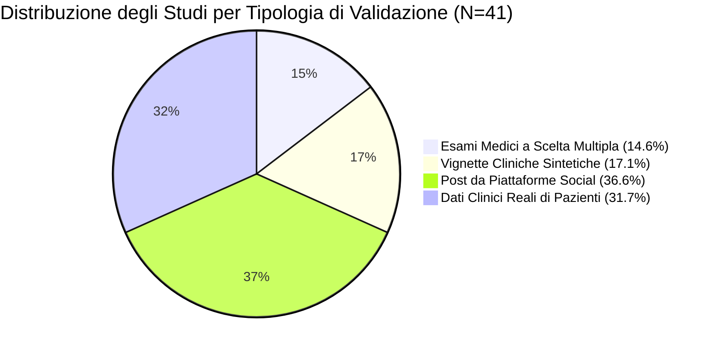

# Validation Gap nell'IA per la Salute Mentale (Il Divario da Misure Surrogate)

## Definizione Operativa
- Il **Validation Gap (Divario di Validazione Clinica)** nella salute mentale computazionale descrive la discrepanza metodologica ed epistemologica per cui la quasi totalità degli studi su Large Language Models (LLM) valuta le performance algoritmiche su **misure surrogate e contesti non reali** (*proxy outcomes* — quali esami di abilitazione medica standardizzati, vignette cliniche fittizie o post estratti da piattaforme social), mentre solo una ridotta minoranza valida l'efficacia e la sicurezza dei modelli a confronto con valutazioni di clinici esperti su **dati di pazienti reali** (Lokadjaja et al., 2026).
- **Entità del Divario:** Nella scoping review di Lokadjaja et al. (2026) su 41 studi peer-reviewed pubblicati in riviste di primo quartile Q1, **solo il 31,7% (13/41)** ha validato gli LLM rispetto a valutazioni cliniche su dati reali di pazienti (EHR, trascrizioni di colloqui clinici effettivi, diari longitudinali), mentre il **68,3% (28/41)** si è basato unicamente su esiti proxy (13 studi su esami/vignette e 15 su social media).
- **Utilità Clinica e Psichiatria:** Tale divario genera una pericolosa "illusione di prontezza clinica" (*clinical readiness fallacy*): i modelli che esibiscono punteggi quantitativi elevati o superiori ai medici nei test nozionistici falliscono frequentemente nei flussi di lavoro ambulatoriali e ospedalieri a causa del rumore nei dati, delle comorbilità complesse, delle sfumature relazionali e del rischio di allucinazioni mascherate da alta sicurezza assertiva.

---

## Le Dimensioni del Divario di Validazione

### 1. Esami di Abilitazione Medica vs Ragionamento Psichiatrico Reale
- **Knowledge Retrieval vs Inferenza Clinica:** Nei test standardizzati (es. esami di licenza in Taiwan, Corea, Cile, o board exams di neurologia e medicina generale), gli LLM come GPT-4 eccellono grazie all'immensa base di dati preaddestrata (Schubert et al., 2023; Li et al., 2024; Kim et al., 2025).
- **La Discrepanza Specifica della Psichiatria:** Quando le prestazioni vengono scorporate per sottodiscipline mediche, la psichiatria si rivela costantemente il settore con la performance più fragile per gli LLM (Watari et al., 2023). Nei test di medicina generale giapponesi, mentre GPT-4 superava la media dei medici specializzandi nelle altre branche, gli specializzandi umani superavano significativamente GPT-4 in psichiatria, evidenziando che il ragionamento psicopatologico non è riducibile a memorizzazione nozionistica ma richiede contestualizzazione dinamica.
- **Allucinazioni ad Alta Confidenza:** Nei problemi che richiedono abilità cognitive di ordine superiore, gli LLM generano diagnosi e piani terapeutici errati presentandoli con tono autoritario e assoluta sicurezza linguistica (*high confidence errors*) (Schubert et al., 2023).
- **Catastrophic Forgetting:** Di fronte a casi articolati con più passaggi diagnostici, i modelli manifestano improvvisa perdita del contesto iniziale o incapacità di motivare i passaggi intermedi (Herrmann-Werner et al., 2024).

---

### 2. Vignette Cliniche Narrative vs Pazienti Reali
- **Limiti Strutturali delle Vignette:** Le vignette cliniche utilizzate nella ricerca (es. Levkovich & Elyoseph, 2023; Choi et al., 2024; Wislocki et al., 2025) sono narrazioni sintetiche, strutturate e lineari, prive delle ambiguità, delle difese psicologiche e delle resistenze tipiche del paziente reale.
- **Sottostima dei Rischi Imminenti:** Nei test con vignette di crisi, modelli come GPT-3.5 hanno mostrato una pericolosa tendenza a sottostimare la gravità del rischio suicidario (Levkovich & Elyoseph, 2023).
- **Blocco da Filtri di Policy (*Safety Censorship*):** Quando le vignette cliniche descrivono esperienze traumatiche realistiche (es. abusi sessuali, violenza fisica grave), i filtri commerciali di content moderation delle API closed-source (OpenAI) bloccano l'elaborazione dell'input o restituiscono risposte evasive standardizzate, rendendo il modello inutilizzabile per la pratica clinica reale con popolazioni traumatizzate.

---

### 3. Dati da Social Media vs Discorso Terapeutico (*Domain Shift*)
- **Il Paradosso dei Social Network:** Oltre un terzo degli studi (36,6%) addestra e testa algoritmi su post di Reddit (r/depression, r/SuicideWatch) o Twitter.
- **Distorsione del Campione e Lessico Informale:** Il linguaggio dei social è caratterizzato da disinibizione online, espressioni iperboliche, gergo gergale e forte auto-selezione demografica (prevalenza di utenti giovani e anglofoni).
- **Fallimento Traslazionale:** I modelli addestrati su social media falliscono quando applicati a trascrizioni di sedute di psicoterapia o a note infermieristiche formali (*domain shift*), scambiando il registro stilistico per gravità sintomatica o mancando la rilevazione di quadri depressivi atipici (Xu et al., 2024; Dalal et al., 2024; Kallstenius et al., 2025).

---

### 4. Il Fenomeno del Publication Bias e la Mancanza di Patient Advocacy

- **Publication Bias Strutturale:** Nell'attuale contesto di entusiasmo commerciale e accademico verso l'IA generativa, gli studi che dimostrano la parità o la superiorità degli LLM rispetto ai clinici hanno una probabilità esponenzialmente più alta di essere accettati e pubblicati rispetto a studi negativi o che evidenziano fallimenti algoritmici (Lokadjaja et al., 2026).
- **Assenza dei Pazienti nei Processi di Ricerca:** Nessuno dei 41 studi inclusi nella rassegna ha previsto meccanismi di consultazione, co-progettazione o valutazione qualitativa dell'accettabilità da parte dei pazienti (*patient advocacy gap*), limitando la valutazione a parametri puramente ingegneristici o a feedback secondari di operatori.

---

## Conseguenze Cliniche e Requisiti per il Superamento del Divario

| Criticità del Divario | Manifestazione nel Contesto Reale | Requisito Metodologico di Rimedio |
| :--- | :--- | :--- |
| **Allucinazioni da Comorbilità** | Modelli che inventano sintomi o confondono quadri di dipendenza multipla (Mahbub et al., 2025). | Validazione obbligatoria su cartelle cliniche con poli-patologie reali. |
| **Incapacità di Rilevare il Subtesto** | Gli LLM faticano a distinguere fatti oggettivi da interpretazioni soggettive del terapeuta (Adhikary et al., 2024). | Integrazione di annotazioni cliniche qualitative esperte a più livelli (*multi-rater consensus*). |
| **Falsi Positivi Elevati nelle Crisi** | GPT-4 segnala allarmi di emergenza indiscriminati su casi ambigui in telemedicina (Lee et al., 2024). | Taratura di soglie di specificità clinica e modelli *Human-in-the-Loop* continui. |
| **Opacità e Scetticismo Clinico** | Mancanza di spiegazioni comprensibili per le decisioni algoritmiche (Herrmann-Werner et al., 2024). | Sviluppo di moduli XAI (Explainable AI) conformi alle linee guida cliniche (es. DSM-5/ICD-11). |

---

## Riferimenti Bibliografici
- Lokadjaja, M. C., Kho, J. J., Schulz, P. J., & Goh, W. W. B. (2026). Large Language Models and Their Applications in Mental Health: Scoping Review. *JMIR Mental Health*, 13, e88057. https://doi.org/10.2196/88057
- Adhikary, P. K., Srivastava, A., Kumar, S., et al. (2024). Exploring the efficacy of large language models in summarizing mental health counseling sessions: benchmark study. *JMIR Ment Health*, 11, e57306.
- Choi, Y. K., Lin, S. Y., Fick, D. M., et al. (2024). Optimizing ChatGPT's interpretation and reporting of delirium assessment outcomes: exploratory study. *JMIR Form Res*, 8, e51383.
- Herrmann-Werner, A., Festl-Wietek, T., Holderried, F., et al. (2024). Assessing ChatGPT's mastery of Bloom's taxonomy using psychosomatic medicine exam questions. *J Med Internet Res*, 26, e52113.
- Lee, C., Mohebbi, M., O'Callaghan, E., & Winsberg, M. (2024). Large language models versus expert clinicians in crisis prediction among telemental health patients. *JMIR Ment Health*, 11, e58129.
- Levkovich, I., & Elyoseph, Z. (2023). Suicide risk assessments through the eyes of ChatGPT-3.5 versus ChatGPT-4: vignette study. *JMIR Ment Health*, 10, e51232.
- Li, D. J., Kao, Y. C., Tsai, S. J., et al. (2024). Comparing the performance of ChatGPT GPT-4, Bard, and Llama-2 in the Taiwan psychiatric licensing examination. *Psychiatry Clin Neurosci*, 78(6), 347–352.
- Schubert, M. C., Wick, W., & Venkataramani, V. (2023). Performance of large language models on a neurology board-style examination. *JAMA Netw Open*, 6(12), e2346721.
- Watari, T., Takagi, S., Sakaguchi, K., et al. (2023). Performance comparison of ChatGPT-4 and Japanese medical residents in the general medicine in-training examination. *JMIR Med Educ*, 9, e52202.
- Wislocki, K. E., Sami, S., Liberzon, G., & Zalta, A. K. (2025). Comparing generative artificial intelligence and mental health professionals for clinical decision-making with trauma-exposed populations. *JMIR Ment Health*, 12, e80801.

---

## Relazioni
- [[mental-2026-1-e88057]]
- [[clinical-readiness-gap-in-mh-chatbots]]
- [[evidence-adoption-gap-ai-mental-health]]
- [[lightweight-domain-models-in-mental-health]]
- [[specialized-nlp-models-mental-health]]
- [[synthetic-psychopathology]]
- [[single-correct-answer-fallacy-in-clinical-ai]]
- [[open-data-scarcity-clinical-psychology]]
- [[modello-centauro-clinico]]
- [[human-in-the-reasoning]]
- [[linee-guida-reporting-ai-generativa-chart-elevate]]
- [[traffic-light-quality-appraisal-clinical-ai]]
