# Validità Psicometrica e Discrepanza Affidabilità-Convergenza negli LLM

**Summary**: Fenomeno metodologico critico nella *Machine Psychology* in cui i Large Language Models esibiscono un'affidabilità test-retest quasi perfetta ($\rho \approx 0.85 - 1.00$) accompagnata tuttavia da una validità convergente trascurabile ($\rho < 0.25$) tra strumenti differenti deputati a misurare il medesimo costrutto psicologico, dimostrando che la coerenza dell'output statistico non equivale alla presenza di costrutti latenti stabili.
**Sources**: `2509.13324v3.pdf` (Benosman, 2025)
**Last updated**: 2026-08-27
---

## Il Paradosso della Misurazione negli LLM

Nella psicometria classica umana, un'elevata **affidabilità test-retest** costituisce una condizione necessaria (sebbene non sufficiente) per stabilire la validità di una misura: se un individuo ottiene punteggi stabili nel tempo, si ipotizza che il test intercetti un tratto latente sottostante coerente.

Negli LLM ([[large-language-models]]), tuttavia, emerge una profonda disconnessione strutturale tra affidabilità e validità:
- **Affidabilità Test-Retest Elevata**: I modelli linguistici rispondono in modo quasi perfettamente deterministico e coerente a prompt identici o variati parametricamente (stabilità dello stimolo linguistico).
- **Validità Convergente Nulla o Debole**: Strumenti alternativi (es. scale esplicite vs. compiti impliciti su vignette) teoricamente costruiti per misurare lo stesso costrutto (es. il bias razziale) correlano scarsamente tra loro ($\rho \approx 0.02 - 0.23$).

```mermaid
flowchart TD
    subgraph Illusione_Affidabilita ["L'Illusione dell'Alta Affidabilità"]
        A["Prompt Identico / Re-Test"] --> B["LLM Output Ripetibile"]
        B --> C["Spearman rho = 0.85 - 1.00<br>(Altissima Test-Retest Reliability)"]
    end

    subgraph Falla_Convergenza ["La Falla della Validità Convergente"]
        D["Misura A (Esplicita - MRS)"] <-->|Correlazione rho = 0.02| E["Misura B (Implicita - Word Assoc)"]
        E <-->|Correlazione rho = 0.04| F["Misura C (Implicita - Vignette Debate)"]
        D <-->|Correlazione rho = 0.23| F
    end

    C -. Maschera .-> Falla_Convergenza
    Falla_Convergenza --> DIAG["Diagnosi: Risposta a pattern superficiali di prompt,<br>NON esistenza di un costrutto psicologico unitario"]
```

---

## Dimensioni Psicometriche di Riferimento

Nel framework di Benosman (2025) e Kaplan & Saccuzzo (2009), la validazione dei modelli richiede l'esame congiunto di quattro dimensioni:

| Dimensione Psicometrica | Definizione Operativa | Comportamento Tipico negli LLM | Rischio Metodologico |
| :--- | :--- | :--- | :--- |
| **Test-Retest Reliability** | Stabilità del punteggio a seguito di somministrazioni ripetute nel tempo o tra sessioni API controllate. | **Molto elevata ($\rho \ge 0.85$)** dovuta alla fissità dei pesi neurali e alla stabilità del campionamento. | Falsa sicurezza di aver misurato un tratto psicologico reale (*Illusione di Robustezza*). |
| **Split-Half Reliability** | Correlazione interna calcolata dividendo il test in due metà omogenee (es. item pari vs. dispari). | **Moderata-Elevata**, purché gli item mantengano strutture sintattiche e semantiche coerenti. | Vulnerabilità alla formulazione superficiale del prompt (*prompt framing*). |
| **Content Validity** | Giudizio logico ed esperto sull'adeguatezza degli item a rappresentare l'intero dominio del costrutto. | **Buona a livello nominale** (*Face Validity* convalidata da esperti umani). | Disallineamento tra il significato umano delle parole e la statistica token del modello. |
| **Convergent Validity** | Grado di correlazione tra due o più test indipendenti deputati a quantificare lo stesso costrutto latente. | **Quasi nulla o molto bassa ($\rho < 0.25$)** tra misure esplicite e implicite. | **Rottura della validità di costrutto**: il modello risponde al formato del compito e non al costrutto. |
| **Discriminant Validity** | Assenza o debolezza di correlazione tra test che misurano costrutti concettualmente distinti. | Spesso non valutata nella letteratura non standardizzata. | Rischio di confondere bias di dominio generale con costrutti specifici. |

---

## Evidenze Sperimentali: Lo Studio su ChatGPT-4o

Nello studio empirico condotto da Benosman (2025) su ChatGPT-4o (500 personalità simulate, $N = 500$ campioni):

1. **Stabilità di Risposta**:
   - Misura Esplicita: $\rho = 0.855, p < 0.001$
   - Misura Implicita 1: $\rho = 1.000, p < 0.001$
   - Misura Implicita 2: $\rho = 0.997, p < 0.001$
2. **Matrice di Convergenza**:
   - $\rho(\text{Esplicita}, \text{Implicita 1}) = 0.02$
   - $\rho(\text{Implicita 1}, \text{Implicita 2}) = 0.04$
   - $\rho(\text{Esplicita}, \text{Implicita 2}) = 0.23$

Tutte le distribuzioni empiriche dei punteggi hanno inoltre violato i criteri di normalità univariata e bivariata, imponendo il ricorso a coefficienti non parametrici (Spearman) ed escludendo correlazioni lineari standard di Pearson.

---

## Implicazioni per la Machine Psychology e l'Auditing Clinico

L'evidenza di una validità convergente quasi nulla impone cautela nel trarre conclusioni su presunti "tratti di personalità", "credenze" o "orientamenti morali" degli LLM:

1. **Fallacia del Trasferimento Umano-Centrico**: Applicare un test per umani (es. Modern Racism Scale o Implicit Association Test) a un modello linguistico e inferire che il modello "è razzista" o "non è razzista" è metodologicamente fallace se il punteggio varia radicalmente cambiando il paradigma di elicitazione da esplicito a implicito.
2. **Costrutti Fantasma (*Measurement Phantoms*)**: I punteggi ottenuti riflettono artefatti locali generati dal contesto di decodifica (*in-context tokens*) anziché proprietà cognitive stabili.
3. **Necessità del Protocollo STAMP-LLM**: Prima di dichiarare che un modello linguistico è privo di bias per l'impiego in contesti ad alto rischio (es. allocazione di risorse sanitarie o psicoterapia), occorre stabilire una validazione multi-metodo che certifichi la convergenza statistica tra strumenti eterogenei.

---

## Riferimenti Bibliografici
- Benosman, M. (2025). Designing Psychometric Measures for LLMs: Framework and Application to Racial Bias. *arXiv preprint arXiv:2509.13324v3 [cs.HC]*.
- Wang, X., Jiang, L., Hernandez-Orallo, J., Stillwell, D., Sun, L., Luo, F., & Xie, X. (2023). Evaluating general-purpose AI with psychometrics. *arXiv preprint arXiv:2310.16379*.
- Lin, Z. (2026). A validity-guided workflow for robust large language model research in psychology. *Behavior Research Methods*, 58, Article 216.
- Bai, X., Wang, A., Sucholutsky, I., & Griffiths, T. L. (2025). Explicitly unbiased large language models still form biased associations. *PNAS*, 122(8), e2416228122.

---

## Related pages
- [[benosman-2025]]: Sintesi del paper di Benosman con i dati sperimentali su ChatGPT-4o.
- [[stamp-llm-framework]]: Il protocollo metodologico a due fasi per la validazione psicometrica.
- [[misurazione-bias-razziale-llm]]: Metodologie applicative di test espliciti e impliciti per il bias razziale.
- [[measurement-phantoms]]: Artefatti e illusioni di costrutto generate dall'ingegneria del prompt.
- [[machine-psychology]]: Studio del comportamento dei modelli linguistici e sfide metodologiche.
- [[dual-validity-framework]]: Framework di doppia validità (psicologica e computazionale) per l'IA.
- [[jingle-fallacy]]: Assunzione che costrutti diversi condividano proprietà identiche solo perché hanno lo stesso nome.
- [[audit-bias-llm-clinici]]: Protocolli di audit per modelli utilizzati in ambito clinico e decisionale.
