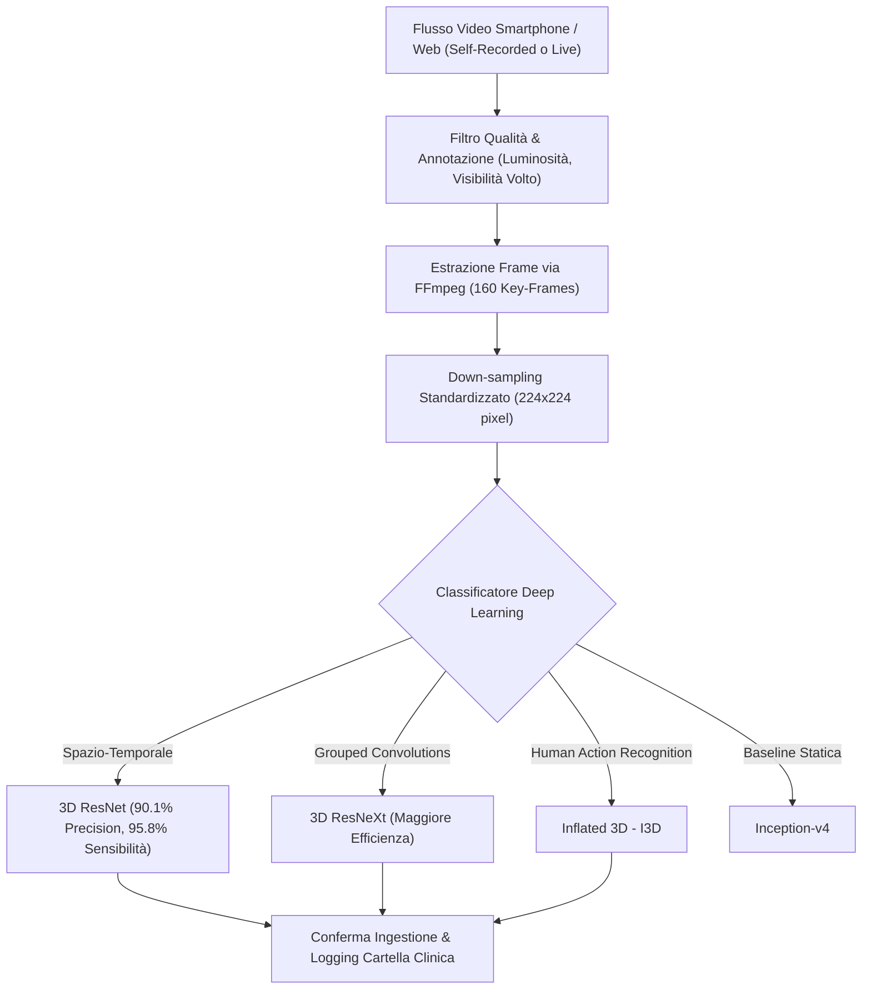

# Video-Observed Therapy (VDOT) and Computer Vision for Ingestion Confirmation

## Definizione Operativa
L'impiego di algoritmi di Computer Vision e reti neurali convoluzionali (CNN) per analizzare flussi video registrati o in tempo reale (acquisiti tramite fotocamera dello smartphone o dispositivi dedicati), al fine di verificare oggettivamente l'identità del paziente, il riconoscimento del farmaco specifico e l'avvenuta deglutizione (*swallowing confirmation*), automatizzando ed estendendo la classica *Directly Observed Therapy* (DOT) in ambito telemedico (Joshua & Peterson, 2025; Labovitz et al., 2020).

- **Utilità Clinica e Telemedica:** Superamento dei limiti delle misure indirette (self-report, conteggio blister, smart bottle sensibili a false aperture), garantendo la prova oggettiva dell'ingestione in terapie ad alto rischio (es. anticoagulanti post-ictus, tubercolosi, patologie psichiatriche maggiori).

---

## Architettura e Pipeline di Preprocessing Video

### 1. Fasi del Trattamento dei Dati
- **Campionamento e Risoluzione**: Estrazione di circa 160 frame chiave per ciascun video tramite utility di streaming video (`FFmpeg`), scalati a una dimensione uniforme di $224 \times 224$ pixel.
- **Controllo di Qualità e Artefatti**: Protocolli di filtraggio automatico e manuale per escludere registrazioni con illuminazione inadeguata, angolazioni scorrette o parziale occlusione del volto.

### 2. Modelli di Deep Learning Comparati
1. **3D ResNet**: Modello d'elezione per l'estrazione congiunta di feature spaziali (identificazione pillola/bocca) e temporali (movimento braccio-bocca e deglutizione). Ha dimostrato la massima efficienza e velocità di elaborazione nei test clinici su larga scala.
2. **3D ResNeXt**: Variante di ResNet basata su convoluzioni raggruppate (*grouped convolutions*), mirata a ottimizzare il footprint computazionale senza sacrificare la capacità discriminativa.
3. **Inflated 3D (I3D)**: Architettura derivata dall'inflazione temporale dei filtri 2D, specificamente progettata per il riconoscimento di pattern complessi di azione umana nei video.
4. **Inception-v4**: Architettura 2D utilizzata come baseline statica di comparazione frame-by-frame.

---

## Evidenze Cliniche ed Efficacia Sperimentale

- **Trial su Pazienti Post-Ictus (Anticoagulanti)**: La piattaforma *AiCure* (sistema VDOT basato su smartphone) ha consentito di raggiungere il **100% di aderenza terapeutica** nei pazienti monitorati, a fronte del solo 50% osservato nel braccio di controllo convenzionale non monitorato (Labovitz et al., 2020; Joshua & Peterson, 2025).
- **Trattamento della Tubercolosi (TB)**: Su dataset di 861 video di pazienti con TB, 3D ResNet ha ottenuto una **precisione del 90.1%** e una **sensibilità del 95.8%** (Sekandi et al., 2023; Joshua & Peterson, 2025).
- **Trial su Pazienti con Schizofrenia e Deficit Cognitivo**: Uno studio di 24 settimane ha evidenziato un incremento dell'aderenza del **+17.9%** rispetto alla modified directly observed therapy.

---

## Trade-off e Limiti di Implementazione

| Vantaggi | Criticità e Limitazioni |
| :--- | :--- |
| **Conferma Oggettiva**: Verifica visiva dell'ingestione reale anziché semplice apertura confezione. | **Specificità Moderata**: Tassi di specificità oscillanti tra il 43.5% e il 55.4% in ambienti casalinghi non controllati (rischio falsi negativi dovuti a ombre o angolazioni). |
| **Coinvolgimento Attivo**: Incrementa l'auto-disciplina del paziente (*Hawthorne effect* positivo). | **Attrito d'Uso (User Burden)**: Richiede la registrazione attiva del video a ogni dose, con possibile calo di compliance nel lungo termine. |
| **Supporto Pazienti Fragili**: Adatto a deficit cognitivi o malattie psichiatriche gravi. | **Privacy e Larghezza di Banda**: Trasmissione di flussi video sensibili; richiede compressione avanzata e connettività 5G/Wi-Fi stabile. |

---

## Riferimenti Bibliografici
- Joshua, C., & Peterson, W. (2025). AI-Powered Real-Time Adherence Monitoring for Remote Patient Care in Telemedicine. *Research Article*, June 2025.
- Labovitz, D. L., et al. (2020). Using Artificial Intelligence to Measure Adherence to Anticoagulants in Stroke Patients. *Stroke and Cerebrovascular Diseases*, 29(10), 105048.
- Sekandi, J. N., et al. (2023). Application of AI to the Monitoring of Medication Adherence for TB Treatment in Africa. *JMIR AI*, 2(1), e40167.

---

## Relazioni
- [[joshua-peterson-2025]]
- [[wearable-sensor-fusion-adherence]]
- [[proactive-surveillance-alert-fatigue]]
- [[privacy-preserving-rpm-frameworks]]
- [[chronic-disease-monitoring-adherence]]
