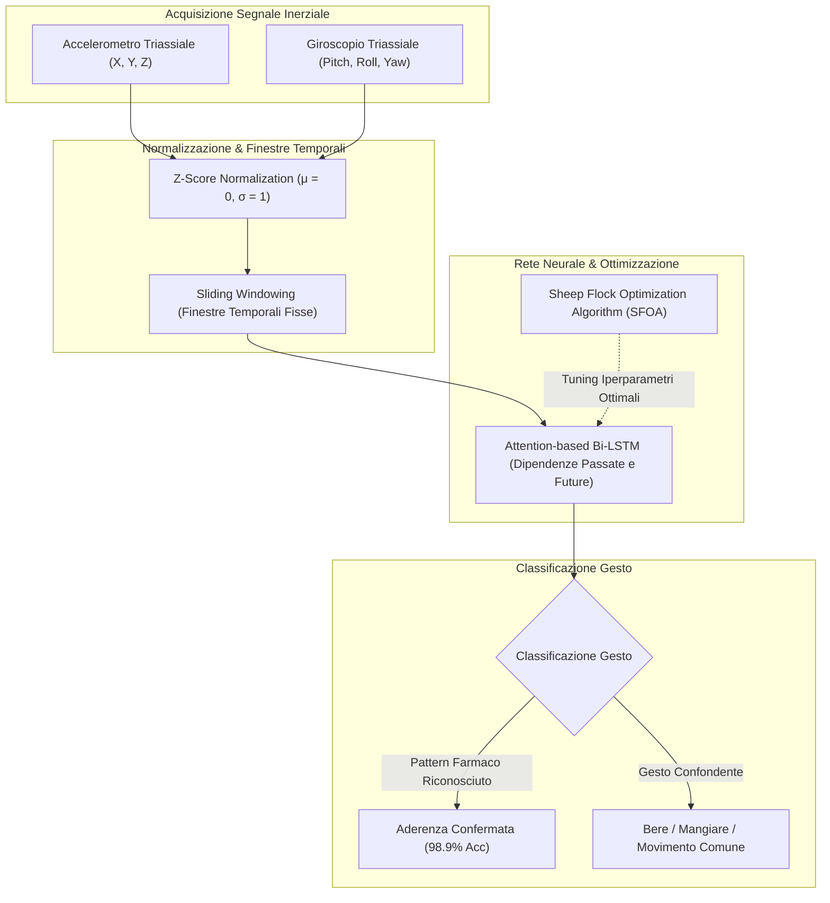

# Wearable Sensor Fusion and Gesture Recognition for Passive Adherence Monitoring

## Definizione Operativa
L'utilizzo integrato di sensori inerziali indossabili (accelerometri e giroscopi triassiali inseriti in smartwatch o cerotti cutanei smart) combinati con reti neurali ricorrenti attentive (*Attention-based Bidirectional LSTM*) per il rilevamento passivo e non invasivo della specifica sequenza cinematica mano-bocca (*hand-to-mouth motor signature*) associata all'assunzione farmacologica, eliminando la necessità di registrazione video attiva o annotazione manuale (Joshua & Peterson, 2025; Rahman et al., 2024).

- **Utilità Clinica e Telemedica:** Riduzione dell'onere comportamentale (*user burden*) per il paziente, massimizzazione dell'accettabilità d'uso nel monitoraggio a lungo termine e discriminazione ad altissima precisione rispetto ad attività quotidiane confondenti (alimentazione, idratazione, igiene orale).

---

## Architettura del Sistema e Pipeline di Riconoscimento

### 1. Pre-elaborazione del Segnale e Normalizzazione Z-Score
I segnali inerziali grezzi registrati da polso o braccio presentano un elevato livello di rumore dovuto alle attività quotidiane e alle variazioni individuali di velocità motoria. 
- La standardizzazione tramite **Z-Score Normalization** scala i dati ad avere media zero ($\mu = 0$) e deviazione standard unitaria ($\sigma = 1$), rendendo la rete sensibile alla dinamica angolare e all'accelerazione specifica del gesto di ingestione a prescindere dall'intensità muscolare o dalla corporatura dell'utente.

### 2. Attention-based Bidirectional Long Short-Term Memory (Bi-LSTM)
- Le reti **Bi-LSTM** elaborano la serie temporale in entrambe le direzioni temporali (passato e futuro), consentendo al modello di comprendere la sequenza completa della traiettoria motoria:
  1. *Fase di presa*: Movimento verso il contenitore o blister;
  2. *Fase di sollevamento*: Traslazione e rotazione verso il cavo orale;
  3. *Fase di rilascio/inclinazione del capo*: Ingestione e ritorno al punto di riposo.
- Il meccanismo di **Attenzione (Attention Mechanism)** assegna pesi dinamici ai singoli intervalli temporali della finestra di movimento, focalizzandosi sui micro-movimenti distintivi ed escludendo le fluttuazioni casuali.

### 3. Sheep Flock Optimization Algorithm (SFOA)
- Per evitare che l'architettura Bi-LSTM rimanga intrappolata in minimi locali durante l'ottimizzazione di layer, learning rate e batch size, viene impiegato il **Sheep Flock Optimization Algorithm (SFOA)** (Rahman et al., 2024).
- L'algoritmo riproduce le dinamiche sociali e di pascolo del gregge (esplorazione distribuita dello spazio dei parametri e convergenza rapida verso la soluzione globale ottimale), incrementando drasticamente la precisione del modello.

---

## Prestazioni Sperimentali e Confronto Benchmark

| Algoritmo / Modello | Tipo di Dispositivo | Applicazione Clinica | Accuratezza | Sensibilità |
| :--- | :--- | :--- | :--- | :--- |
| **SFOA-Bi-LSTM** | Smartwatch (ACC + GYRO) | Gesture Recognition Generale | **98.90%** | **97.80%** |
| **Movelet Algorithm** | Smartwatch | Coorte Pazienti Oncologici | **85.00%** | N/A |
| **LSTM Standard** | Smartwatch / Band | Attività Quotidiane | 89.20% | 88.50% |

---

## Vantaggi Clinico-Operativi e Sfide Aperte

1. **Monitoraggio Completamente Passivo**: Non richiede l'apertura di app o la registrazione video da parte del paziente, riducendo l'attrito cognitivo e la dimenticanza.
2. **Resistenza a Falsi Positivi**: La discriminazione fine tra mangiare un boccone, bere un bicchiere d'acqua e assumere una pillola evita il fenomeno dei falsi positivi tipico delle smart pill bottles.
3. **Efficienza Energetica e Autonomia**: L'elaborazione a bordo (*edge/on-device*) di segnali a bassa dimensionalità (ACC/GYRO) consuma significativamente meno batteria rispetto all'elaborazione di stream video continui.
4. **Sfide Residue**: Necessità di calibrazione iniziale per pazienti con disturbi del movimento (es. tremore da Parkinson o deficit motori post-ictus) e variabilità nell'uso dello smartwatch (es. braccio dominante vs non dominante).

---

## Riferimenti Bibliografici
- Joshua, C., & Peterson, W. (2025). AI-Powered Real-Time Adherence Monitoring for Remote Patient Care in Telemedicine. *Research Article*, June 2025.
- Zisanur Rahman, Md., et al. (2024). A Smart Wearable Sensor-Based Model for Medication Adherence Using SFOA-Bi-LSTM. *Digital Health*, 10, 1-15.
- Haas, K., et al. (2019). Predicting Medication Adherence in Fibromyalgia Patients Using Random Forest. *Digital Health Journal*, 5(1), 1-12.

---

## Relazioni
- [[joshua-peterson-2025]]
- [[video-observed-therapy-ai]]
- [[proactive-surveillance-alert-fatigue]]
- [[privacy-preserving-rpm-frameworks]]
- [[chronic-disease-monitoring-adherence]]
