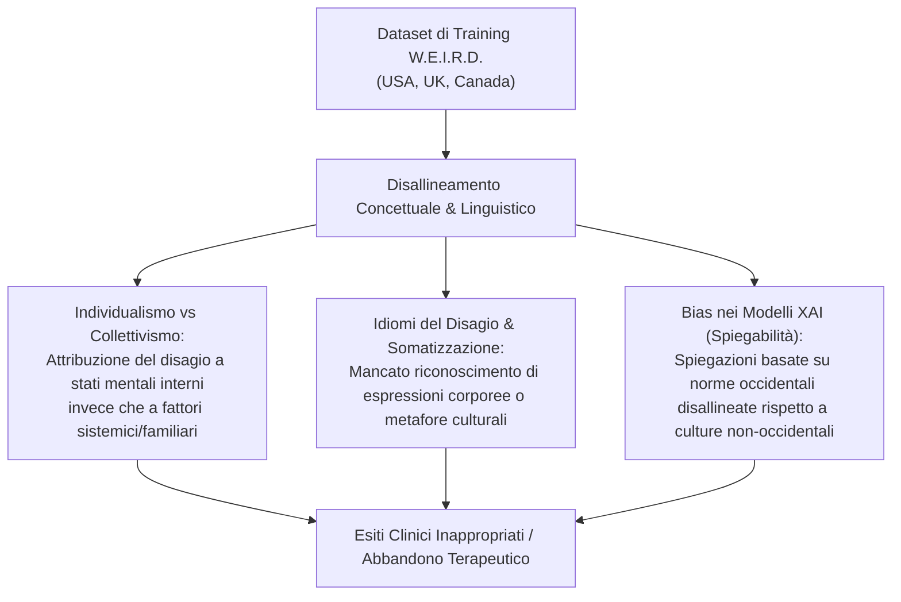

# WEIRD Bias and Cultural Adaptability in Mental Health AI (Bias di Campionamento W.E.I.R.D. e Adattabilità Interculturale)

## Inquadramento del Problema
La quasi totalità dei modelli di Intelligenza Artificiale e degli agenti conversazionali per la salute mentale viene sviluppata e addestrata su dataset provenienti da contesti **W.E.I.R.D.** (*Western, Educated, Industrialized, Rich, Democratic*), principalmente Stati Uniti, Canada, Regno Unito ed Europa occidentale (Rezaei et al., 2026; Peters & Carman, 2024).

Questo squilibrio sistemico genera profonde disuguaglianze nell'efficacia e nell'equità degli strumenti di salute mentale digitale nel panorama globale.

---

## Dimensioni del Disallineamento Culturale

### 1. Individualismo vs Collettivismo
- I modelli addestrati su popolazioni occidentali interpretano il benessere psicologico e la sofferenza attraverso una lente prevalentemente **individualista** (focalizzata su autostima, autonomia decisionale, bisogni e credenze del singolo individuo).
- Nelle culture collettiviste o non occidentali, il disagio psicologico è spesso concettualizzato e affrontato attraverso fattori **contestuali, relazionali, familiari e spirituali**. Suggerimenti algoritmici individualistici possono risultare alienanti, inappropriati o in contrasto con le norme comunitarie.

### 2. Idiomi Culturali della Sofferenza e Somatizzazione
- I modelli NLP tendono a cercare marcatori espliciti di depressione o ansia (es. "tristezza", "senso di colpa"). Tuttavia, in molte culture il distress emotivo si esprime primariamente attraverso sintomi somatici (es. oppressione toracica, affaticamento fisico) o costrutti linguistici metaforici specifici. I modelli non adattati incorrono in elevati tassi di **falsi negativi nello screening**.

### 3. Bias nei Modelli di Spiegabilità (XAI - Peters & Carman, 2024)
- Anche i sistemi di Intelligenza Artificiale Spiegabile (*Explainable AI*) riflettono presupposti cognitivi occidentali. Il modo in cui un'IA giustifica una raccomandazione terapeutica o una stima di rischio riflette schemi razionalisti che possono risultare incomprensibili o inefficaci per utenti di altri background culturali.

---

## Evidenze Empiriche e Modelli Multilingue

| Studio / Progetto | Popolazione / Contesto | Strategia di Adattamento | Risultati / Note |
| :--- | :--- | :--- | :--- |
| **ChatPal (Potts et al., 2023)** | 5 Regioni Europee (Irlanda, Scozia, Svezia, Finlandia, Irlanda del Nord) | Architettura multilingue e clustering K-means degli archetipi utente | Dimostra la fattibilità di chatbot multilingue, pur evidenziando effect size modesti rispetto ai bot monoculturali. |
| **IDEABot (Viduani et al., 2023)** | Adolescenti brasiliani (n = 272) | Input multimodale (voce + testo) adattato al contesto socio-culturale locale | Elevata accettazione (>80%) e conformità (~90%) nel tracciamento dell'umore. |
| **XiaoE (He et al., 2022)** | Studenti universitari in Cina | Protocollo CBT adattato al contesto universitario e linguistico cinese | Remissione sintomatica e riduzione rapida dei punteggi PHQ-9 durante il lockdown. |

---

## Linee Guida per un'IA Culturalmente Adattabile

1. **Campionamento Inclusivo Non-WEIRD:** Investire nella raccolta di corpora clinici rappresentativi delle popolazioni a basso e medio reddito (LMIC), che rappresentano l'85% della popolazione mondiale ma meno del 10% dei dati di ricerca sull'IA.
2. **Co-Progettazione con Esperti Locali:** Coinvolgere psicologi, antropologi e comunità locali durante la formulazione dei prompt e la definizione dei target terapeutici.
3. **Localizzazione Semantica oltre la Semplice Traduzione:** Evitare la mera traduzione automatica dei modelli in lingua inglese; sviluppare modelli nativamente addestrati su lingue e idiomi regionali.
4. **Monitoraggio Dinamico delle Equità:** Condurre audit sistematici di parità di accuratezza (*fairness metrics*) prima di autorizzare l'uso clinico di strumenti in territori multiculturali.

---

## Riferimenti Bibliografici
- Rezaei, Z., Khorraminia, A., Shi, D., & Banad, Y. M. (2026). Network-based artificial intelligence in mental healthcare: A systematic review of chatbots, artificial intelligence/machine learning models and ethical considerations in global healthcare networks. *DIGITAL HEALTH*, 12, 1–30. https://doi.org/10.1177/20552076261421688
- Peters, U., & Carman, M. (2024). Cultural bias in explainable AI research: a systematic analysis. *J Artif Intell Res*, 79, 971–1000.
- Potts, C., Lindström, F., Bond, R., et al. (2023). A multilingual digital mental health and well-being chatbot (ChatPal): pre–post multicenter intervention study. *J Med Internet Res*, 25, e43051.

---

## Pagine Correlate
- [[rezaei-et-al-2026]]
- [[algorithmic-bias-and-digital-inequalities]]
- [[ieacp-canada-protocol-ethical-frameworks]]
- [[network-based-ai-mental-healthcare]]
- [[specialized-nlp-models-mental-health]]
- [[mental-health-chatbot-taxonomy]]
