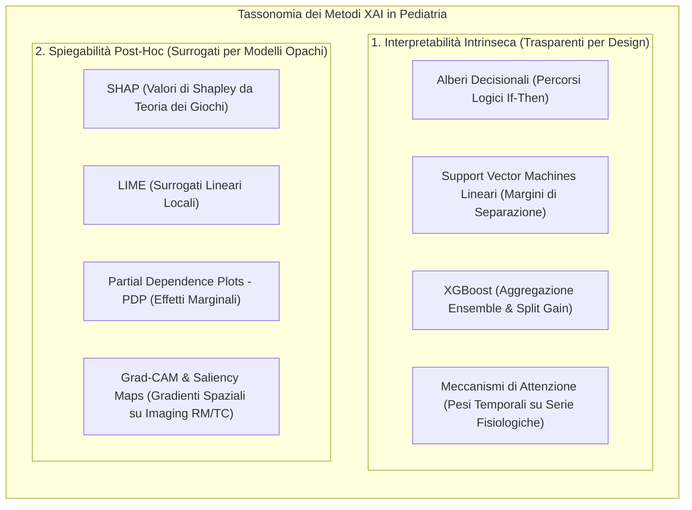
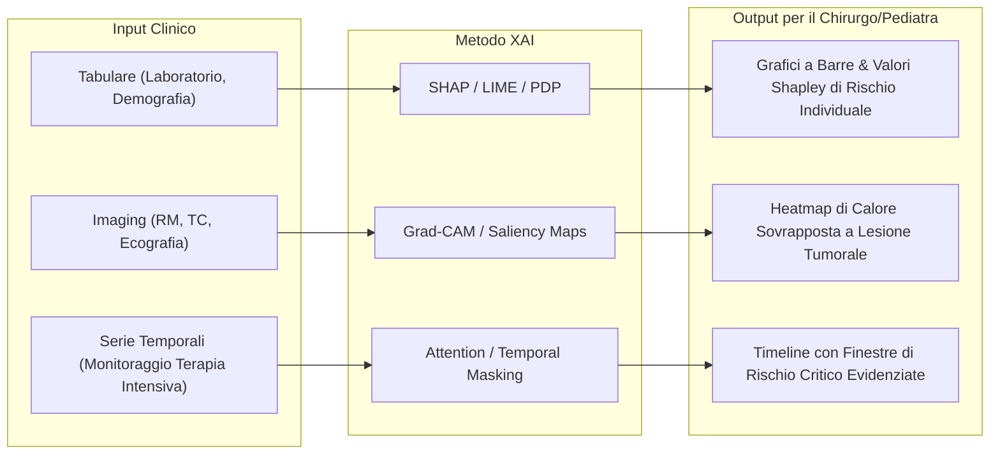

# Explainable AI (XAI) in Pediatric Surgery and Medicine

**Summary**: Tassonomia, caratteristiche e applicazioni cliniche delle metodologie di Explainable AI (XAI) intrinseche (Decision Trees, SVM, XGBoost, Attention Mechanisms) e post-hoc (SHAP, LIME, PDP, Grad-CAM, Saliency Maps) impiegate nella chirurgia e medicina pediatrica per garantire trasparenza, sicurezza e interpretabilità decisionale.
**Sources**: Verhoeven, Bouisaghouane & Hulscher (2026) - `a-2702-1843.pdf`
**Last updated**: 2026-08-27
---

## Definizione e Razionale Clinico

L'integrazione di modelli predittivi e algoritmi di computer vision nella chirurgia pediatrica affronta sfide uniche dovute alla vulnerabilità biologica, alle finestre di sviluppo continuo e alla ridotta numerosità campionaria dei pazienti pediatrici. I modelli cosiddetti "black-box" (scatola nera), la cui logica inferenziale interna rimane opaca, presentano gravi rischi clinici:
- Impossibilità per il chirurgo o pediatra di validare la plausibilità biologica del ragionamento algoritmico.
- Mancanza di accountability e tracciabilità in caso di errore diagnostico o complicanza post-operatoria.
- Difficoltà di comunicare le motivazioni cliniche ai genitori o tutori per l'ottenimento di un consenso informato valido.

L'**Explainable AI (XAI)** risponde a queste criticità quantificando l'importanza delle variabili predittive (*feature importance*), visualizzando i confini decisionali e generando mappe di attivazione anatomica interpretabili.

---

## Metodologie XAI Intrinseche

I modelli intrinsecamente interpretabili possiedono una struttura matematica direttamente ispezionabile dal clinico:

### 1. Alberi Decisionali (*Decision Trees*)
- **Meccanismo**: Struttura gerarchica ad albero che suddivide lo spazio delle feature secondo regole binarie sequenziali, rispecchiando la logica degli algoritmi diagnostici clinici tradizionali.
- **Applicazione Pediatrica**: Predizione precoce del rischio di **sepsi pediatrica** e screening dell'appendicite acuta.
- **Punti di Forza & Limiti**: Estremamente intuitivi, ma inclini all'overfitting su dataset pediatrici piccoli e con ridotta capacità predittiva su relazioni non lineari complesse.

### 2. Support Vector Machines (SVM) Lineari
- **Meccanismo**: Identificazione dell'iperpiano di massima separazione tra classi cliniche, con pesi associati direttamente interpretabili come contributo relativo di ciascuna variabile.
- **Applicazione Pediatrica**: Stratificazione del rischio di **complicanze post-operatorie** e rigetto di trapianto d'organo (fegato, cuore).
- **Punti di Forza & Limiti**: Efficaci su spazi ad alta dimensionalità (es. profili genomici o biomarcatori sierici), ma limitati alle relazioni puramente lineari.

### 3. XGBoost (Ensemble di Alberi)
- **Meccanismo**: Combina centinaia di alberi di decisione tramite gradient boosting, calcolando l'importanza delle feature in base al guadagno informativo (*gain*) e alla frequenza di utilizzo negli split.
- **Applicazione Pediatrica**: Predizione degli esiti riabilitativi dopo **chirurgia per deformità spinale pediatrica** (es. scoliosi idiopatica), dove parametri sagittali e punteggi di self-image sono emersi come i predittori chiave.

### 4. Meccanismi di Attenzione (*Attention Mechanisms*)
- **Meccanismo**: In modelli sequenziali o ricorrenti (es. transformer, LSTM), quantificano i pesi di attenzione assegnati a specifici istanti temporali o canali fisiologici.
- **Applicazione Pediatrica**: Monitoraggio continuo dei parametri vitali per la predizione precoce di **enterocolite necrotizzante (NEC)** nei neonati pretermine.

---

## Metodologie XAI Post-Hoc

Applicate a modelli complessi e non lineari (es. reti neurali profonde, deep learning multimodale) per estrarre spiegazioni a posteriori:

### 1. SHAP (Shapley Additive Explanations)
- Basato sulla **teoria dei giochi cooperativi**, garantisce proprietà matematiche ottimali (efficienza, simmetria, additività). Calcola il contributo marginale di ogni feature sia a livello globale (sull'intera coorte) sia locale (sul singolo paziente).
- *Caso d'uso pediatrico*: Identificazione dei fattori determinanti per il rischio di **malnutrizione post-operatoria in bambini con cardiopatie congenite**.

### 2. LIME (Local Interpretable Model-Agnostic Explanations)
- Approssima localmente la superficie decisionale del modello black-box attorno a una specifica istanza clinica mediante un modello surrogato interpretabile (es. regressione lineare pesata).
- *Caso d'uso pediatrico*: Supporto alla diagnosi dello spettro dell'**autismo infantile**, combinato con SHAP per bilanciare granularità locale e robustezza globale.

### 3. Partial Dependence Plots (PDP)
- Visualizzano la relazione funzionale tra una o due variabili cliniche e la probabilità predetta, mantenendo costanti tutte le altre feature. Consentono di individuare valori soglia critici (es. livelli di biomarker oltre i quali il rischio chirurgico aumenta esponenzialmente).

### 4. Saliency Maps e Grad-CAM
- **Saliency Maps**: Calcolano i gradienti dell'output rispetto ai pixel di input per mostrare quali regioni anatomiche influenzano maggiormente la classificazione.
- **Grad-CAM (Gradient-weighted Class Activation Mapping)**: Utilizza i gradienti che fluiscono nell'ultimo strato convoluzionale delle CNN per generare mappe di calore a grana grossa ma semanticamente e anatomicamente coerenti.
- *Caso d'uso pediatrico*: Classificazione e localizzazione di **tumori cerebrali pediatrici** su risonanza magnetica (MR), permettendo al neuroradiologo e al neurochirurgo di verificare se l'algoritmo focalizza la propria attenzione sulla lesione neoplastica o su artefatti di scansione.

---

## Sintesi Comparativa

| Metodo | Ambito Applicativo | Tipologia Output | Principale Vantaggio Clinico | Principale Vulnerabilità |
| :--- | :--- | :--- | :--- | :--- |
| **Alberi Decisionali** | Dati tabulari / Cartella clinica | Regole If-Then | Massima trasparenza intuitiva | Bassa accuratezza su dinamiche complesse |
| **XGBoost** | Dati tabulari clinici | Feature Importance aggregata | Alto potere predittivo + ranking | Non fornisce la direzione dell'effetto per singolo split |
| **Attention** | Monitoraggio PICU / NICU | Curve di attenzione temporale | Identifica finestre di instabilità | Difficile traduzione in indicatori standard |
| **SHAP** | Modelli multivariati complessi | Valori Shapley (+ / -) | Rigore teorico, consistenza locale/globale | Alto costo computazionale |
| **LIME** | Decisioni su singoli pazienti | Pesi del surrogato locale | Flessibile per singoli casi atipici | Instabilità alle perturbazioni locali |
| **Grad-CAM** | Imaging radiologico e RM | Heatmap cromatica anatomica | Immediata validazione visiva anatomica | Rischio di evidenziare pattern non specifici |

---

## Pagine Correlate

- [[verhoeven-et-al-2026]]: Sintesi della revisione sistematica su XAI in chirurgia pediatrica.
- [[pediatric-ai-bias-and-vulnerabilities]]: Meccanismi di bias e vulnerabilità clinico-biologiche nei modelli pediatrici.
- [[accept-ai-and-pediatric-ethical-frameworks]]: Framework etici, linee guida ACCEPT-AI e conformità al regolamento EU AI Act.
- [[pediatric-xai-benchmarking]]: Standardizzazione e metriche di validazione per spiegazioni cliniche affidabili.
- [[ai-clinical-decision-support]]: Sistemi di supporto alle decisioni cliniche e integrazione nella pratica medica.
- [[reflective-interpretability]]: Tecniche di interpretabilità riflessiva e dialogo clinico.
