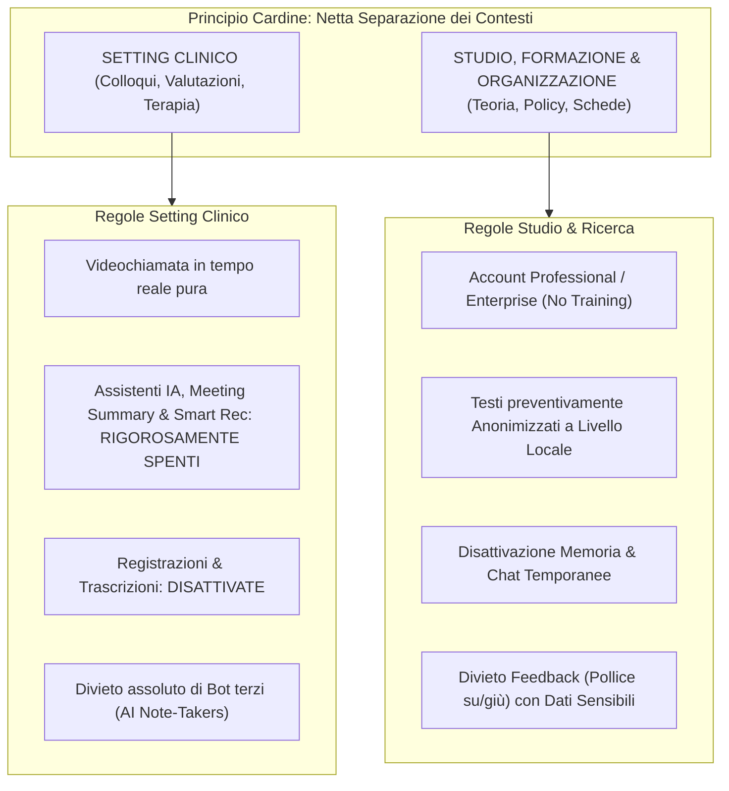
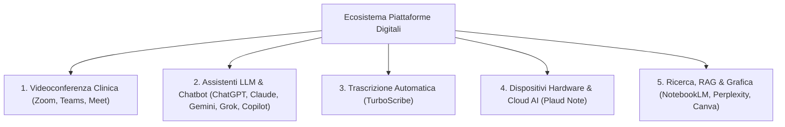
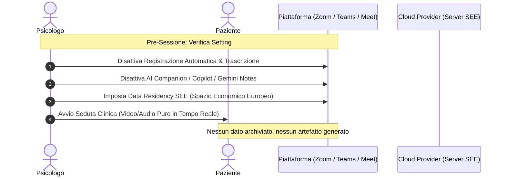
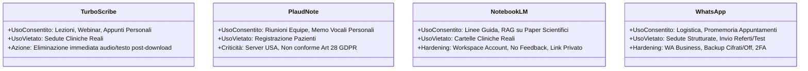
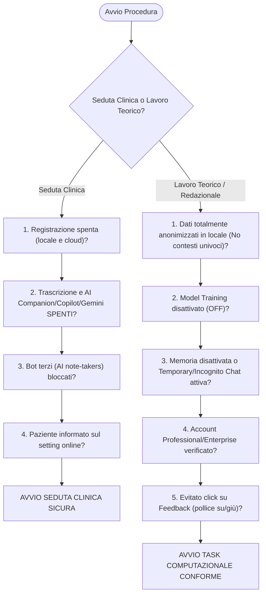

# Configurazione di Sicurezza e Mitigazione del Rischio per Piattaforme di IA in Ambito Clinico

**Summary**: Protocollo operativo e tassonomia tecnica formalizzati dal Gruppo di Lavoro Intelligenza Artificiale dell'Ordine delle Psicologhe e degli Psicologi del Veneto (OPPV, 2026) per la messa in sicurezza e l'uso conforme dei software commerciali e dei modelli linguistici nella pratica clinica, formativa e di ricerca. Definisce il principio di separazione dei contesti (setting clinico vs attività di studio/organizzazione), le procedure tecniche di *opt-out* dal training algoritmico, la gestione della persistenza e della memoria nei sistemi LLM e le checklist pre-sessione per 11 piattaforme digitali.
**Sources**: `Guida-Pratica-AI-OPPV.pdf` (OPPV, 2026)
**Last updated**: 2026-08-27
---

## Definizione Operativa e Architettura della Sicurezza

La **Configurazione di Sicurezza e Mitigazione del Rischio per Piattaforme di IA** costituisce la declinazione tecnica delle [[quattro-condizioni-liceita-ia-psicologia|Quattro Condizioni di Liceità]] stabilite dall'[[Guida-Pratica-AI-OPPV|OPPV (2026)]].

L'obiettivo fondamentale è neutralizzare i vettori di rischio tipici dell'adozione di software terzi di [[large-language-models|Intelligenza Artificiale Generativa]]:
1. **Perdita di riservatezza e segreto professionale:** Inoltro non controllato di flussi audio, video o testuali verso server extra-SEE;
2. **Inquinamento dei pesi neurali (*Data Retraining Leakage*):** Riutilizzo dei prompt o testi inseriti per l'addestramento continuo dei modelli linguistici;
3. **Persistenza indebita e profiling automatico:** Accumulo indefinito di conversazioni nella cronologia di cloud provider non conformi all'art. 28 GDPR;
4. **Interferenza algoritmica nel setting:** Intrusione di assistenti automatici durante le sedute psicologiche o psicoterapeutiche online.

---

## 1. Tassonomia Operativa delle Piattaforme

La Guida OPPV raggruppa gli strumenti digitali in cinque macro-categorie, per ciascuna delle quali individua limiti d'uso e configurazioni obbligatorie:

---

## 2. Piattaforme di Videoconferenza (Telepsicologia Sicura)

Le sedute online devono garantire lo stesso livello di riservatezza, intimità e protezione del setting in presenza. L'attivazione di assistenti automatici che ascoltano, trascrivono o riassumono il colloquio costituisce una grave violazione della privacy se non regolamentata e una fonte di potenziale compromissione dell'alleanza.

### Regole Comuni Obbligatorie per Sedute Cliniche:
- **Nessuna registrazione automatica o manuale** (né su disco locale, né su cloud);
- **Assistenti IA di riepilogo SPENTI**;
- **Trascrizione live disattivata** (i sottotitoli in tempo reale sono ammessi solo per esigenze di accessibilità, previo accordo con il paziente ed escludendo qualsiasi salvataggio di testo o log);
- **Divieto di ingresso a bot terzi** (es. *Otter.ai, Read.ai, Fireflies* e altri *AI Note Takers*).

### Protocollo di Hardening Specifico:

| Piattaforma | Impostazioni di Hardening Tecnico | Percorso di Configurazione |
| :--- | :--- | :--- |
| **Zoom** | 1. Disattivare *Zoom AI Companion* e *Meeting Summary*. 2. Disattivare registrazione locale e cloud automatica. 3. Impostare la residenza dei dati su server europei. | `Impostazioni > Registrazione -> OFF` `Impostazioni > Avanzate > Dati e privacy > Residenza dei dati > Imposta SEE`. |
| **Microsoft Teams** | 1. Disattivare la registrazione automatica e la trascrizione live. 2. Non attivare licenze o funzionalità *Intelligent Recap / Copilot* per gli account a uso clinico. 3. Bloccare app e bot terzi nei criteri di riunione. | `Interfaccia Amministratore / Opzioni Riunione > Registra automaticamente -> No` `Consenti trascrizione -> No`. |
| **Google Meet** | 1. Disattivare *Gemini in Meet* (*Take notes for me* e *Ask Gemini*). 2. Disattivare le opzioni di registrazione e trascrizione automatica collegate a Calendar/Drive. 3. Sottotitoli impostati solo per fruizione immediata. | `Opzioni Videochiamata Google Calendar > Registrazione/Trascrizione -> Disattivato` `Google Meet > Impostazioni > Generale`. |

---

## 3. Assistenti LLM e Chatbot Generalisti: Hardening e Privacy

L'impiego di LLM per la revisione stilistica, la traduzione o la riflessione teorica richiede la preventiva disattivazione di tutti i canali di apprendimento algoritmico e di ritenzione a lungo termine:

### 3.1. ChatGPT (OpenAI)
1. **Esclusione Training:** `Settings > General > Data Controls > Improve the model for everyone -> OFF`. Disattiva il riutilizzo di prompt e allegati per l'addestramento globale.
2. **Disattivazione Memoria:** `Settings > Personalizzazione > Memoria -> OFF` per entrambe le voci: *"Fai riferimento alle memorie salvate"* e *"Fai riferimento alla cronologia chat"*.
3. **Sessioni con Dati Delicati:** Impiegare la funzione **Temporary Chat** (icona fumetto tratteggiato in alto a destra); i contenuti non compaiono nella cronologia e vengono purgati dai sistemi interni entro 30 giorni.
4. **Account:** Prediligere licenze *Plus, Pro, Team o Enterprise* rispetto a quelle Free per usufruire dei controlli avanzati.

### 3.2. Claude (Anthropic)
1. **Esclusione Training:** `Settings > Privacy > Help improve Claude -> OFF` (da configurare sia su browser desktop sia su app mobile).
2. **Gestione Memoria e Progetti:** `Settings > Capabilities > Pause / Reset memory` per congelare o eliminare memorie di contesto pregresse.
3. **Modalità Incognito:** Attivare le **Incognito Chats** (icona fantasma in alto a destra).
4. **Divieto di Feedback:** **Non cliccare su pollice su / pollice giù** su messaggi professionali: l'invio di feedback autorizza Anthropic a trattenere la conversazione fino a **5 anni**.

### 3.3. Gemini (Google)
1. **Esclusione Attività e Training:** `Account Google > Dati e privacy > Gemini Apps Activity (Attività) -> OFF`.
2. **Disattivazione Contributi:** Deselezionare la casella *"Migliora i servizi Google con le tue registrazioni audio e di Gemini Live"*.
3. **Auto-cancellazione:** Se si mantiene la cronologia per fini di studio, impostare l'auto-eliminazione a **3 mesi** (anziché il default a 18 mesi).
4. **Uso Chat Temporanea:** Utilizzare la chat temporanea ed **evitare l'invio di feedback** (il feedback autorizza la conservazione fino a **3 anni** con potenziale revisione umana).

### 3.4. Microsoft Copilot (M365)
1. **Verifica Protezione Dati:** Lavorare esclusivamente all'interno dell'ambiente aziendale Microsoft 365 verificando che sia visibile lo **scudetto verde (Enterprise Data Protection)**, il quale garantisce l'isolamento dei prompt dal training.
2. **Uso Account Personale (Consumer):** Disattivare il training di testo e voce in `Impostazioni Profilo > Privacy > Esporta o elimina cronologia`.

### 3.5. Grok (xAI)
1. **Disattivazione Training su X (Twitter):** `Settings and Privacy > Privacy & Safety > Data sharing and personalization > Grok & Third-party Collaborators > Data Sharing -> OFF`.
2. **Disattivazione Training su grok.com / App:** `Impostazioni > Controllo dati > Migliora il modello -> OFF`.
3. **Avvertenza di Separazione:** Le cronologie di X e di grok.com sono indipendenti e devono essere gestite e cancellate separatamente.

---

## 4. Strumenti di Trascrizione, Hardware e RAG

### 4.1. TurboScribe (Trascrizione AI)
- **Usi ammessi:** Trascrizione di webinar, lezioni universitarie, convegni scientifici, simulazioni didattiche o registrazioni vocali personali del terapeuta su riflessioni teoriche.
- **Usi vietati:** Trascrizione di sedute cliniche reali o caricamento di file audio contenenti la voce del paziente.
- **Presidio di sicurezza:** Cancellare i file sorgente e i testi trascritti dal cloud del servizio immediatamente dopo il completamento del lavoro.

### 4.2. PLAUD (Plaud Note - Hardware & Cloud)
- **Valutazione di Conformità (Gennaio 2026):** Non rispetta le garanzie formali dell'art. 28 GDPR per i dati particolari/sanitari e opera tramite server extra-SEE (USA).
- **Regola clinica:** **Non deve mai essere impiegato per registrare o riassumere sedute cliniche con pazienti**. È consentito solo per la registrazione di riunioni organizzative di studio o appunti vocali teorici personali.

### 4.3. NotebookLM (Google)
- **Potenzialità e Uso Conforme:** Assistente eccellente per lo studio clinico basato su fonti certe (*source-grounded RAG*). Ideale per interrogare linee guida NICE/APA, manuali diagnostici (DSM-5, ICD-11), articoli scientifici e creare schede psicoeducative.
- **Divieto di Dati Clinici:** Vietato caricare cartelle cliniche, note di seduta o anamnesi di pazienti reali.
- **Hardening:** Utilizzare account Google Workspace, mantenere i Notebook con permessi di accesso ristretti (*Private/Solo tu*) ed evitare l'invio di feedback su materiali riservati.

### 4.4. WhatsApp (Meta)
- **Usi consentiti:** Comunicazioni organizzative, promemoria appuntamenti, modifiche di orario. Videochiamate ammesse solo in via transitoria ed emergenziale (preferendo piattaforme dedicate).
- **Usi non consentiti:** Conduzione sistematica di sedute terapeutiche; invio di allegati contenenti referti, test psicologici o cartelle cliniche; utilizzo della chat come diario terapeutico.
- **Hardening:** Utilizzo di WhatsApp Business o numero dedicato, disattivazione del backup su cloud non cifrato, attivazione della verifica in due passaggi (2FA) e impostazione dei messaggi a scomparsa per comunicazioni di servizio.

### 4.5. Canva
- **Uso conforme:** Creazione di infografiche visive e schede psicoeducative divulgative generiche (ansia, tecniche di rilassamento, gestione del tempo).
- **Presidio:** Non caricare immagini di pazienti o narrazioni biografiche dettagliate; considerare i moduli *Magic Write* e *Magic Media* come prompt soggetti a trattamento dati.

---

## 5. Checklist di Hardening Pre-Seduta e Pre-Task

Prima di ogni seduta clinica online o sessione di lavoro assistita da IA, il professionista deve verificare la seguente checklist:

---

## Concetti Correlati

- [[Guida-Pratica-AI-OPPV|Guida Operativa all'Utilizzo dell'AI nella Pratica Professionale (OPPV, 2026)]]: Sintesi istituzionale completa della fonte.
- [[quattro-condizioni-liceita-ia-psicologia|Le Quattro Condizioni di Liceità e Correttezza Deontologica per l'IA in Psicologia]]: Fondamento giuridico e deontologico.
- [[gdpr-governance-mental-health-ai|GDPR Governance e Protezione Dati nell'IA per la Salute Mentale]]: Requisiti normativi su cloud, crittografia e storage.
- [[informed-consent-for-clinical-ai|Consenso Informato per l'IA nella Pratica Clinica]]: Modelli di informativa e sezioni modulari.
- [[human-oversight-and-liability-in-clinical-ai|Supervisione Umana e Responsabilità Giuridica nell'IA Clinica]]: Linee guida sulla validazione dell'output.
- [[modello-centauro-clinico|Modello Centauro Clinico]]: Metodologia di integrazione RAG e LLM post-seduta.
