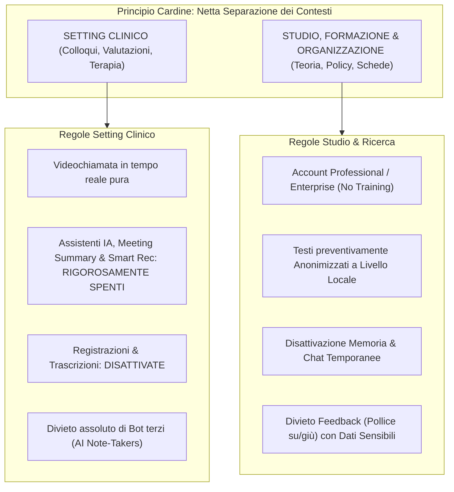

# Configurazione di Sicurezza e Mitigazione del Rischio per Piattaforme di IA in Ambito Clinico

## Definizione Operativa
La **Configurazione di Sicurezza e Mitigazione del Rischio per Piattaforme di IA** costituisce la declinazione tecnica delle [[quattro-condizioni-liceita-ia-psicologia|Quattro Condizioni di Liceità]] stabilite dall'[[guida-pratica-ai-oppv-1|OPPV (2026)]].

L'obiettivo fondamentale è neutralizzare i vettori di rischio tipici dell'adozione di software terzi di [[large-language-models|Intelligenza Artificiale Generativa]]:
1. **Perdita di riservatezza e segreto professionale:** Inoltro non controllato di flussi audio, video o testuali verso server extra-SEE;
2. **Inquinamento dei pesi neurali (*Data Retraining Leakage*):** Riutilizzo dei prompt o testi inseriti per l'addestramento continuo dei modelli linguistici;
3. **Persistenza indebita e profiling automatico:** Accumulo indefinito di conversazioni nella cronologia di cloud provider non conformi all'art. 28 GDPR;
4. **Interferenza algoritmica nel setting:** Intrusione di assistenti automatici durante le sedute psicologiche o psicoterapeutiche online.

## Evidenze dalla Letteratura
Il protocollo operativo e la tassonomia tecnica sono stati formalizzati dal **Gruppo di Lavoro Intelligenza Artificiale dell'Ordine delle Psicologhe e degli Psicologi del Veneto (OPPV, 2026)**. Tale guida definisce il principio di separazione dei contesti (setting clinico vs attività di studio/organizzazione), le procedure tecniche di *opt-out* dal training algoritmico, la gestione della persistenza e della memoria nei sistemi LLM e le checklist pre-sessione per 11 piattaforme digitali.

**Riferimenti Bibliografici:**
- OPPV (2026). *Guida Pratica all'Utilizzo dell'IA nella Pratica Professionale*. Gruppo di Lavoro Intelligenza Artificiale dell'Ordine delle Psicologhe e degli Psicologi del Veneto.

## Relazioni
- [[guida-pratica-ai-oppv-1|Guida Operativa all'Utilizzo dell'AI nella Pratica Professionale (OPPV, 2026)]]: Sintesi istituzionale completa della fonte.
- [[quattro-condizioni-liceita-ia-psicologia|Le Quattro Condizioni di Liceità e Correttezza Deontologica per l'IA in Psicologia]]: Fondamento giuridico e deontologico.
- [[gdpr-governance-mental-health-ai|GDPR Governance e Protezione Dati nell'IA per la Salute Mentale]]: Requisiti normativi su cloud, crittografia e storage.
- [[informed-consent-for-clinical-ai|Consenso Informato per l'IA nella Pratica Clinica]]: Modelli di informativa e sezioni modulari.
- [[human-oversight-and-liability-in-clinical-ai|Supervisione Umana e Responsabilità Giuridica nell'IA Clinica]]: Linee guida sulla validazione dell'output.
- [[modello-centauro-clinico|Modello Centauro Clinico]]: Metodologia di integrazione RAG e LLM post-seduta.
