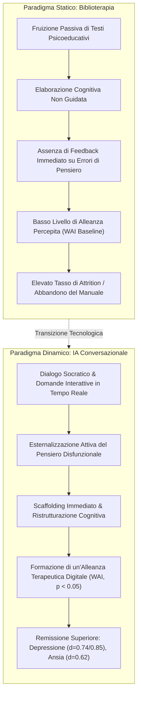
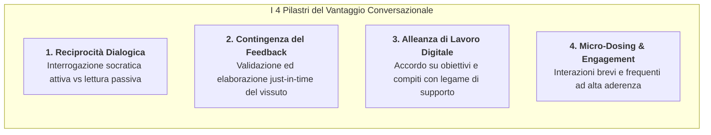
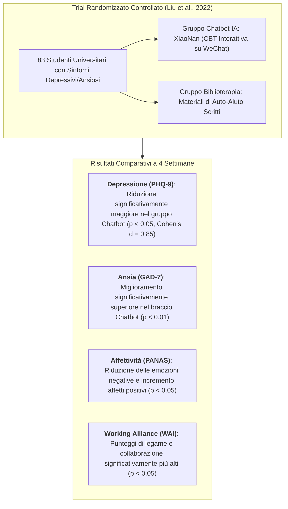
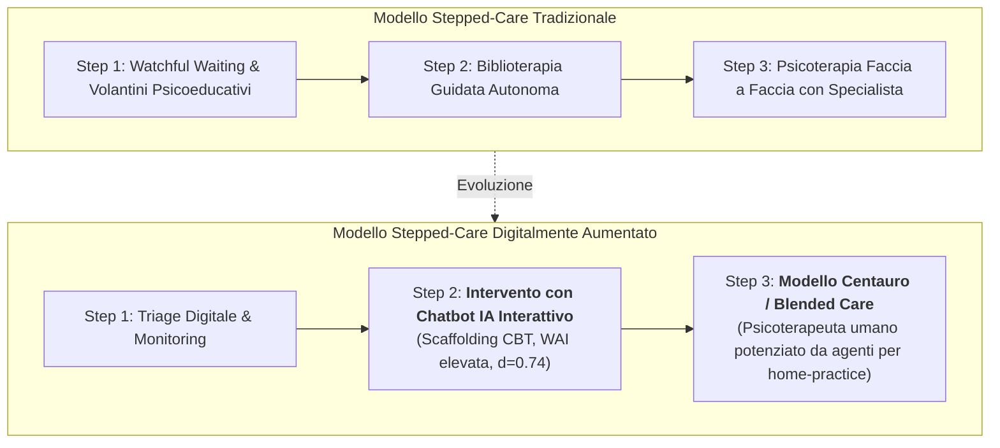

---
tags: [conversational-ai, bibliotherapy, digital-cbt, working-alliance, therapeutic-rapport, interactive-scaffolding, clinical-effectiveness, meta-analysis, socratic-dialogue, humayun-2025]
source_papers: ["pone.0332207.pdf"]
---

# Conversational AI vs. Bibliotherapy in Mental Health (IA Conversazionale vs Biblioterapia nella Salute Mentale)

## Definizione Operativa
- Il costrutto di **Conversational AI vs. Bibliotherapy** formalizza la contrapposizione clinica, metodologica ed esperienziale tra due paradigmi cardine dell'auto-aiuto guidato in salute mentale:
  1. **Biblioterapia Tradizionale (*Bibliotherapy / Static Self-Help*):** Erogazione di interventi mediante materiali scritti strutturati (libri, dispense psicoeducative cartacee, PDF, manuali di self-help), in cui l'elaborazione e l'applicazione delle tecniche di terapia cognitivo-comportamentale (CBT) sono demandate interamente alla lettura autonoma e alla volizione del paziente;
  2. **Interventi Conversazionali basati su IA (*Conversational AI / Interactive Chatbots*):** Erogazione mediata da agenti conversazionali intelligenti (CBT chatbots come XiaoNan, Woebot, Tess) capaci di condurre un dialogo socratico in tempo reale, formulare domande guidate, somministrare esercizi interattivi passo-passo e fornire validazione contingente (Humayun et al., 2025; *PLoS ONE*, doi: [10.1371/journal.pone.0332207](https://doi.org/10.1371/journal.pone.0332207); Liu et al., 2022; *Internet Interventions*, doi: [10.1016/j.invent.2022.100495](https://doi.org/10.1016/j.invent.2022.100495)).
- **Evidenze Empiriche di Superiorità:** Nella sintesi meta-analitica di Humayun et al. (2025) e nel trial randomizzato di Liu et al. (2022), i partecipanti assegnati al chatbot interattivo hanno conseguito:
  - Una riduzione significativamente superiore dei sintomi depressivi (**$p < 0.05$**, Cohen's $d = 0.6 - 0.8$ / $d=0.85$);
  - Una remissione significativamente più marcata dell'ansia (**$p < 0.01$**);
  - Punteggi statisticamente più elevati nella *Working Alliance Inventory* (**WAI, $p < 0.05$**), a dimostrazione che l'interattività dialogica genera un legame terapeutico percepito assente nella lettura statica.



---

## I Quattro Driver della Superiorità Conversazionale



### 1. Reciprocità Dialogica e Scaffolding Socratico
- **Dal Monologo al Dialogo:** Nella biblioterapia convenzionale, il paziente riceve spiegazioni astratte sui meccanismi dell'ansia e deve identificare autonomamente i propri pensieri automatici.
- **Scaffolding Guidato:** L'agente conversazionale pone domande progressive mirate ("Cosa ti dice la mente in questo istante?", "Quali evidenze fattuali contraddicono questa previsione?"), accompagnando il soggetto lungo i passaggi della ristrutturazione cognitiva secondo il modello ABC della CBT.

### 2. Validazione Emotiva e Feedback Contingente in Tempo Reale
- **Contingenza Temporale:** Il testo stampato non può rilevare se il lettore è confuso, scoraggiato o in preda a disregolazione emotiva. L'IA risponde istantaneamente alle modulazioni affettive dell'utente, offrendo rispecchiamento empatico prima di proporre la tecnica di regolazione, prevenendo sentimenti di inadeguatezza.

### 3. Costruzione dell'Alleanza di Lavoro (*Working Alliance*)
- **Le Tre Dimensioni di Bordin:** Come documentato da Liu et al. (2022), l'interazione con XiaoNan ha ottenuto punteggi WAI significativamente superiori rispetto alla biblioterapia su:
  1. *Accordo sugli Obiettivi (Goals):* Co-definizione dello scopo della conversazione;
  2. *Accordo sui Compiti (Tasks):* Esecuzione condivisa degli esercizi terapeutici;
  3. *Legame Affettivo (Bond):* Sensazione di presenza, supporto e continuità relazionale.

### 4. Micro-Interazioni Quotidiane (*Conversational Micro-Dosing*)
- **Frazionamento del Carico:** La biblioterapia richiede sessioni di lettura prolungate che scoraggiano soggetti con ridotta capacità di concentrazione o anedonia grave. Il chatbot veicola l'intervento tramite brevi scambi di 3–5 minuti distribuiti nella giornata, massimizzando l'aderenza (*retention*) e riducendo il dropout.

---

## Evidenze Sperimentali Dirette: Liu et al. (2022) e Sintesi Meta-Analitica

Nel trial clinico controllato randomizzato condotto da Liu et al. (2022) su 83 studenti universitari con sintomatologia depressiva e ansiosa (valutati per 4 settimane):



```
                     Confronto degli Esiti Clinici (Liu et al., 2022)
Outcome Misurato         Chatbot IA (XiaoNan)      Biblioterapia      Significatività (p)
-----------------------------------------------------------------------------------------
Depressione (PHQ-9)      Riduzione Marcata         Calo Modesto       p < 0.05 (d = 0.85)
Ansia (GAD-7)            Riduzione Elevata         Calo Minore        p < 0.01
Affetti Negativi (PANAS) Riduzione Marcata         Calo Lieve         p < 0.05
Alleanza Terapeutica WAI Punteggio Alto            Punteggio Basso    p < 0.05
```

---

## Tabella Sinottica Comparativa (8 Dimensioni Cliniche e Funzionali)

| Dimensione di Analisi | Biblioterapia Tradizionale (Self-Help Passivo) | Chatbot Conversazionale IA (CBT Interattiva) |
| :--- | :--- | :--- |
| **1. Modalità di Fruizione** | Lettura unidirezionale di testi, schede didattiche e manuali | Dialogo interattivo bidirezionale con domande e risposte in tempo reale |
| **2. Coinvolgimento Cognitivo** | Elaborazione passiva; elevato rischio di *mind wandering* | Esternalizzazione attiva e problem-solving guidato socratico |
| **3. Feedback Emotivo** | Assente; nessuna reattività al tono affettivo del paziente | Presente e contingente; validazione empatica immediata |
| **4. Alleanza di Lavoro (WAI)** | Minima o nulla (nessuna figura interattiva con cui stringere legami) | Significativamente superiore ($p < 0.05$ su obiettivi, compiti e legame) |
| **5. Personalizzazione del Ritmo** | Fissata dalla struttura rigida dell'indice del libro/opuscolo | Dinamica: adattamento in tempo reale alle risposte dell'utente |
| **6. Gestione delle Emergenze** | Statica (meri elenchi di numeri verdi in calce al testo) | Rilevamento dinamico di parole chiave di crisi e attivazione di protocolli di emergenza |
| **7. Aderenza e Dropout** | Elevata attrition (frequente mancata lettura integrale dei testi) | Maggiore retention favorita da notifiche contestuali e brevità delle sessioni |
| **8. Dimensione dell'Effetto (d)** | Piccola-moderata ($d \approx 0.30 - 0.40$) | Moderata-grande ($d = 0.62 - 0.85$, Humayun et al., 2025) |

---

## Implicazioni per la Sanità Pubblica e i Modelli Stepped-Care



1. **Sostituzione della Biblioterapia nello Step 2:** La documentata superiorità dei chatbot conversazionali rispetto alla biblioterapia suggerisce che i servizi sanitari (es. NHS Talking Therapies) dovrebbero aggiornare le linee guida di *stepped-care*, promuovendo agenti conversazionali certificati come primo livello attivo d'intervento al posto dei soli opuscoli cartacei.
2. **Integrazione come Esercizio Tra le Sedute (*Between-Session Practice*):** Nella psicoterapia condotta da clinici umani, l'assegnazione di compiti interattivi su chatbot conversazionale supera l'inerzia tipica dei diari cartacei, aumentando il consolidamento delle competenze CBT e la continuità del trattamento ([[ai-supported-between-session-engagement|AI-Supported Between-Session Engagement]]).

---

## Pagine Correlate
- [[pone.0332207|PLoS ONE Meta-Analysis (Humayun et al., 2025)]]: Evidenze meta-analitiche e confronto statistico tra trial di IA.
- [[interactive-vs-psychoeducational-ai-engagement|Interactive vs. Psychoeducational AI Engagement]]: Analisi dello 'Use Ratio' tra esercizi attivi e testi passivi.
- [[digital-therapeutic-alliance|Digital Therapeutic Alliance]]: Dinamiche del legame collaborativo con agenti conversazionali.
- [[multimodal-conversational-agents-in-mental-health|Multimodal Conversational Agents in Mental Health]]: Vantaggi di voce, video e multimedialità nei chatbot clinici.
- [[ai-enhanced-cbt|AI-Enhanced CBT]]: Integrazione di modelli cognitivo-comportamentali nelle architetture conversazionali.
- [[routine-coach-vs-on-demand-assistant|Routine Coach vs. On-Demand Assistant]]: Tassonomia funzionale e temporale dei chatbot per la salute.
