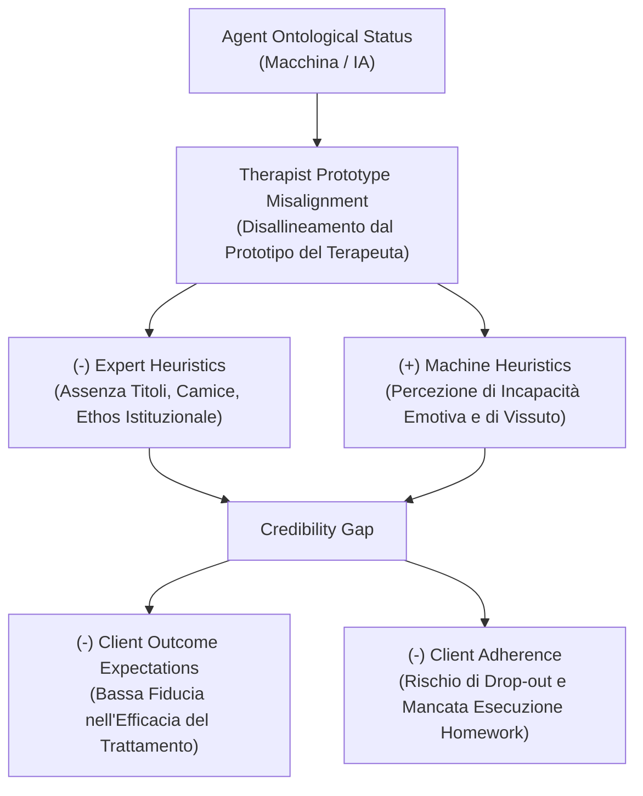

# Credibility Gap

## Definizione Operativa
- Costrutto teorico formulato da Herbener e Damholdt (2025) che descrive la disparità tra l'effettiva competenza operativa esibita da un agente artificiale nell'erogazione di interventi clinici evidence-based e la sua intrinseca carenza di credibilità, ethos, legittimazione istituzionale e autorità socioculturale come figura curante riconosciuta.
- **Utilità CBT:** Spiega perché i pazienti possano manifestare basse aspettative di miglioramento (*prognostic outcome expectations*) e scarsa aderenza terapeutica (*client adherence*) di fronte a prescrizioni o compiti guidati unicamente da IA. Evidenzia la funzione del clinico umano come garante istituzionale che conferisce un "bollino di approvazione" (*stamp of approval*) all'agente in configurazioni di **blended care**.

## Evidenze dalla Letteratura
- **Modello di Influenza Sociale ed Ethos Terapeutico:** Secondo Strong (1968), il successo terapeutico dipende dalla ricettività del paziente all'influenza del clinico, determinata da perizia (*expertness*), affidabilità (*trustworthiness*) e autorevolezza. Frank e Frank (1991) estendono questo principio sottolineando che il terapeuta opera come figura socialmente sanzionata capace di "rimoralizzare" il paziente infondendo speranza e mobilitando l'autoefficacia. L'IA manca di questo status socioculturale sanzionato.
- **Disallineamento dal Prototipo Cognitivo (*Prototype Misalignment*):** I pazienti valutano la credibilità confrontando il terapeuta con un prototipo cognitivo culturalmente strutturato (Rosch, 1973; Kahneman & Tversky, 1972) che include diplomi, credenziali professionali, abbigliamento formale, jargon clinico e reale esperienza di vita umana. L'agente artificiale disattende tali rappresentazioni, inibendo l'attivazione delle **euristiche dell'esperto** (*expert heuristics*, Sundar, 2008; Meinert & Krämer, 2022).
- **Machine Heuristics e Scetticismo Clinico:** Gli individui attivano scorciatoie cognitive sulle macchine (*machine heuristics*, Yang & Sundar, 2024), considerandole ideali per compiti di calcolo, memoria e oggettività, ma strutturalmente inadatte a comprendere sofferenze esistenziali ed emotive (Howe et al., 2023; Vowels, 2024). Tale dissonanza deprime le credenze di esito e la motivazione al cambiamento.
- **Eccezione delle Popolazioni Marginalizzate:** In contesti caratterizzati da elevato stigma sociale o paura del giudizio morale (es. dipendenze, devianze, minoranze discriminate), la percezione di neutralità e assenza di giudizio dell'euristica della macchina può facilitare l'auto-apertura (*self-disclosure*) rispetto all'interazione con un umano (Lucas et al., 2014; Kim et al., 2022).
- **Soluzione Integrativa Blended Care:** Il Credibility Gap viene efficacemente neutralizzato nei protocolli blended care: il terapeuta umano stabilisce l'inquadramento clinico iniziale, prescrive l'uso dell'agente artificiale e gli trasferisce la propria legittimazione professionale (*stamp of approval*), mentre l'IA massimizza l'aderenza tra le sedute mediante reperibilità e supporto continuativo (Wentzel et al., 2016; Koelen et al., 2022).

**Riferimenti Bibliografici:**
- Herbener, A. B., & Damholdt, M. F. (2025). A Theoretical Framework of the Processes of Change in Psychotherapy Delivered by Artificial Agents. *arXiv preprint arXiv:2509.02144v1 [cs.HC]*.
- Strong, S. R. (1968). Counseling: An interpersonal influence process. *Journal of Counseling Psychology*, 15(3), 215–224.
- Frank, J. D., & Frank, J. B. (1991). *Persuasion and healing: A comparative study of psychotherapy* (3rd ed.). Johns Hopkins University Press.
- Sundar, S. S. (2008). The MAIN Model: A Heuristic Approach to Understanding Technology Effects on Credibility.
- Yang, H., & Sundar, S. S. (2024). Machine heuristic: concept explication and development of a measurement scale. *Journal of Computer-Mediated Communication*, 29(6).
- Constantino, M. J., Vîslă, A., Coyne, A. E., & Boswell, J. F. (2018). A meta-analysis of the association between patients' early treatment outcome expectation and their posttreatment outcomes. *Psychotherapy*, 55(4), 473–485.

## Relazioni
- Vedi anche: [[2509-02144v1]], [[genuineness-gap]], [[processes-of-change-in-psychotherapy]], [[modello-centauro-clinico]], [[digital-therapeutic-alliance]], [[ai-assisted-psychotherapy]], [[supervisione-clinica-ai]]
