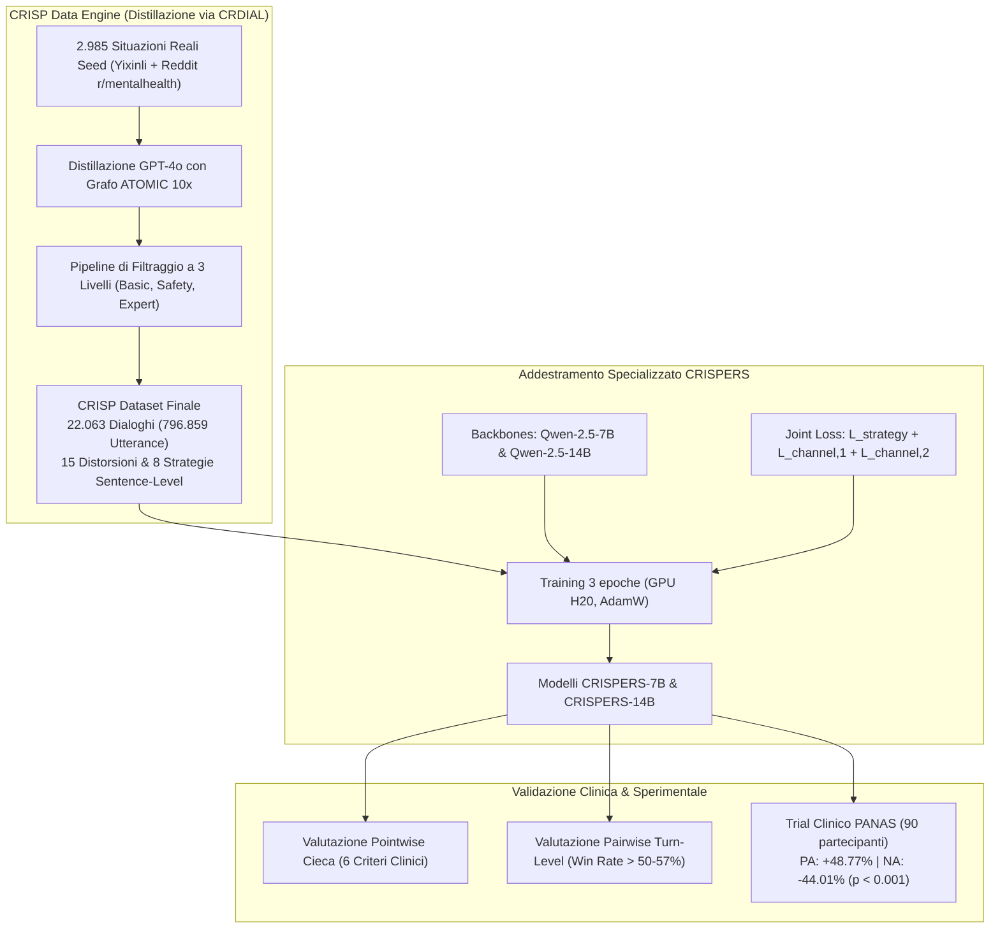

# CRISP Dataset e Modelli CRISPERS

## Definizione Operativa
- **CRISP** è il primo dataset bilingue (inglese e cinese) su larga scala di dialoghi psicoterapeutici multi-fase e multi-turno orientati alla **Ristrutturazione Cognitiva (CR)** con vincoli di strategie supportive frase per frase.
- **CRISPERS** (7B e 14B) sono Large Language Models conversazionali specialistici addestrati su CRISP mediante una funzione di perdita congiunta ($\mathcal{L}_{joint}$) che ottimizza la generazione condizionata da strategie supportive e l'identificazione multi-canale delle distorsioni cognitive.
- **Utilità CBT:** Rappresenta un benchmark e una famiglia di modelli aperti in grado di operare interventi complessi di CBT dialogica, superando modelli commerciali chiusi di scala superiore (come GPT-4o e GLM-4) in valutazioni cieche e trial clinici con standardizzazione psicometrica (PANAS).

## Evidenze dalla Letteratura
- **Statistiche e Dimensioni del Dataset CRISP:**
  - 22.063 dialoghi bilingui (10.733 in inglese, 11.330 in cinese) derivati da 2.985 situazioni uniche, con una media di **36.48 turni per dialogo** e oltre **796.859 enunciati** complessivi (Zhou et al., 2025).
  - Copertura di 10 macro-categorie situazionali e 54 sotto-categorie; diversità lessicale (MTLD = 70.51) doppia rispetto ai dataset tradizionali come ESConv (34.27), grazie all'integrazione del knowledge graph di senso comune ATOMIC 10x (Zhou et al., 2025; Hwang et al., 2021).
  - Classificazione bilanciata su **15 distorsioni cognitive** (catastrofizzazione, pensiero tutto-o-nulla, ipergeneralizzazione, personalizzazione, ecc.) con accuratezza validata da esperti psicologi all'85.5% ($\kappa = 0.681$) e accuratezza sulle strategie supportive al 97.6% ($\kappa = 0.712$) (Zhou et al., 2025).
- **Pipeline di Filtraggio di Qualità a Tre Livelli:**
  1. *Basic Filtering:* Rimozione di espressioni innaturali, incoerenze logico-sociali tra sotto-passi e violazioni di buonsenso (-11.03%).
  2. *Safety Filtering:* Pre-screening manuale dei seed (-29.8%) e doppio filtro con classificatore Canary e LLM safety check (-0.02%).
  3. *Expert Filtering:* Valutazione automatizzata rigorosa su 16 metriche suddivise in *Therapist Standard* (5 metriche), *Help-Seeker Standard* (9 metriche) e *Supervisor Standard* (2 metriche); scarto dei dialoghi con punteggio medio < 3.5 (-11.00%, con pass-rate umano del 95% sui dialoghi trattenuti).
- **Prestazioni Clinico-Sperimentali di CRISPERS-14B:**
  - *Valutazione Pointwise Interattiva:* Supera sistematicamente GPT-4o, GLM-4 e Qwen-2.5-72B/14B in tutte e 6 le dimensioni cliniche (Sensatezza, Specificità, Supporto emotivo, Utilità, Affidabilità e Qualità complessiva).
  - *Trial Clinico di Intervento (PANAS su 90 soggetti):* Produce un incremento dell'affetto positivo del **+48.77%** ($p = 5.40 \times 10^{-8}$) e un abbattimento dell'affetto negativo del **-44.01%** ($p = 1.07 \times 10^{-10}$), distaccando in modo statisticamente significativo ($p < 0.05$ su Tukey HSD) il modello maestro GPT-4o e l'LLM clinico commerciale Emohaa (Zhou et al., 2025).

**Riferimenti Bibliografici:**
- Zhou, J., Chen, Y., Yin, J., Huang, Y., Shi, Y., Zhang, X., Peng, L., Zhang, R., Lv, T., Hu, Z., Wang, H., & Huang, M. (2025). CRISP: Cognitive Restructuring of Negative Thoughts through Multi-turn Supportive Dialogues. *arXiv preprint arXiv:2504.17238*. https://arxiv.org/abs/2504.17238
- Watson, D., Clark, L. A., & Tellegen, A. (1988). Development and validation of brief measures of positive and negative affect: The PANAS scales. *Journal of Personality and Social Psychology*, 54(6), 1063–1070.

## Relazioni
- Vedi anche: [[2504-17238v1]], [[crdial-framework]], [[defense-attorney-technique]], [[cbt-dialogue-systems-and-tools]], [[clinical-fidelity-assessment]], [[active-ai-therapeutic-agent]], [[conversational-agents-mental-health]]
