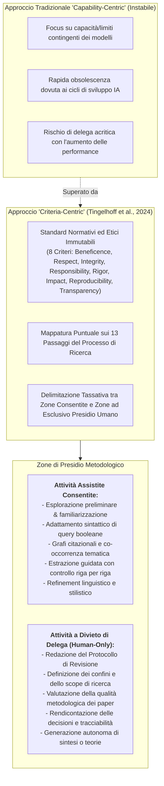
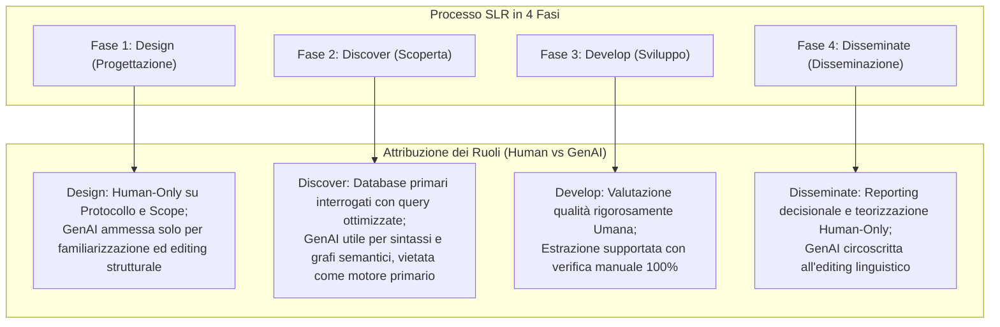

# Criteria-Centric GenAI Integration (Integrazione della GenAI Guidata dai Criteri di Qualità)

## Definizione Operativa
- Il paradigma di **Criteria-Centric GenAI Integration** (Integrazione della GenAI Guidata dai Criteri) è un modello metodologico ed epistemologico formalizzato da Fabian Tingelhoff, Micha Brugger e Jan Marco Leimeister (2024; *Journal of Information Technology*) per governare l'adozione dell'Intelligenza Artificiale Generativa nella ricerca scientifica e nelle [[structured-literature-reviews|revisioni strutturate della letteratura (SLR)]].
- **Capovolgimento di Paradigma (*Flipping the Perspective*):** La maggior parte della letteratura valuta l'uso dell'IA con un approccio *capability-centric* ("cosa può o non può fare l'IA"), che diventa rapidamente obsoleto a ogni nuova release di modello. Il modello *criteria-centric* ribalta la questione ancorandola a principi normativi immutabili: *"cosa dovremmo consentire all'IA di fare, indipendentemente dalle sue capacità tecniche contingenti o future?"*.
- **Utilità Clinica e Metodologica:** Stabilisce confini precisi (*guardrails*) per preservare l'integrità accademica, la riproducibilità e l'accountability umana, impedendo che l'efficienza computazionale sostituisca il giudizio critico del ricercatore o introduca distorsioni sistemiche (es. allucinazioni, effetto ancoraggio, appiattimento su narrazioni dominanti).

## Evidenze dalla Letteratura

L'approccio consolida le direttive emanate da comitati etici nazionali (es. *US Institutional Review Board*, *Deutsche Forschungsgemeinschaft*), associazioni disciplinari (*Academy of Management*, *Association for Information Systems*) e riviste accademiche primarie (*Nature*, *Journal of Information Technology*). Vengono definiti 8 criteri di qualità:

1. **Beneficence (Beneficenza):** L'integrazione dell'IA deve massimizzare il valore sociale e conoscitivo della ricerca.
2. **Respect for Persons (Rispetto per le Persone):** Salvaguardia del consenso, privacy e copyright.
3. **Integrity (Integrità):** Trasparenza totale contro manipolazioni, allucinazioni e bias di modelli black-box.
4. **Responsability (Responsabilità):** La responsabilità intellettuale ricade in modo esclusivo e non delegabile sugli autori umani.
5. **Rigor (Rigore):** Rispetto intransigente delle procedure di campionamento e sintesi.
6. **Impact (Impatto):** Focalizzazione su contributi che aprano autentiche prospettive teoriche.
7. **Reproducibility (Riproducibilità):** Adozione di registri espliciti di prompt e parametri.
8. **Transparency (Trasparenza):** Documentazione pubblica dettagliata di ogni impiego della GenAI.

### Matrice di Delimitazione Funzionale nel Ciclo di Ricerca

- **Protocollo e Scope:** Il loro divieto di delega è fondamentale per evitare l'**anchoring bias** (Tversky & Kahneman, 1974).
- **Valutazione Metodologica:** I modelli AI risultano spesso ciechi a vizi metodologici sottili (Drori & Te'eni, 2024; Kankanhalli, 2024).
- **Generazione di sintesi:** L'esposizione a fenomeni di inquinamento accademico e ritrattazioni massive (Subbaraman, 2024) rende necessaria la supervisione umana.

**Riferimenti Bibliografici:**
- Tingelhoff, F., Brugger, M., & Leimeister, J. M. (2024). A guide for structured literature reviews in business research: The state-of-the-art and how to integrate generative artificial intelligence. *Journal of Information Technology*, 1–23. https://doi.org/10.1177/02683962241304105
- Drori, I., & Te’eni, D. (2024). Human-in-the-Loop AI reviewing: Feasibility, opportunities, and risks. *Journal of the Association for Information Systems*, 25(1), 98–109.
- Kankanhalli, A. (2024). Peer review in the age of generative AI. *Journal of the Association for Information Systems*, 25(1), 76–84.
- Subbaraman, N. (2024). Flood of Fake Science Forces Multiple Journal Closures. *The Wall Street Journal*.
- Tversky, A., & Kahneman, D. (1974). Judgment under uncertainty: Heuristics and biases. *Science*, 185(4157), 1124–1131.

## Relazioni
- Vedi anche: [[jml-1001]], [[eight-step-genai-research-workflow]], [[between-and-within-tool-triangulation]], [[structured-literature-reviews]], [[guide-genai-literature-review]], [[gai-research-integrity-and-verification]], [[ai-research-ethics]], [[hybrid-ai-research-workflows]], [[modello-centauro-clinico]], [[large-language-models]]
