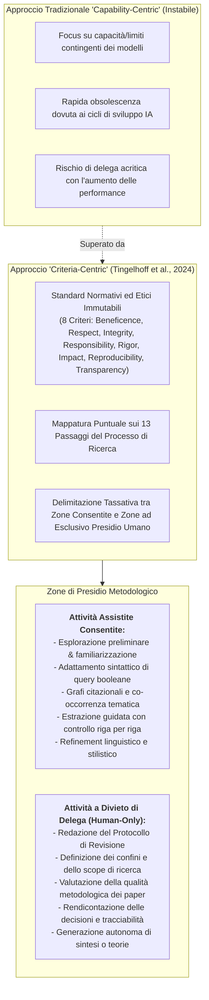
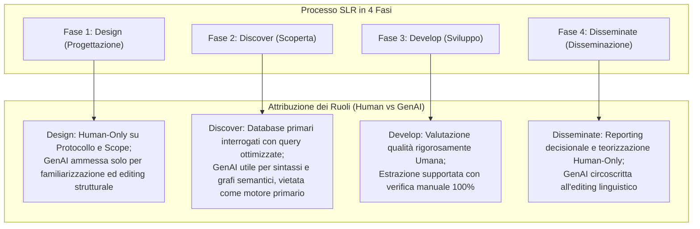

# Criteria-Centric GenAI Integration (Integrazione della GenAI Guidata dai Criteri di Qualità)

## Definizione Operativa
- Il paradigma di **Criteria-Centric GenAI Integration** (Integrazione della GenAI Guidata dai Criteri) è un modello metodologico ed epistemologico formalizzato da Fabian Tingelhoff, Micha Brugger e Jan Marco Leimeister (2024; *Journal of Information Technology*) per governare l'adozione dell'Intelligenza Artificiale Generativa nella ricerca scientifica e nelle [[structured-literature-reviews|revisioni strutturate della letteratura (SLR)]].
- **Capovolgimento di Paradigma (*Flipping the Perspective*):** La maggior parte della letteratura valuta l'uso dell'IA con un approccio *capability-centric* ("cosa può o non può fare l'IA"), che diventa rapidamente obsoleto a ogni nuova release di modello. Il modello *criteria-centric* ribalta la questione ancorandola a principi normativi immutabili: *"cosa dovremmo consentire all'IA di fare, indipendentemente dalle sue capacità tecniche contingenti o future?"*.
- **Utilità Clinica e Metodologica:** Stabilisce confini precisi (*guardrails*) per preservare l'integrità accademica, la riproducibilità e l'accountability umana, impedendo che l'efficienza computazionale sostituisca il giudizio critico del ricercatore o introduca distorsioni sistemiche (es. allucinazioni, effetto ancoraggio, appiattimento su narrazioni dominanti).

---

## Gli 8 Criteri di Qualità per la Ricerca Scientifica

L'approccio consolida le direttive emanate da comitati etici nazionali (es. *US Institutional Review Board*, *Deutsche Forschungsgemeinschaft*), associazioni disciplinari (*Academy of Management*, *Association for Information Systems*) e riviste accademiche primarie (*Nature*, *Journal of Information Technology*):

1. **Beneficence (Beneficenza):** L'integrazione dell'IA deve massimizzare il valore sociale e conoscitivo della ricerca, evitando di generare ridondanza o di occultare approcci critici e prospettive etiche.
2. **Respect for Persons (Rispetto per le Persone):** Salvaguardia del consenso, della privacy e del copyright; divieto di caricare dati proprietari, riservati o non anonimizzati su server commerciali privi di clausole di confidenzialità.
3. **Integrity (Integrità):** Trasparenza totale contro la manipolazione o fabbricazione di dati, le allucinazioni bibliografiche e i bias di campionamento indotti da modelli a scatola chiusa (*black-box*).
4. **Responsability (Responsabilità):** La responsabilità intellettuale, metodologica e deontologica ricade in modo esclusivo e non delegabile sugli autori umani; l'IA è uno strumento, non un co-autore (*non-human agency*).
5. **Rigor (Rigore):** Rispetto intransigente delle procedure di campionamento e sintesi; divieto di accettare sintesi algoritmiche superficiali che bypassano la lettura e comprensione umana.
6. **Impact (Impatto):** Focalizzazione su contributi che aprano autentiche prospettive teoriche e applicative, contrastando la propensione dell'IA a reiterare cluster concettuali già saturi.
7. **Reproducibility (Riproducibilità):** Adozione di registri espliciti di prompt, parametri e registri di versioning per compensare la natura stocastica e la non-determinatezza dei modelli linguistici.
8. **Transparency (Trasparenza):** Documentazione pubblica e dettagliata di ogni impiego della GenAI (strumenti utilizzati, prompt, ruoli, iterazioni e procedure di verifica manuale).

---

## Matrice di Delimitazione Funzionale nel Ciclo di Ricerca

### 1. Perché è vietata la delega del Protocollo e dello Scope?
- La stesura del protocollo di revisione e la delimitazione dei confini concettuali richiedono un bilanciamento critico e imparziale tra diverse correnti teoriche. L'impiego precoce della GenAI espone al rischio di **anchoring bias** (effetto ancoraggio; Tversky & Kahneman, 1974), inducendo il ricercatore a conformare la propria strategia di ricerca ai pattern dominanti nei dati di pre-training dell'LLM.

### 2. Perché è vietata la valutazione della qualità metodologica?
- Sebbene alcuni modelli offrano scoring automatico di testi scientifici, essi valutano principalmente la coerenza stilistica e la plausibilità sintattica superficiale, risultando ciechi a vizi metodologici sottili, distorsioni di campionamento o forzature interpretative (Drori & Te'eni, 2024; Kankanhalli, 2024).

### 3. Perché è vietata la generazione autonoma di contenuti di sintesi?
- La generazione non supervisionata espone la letteratura a fenomeni di inquinamento accademico, conclamati da ritrattazioni massive (oltre 11.300 paper ritirati in ambito editoriale; Subbaraman, 2024). Il valore epistemico di una review risiede nella concettualizzazione originale prodotta dall'autore umano.

---

## Il Dilemma Epistemologico: Controllo vs Contributo

L'approccio criteria-centric affronta esplicitamente il dilemma filosofico tra:
- **Espansione del Contributo:** La tentazione di sfruttare la GenAI per produrre rassegne a ritmo esponenziale, massimizzando il volume informativo a scapito della verificabilità.
- **Preservazione del Controllo:** La necessità inderogabile di mantenere la supervisione umana (*Human-in-the-Loop*), la tracciabilità documentata e il rigore procedurale.

Il modello sancisce che l'avanzamento scientifico autentico si realizza unicamente quando l'efficienza algoritmica è subordinata a standard etici e qualitativi espliciti.

---

## Riferimenti Bibliografici
- Tingelhoff, F., Brugger, M., & Leimeister, J. M. (2024). A guide for structured literature reviews in business research: The state-of-the-art and how to integrate generative artificial intelligence. *Journal of Information Technology*, 1–23. https://doi.org/10.1177/02683962241304105
- Drori, I., & Te’eni, D. (2024). Human-in-the-Loop AI reviewing: Feasibility, opportunities, and risks. *Journal of the Association for Information Systems*, 25(1), 98–109.
- Kankanhalli, A. (2024). Peer review in the age of generative AI. *Journal of the Association for Information Systems*, 25(1), 76–84.
- Subbaraman, N. (2024). Flood of Fake Science Forces Multiple Journal Closures. *The Wall Street Journal*.
- Tversky, A., & Kahneman, D. (1974). Judgment under uncertainty: Heuristics and biases. *Science*, 185(4157), 1124–1131.

---

## Relazioni
- Vedi anche: [[JML_1001]], [[eight-step-genai-research-workflow]], [[between-and-within-tool-triangulation]], [[structured-literature-reviews]], [[guide-genai-literature-review]], [[gai-research-integrity-and-verification]], [[ai-research-ethics]], [[hybrid-ai-research-workflows]], [[modello-centauro-clinico]], [[large-language-models]]
