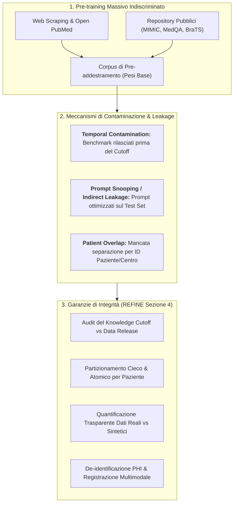
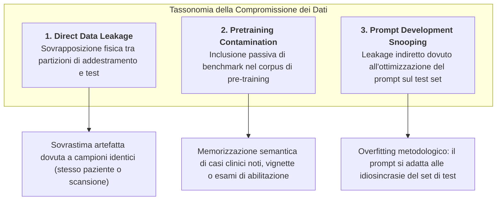
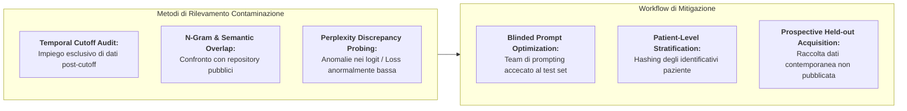

# Dataset Integrity, Contamination, and Partition Independence in Medical AI

## Definizione Operativa
- L'**Integrità del Dataset (*Dataset Integrity*)** nell'intelligenza artificiale medica definisce il grado di trasparenza, tracciabilità etico-legale, qualità clinica e indipendenza metodologica delle coorti di dati impiegate attraverso tutte le fasi di sviluppo, adattamento e collaudo dei Foundation Models (FM) e dei Large Language Models (LLM).
- **La Crisi di Contaminazione nei Modelli di Fondazione:** A differenza degli algoritmi di machine learning convenzionali (addestrati su dataset circoscritti e noti), i modelli generativi di larga scala vengono pre-addestrati su centinaia di miliardi di token e milioni di immagini estratti massivamente dal web aperto, dalla letteratura biomedica (*PubMed Central*, *bioRxiv*, archivi open-access) e da repository pubblici. Questo introduce il grave rischio di **contaminazione dei dati di test (*data contamination / test set memorization*)**, dove il modello manifesta un'elevata accuratezza non per capacità di generalizzazione clinica, bensì per pura memorizzazione parametrica dei quesiti o dei referti visti durante il pretraining.
- **Inquadramento negli Standard Metodologici:** Come formalizzato dalla Sezione 4 dello standard **[[REFINE_2026|REFINE]]** (Mese et al., 2026; Item 4.1 - 4.10) e dalle linee guida **[[MI-CLEAR-LLM_2025|MI-CLEAR-LLM]]**, la verifica rigorosa dell'integrità del dataset richiede la tracciabilità delle licenze, la quantificazione del rischio di contaminazione temporale legato al *knowledge cutoff*, l'analisi dei bias di rappresentatività, la corretta gestione dei dati sintetici e la separazione atomica e cieca tra partizioni di sviluppo e test.

---

## Tassonomia dei Rischi di Contaminazione e Leakage

La letteratura metodologica recente distingue tre principali modalità di compromissione dell'indipendenza dei dati di valutazione medica:

### 1. Direct Data Leakage (Perdita Diretta)
Si verifica quando i dati del paziente o gli esami di test vengono inavvertitamente inclusi nel dataset di training o di fine-tuning parametrico.
- *Esempio tipico:* Suddivisione casuale per immagine anziché per paziente; se un paziente ha 4 scansioni RM longitudinali, 3 finiscono nel training set e 1 nel test set. Il modello riconosce l'anatomia specifica del soggetto piuttosto che la patologia.

### 2. Pretraining Data Contamination (Contaminazione da Pretraining)
I modelli proprietari o open-weight (es. GPT-4, LLaMA-3, Claude 3.5, Gemini 1.5/2.0) vengono addestrati su corpus che includono pubblicazioni scientifiche, banche dati radiologiche (es. MIMIC-CXR, CheXpert) e quiz medici (es. USMLE, MedQA).
- *Il fattore temporale (Knowledge Cutoff):* Qualsiasi dataset pubblico rilasciato **prima della data di cutoff dell'addestramento** del modello comporta un rischio intrinseco di contaminazione.
- *Conseguenza clinica:* Il modello fornisce diagnosi corrette non perché padroneggia il ragionamento fisiopatologico, ma perché ripete schemi lessicali e associazioni già memorizzati durante l'apprendimento auto-supervisionato.

### 3. Prompt Development Snooping (Leakage Indiretto da Prompting)
Negli studi basati su *inference-time adaptation*, i ricercatori testano iterativamente varianti di prompt. Se l'efficacia del prompt viene valutata direttamente sul medesimo set di dati usato per il reporting finale, si verifica un fenomeno di overfitting metodologico analogo al *data snooping*.
- *Regola aurea:* Il prompt engineering deve avvenire su un sottoinsieme dedicato (*prompt development/adaptation data*), mantenendo il test set finale rigorosamente non visto (*strictly unseen held-out set*).

---

## I 10 Requisiti di Integrità del Dataset (REFINE Sezione 4)

La Sezione 4 della linea guida **[[refine-reporting-checklist|REFINE]]** (Mese et al., 2026) stabilisce i requisiti minimi di trasparenza per i dati biomedici:

| Item REFINE | Dominio Metodologico | Requisito Operativo ed Elementi Chiave |
| :--- | :--- | :--- |
| **4.1** | **Tracciabilità e Licenze** | Nome, versione esatta del dataset (es. MIMIC-CXR v2.0), tipo di accesso (pubblico, restricted con credenziali PhysioNet, privato), citazione formale, licenza d'uso e conformità ad accordi di utilizzo (DUA). |
| **4.2** | **Origine Geografica e Istituzionale** | Dichiarazione di coorte monocentrica vs multicentrica; numero e tipologia di strutture (ospedali universitari terziari vs presidi territoriali), distribuzione regionale o internazionale. |
| **4.3** | **Etica e Consenso** | Approvazione del comitato etico (IRB) con numero di protocollo; documentazione esplicita del razionale per eventuale deroga al consenso informato (es. studi retrospettivi su dati secondari de-identificati). |
| **4.4** | **Uso Pregresso e Data di Rilascio** | Segnalazione di precedenti usi della coorte da parte del medesimo gruppo. Data di pubblicazione del dataset per confrontarla con il *knowledge cutoff* del modello e stimare il rischio di memorizzazione. |
| **4.5** | **Composizione e Dati Sintetici** | Dichiarazione della proporzione esatta di dati clinici reali vs dati sintetici generati (LLM-synthesized reports, diffusion-generated MRI, GAN-augmented CT scans) e divulgazione dei modelli generativi usati per la sintesi. |
| **4.6** | **Caratteristiche e Bias di Campione** | Distribuzione demografica (età, sesso biologico), gravità clinica, modalità diagnostiche e sbilanciamento delle classi. Analisi formale di bias di sottogruppo per prevenire disparità algoritmiche. |
| **4.7** | **Standard di Riferimento (Ground Truth)** | Metodo di definizione del gold standard (conferma istopatologica, follow-up a lungo termine, referto validato, panel multidisciplinare). Qualifiche degli annotatori clinici (anni di esperienza) e gestione dei disaccordi. |
| **4.8** | **Preprocessing e Pairing Multimodale** | Pipeline di anonimizzazione e rimozione di Protected Health Information (PHI). Metodi di allineamento e accoppiamento referto-immagine, impostazioni window/level DICOM, normalizzazione delle intensità e filtri anti-artefatto. |
| **4.9** | **Gestione dei Dati Mancanti** | Percentuale di missing data per ciascuna variabile clinica, determinazione del meccanismo (MCAR, MAR, MNAR) e strategia applicata (complete-case analysis, imputazione per mediana, imputazione multivariata/model-based). |
| **4.10** | **Separazione Rigorosa delle Partizioni** | Isolamento fisico e deterministico tra partizioni di training, fine-tuning, test interno (monocentrico) e test esterno (multicentrico) basato su identificativi paziente univoci. Conferma che nessun dato di test è stato impiegato nel prompt engineering. |

---

## Strategie Operative per Prevenire e Rilevare la Contaminazione

### 1. Temporal Cutoff Audit (Audit Temporale di Cutoff)
La strategia più solida per evitare la contaminazione del pretraining consiste nell'utilizzare coorti di dati clinici raccolte o pubblicate **successivamente alla data di cutoff dichiarata** del modello di fondazione.
- Se un modello ha un cutoff dichiarato a *Dicembre 2023*, un test condotto su casi clinici e immagini acquisiti nel *2024–2025* garantisce l'assenza di contaminazione pregressa nel corpus di base.

### 2. De-identification e Preservazione della Privacy PHI
Nel contesto dei Large Language Models e dei modelli di fondazione multimodali, l'integrità del dato è indissolubilmente legata alla sicurezza dei dati sanitari protetti (*Protected Health Information - PHI*):
- **De-identificazione Testuale:** Rimozione deterministica o probabilistica di identificativi diretti (nomi, numeri di cartella, date esatte, recapiti) tramite modelli NLP specializzati o pattern regex avanzati.
- **De-identificazione Immagini (Pixel Anonymization):** Rimozione del testo "bruciato" (*burned-in text*) nei metadati DICOM e nei pixel visibili di ecografie o scansioni radiografiche.
- **Policy di Routing e Cloud:** Come richiesto dall'Item 6.6 di REFINE, i prompt contenenti dati clinici non devono essere instradati su server commerciali pubblici né riutilizzati per il riaddestramento dei modelli (*zero-retention agreements*).

---

## Dati Sintetici: Opportunità e Rischi per l'Integrità Scientifica

L'impiego crescente di modelli generativi per creare cartelle cliniche sintetiche, referti radiologici artificiali o immagini mediche aumentate via modelli di diffusione introduce opportunità e insidie:

> [!TIP]
> **Vantaggi dei Dati Sintetici:**
> - Possibilità di ampliare coorti di malattie rare o fenotipi sottorappresentati (*class rebalancing*).
> - Condivisione open-science priva di vincoli di privacy e GDPR/HIPAA.

> [!CAUTION]
> **Rischi di Integrità e "Model Collapse":**
> - **Allucinazioni Strutturali:** I dati sintetici possono riflettere e amplificare i bias o gli errori di ragionamento del generatore.
> - **Collasso del Modello (*Model Autophagy / Model Collapse*):** Addestrare o valutare modelli su dati sintetici generati da altri LLM porta al degrado progressivo della variabilità biologica reale e a una falsa convergenza statistica.
> - **Obbligo di Reporting:** L'Item 4.5 di REFINE impone la dichiarazione esplicita della percentuale di dati sintetici e la trasparenza completa sull'architettura generativa impiegata per produrli.

---

## Pagine Correlate della Wiki
- [[REFINE_2026]] — Sintesi completa della linea guida internazionale REFINE (Mese et al., 2026).
- [[refine-reporting-checklist]] — Concetto metodologico sui 6 domini della checklist REFINE.
- [[MI-CLEAR-LLM_2025]] — Standard di accuratezza diagnostica e prevenzione del data leakage negli LLM clinici.
- [[stochasticity-management-in-clinical-llms]] — Gestione della non-determinatezza e affidabilità dell'output generativo.
- [[CLAIM]] — Linea guida per l'intelligenza artificiale in diagnostica per immagini.
- [[TRIPOD-LLM]] — Standard di reporting per modelli predittivi clinici basati su LLM.
