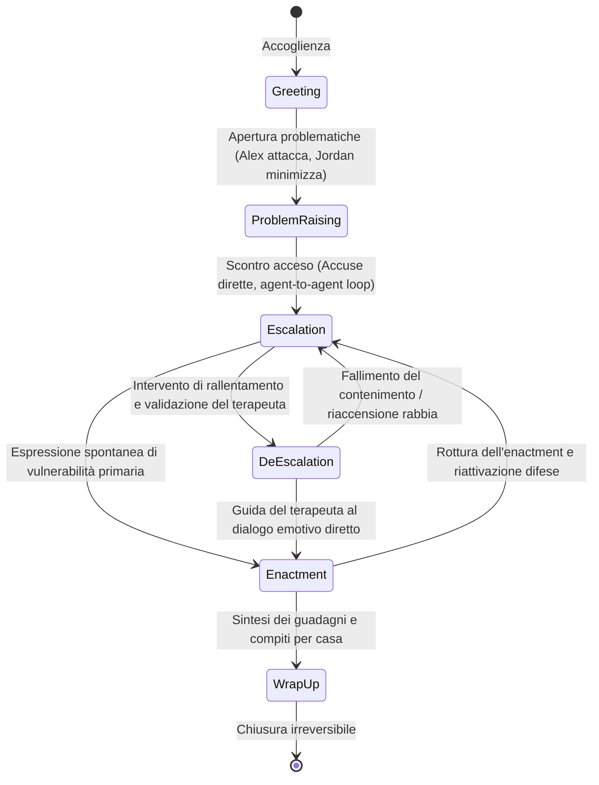

# Modellazione del Ciclo Demand-Withdraw nei Sistemi Multi-Agente

## Definizione Operativa
- Formalizzazione computazionale e psicologica del ciclo relazionale conflittuale **Demand–Withdraw (Pursue–Withdraw)** all'interno di architetture multi-agente per la simulazione clinica della psicoterapia di coppia.
- **Meccanismo Relazionale e Clinico:**
  - Il pattern descrive la classica polarizzazione in cui un partner (*Demander*) assume un atteggiamento inquisitorio, esigente e critico, chiedendo cambiamenti immediati e amplificando il conflitto, mentre l'altro partner (*Withdrawer*) reagisce con evitamento, difese passive, sarcasmo o chiusura emotiva nel silenzio (Christensen & Heavey, 1990; Eldridge et al., 2002).
  - Nel sistema multi-agente (Wang et al., 2026), tale dinamica è modellata come un **sistema dinamico a feedback continuo** coordinato da uno *Stage Controller* che modula i prompt comportamentali e gli stati affettivi dei due agenti lungo sei stadi di interazione.

---

## Evidenze dalla Letteratura

### 1. Basi Teoriche del Demand-Withdraw e Terapia di Coppia
- Nelle terapie evidence-based per le coppie (*Emotionally Focused Couple Therapy* - EFT, Johnson & Greenman, 2006; *Integrative Behavioral Couple Therapy* - IBCT, Christensen et al., 2004), il ciclo demand-withdraw è concettualizzato come una danza relazionale disfunzionale in cui l'aggressività del demander maschera un bisogno primario di connessione e rassicurazione, mentre il ritiro del withdrawer rappresenta una strategia difensiva per proteggersi dal senso di inadeguatezza e fallimento (Crenshaw et al., 2017).
- Il disinnesco del ciclo richiede che il terapeuta rallenti il ritmo della seduta, interrompa l'escalation reattiva e guidi i partner verso un **enactment emotivo** in cui esprimere vulnerabilità primarie (dolore, paura, solitudine) anziché accuse secondarie (Woolley et al., 2012).

### 2. Parametrizzazione Comportamentale dei Due Agenti
| Dimensione | Agente Alex (*Demander*) | Agente Jordan (*Withdrawer*) |
| :--- | :--- | :--- |
| **Ruolo Primario** | Reclamo attivo, incalzamento, critica esplicita. | Evitamento del conflitto, minimizzazione, ritiro difensivo. |
| **Stile Verbale** | Linguaggio diretto, accusatorio (*"you always"*, *"you never"*). | Linguaggio passivo-aggressivo, sarcastico, risposte minime o silenzio. |
| **Traiettoria Emotiva (6 Stadi)** | Neutral $\rightarrow$ Sad $\rightarrow$ Angry $\rightarrow$ Hopeful $\rightarrow$ Vulnerable $\rightarrow$ Relieved | Neutral $\rightarrow$ Anxious $\rightarrow$ Defensive/Sad $\rightarrow$ Cautious $\rightarrow$ Open $\rightarrow$ Calm |
| **Prosodia Vocale (TTS)** | Tono incalzante, voce spezzata tra rabbia e supplica (*cracking voice*). | Parlato lento, esitante, monotono in chiusura o tagliente se difensivo. |

### 3. Vincoli Euristici Deterministici per la Conduzione Didattica
Per garantire un valore pedagogico ottimale ed evitare stalli o derive incontrollate, il controllore applica quattro regole di sicurezza (Wang et al., 2026):
1. **Inibizione Iniziale dell'Escalation ($\text{Turni} \le 5$):** Impedisce liti precoci prima che il corsista abbia instaurato il setting di base.
2. **Escalation Forzata al Turno 7:** Se al settimo turno la seduta è ancora in *Problem Raising*, viene forzato lo scontro per assicurare l'esposizione al conflitto a tutti gli allievi.
3. **De-escalation Guidata:** Se l'escalation persiste per 2 turni consecutivi e il terapeuta compie due tentativi adeguati di contenimento, la fase avanza a *De-escalation*.
4. **Irreversibilità del Wrap-up:** Impedisce la riaccensione del conflitto una volta avviata la chiusura della seduta.

### 4. Risultati della Validazione Empirica con Psicoterapeuti ($N=21$)
- **Riconoscimento del Pattern:** I terapeuti hanno riconosciuto la presenza autentica del ciclo Demand-Withdraw in misura significativamente maggiore nel sistema stateful rispetto alla baseline prompt-only ($M = 3.301$ vs $1.460, z = 35.46, p < 0.001$).
- **Fidelity di Ruolo e Stadio:** Raggiunta una Role Fidelity del **70.7%** (vs 4.9% baseline, $p < 0.001$) e una Stage Fidelity dell'**83.8%** (vs 63.8% baseline, $p < 0.001$).
- **Valore Pedagogico:** La simulazione offre uno spazio per la pratica deliberata (*deliberate practice*) delle abilità di micro-intervento (zoom-in affettivo, softening del demander, apertura del withdrawer) senza esporre pazienti reali al rischio di rotture dell'alleanza non riparate.

---

**Riferimenti Bibliografici:**
- Wang, C., Chen, A., Bao, C., Jin, S., Swartz, H., Wu, T., Kraut, R. E., & Zhu, H. (2026). Simulating Couple Conflict: Designing A Multi-Agent System for Therapy Training and Practice. *arXiv preprint arXiv:2601.10970v2 [cs.CY]*, 1–21. https://doi.org/10.48550/arXiv.2601.10970
- Christensen, A., & Heavey, C. L. (1990). Gender and social structure in the demand/withdraw pattern of marital conflict. *Journal of Personality and Social Psychology*, 59(1), 73–81.
- Christensen, A., Atkins, D. C., Berns, S., Wheeler, J., Baucom, D. H., & Simpson, L. E. (2004). Traditional versus integrative behavioral couple therapy: Longitudinal results from a randomized clinical trial. *Journal of Consulting and Clinical Psychology*, 72(2), 176–191.
- Crenshaw, A. O., Christensen, A., Baucom, D. H., Epstein, N. B., & Baucom, B. R. (2017). Revised scoring and improved reliability for the Communication Patterns Questionnaire. *Psychological Assessment*, 29(7), 913–925.
- Eldridge, K. A., & Christensen, A. (2002). Demand-withdraw communication during couple conflict: A review and analysis. *Understanding Marriage: Developments in the Study of Couple Interaction*, 289–322.
- Johnson, S. M., & Greenman, P. S. (2006). The path to a secure bond: Emotionally focused couple therapy. *Journal of Clinical Psychology*, 62(5), 597–609.
- Woolley, S. R., Wampler, K. S., & Davis, S. D. (2012). Enactments in couple therapy: Identifying therapist interventions associated with positive change. *Journal of Family Therapy*, 34(3), 284–305.

## Relazioni
- Vedi anche: [[2601.10970v2]], [[multi-party-interaction-simulation]], [[simulazione-pazienti-ai]], [[clinical-ai-simulation]], [[trainer-simulator]], [[clinical-fidelity-assessment]], [[reverse-training-simulazione]], [[ai-assisted-psychotherapy]]
