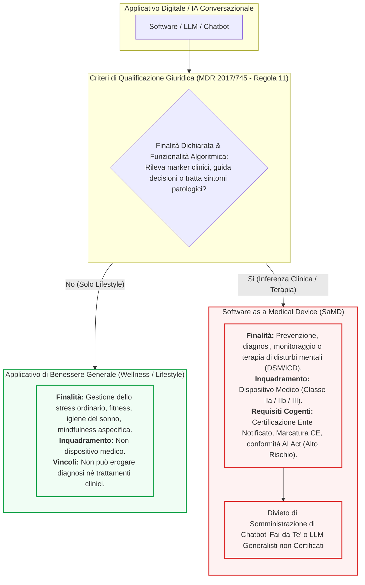

# Demarcazione tra Applicativi Wellness e Software as a Medical Device (SaMD) in Salute Mentale

## Definizione Operativa
- Criterio regolatorio (Reg. UE 2017/745, MDCG 2019-11, AI Act) che distingue i software di benessere generale (*lifestyle/wellness*) dagli applicativi che inferiscono condizioni patologiche o forniscono indicazioni terapeutiche, qualificando questi ultimi come Software as a Medical Device ([[software-as-a-medical-device-salute-mentale|SaMD]]) soggetti a marcatura CE obbligatoria (Classe IIa o superiore).
- **Utilità CBT:** Consente al terapeuta cognitivo-comportamentale di discernere quali strumenti digitali (app di tracciamento dell'umore, chatbot di supporto o moduli di rilassamento) possano essere legittimamente raccomandati come ausili di benessere, e quali configurino invece dispositivi medici non autorizzati o illeciti se privi di marcatura CE.

---

## Evidenze dalla Letteratura
- Il Regolamento (UE) 2017/745 (MDR) e le linee guida europee MDCG 2019-11 chiariscono che la qualificazione di un software come dispositivo medico dipende dalla sua destinazione d'uso clinica (*intended purpose*): i software destinati a fornire informazioni usate per prendere decisioni a fini diagnostici o terapeutici sono classificati in Classe IIa, salendo a Classe IIb o III qualora tali decisioni possano incidere gravemente sullo stato di salute della persona (Medical Device Coordination Group, 2019; Regolamento UE 2017/745).
- Ai sensi dell'EU AI Act (Regolamento UE 2024/1689), i sistemi di intelligenza artificiale che rientrano nella disciplina dei dispositivi medici sono classificati come "sistemi ad alto rischio" (Allegato III), imponendo valutazioni di conformità pre-market rigorose, registrazione ufficiale e sorveglianza umana continua (Parlamento Europeo e Consiglio dell'Unione Europea, 2024).
- La fluidità diagnostica in psicologia rende insidiosa la frontiera applicativa: assistenti conversazionali inizialmente sviluppati per il benessere generale (es. mindfulness o gestione dello stress) possono intercettare marker prodromici a disturbi depressivi maggiori o attacchi di panico; in assenza di perimetri espliciti, la dottrina prudenziale impone di considerare tali strumenti come SaMD non appena formulano raccomandazioni su costrutti disfunzionali specifici (Garante Privacy, 2023; 2025).
- L'impiego o la somministrazione clinica da parte dello psicologo di chatbot terapeutici privi di marcatura CE viola contemporaneamente il Codice Deontologico (Artt. 3 e 5: tutela della persona e divieto di strumenti non validati) e l'Art. 22 del GDPR, che vieta decisioni cliniche automatizzate prive di un effettivo controllo umano (*Human-in-the-Loop*) (Consiglio di Stato, 2024; CNOP, 2024).

**Riferimenti Bibliografici:**
- Consiglio di Stato. (2024). *Sentenza n. 10376/2024 del 24 dicembre 2024 (Annullamento referendum revisione Codice Deontologico Psicologi)*. Roma: Consiglio di Stato.
- Consiglio Nazionale Ordine Psicologi [CNOP]. (2024). *Codice Deontologico degli Psicologi Italiani (Testo vigente 2013)*. Roma: CNOP. https://www.psy.it/
- Garante per la Protezione dei Dati Personali. (2023). *Sanità: decalogo del Garante Privacy sull'uso dell'intelligenza artificiale* (Provvedimento n. 9937730). Roma: Garante Privacy. https://www.garanteprivacy.it/home/docweb/-/docweb-display/docweb/9937730
- Garante per la Protezione dei Dati Personali. (2025). *Referti medici e IA, allarme del Garante privacy sui rischi di violazione della riservatezza* (Provvedimento n. 10154670). Roma: Garante Privacy. https://www.garanteprivacy.it/home/docweb/-/docweb-display/docweb/10154670
- Medical Device Coordination Group [MDCG]. (2019). *MDCG 2019-11: Guidance on Qualification and Classification of Software in Regulation (EU) 2017/745 – MDR and Regulation (EU) 2017/746 – IVDR*. European Commission.
- Parlamento Europeo e Consiglio dell'Unione Europea. (2017). *Regolamento (UE) 2017/745 relativo ai dispositivi medici (MDR)*. Gazzetta Ufficiale dell'Unione Europea, L 117/1.
- Parlamento Europeo e Consiglio dell'Unione Europea. (2024). *Regolamento (UE) 2024/1689 che stabilisce regole armonizzate sull'intelligenza artificiale (AI Act)*. Gazzetta Ufficiale dell'Unione Europea, L 2024/1689.

---

## Relazioni
- Vedi anche: [[normativa-llm-psicologia-in-italia]], [[software-as-a-medical-device-salute-mentale]], [[responsabilita-sanitaria-allucinazioni-algoritmiche]], [[quattro-condizioni-liceita-ia-psicologia]], [[health-advisory-ai-chatbots-wellness-apps-mental-health]], [[digital-therapeutic-alliance]], [[human-oversight-and-liability-in-clinical-ai]], [[guida-pratica-ai-oppv-1]]
