# Deployment-Readiness Checklist for Mental-Health AI (Checklist di Prontezza Operativa per l'IA in Salute Mentale)

## Definizione Operativa
- Il **Deployment-Readiness Checklist for Mental-Health AI** è un framework pragmatico, audibile e strutturato su sei pilastri operativi, sviluppato da Abu-Mahfouz et al. (2026; *Frontiers in Psychiatry*, doi: 10.3389/fpsyt.2026.1688043) per definire una soglia minima verificabile di qualità (*minimum, testable quality bar*) necessaria prima di autorizzare l'implementazione routinaria di strumenti di Intelligenza Artificiale nei servizi di salute mentale.
- **Utilità Clinica e di Governance Sanitaria:** Supera la vaghezza delle dichiarazioni etiche generiche e l'"ottimismo computazionale" da metriche in-sample, vincolando l'adozione clinica a requisiti tecnici, economici, di sicurezza e formativi misurabili (ad es. calcolo dinamico del ciclo di vita con ICER/QALY, audit trimestrali di guardrail e tracciamento del *time-to-human contact* in caso di emergenza, monitoraggio continuo del drift con trigger predefiniti di retraining, e misurazione della literacy/readiness del personale sanitario come co-primary endpoint).

```mermaid
flowchart TD
    subgraph SixPillars ["I Sei Pilastri della Deployment-Readiness Checklist (Abu-Mahfouz et al., 2026)"]
        direction TB
        
        subgraph P1 ["1. Validation & Monitoring"]
            P1_A["Valutazione Esterna & Prospettica"]
            P1_B["Sorveglianza Continua del Drift Algoritmico"]
            P1_C["Soglie e Trigger Prefissati di Retraining"]
        end
        
        subgraph P2 ["2. Dynamic Lifecycle Costing"]
            P2_A["Costi di Integrazione, Interfaccia & Privacy Engineering"]
            P2_B["Budget Impact su 1–3 Anni con Modelli Dinamici"]
            P2_C["Sensitività al Decadimento Prestazionale (Performance Decay)"]
        end
        
        subgraph P3 ["3. Safety for Chatbots & Duty-to-Warn"]
            P3_A["Audit Trimestrali su Contenuti e Guardrail"]
            P3_B["Sentiment Monitoring in Tempo Reale per Distress/Rischio"]
            P3_C["Handover ed Escalation Umana Tracciabile (Time-to-Human Contact)"]
        end
        
        subgraph P4 ["4. Distributional Equity & Bias Auditing"]
            P4_A["Benchmark Prestazionale per Sottogruppi Demografici"]
            P4_B["Audit di Bias Programmati e Ricorrenti"]
            P4_C["Federated Learning & Condivisione Dati Privacy-Preserving"]
        end
        
        subgraph P5 ["5. Socio-Technical Adoption & Actionability"]
            P5_A["Piena Integrazione nei Flussi di Cartella Elettronica (EHR)"]
            P5_B["Test di Usabilità Clinica con Standard SUS"]
            P5_C["Explainable AI (XAI) Vincolata a Formazione Clinica Dedicata"]
        end
        
        subgraph P6 ["6. Workforce Readiness Endpoints"]
            P6_A["Literacy e Confidence del Personale come Co-Primary Endpoint"]
            P6_B["Scale Validate di Prontezza Tecnologica"]
            P6_C["Monitoraggio della Sostenibilità d'Uso e Impatto sul Burnout"]
        end
    end

    P1 --> P2
    P2 --> P3
    P3 --> P4
    P4 --> P5
    P5 --> P6
```

---

## I Sei Pilastri Operativi e le Metriche di Valutazione

La checklist formalizza un contratto pragmatico tra sviluppatori di IA, direzioni sanitarie, clinici e pazienti. La tabella seguente illustra i requisiti minimi e le metriche quantitative che ogni trial clinico o servizio sanitario deve documentare:

| Pilastro Operativo | Pratica Minima Obbligatoria (*Required Practice*) | Metriche Quantitative di Riferimento (*Core Measures to Report*) |
| :--- | :--- | :--- |
| **1. Validation & Monitoring** | Validazione su coorti multicentriche temporaneamente e geograficamente indipendenti; sorveglianza attiva del *data drift* e del *concept drift* con soglie di ri-addestramento definite a priori. | Variazione temporale e geografica di $\Delta\text{AUC}$ e Brier Score esterno; shift di calibrazione ($E_{\text{cal}}$); *Time-to-Retraining*; incidenza di eventi avversi pre e post-retraining. |
| **2. Dynamic Economic Value** | Costing dinamico dell'intero ciclo di vita (comprensivo di integrazione software, ridisegno dell'interfaccia clinica, privacy engineering, manutenzione server e costi periodici di ri-addestramento). | Rapporto incrementale di costo-efficacia (ICER) per QALY con analisi di scenario; impatto sul budget sanitario a 1–3 anni; analisi di sensibilità al decadimento progressivo dell'accuratezza. |
| **3. Safety for Chatbots & Duty-to-Warn** | Audit trimestrali di sicurezza sui contenuti generati e sulla tenuta dei guardrail; algoritmi di sentiment monitoring in tempo reale per distress acuto; procedura formalizzata di *duty to warn* con passaggio immediato a operatore umano. | Tasso di non-conformità dell'audit per 1.000 interazioni; *Time-to-Human Contact* dopo attivazione del red-flag; incidenza di eventi avversi iatrogeni (es. invalidazione, alimentazione deliri, mancata rilevazione suicidaria). |
| **4. Distributional Equity & Fairness** | Valutazione obbligatoria dell'accuratezza disaggregata per sottogruppi demografici; audit periodici contro i bias algoritmici; architetture federate per includere contesti rurali o a basse risorse. | Discrepanza prestazionale ($\Delta\text{AUROC}$ e calibrazione) stratificata per sesso, fascia d'età, etnia, lingua e comorbidità psichiatriche; metriche di equità nel tempo; numero di centri partner in contesti sottorappresentati. |
| **5. Socio-Technical Adoption & Actionability** | Integrazione diretta nei flussi EHR senza duplicazione dell'inserimento dati; test formali di usabilità clinica; abbinamento obbligatorio tra spiegabilità dell'IA (XAI: SHAP/LIME) e moduli formativi clinici. | Tempo di completamento del task clinico (*Task Completion Time*); tasso di accettazione vs override delle raccomandazioni algoritmiche; variazione pre/post-training delle decisioni cliniche appropriate basate sulle spiegazioni fornite. |
| **6. Workforce Endpoints** | Co-misurazione sistematica della prontezza, fiducia e literacy tecnologica degli operatori sanitari (medici, psicologi, infermieri) parallelamente agli outcome clinici dei pazienti. | Punteggi su scale validate di AI literacy e readiness; grado di confidenza nell'uso; tasso di adozione sostenuta a 6–12 mesi; correlazione tra prontezza dell'operatore, sicurezza del paziente e miglioramento sintomatico. |

---

## Analisi Dettagliata dei Domini Critici

### 1. Validazione di Ciclo di Vita (Lifecycle-Aware Validation)
- **Il Limite dei Modelli Statici:** I modelli predittivi e diagnostici soffrono di una naturale usura prestazionale nel tempo (*performance decay*) dovuta a cambiamenti nella popolazione di pazienti, modifiche nei pattern di prescrizione o aggiornamenti delle codifiche diagnostiche.
- **Protocollo di Retraining Prefissato:** La checklist impone che i modelli non siano rilasciati "a scatola chiusa", ma incorporino un sistema di monitoraggio continuo della calibrazione con trigger oggettivi (es. calo dell'AUC > 0.05 o scostamento del Brier score > 15%) che attivano automaticamente il ciclo di ri-addestramento e ri-validazione.

### 2. Valutazione Economica Dinamica
- **Superamento delle Stime di Costo Ottimistiche:** Molte analisi economiche considerano unicamente il costo iniziale di licenza del software, ignorando che l'80% delle spese reali deriva dall'integrazione informatica con i sistemi ospedalieri (EHR), dalla conformità normativa (GDPR/HIPAA/MDR), dalla manutenzione dei server e dal tempo clinico dedicato alla revisione degli output.
- **Modellazione Dinamica con Penalizzazione del Decadimento:** Il calcolo ICER/QALY deve includere analisi di sensibilità che considerano la progressiva perdita di accuratezza dell'algoritmo nel mondo reale qualora i retraining vengano ritardati.

### 3. Sicurezza Operativa e Protocolli di Escalation (Duty-to-Warn)
- **Il Principio di Sicurezza Attiva:** Gli agenti conversazionali (chatbot CBT come Woebot, Wysa, Youper) interagiscono frequentemente con utenti in condizioni di elevata vulnerabilità emotiva.
- **Metriche di Escalation:** Non è sufficiente inserire un disclaimer statico contenente il numero verde di emergenza. Il sistema deve monitorare attivamente le conversazioni e, al rilevamento di pattern semantici critici (es. disperazione grave, ideazione di autolesionismo, allucinazioni o deliri), deve attivare un flusso prioritario di ingaggio umano, misurandone rigorosamente il tempo di presa in carico (*time-to-human contact*).

### 4. Spiegabilità Centrata sul Clinico (Actionable XAI)
- **Il Fallimento della XAI Isolata:** Metodi matematici come *SHAP (SHapley Additive exPlanations)* o *LIME (Local Interpretable Model-agnostic Explanations)* producono grafici di feature importance che spesso risultano incomprensibili o privi di valore pratico per il terapeuta in seduta.
- **Condizione di Azionabilità:** La XAI conferisce reale utilità clinica solo se accompagnata da training formativo: il professionista deve essere addestrato a interpretare il peso delle variabili algoritmiche (es. variazione nei marker vocali o nei pattern di sonno) all'interno del modello bio-psico-sociale del singolo paziente.

### 5. Inclusione del Personale Sanitario (Workforce Co-Primary Endpoints)
- **Integrazione Infermieristica e Multidisciplinare:** L'efficacia di uno strumento di IA dipende primariamente da chi lo utilizza quotidianamente. Misurare la *literacy*, l'ansia tecnologica e la percezione di carico lavorativo di medici, infermieri e terapisti è indispensabile per prevenire fenomeni di rigetto dello strumento o adozione superficiale passiva (*deskilling*).

---

## Implicazioni per la Psicoterapia e la Clinica CBT

1. **Standard di Selezione per le Digital Therapeutics (DTx):** I clinici e le commissioni di valutazione sanitaria devono adottare i criteri della checklist per selezionare unicamente app e chatbot che dimostrino audit di sicurezza periodici e canali di allerta attivi verso il terapeuta curante.
2. **Progettazione di Modelli Centauro:** La checklist costituisce la base metodologica per strutturare interventi ibridi in cui l'IA si occupa del monitoraggio passivo inter-seduta e dell'erogazione di micro-esercizi CBT guidati, mentre il terapeuta supervisiona la traiettoria clinica e interviene nelle deviazioni di processo.
3. **Tutela della Responsabilità Professionale (Liability):** L'esistenza di log tracciabili di override, note esplicative e registri di allarme protegge il clinico dal rischio di negligenza o affidamento acritico (*over-reliance*), garantendo trasparenza medico-legale.

---

## Relazioni
- Vedi anche: [[fpsyt-17-1688043_1]], [[care-continuum-ai-functions-mental-health]], [[clinical-readiness-gap-in-mh-chatbots]], [[traffic-light-quality-appraisal-clinical-ai]], [[software-as-a-medical-device-salute-mentale]], [[modello-centauro-clinico]], [[explainable-mental-health-diagnosis]], [[human-oversight-and-liability-in-clinical-ai]], [[ai-psychosocial-functioning-in-psychosis]], [[wearable-sensor-fusion-adherence]], [[ai-psychosis]]
