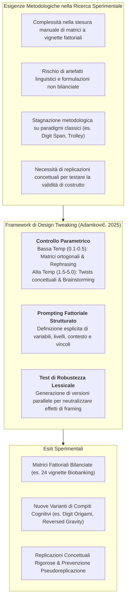
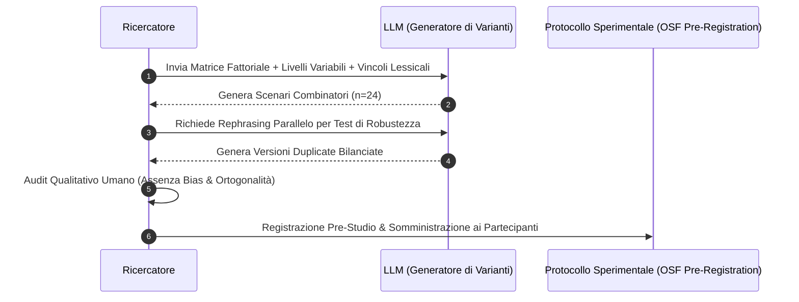

# Design Tweaking and Conceptual Replication with LLMs (Riprogettazione Sperimentale e Replicazione Concettuale Assistita da IA)

## Definizione Operativa
- Il **Design Tweaking** (variazione controllata del disegno sperimentale) e la **Replicazione Concettuale Assistita da LLM** definiscono un framework metodologico introdotto da Matúš Adamkovič (2025) per sfruttare le capacità generative e divergenti dei modelli linguistici di grandi dimensioni ([[large-language-models]]) nella ricerca psicologica e comportamentale.
- **Finalità Metodologica:** Superare la rigidità dei compiti sperimentali convenzionali attraverso due percorsi complementari:
  1. *Generazione Combinatoria di Vignette:* Produzione sistematica di matrici fattoriali di stimoli testuali (es. disegni $2 \times 3 \times 2 \times 2$) garantendo consistenza lessicale e ortogonalità dei fattori;
  2. *Design Tweaking (Varianti Creative con "Twist"):* Introduzione di modifiche strutturali inedite a paradigmi classici (es. Dilemma del Carrello, Digit Span Task) mediante campionamento ad alta temperatura ($\text{Temp} \ge 1.5 - 5.0$), permettendo di verificare se i fenomeni osservati siano robusti rispetto alle variazioni procedurali (replicazioni concettuali) anziché semplici artefatti metodologici.
- **Rilevanza per le Scienze del Comportamento:** A differenza delle replicazioni dirette (che ripetono il protocollo identico), le replicazioni concettuali saggiano i confini di validità ecologica e generalizzabilità dei costrutti psicologici, riducendo i bias dello sperimentatore e accelerando il ciclo di validazione empirica (Baek et al., 2024; Si et al., 2024).

---

## De-costruzione Metodologica e Protocolli Operativi

### 1. Generazione di Matrici Fattoriali a Vignette
- Nei disegni sperimentali basati su scenari ipotetici (*vignette designs*), la manipolazione simultanea di più variabili produce rapidamente matrici combinatorie complesse.
- **Esempio del Biobanking (Adamkovič, 2025):**
  - *Variabili Manipolate:* (1) Finalità del biobank (minima vs dettagliata), (2) Proprietà (nessuna menzione vs privata vs governativa), (3) Partner esterni (nessuna menzione vs menzionati), (4) Incentivi (nessuna menzione vs presenti).
  - *Condizioni Totali:* $2 \times 3 \times 2 \times 2 = 24$ scenari unici.
  - *Pipeline LLM:* Un singolo prompt strutturato genera l'intera matrice garantendo uniformità stilistica, tono emotivo neutro e isolamento rigoroso delle sole variabili target.
- **Test di Robustezza Lessicale (*Rephrasing Protocol*):** Per scongiurare che gli effetti riscontrati dipendano dalla specifica scelta di parole, l'LLM viene impiegato per generare coppie di vignette parallele (*rephrased versions*) somministrate casualmente tra i partecipanti.

---

### 2. Design Tweaking: Replicazioni Concettuali con Varianti Creative
- Il *Design Tweaking* sfrutta la capacità combinatoria degli LLM per esplorare varianti parametriche non ovvie di compiti sperimentali storici.
- **Manipolazione della Temperatura:**
  - Per generare variazioni conservative o riformulazioni: $\text{Temp} \approx 0.2 - 0.5$.
  - Per stimolare il pensiero divergente e scenari inediti: $\text{Temp} \ge 2.0 - 5.0$.
- **Casi Esemplificativi di Tweaking nel Digit Span Task (Adamkovič, 2025):**

| Variante Generata dall'LLM | Meccanismo Cognitivo Aggiuntivo | Razionale Metodologico |
| :--- | :--- | :--- |
| **Digit Origami** | Integrazione visuomotoria e manipolazione fisica (piegatura carta). | Valuta l'interazione tra memoria di lavoro verbale e pianificazione spaziale. |
| **Gravity Reversed** | Trascrizione delle cifre invertite verticalmente (sottosopra). | Introduce un costo di trasformazione visuo-rotazionale durante il recupero. |
| **Digital Ecosystem** | Mappatura numerica su elementi ecologici evolutivi (1=fiume, 2=monte, 3=foresta). | Esamina l'ancoraggio semantico-narrativo nella ritenzione a breve termine. |
| **Emotion-Fueled Recall** | Associazione di ciascun numero a un'emozione discreta (1=felicità, 2=rabbia). | Saggia l'interferenza tra elaborazione affettiva e span mnestico. |
| **Digit Countdown** | Presentazione inversa (da ultimo a primo) con rievocazione in ordine diretto. | Inverte la sequenza di codifica rispetto alla rievocazione standard (*backward span*). |

---

## Rischi Metodologici e Salvaguardie Umane (*Human-in-the-Loop*)

1. **Scivolamento Semantico (*Semantic Drift*):** Nella generazione automatica di vignette, l'LLM rischia di introdurre connotazioni emotive involontarie che alterano i livelli della variabile indipendente. Richiede sempre una verifica cieca da parte di ricercatori umani.
2. **Perdita della Validità di Costrutto:** Varianti sperimentali iper-creative (ad es. generate a temperature estreme) possono distorcere la natura del costrutto originario, misurando abilità non correlate (es. creatività visiva anziché working memory).
3. **Prevenzione della Pseudoreplicazione:** L'impiego di stimoli sintetici non sostituisce la necessità di un campione adeguato di partecipanti umani e di analisi statistiche robuste pre-registrate.

---

## Riferimenti Bibliografici

- **Adamkovič, M. (2025).** *Large Language Models in (Not Only) Psychology Training and Research: A Brief Introduction*. Centre of Social and Psychological Sciences, Slovak Academy of Sciences. https://doi.org/10.31577/2025.9788082980144
- **Baek, J., Jauhar, S. K., Cucerzan, S., & Hwang, S. J. (2024).** ResearchAgent: Iterative research idea generation over scientific literature with large language models. *arXiv preprint*, arXiv:2404.07738.
- **Döderlein, J.-B., Acher, M., Khelladi, D. E., & Combemale, B. (2022).** Piloting Copilot and Codex: Hot temperature, cold prompts, or black magic? *arXiv preprint*, arXiv:2210.14699.
- **Si, C., Yang, D., & Hashimoto, T. (2024).** Can LLMs generate novel research ideas? A large-scale human study with 100+ NLP researchers. *arXiv preprint*, arXiv:2409.04109.

---

## Related Pages
- [[final_textbook_genAIinpsychologyresearchandtraining]]
- [[adaptive-learning-in-psychology]]
- [[prompting-in-psychology]]
- [[human-in-the-reasoning]]
- [[pseudoreplication]]
- [[hypothesis-generation]]
- [[structured-literature-reviews]]
- [[validita-psicometrica-llm]]
- [[ai-research-ethics]]
