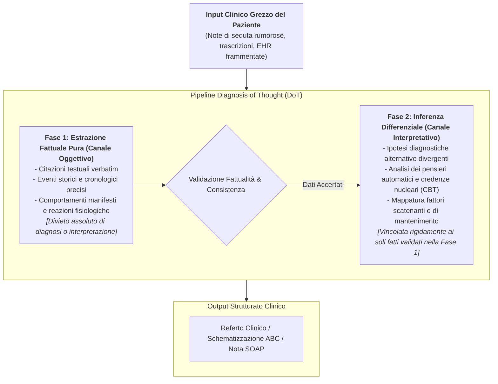
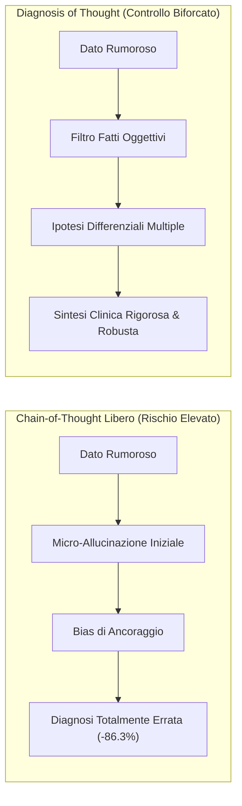
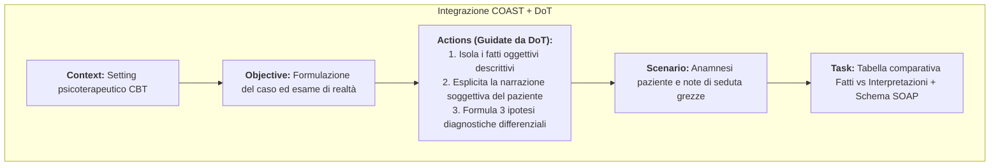

# Framework Diagnosis of Thought (DoT) e Disaccoppiamento Fatti-Interpretazioni

## Definizione Operativa
- Il **Framework Diagnosis of Thought (DoT)** è una metodologia strutturata di prompt engineering clinico e guida inferenziale per modelli linguistici generativi ([[large-language-models]]) applicati alla psicoterapia, alla psichiatria e alla medicina.
- **Principio Cardine:** Impone la **separazione procedurale rigorosa e sequenziale** tra:
  1. L'estrazione oggettiva e descrittiva degli eventi narrati e dei comportamenti manifesti (*Fatti Oggettivi Osservati / Raw Observed Facts*);
  2. La generazione delle ipotesi cliniche, la concettualizzazione del caso e l'inferenza di schemi cognitivi disfunzionali (*Ipotesi e Interpretazioni Diagnostiche*).
- **Finalità Metodologica:** Disinnescare il *Paradosso dei Testi Clinici* e l'**Effetto Valanga del Chain-of-Thought (CoT)**, impedendo che micro-allucinazioni o fraintendimenti lessicali iniziali su cartelle cliniche reali ed eterogenee (EHR) si propaghino a cascata, causando il crollo dell'accuratezza diagnostica (-86.3%).



---

## Origine Clinica: Il Superamento del Paradosso del Chain-of-Thought

### Il Paradosso dei Testi Clinici Reali
- Nei benchmark logico-matematici e scientifici tradizionali, l'approccio *Chain-of-Thought* (forzare il modello a esplicitare ogni passaggio intermedio prima di fornire la risposta) incrementa notevolmente le prestazioni.
- Tuttavia, in ambito clinico su cartelle elettroniche (EHR) e trascrizioni di colloqui reali:
  - Il materiale clinico è intrinsecamente non standardizzato, ricco di abbreviazioni, gergo specialistico, ambiguità emotive e dettagli contingenti privi di rilevanza nosografica.
  - Nel CoT libero, il modello linguistico formula assunzioni precoci ed errate sin dal primo snodo logico.
  - Tali errori si auto-amplificano esponenzialmente lungo la catena deduttiva, producendo una **degradazione dell'accuratezza clinica pari all'86.3%** e portando a falsi positivi diagnostici gravi.



---

## Struttura Operativa a Due Canali del DoT

### Canale 1: Fatti Oggettivi Osservabili (Objective Event Layer)
- **Cosa include:**
  - Frasi esatte (*verbatim*) pronunciate dal paziente;
  - Eventi antecedenti ambientali e relazionali specifici (luogo, ora, interlocutori);
  - Manifestazioni sintomatiche somatiche oggettivabili (es. tachicardia, sudorazione, durata in minuti);
  - Comportamenti manifesti messi in atto (es. allontanamento dalla stanza, assunzione di farmaci al bisogno).
- **Regola di Sistema:** Nessun termine nosografico, etichetta psicodiagnostica o giudizio clinico è ammesso in questo stadio.

### Canale 2: Ipotesi e Interpretazioni Cliniche (Inferential Hypothesis Layer)
- **Cosa include:**
  - Concettualizzazione cognitiva (Modello ABC: Pensieri Automatici Negativi, Distorsioni Cognitive, *Core Beliefs*);
  - Ipotesi diagnostiche differenziali (es. Disturbo di Panico vs Ansia Sociale vs Condizione Medica Generale);
  - Ipotesi funzionali sui meccanismi di mantenimento ed evitamento.
- **Regola di Sistema:** Ogni interpretazione deve essere esplicitamente agganciata (*grounded*) a un fatto oggettivo estratto nel Canale 1.

---

## Integrazione tra Framework DoT e Framework COAST

Il DoT agisce come il motore logico interno inserito nella componente **Actions** del framework pentapartito **[[coast-framework-clinical-prompting|COAST]]**:



---

## Esempio Operativo di Prompting DoT

```markdown
Sei un assistente AI clinico per la supervisione e la concettualizzazione del caso (Modello CBT).
Segui rigorosamente il framework **Diagnosis of Thought (DoT)**:

[FASE 1 - ISOLAMENTO DEI FATTI OGGETTIVI]
Estrai unicamente gli eventi osservabili, le verbalizzazioni letterali e i parametri temporali descritti nella seduta. Non aggiungere alcuna interpretazione diagnostica.

[FASE 2 - MAPPATURA DELLA SOGGETTIVITÀ DEL PAZIENTE]
Elenca le valutazioni soggettive, le inferenze e i pensieri automatici che il paziente sovrappone agli eventi oggettivi.

[FASE 3 - INFERENZA CLINICA E IPOTESI DIFFERENZIALI]
Sulla base del confronto tra Fase 1 e Fase 2, genera 3 ipotesi cliniche differenziali, indicando per ciascuna le evidenze a favore e i contro-indizi.
```

---

## Benefici Clinici e Prevenzione del De-Skilling

1. **Prevenzione della Chiusura Prematura (*Premature Closure*):** Obbligare l'LLM a separare i fatti dalle interpretazioni inibisce la tendenza all'iper-compiacenza e al problem-solving immediato, preservando lo spazio per il ragionamento differenziale.
2. **Neutralizzazione dell'[[korsakoff-confabulazione-llm|Allucinazione di tipo Korsakoff]]:** Ancorando la seconda fase a un insieme verificato e circoscritto di fatti estratti nella prima fase, si impedisce al modello di inventare sintomi o dettagli inesistenti.
3. **Potenziamento della Vigilanza Metacognitiva del Clinico:** Il terapeuta non riceve una diagnosi a "scatola nera", ma un prospetto chiaro e ispezionabile che distingue ciò che il paziente ha realmente detto/vissuto da ciò che viene teoricamente inferito, riducendo l'**Automation Bias**.

---

## Relazioni e Navigazione nella Wiki

### Pagine e Concetti Correlati
- [[Clinical_AI_Cognitive_Assessment]] - Sintesi della Masterclass sull'assessment cognitivo dell'AI.
- [[korsakoff-confabulazione-llm]] - Dissociazione tra accuratezza formale e fattualità empirica nei modelli linguistici.
- [[coast-framework-clinical-prompting]] - Framework metodologico pentapartito per il prompt engineering clinico.
- [[explainable-mental-health-diagnosis]] - Tecniche di interpretabilità nosografica e marcatura semantica delle evidenze.
- [[mind-safe-framework]] - Architettura a strati e guardrails per la sicurezza del setting terapeutico digitale.
- [[modello-centauro-clinico]] - Cooperazione clinica uomo-macchina con supervisione umana attiva.
- [[cbt-dialogue-systems-and-tools]] - Sistemi di dialogo guidati da protocolli cognitivo-comportamentali.
- [[large-language-models]] - Meccanismi di calcolo probabilistico e predizione del token successivo.
- [[TRIPOD-LLM]] / [[chart-reporting-guideline]] - Linee guida internazionali per la trasparenza e la rendicontazione dell'AI in sanità.
