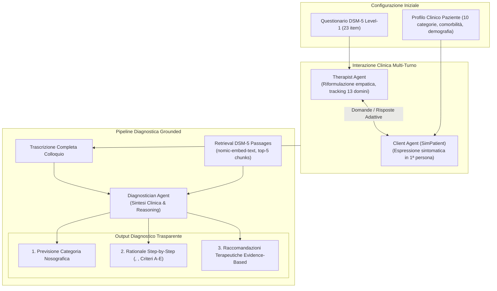

# DSM5AgentFlow

## Definizione Operativa
- Framework e architettura multi-agente basata su Large Language Models (LLM) sviluppata da Ozgun et al. (2025) per automatizzare la somministrazione conversazionale del questionario clinico *DSM-5 Level-1 Cross-Cutting Symptom Measure* e generare diagnosi nosografiche trasparenti, step-by-step ed evidence-based.
- **Utilità CBT / Clinica:** Trasforma la compilazione statica e decontestualizzata dei questionari di screening in un colloquio clinico dinamico ed empatico. Il sistema articola l'interazione tra tre ruoli distinti (*Therapist*, *Client*, *Diagnostician*), separando la conduzione del colloquio dalla fase di formulazione diagnostica, eliminando i bias di anticipazione diagnostica e producendo referti clinici verificabili e conformi ai criteri DSM-5.

## Evidenze dalla Letteratura
- **Separazione dei Ruoli e Mitigazione dei Bias:** Nei modelli LLM a singolo agente impiegati in compiti clinici, l'interlocutore tende a saltare alle conclusioni diagnostiche durante l'intervista o a farsi influenzare da bias di conferma. DSM5AgentFlow risolve questa vulnerabilità assegnando la raccolta dati al *Therapist Agent* (vincolato a non esprimere giudizi clinici prima del completamento dei 23 item) e delegando l'analisi al *Diagnostician Agent* a colloquio concluso (Ozgun et al., 2025).
- **Componenti dell'Architettura:**
  - *Therapist Agent:* Gestisce l'intervista adattiva monitorando la copertura dei 13 domini sintomatologici (Depressione, Rabbia, Mania, Ansia, Sintomi Somatici, Ideazione Suicidaria, Psicosi, Disturbi del Sonno, Memoria, Pensieri Ripetitivi, Dissociazione, Funzionamento di Personalità, Uso di Sostanze). Riformula i quesiti standardizzati in domande aperte e calde, gestendo richieste di chiarimento.
  - *Client Agent (SimPatient):* Incarna un paziente sintetico configurato tramite profili strutturati contenenti disturbo primario, comorbilità secondarie, stile di coping ed eventi di vita recenti. Mantiene rigorosamente la prospettiva in prima persona ed esprime vissuti emotivi genuini senza mai svelare la propria etichetta nosografica.
  - *Diagnostician Agent:* Integra un motore di Retrieval-Augmented Generation (RAG) per estrarre i passaggi rilevanti dal manuale DSM-5 (chunk da 512/1024 token con `nomic-embed-text`). Produce un referto quadripartito: (1) Sintesi empatica; (2) Diagnosi provvisoria; (3) Giustificazione nosografica strutturata con annotazioni semantiche (`<sym>`, `<quote>`, `<med>`) e rinvio esplicito ai criteri (es. Criterio A1, D, E); (4) Proposta terapeutica orientata alle linee guida.
- **Evidenze di Efficacia e Scelta del Backbone:**
  - Nella sperimentazione su 8.000 colloqui clinici simulati con 4 architetture LLM (*Llama-4-scout-17b*, *Mistral-Saba-24b*, *Qwen-QwQ-32b*, *GPT-4.1-Nano*), l'adozione di un modello esplicitamente addestrato per il ragionamento logico (*Qwen-QwQ-32b*) ha consentito di raggiungere la massima accuratezza (70%), recall (72%) e F1-score (77%), dimostrando una capacità superiore di ancorare le prove verbali del paziente ai criteri nosografici rispetto a modelli ottimizzati per la sola scorrevolezza discorsiva (Ozgun et al., 2025).
- **Modularità e Privacy:** L'architettura è concepita come modulare e plug-and-play: supporta inferenza locale tramite Ollama (evitando l'invio di dati sensibili a cloud proprietari), consente l'integrazione a runtime di nuovi questionari o manuali diagnostici (TXT, Markdown, PDF) e permette la definizione flessibile di nuovi profili di pazienti sintetici (Ozgun et al., 2025).

**Riferimenti Bibliografici:**
- Ozgun, M. C., Pei, J., Hindriks, K., Donatelli, L., Liu, Q., & Wang, J. (2025). Trustworthy AI Psychotherapy: Multi-Agent LLM Workflow for Counseling and Explainable Mental Disorder Diagnosis. In *Proceedings of the 34th ACM International Conference on Information and Knowledge Management (CIKM ’25)*, November 10–14, 2025, Seoul, Republic of Korea. ACM, New York, NY, USA, 10 pages. https://doi.org/10.1145/3746252.3761164 / arXiv:2508.11398v2 [cs.HC]
- American Psychiatric Association. (2013). *Diagnostic and Statistical Manual of Mental Disorders (DSM-5®)*. American Psychiatric Publishing.

## Relazioni
- Vedi anche: [[2508-11398v2]], [[explainable-mental-health-diagnosis]], [[simulazione-pazienti-ai]], [[clinical-ai-simulation]], [[risk-ontology-ai-psychotherapy]], [[crdial-framework]], [[audit-bias-llm-clinici]], [[modello-centauro-clinico]]
