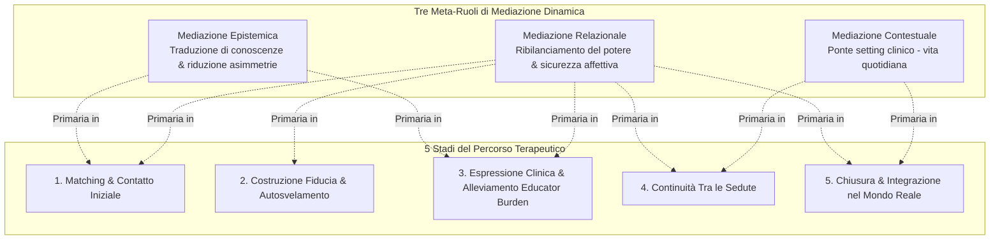
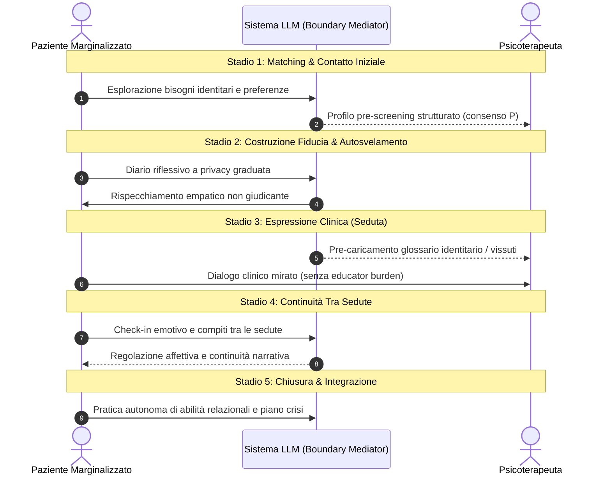

# Dynamic Boundary Mediation Framework

## Definizione Operativa
- Il **Dynamic Boundary Mediation Framework** è un modello teorico e progettuale formulato da Quan et al. (2025) per ridefinire l'integrazione dei Large Language Models (LLM) nella salute mentale. Superando sia la visione dell'IA come mero strumento documentale per il clinico sia quella dell'agente autonomo di auto-aiuto disconnesso dalla relazione di cura, il framework concettualizza l'IA come un **mediatore relazionale dinamico socio-tecnico** (*dynamic relational mediator*).
- **Utilità Clinica e di Design:** Il framework poggia sulla nozione di *oggetti di confine* (Star & Griesemer, 1989) e sullo *spazio potenziale* (Winnicott, 1971; BenEzer, 2012), articolando l'azione dell'IA in tre meta-ruoli di mediazione: **Epistemica** (riduzione delle asimmetrie conoscitive e dell'onere pedagogico del paziente), **Relazionale** (ribilanciamento del potere, privacy granulare e sicurezza affettiva) e **Contestuale** (continuità tra setting clinico e vita quotidiana). Tali funzioni evolvono e si modulano lungo i 5 stadi del percorso terapeutico per rispondere alle specifiche vulnerabilità di pazienti marginalizzati (comunità LGBTQ+, individui a basso reddito, pazienti cronici o neurodivergenti).

---

## Evidenze dalla Letteratura

### 1. I Tre Meta-Ruoli di Mediazione Socio-Tecnica
Il framework organizza le affordance dei sistemi LLM attorno a tre assi funzionali (Quan et al., 2025):

1. **Mediazione Epistemica (*Epistemic Mediation*):**
   - *Obiettivo:* Ridurre le asimmetrie conoscitive e colmare il divario epistemico tra la conoscenza clinico-istituzionale del terapeuta e la conoscenza situata/vissuta del paziente.
   - *Meccanismi Chiave:*
     - *Traduzione dell'esperienza soggettiva:* Formalizzazione del disagio psicologico in costrutti clinici interpretabili senza snaturare l'autenticità del vissuto (Prescreening).
     - *Abbattimento dell'[[educator-burden-marginalized-clients|Educator Burden]]:* Fornitura proattiva al terapeuta di nozioni identitarie e contesti subculturali rilevanti, evitando che il paziente debba impiegare tempo ed energie a "istruire" il professionista durante la seduta.
2. **Mediazione Relazionale (*Relational Mediation*):**
   - *Obiettivo:* Ribilanciare le asimmetrie di potere, promuovere la sicurezza psicologica e offrire uno spazio intermedio a basso rischio per regolare il ritmo dell'autosvelamento.
   - *Meccanismi Chiave:*
     - *Gestione Negoziabile dei Confini:* Architettura di privacy multilivello (*share once, share partially, keep private*) che restituisce al paziente il controllo sui propri dati sensibili.
     - *Buffer Relazionale Non-Giudicante:* Spazio dialogico che riduce la paura del rifiuto e consente di articolare emozioni complesse (Therapeutic Journaling, Basic Chat) prima del confronto in seduta.
3. **Mediazione Contestuale (*Contextual Mediation*):**
   - *Obiettivo:* Risolvere la discontinuità tra il setting protetto della terapia e la complessità spesso ostile o non supportiva della vita quotidiana (*lack of contextual portability*).
   - *Meccanismi Chiave:*
     - *Continuità Asincrona:* Presenza di supporto 24/7 tra le sedute, consolidamento degli esercizi e diario emotivo.
     - *Supporto Post-Chiusura e Gestione Crisi:* Strumenti di riflessione longitudinale e canali di de-escalation e invio immediato attivi oltre il termine del trattamento.

---

### 2. Dinamica Evolutiva Triadica attraverso i 5 Stadi

---

### 3. Principi di Architettura: Privacy Flessibile e Memoria Distillata
- **Visibilità Negoziabile dei Dati (*Negotiable Data Visibility*):** Nelle popolazioni vulnerabili, la paura della sorveglianza istituzionale o della rivelazione non consensuale dell'orientamento sessuale/identità inibisce la trasparenza. Il framework prescrive un controllo di accesso granulare per ogni singola nota o sessione.
- **Sintesi Relazionali Distillate contro l'Effetto Panopticon:** L'archiviazione e condivisione indiscriminata di registrazioni integrali genera ansia da monitoraggio continuo (*panopticon effect*). Il sistema deve operare mediante sintesi astratte di temi clinici, trigger e progressi, preservando la riservatezza delle verbalizzazioni grezze.
- **Superamento del "Robotic Feeling":** I modelli generativi devono evitare formule stereotipate di finta empatia (*"capiamo la tua sofferenza"*), impiegando un'empatia contestuale-adattiva che modula registro, dialetto, tono e formalità in base al vissuto culturale e allo stato emotivo istantaneo dell'utente.

---

### 4. Le 5 Linee Guida di Progettazione (DG1 - DG5)
1. **DG1 (Stage-Aware Role Shifting):** Adattamento progressivo delle funzioni lungo l'intero ciclo terapeutico (matching trasparente $\rightarrow$ espressione senza carico pedagogico $\rightarrow$ consolidamento post-chiusura).
2. **DG2 (Negotiable Data Visibility):** Consenso dinamico a tre livelli (*share once, share partially, keep private*) e trasparenza sulla governance dei dati.
3. **DG3 (Contextualized Relational Memory):** Memoria narrativa basata su temi chiave per garantire continuità senza compromettere l'anonimato.
4. **DG4 (Community-Validated Onboarding):** Integrazione di percorsi di fiducia verificati dalle comunità di pari (*peer networks*) e aggiornamento continuo del lessico identitario.
5. **DG5 (Pervasive Context-Adaptive Empathy):** Sintonizzazione emotiva profonda e flessibile per contrastare il distacco algoritmico e l'empatia stereotipata.

---

**Riferimenti Bibliografici:**
- Quan, J., Li, Z., Zhu, T. Q., Li, Y., Wang, B., Pratt, W., & Gao, N. (2025). Relational Mediators: LLM Chatbots as Boundary Objects in Psychotherapy. *arXiv preprint arXiv:2512.22462v1 [cs.HC]*, 1–35.
- Star, S. L., & Griesemer, J. R. (1989). Institutional ecology, 'translations' and boundary objects: Amateurs and professionals in Berkeley's Museum of Vertebrate Zoology, 1907-39. *Social Studies of Science*, 19(3), 387–420.
- BenEzer, G. (2012). From Winnicott’s potential space to mutual creative space: A principle for intercultural psychotherapy. *Transcultural Psychiatry*, 49(2), 323–339.
- Bordin, E. S. (1979). The generalizability of the psychoanalytic concept of the working alliance. *Psychotherapy: Theory, Research & Practice*, 16(3), 252–260.
- Meyer, I. H. (2003). Prejudice, social stress, and mental health in lesbian, gay, and bisexual populations: Conceptual issues and research evidence. *Psychological Bulletin*, 129(5), 674–697.

## Relazioni
- Vedi anche: [[2512.22462v1]], [[boundary-objects-in-psychotherapy]], [[educator-burden-marginalized-clients]], [[negotiable-data-visibility-privacy]], [[contextualized-relational-memory]], [[between-session-continuity-ai]], [[interazione-triadica-terapeuta-paziente-ia]], [[ai-mental-health-vulnerable-populations]], [[simulated-empathy-vs-authentic-presence]], [[genuineness-gap]], [[weird-bias-cultural-adaptability-ai]]

