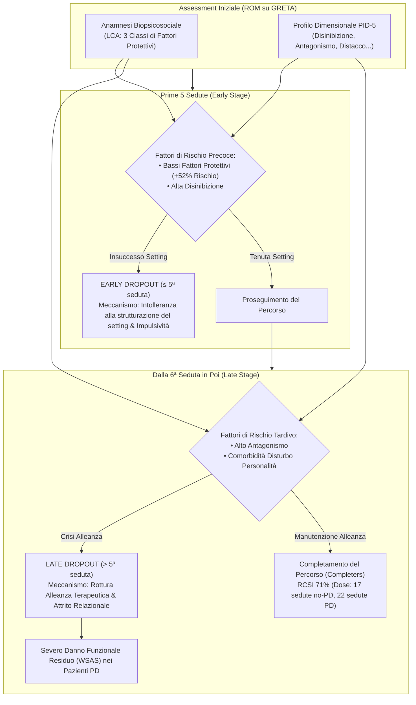
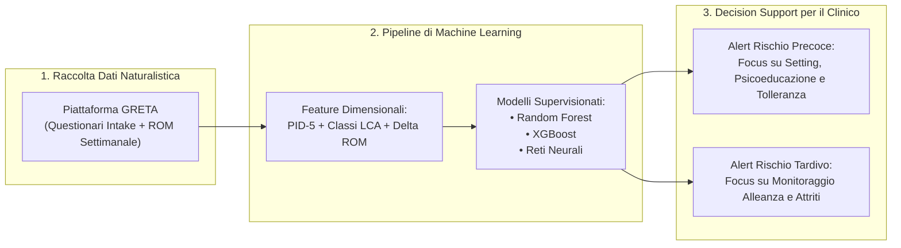

# Differenziazione tra Dropout Precoce e Tardivo nella CBT Online (Early vs. Late Dropout)

## Definizione Operativa
- La **differenziazione tra Dropout Precoce e Tardivo** (*Early vs. Late Dropout Distinction*) è un paradigma clinico e metodologico che dimostra come l'interruzione non programmata della psicoterapia cognitivo-comportamentale non costituisca un fenomeno omogeneo, ma si articoli in due processi qualitativamente e prognosticanente distinti guidati da fattori di rischio dissociati (Grazioli et al., 2026; Caselli et al., 2026):
  1. **Dropout Precoce (*Early Dropout*, $\le$ 5ª seduta):** Interruzione prematura che avviene prima che i meccanismi specifici della CBT abbiano iniziato a produrre benefici clinici; è primariamente predetto da un basso livello di fattori protettivi biopsicosociali all'intake e da elevati tratti di **Disinibizione (PID-5)** (impulsività, intolleranza alla frustrazione e insofferenza verso la strutturazione iniziale del setting).
  2. **Dropout Tardivo (*Late Dropout*, > 5ª seduta):** Interruzione che subentra nelle fasi avanzate del trattamento durante l'esposizione o la ristrutturazione attiva degli schemi di funzionamento; è primariamente predetto da elevati tratti di **Antagonismo (PID-5)** (diffidenza relazionale, rottura dell'alleanza terapeutica) e, nei pazienti con disturbo di personalità comorbido, si associa a un marcato deterioramento funzionale.
- **Superiorità Dimensionale:** La modellazione statistica dimostra che le categorie diagnostiche DSM-5 e il mero numero di disturbi in comorbilità perdono potere predittivo una volta inserite le classi anamnestiche latenti (*Latent Class Analysis* - LCA) e i domini dimensionali del **PID-5 / AMPD**.

---

## Evidenze Empiriche e Parametri Quantitativi

### 1. Epidemiologia e Distribuzione Temporale dell'Abbandono
- **Tassi Globali:** Nella CBT online naturalistica, il tasso di dropout globale si attesta attorno al **30–35%** (Grazioli et al., 2025; Grazioli et al., 2026).
- **Concentrazione Iniziale:** La distribuzione temporale delle interruzioni è asimmetrica:
  - Il **50% dei dropout complessivi si consuma entro la 4ª seduta**.
  - Il **75% dei dropout complessivi si consuma entro la 10ª seduta**.

### 2. Dissociazione dei Predittori Biopsicosociali e di Personalità

| Dimensione Predittiva | Dropout Precoce ($\le$ 5ª seduta) | Dropout Tardivo (> 5ª seduta) | Meccanismo Clinico Sottostante |
| :--- | :---: | :---: | :--- |
| **Fattori Protettivi Anamnestici (LCA)** | **Forte predittore protettivo** (Alti fattori: **-52% rischio**) | Effetto attenuato / non significativo | Il supporto sociale e la stabilità abitativa proteggono l'ingaggio iniziale |
| **Disinibizione (PID-5)** | **Predittore specifico significativo** | Non predittivo | Bassa regolazione degli impulsi e insofferenza alle regole del setting |
| **Antagonismo (PID-5)** | Non predittivo | **Predittore specifico significativo** | Tendenza alla rivalità, diffidenza, rotture non riparate dell'alleanza |
| **Diagnosi Categoriale di PD** | Non predittiva (dopo controllo PID-5) | Non predittiva (dopo controllo PID-5) | Il formato categoriale maschera la variabilità dimensionale predittiva |
| **Esito Funzionale (WSAS post-dropout)** | Compromissione moderata | **Decadimento funzionale severo (specie in PD)** | L'interruzione durante l'attivazione emotiva avanzata lascia il paziente scompensato |

---

## Implicazioni per il Clinical Decision Support (CDSS) e l'Intelligenza Artificiale

1. **Abbandono dell'Approccio Categoriale:** I modelli di Machine Learning sviluppati per predire l'abbandono (Grazioli et al., Fase 04 del progetto IPER Lab) integrano *feature* dimensionali continue (tratti PID-5 e profili latenti LCA), superando le categorizzazioni nosografiche binarie che risultano statisticamente ridondanti.
2. **Alert Dinamici e Stratificazione Temporale:** Il sistema di alert non fornisce un indice di rischio statico, ma calcola una probabilità di interruzione dipendente dalla fase temporale del percorso:
   - *Prime sedute:* Alert guidato da punteggi di Disinibizione e bassi supporti anamnestici $
ightarrow$ raccomandazione di consolidare il contratto terapeutico e chiarire le aspettative.
   - *Sedute intermedie/avanzate:* Alert guidato da punteggi di Antagonismo $
ightarrow$ raccomandazione di esplorare attivamente attriti, sentimenti di incomprensione e rotture dell'alleanza.

---

## Linee Guida Operative per la Pratica Clinica

1. **Esplicitazione Preventiva del Rischio:** Normalizzare la tentazione di abbandonare fin dall'assessment iniziale. Trattare il dropout come un evento prevedibile permette di co-costruire strategie di fronteggiamento prima che si manifestino condotte di evitamento (cancellazioni frequenti, ritardi, silenzi).
2. **Titrazione del Setting per Profili Disinibiti:** Con pazienti che presentano alti livelli di Disinibizione, evitare un'impostazione prescrittiva troppo rigida nelle prime sedute; dedicare tempo a condividere il senso dei compiti a casa (*homework*) e gestire le risposte impulsive alla noia o alla frustrazione.
3. **Manutenzione dell'Alleanza per Profili Antagonisti:** Monitorare costantemente la sintonia interpersonale, legittimare la diffidenza del paziente e accogliere le divergenze di vedute come preziose occasioni di chiarimento terapeutico anziché come ostacoli tecnici.
4. **Protezione dei Percorsi nei Disturbi di Personalità:** Nei pazienti con diagnosi di DP, prevenire il dropout tardivo è vitale: l'interruzione dopo la 5ª seduta espone il soggetto a un peggioramento funzionale marcato. In questi casi è opportuno concordare fin da subito un percorso a dosaggio esteso (~22 sedute).

---

**Riferimenti Bibliografici:**
- Grazioli, S., Canessa, N., Villa, G., De Francesco, S., Ocera, A., Galletti, E., Sassaroli, S., & Caselli, G. (2026). Distinguishing early from late dropout in online Cognitive Behavioral Therapy: the role of biopsychosocial anamnestic profiles and maladaptive personality traits. *Manoscritto in fase di pubblicazione*.
- Grazioli, S., Ocera, A., Notaristefano, I., Piron, R., Fanfoni, M., Terrazzan, L., Ruggiero, G. M., Sassaroli, S., & Caselli, G. (2025). Advancing Cognitive Behavioural Therapy Progress Tracking: A Study on the Design and Implementation of the Online Platform GRETA. *Psychological Reports*, DOI: 10.1177/00332941251409157.
- Caselli, G., Grazioli, S., Piron, R., Fanfoni, M., Giuri, S., Scaini, S., Ruggiero, G. M., & Sassaroli, S. (2026). Effectiveness of Cognitive Behavioral Therapy on anxiety and depression symptoms in naturalistic settings for patients with and without personality disorders. *British Journal of Clinical Psychology* (In revisione).

## Relazioni
- Vedi anche: [[Bollettino_IPERlab_inTherapy_N01_1]], [[treatment-outcome-and-relapse-prediction]], [[clinical-fidelity-assessment]], [[process-based-therapy]], [[software-as-a-medical-device-salute-mentale]], [[000]]\n