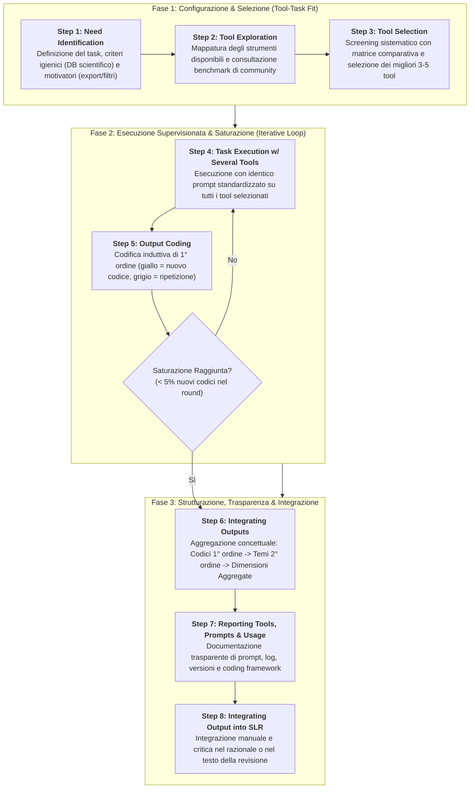
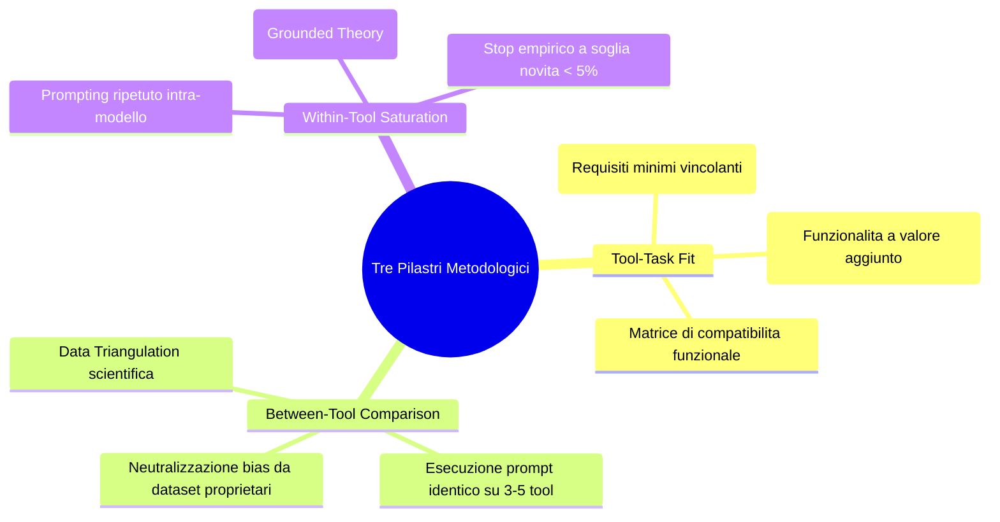
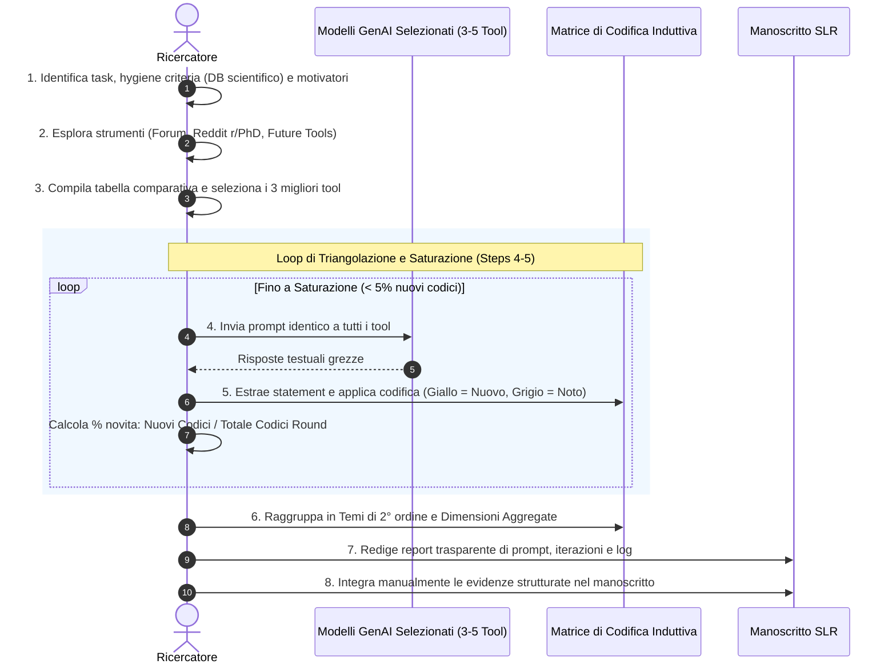

# Eight-Step GenAI Research Workflow (Flusso Metodologico a Otto Fasi per la Ricerca Assistita da GenAI)

## Definizione Operativa
- L'**Eight-Step GenAI Research Workflow** (Flusso a Otto Fasi per la Ricerca con IA Generativa) è un protocollo metodologico rigoroso e standardizzato, formulato da Fabian Tingelhoff, Micha Brugger e Jan Marco Leimeister (2024; *Journal of Information Technology*), per l'esecuzione supervisionata e replicabile di task scientifici assistiti da modelli di Intelligenza Artificiale Generativa.
- **Risoluzione delle Tre Criticità Sistemiche della GenAI:**
  1. *Disallineamento Strumento-Compito (Tool-Task Mismatch):* Risolto tramite una valutazione preventiva strutturata di fattori igienici e motivatori (*Tool-Task Fit*).
  2. *Opacità Black-Box e Bias del Singolo Algoritmo:* Mitigati mediante la triangolazione dei dati tra diversi strumenti indipendenti (*Between-Tool Comparison*).
  3. *Variabilità Stocastica e Incompletezza degli Output:* Compensate attraverso l'esecuzione iterativa dello stesso prompt e la misurazione empirica della saturazione dei codici ispirata alla Grounded Theory (*Within-Tool Comparison & Coding Saturation*).
- **Utilità Clinica e Metodologica:** Fornisce una procedura passo-passo ("cooking recipe") verificabile e documentabile per compiti complessi di revisione scientifica, sintesi concettuale ed esplorazione bibliografica, impedendo l'introduzione di allucinazioni o bias di ancoraggio nel manoscritto finale.

---

## I Tre Pilastri Metodologici

### 1. Tool-Task Fit (Adeguatezza Strumento-Compito)
- **Fattori Igienici (Hygiene Factors):** Requisiti inderogabili affinché uno strumento sia ammesso all'uso. In ambito accademico, includono l'accesso diretto a un database di letteratura scientifica peer-reviewed, la capacità di processare domande aperte e la citazione puntuale delle fonti primarie.
- **Motivatori (Motivators):** Funzionalità accessorie che guidano la scelta tra strumenti capaci, quali la generazione di tabelle sinottiche di sintesi (metodi, campioni, risultanze), filtri cronologici avanzati o grafi semantici di co-citazione.

### 2. Between-Tool Comparison (Triangolazione tra Strumenti)
- Mutuato dal principio scientifico della triangolazione dei dati (Creswell et al., 2003; Tashakkori & Teddlie, 2003), impone di sottoporre il medesimo prompt standardizzato ad almeno **tre o cinque strumenti differenti** (es. *Scite*, *Elicit*, *SciSpace*). Questo approccio previene l'adesione a bias sistemici derivanti dagli algoritmi proprietari, dai filtri di sicurezza specifici o dai dati di addestramento di un unico fornitore.

### 3. Within-Tool Comparison & Coding Saturation (Saturazione di Codifica)
- Basato sul paradigma della Grounded Theory (Glaser & Strauss, 1968), sfrutta la natura stocastica dei modelli linguistici non come un limite, ma come un'opportunità di campionamento informativo:
  - Il prompt viene rieseguito più volte nello stesso strumento.
  - Il ricercatore codifica induttivamente ogni enunciato di risposta.
  - I codici vengono distinti visivamente (nuovi codici vs. codici ripetuti).
  - Il processo si arresta solo quando l'iterazione produce una percentuale trascurabile di nuovi codici (soglia di saturazione convenzionale: **$\le 5\%$ di codici inediti**; Guest et al., 2006; Braun & Clarke, 2021).

---

## Dettaglio Operativo dei Singoli Passaggi

1. **Step 1 - Need Identification (Identificazione del Bisogno):** Formalizzazione puntuale della domanda di ricerca e definizione dei criteri di compatibilità funzionale minimi e desiderabili.
2. **Step 2 - Tool Exploration (Esplorazione degli Strumenti):** Ricognizione dello stato dell'arte tecnologico attraverso community accademiche aperte (es. forum accademici, community di dottorato), preferibili ai siti commerciali per l'indipendenza delle valutazioni.
3. **Step 3 - Tool Selection (Selezione dei Tool):** Confronto sistematico in una tabella a matrice (tool vs. criteri igienici e motivatori) per isolare un pool di 3–5 applicativi validi.
4. **Step 4 - Task Execution w/ Several Tools (Esecuzione Comparativa):** Elaborazione di un prompt chiaro e strutturato, applicato in modo identico e controllato a tutti gli applicativi selezionati.
5. **Step 5 - Output Coding (Codifica degli Output):** Analisi qualitativa degli enunciati con marcatura dei concetti emersi e categorizzazione in codici di primo ordine.
6. **Step 6 - Integrating Outputs (Integrazione e Sintesi Tematica):** Riconciliazione dei codici di primo ordine in temi gerarchici di secondo ordine e macro-dimensioni aggregate mediante schemi concettuali e grafi di conoscenza.
7. **Step 7 - Reporting Tools, Prompts, and Usage (Rendicontazione Trasparente):** Documentazione esaustiva nei materiali supplementari della pubblicazione (elenco strumenti, versioni, checkpoint, prompt testuali, tabelle di saturazione e matrici di codifica).
8. **Step 8 - Integrating Output into SLR (Integrazione nel Manoscritto):** Trasposizione critica e manuale dei risultati all'interno della revisione sistematica della letteratura, preservando l'originalità intellettuale e la responsabilità dell'autore.

---

## Esempio di Applicazione Pratica (Tingelhoff et al., 2024)

Nel paper di Tingelhoff et al., il framework è stato validato sul tema *"L'adozione del Metaverso nel Retail B2C"*:

| Fase / Metrica | Valori Empirici Rilevati |
| :--- | :--- |
| **Tool Candidati Iniziali** | 11 strumenti esplorati |
| **Tool Selezionati (Fit Igienico)** | 3 strumenti (*Scite*, *Elicit*, *SciSpace*) |
| **Iterazioni Eseguite** | 5 round completi di prompting |
| **Codici di Primo Ordine Emersi** | 66 codici concettuali unici |
| **Saturazione Raggiunta al Round 5** | Solo **5% di nuovi codici (3 su 66)** $\rightarrow$ Arresto empirico |
| **Temi di Secondo Ordine Generati** | 13 temi strutturati |
| **Dimensioni Concettuali Finali** | 4 macro-dimensioni teoriche (*Retail*, *Business*, ecc.) |

---

## Riferimenti Bibliografici
- Tingelhoff, F., Brugger, M., & Leimeister, J. M. (2024). A guide for structured literature reviews in business research: The state-of-the-art and how to integrate generative artificial intelligence. *Journal of Information Technology*, 1–23. https://doi.org/10.1177/02683962241304105
- Braun, V., & Clarke, V. (2021). To saturate or not to saturate? Questioning data saturation as a useful concept for thematic analysis and sample-size rationales. *Qualitative Research in Sport, Exercise and Health*, 13(2), 201–216.
- Creswell, J. W., Clark, V. L. P., Gutmann, M. L., et al. (2003). Advanced mixed methods research designs. In *Handbook of Mixed Methods in Social & Behavioral Research* (pp. 209–240). SAGE.
- Glaser, B. G., & Strauss, A. L. (1968). *The Discovery of Grounded Theory: Strategies for Qualitative Research*. Aldine.
- Guest, G., Bunce, A., & Johnson, L. (2006). How many interviews are enough? Experimenting with data saturation and variability. *Field Methods*, 18(1), 59–82.
- Tashakkori, A., & Teddlie, C. (2003). *Handbook of Mixed Methods in Social & Behavioral Research*. SAGE.

---

## Relazioni
- Vedi anche: [[JML_1001]], [[criteria-centric-genai-integration]], [[structured-literature-reviews]], [[guide-genai-literature-review]], [[gai-research-integrity-and-verification]], [[hybrid-ai-research-workflows]], [[prompting-in-psychology]], [[llm-assisted-synthesis]], [[bibliometric-analysis]]
