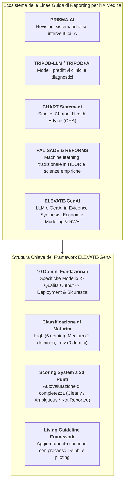
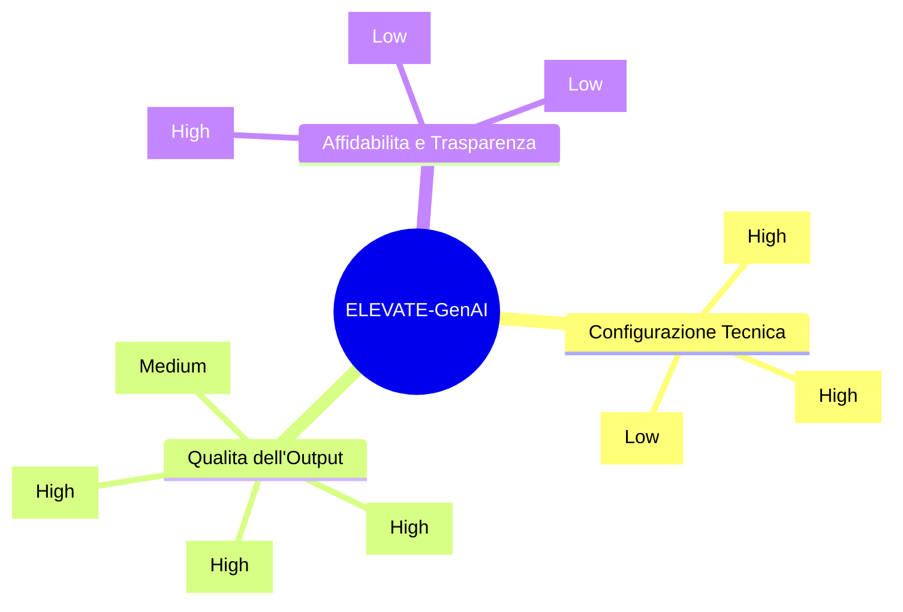
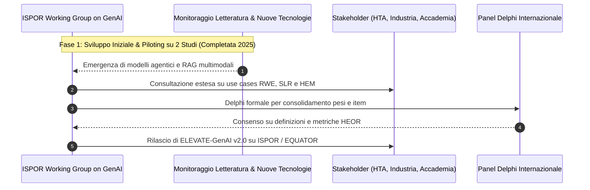

# ELEVATE-GenAI Framework

## Definizione Operativa
- L'**ELEVATE-GenAI Framework** (*Evidence, Transparency, and Efficiency for Generative AI*) è lo standard metodologico di rendicontazione elaborato dall'**ISPOR Working Group on Generative AI** (Fleurence et al., 2025; *Value in Health*, doi: 10.1016/j.jval.2025.06.018) specificamente concepito per guidare, strutturare e valutare la trasparenza e la riproducibilità degli studi basati su Large Language Models (LLM) nell'Economia Sanitaria e nella Ricerca sugli Esiti (*Health Economics and Outcomes Research* - HEOR).
- **Architettura a 10 Domini e Livelli di Maturità:** Il framework traduce i principi generali di valutazione dell'IA (derivanti dal benchmark HELM di Stanford e dalla systematic review di Bedi et al., 2025) in una checklist operativa strutturata su **10 domini metodologici**, associando a ciascuno un livello di maturità metrica (*High, Medium, Low*) per riflettere lo stato dell'arte delle metriche di misurazione nel dominio sanitario.
- **Utilità Clinico-Regolatoria e Decisionale:** A differenza delle linee guida per trial clinici (CONSORT-AI) o modelli predittivi (TRIPOD-LLM), ELEVATE-GenAI è ottimizzato per i flussi di lavoro complessi dell'HEOR e dell'HTA (Health Technology Assessment), tra cui screening di revisioni sistematiche, stima di parametri per modelli di Markov, simulazioni di costo-efficacia e fenotipizzazione da cartelle cliniche elettroniche (EHR).

---

## I 10 Domini Metodologici e la Checklist ELEVATE-GenAI

### 1. Model Characteristics (Maturità: *High*)
- **Requisiti di Reporting:** Identificazione del modello (nome, checkpoint esatto es. `gpt-4o-2024-05-13`, `llama-3-70b-instruct`), organizzazione sviluppatrice, data di rilascio, regime di licenza (commerciale/closed-source vs open-weights), canale di accesso (API, web UI, on-premise) e architettura di base (transformer, context window).
- **Dati e Adattamenti:** Esplicitazione dei dati di pretraining, dataset utilizzati per fine-tuning/LoRA (es. abstract Cochrane, PubMed), e basi di conoscenza collegate via Retrieval-Augmented Generation (RAG).

### 2. Accuracy Assessment (Maturità: *Medium*)
- **Requisiti di Reporting:** Quantificazione della correttezza dell'output rispetto a standard di riferimento (*gold standard* o benchmark umani validati).
- **Metriche Applicate:** Metriche di classificazione/estrazione (Precision, Recall, F1-Score, AUC), metriche NLP (BLEU, ROUGE) o metriche specialistiche per report clinici (es. GREEN).
- **Stato Metodologico:** *Medium* perché le metriche tradizionali AI/ML devono ancora essere pienamente calibrate per task HEOR complessi di generazione di testo libero e sintesi economica.

### 3. Comprehensiveness Assessment (Maturità: *High*)
- **Requisiti di Reporting:** Valutazione della completezza tematica: verificare che l'LLM abbia catturato tutti i trial rilevanti in una SLR, tutti gli stati di transizione in un modello di costo-efficacia, o tutte le covariate cliniche in uno studio RWE.
- **Validazione:** Revisione qualitativa e comparativa condotta da esperti di dominio HEOR/clinici.

### 4. Factuality Verification (Maturità: *High*)
- **Requisiti di Reporting:** Protocolli espliciti per la verifica documentale della verità delle affermazioni, tracciamento delle fonti e rilevamento sistematico di **allucinazioni** (citazioni fittizie, numeri errati, associazioni spurie).
- **Correzioni:** Documentazione formale delle discrepanze rilevate e delle azioni correttive intraprese.

### 5. Reproducibility Protocols & Generalizability (Maturità: *High*)
- **Requisiti di Reporting:** Trasparenza integrale del workflow: prompt testuali completi, system prompt, temperature, top-p, seed numerico, pipeline di codice per chiamate API (Python/R) rilasciati in repository pubblici (GitHub/Zenodo).
- **Generalizzabilità:** Discussione della trasferibilità del prompt/workflow ad altre patologie, interventi o contesti decisionali.

### 6. Robustness Checks (Maturità: *High*)
- **Requisiti di Reporting:** Resilienza a variazioni di input: testing della stabilità delle decisioni dell'LLM a fronte di errori tipografici, parafrasi dei prompt o pairing con abstract non correlati (es. test di irrelevancy).

### 7. Fairness & Bias Monitoring (Maturità: *Low*)
- **Requisiti di Reporting:** Monitoraggio delle disparità di output correlate a variabili sociodemografiche (genere, età, etnia, livello socioeconomico).
- **Stato Metodologico:** *Low* a causa della scarsità di metriche di equità (es. demographic parity, equalized odds) validate e standardizzate nei flussi decisionali HEOR.

### 8. Deployment Context & Efficiency Metrics (Maturità: *High*)
- **Requisiti di Reporting:** Dettagli sull'ambiente di esecuzione: GPU/TPU (es. NVIDIA A100/H100), framework (PyTorch, Hugging Face), containerizzazione Docker, latenza di risposta (secondi/campione), throughput, costi per token/chiamata API e rate limits.

### 9. Calibration & Uncertainty (Maturità: *Low*)
- **Requisiti di Reporting:** Valutazione dell'affidabilità della confidenza espressa dal modello (es. *Expected Calibration Error* - ECE); definizione di soglie quantitative di incertezza per attivare la revisione manuale umana (*human-in-the-loop*).

### 10. Security & Privacy Measures (Maturità: *Low*)
- **Requisiti di Reporting:** Protocolli di protezione dei dati sanitari protetti (*Protected Health Information* - PHI), conformità GDPR e HIPAA, impiego di dati sintetici/fittizi (*dummy data*) per evitare la memorizzazione di dati sensibili sui server di provider commerciali, e tutela del diritto d'autore.

---

## Il Sistema di Punteggio di Completezza (Scoring Rubric)

ELEVATE-GenAI include una griglia opzionale di autovalutazione a 30 punti:

| Giudizio di Reporting | Punteggio Assegnato | Criterio Operativo |
| :--- | :---: | :--- |
| **Clearly Reported** | **3 punti** | L'item è documentato in modo esauriente, trasparente e replicabile. |
| **Not Applicable** | **3 punti** | Il dominio non è pertinente allo studio, con motivazione esplicita e valida. |
| **Ambiguous** | **2 punti** | Il dominio è menzionato ma con dettagli insufficienti o ambigui. |
| **Not Reported** | **1 punto** | L'informazione rilevante è del tutto omessa nel manoscritto. |

> [!IMPORTANT]
> Lo score sintetico (da 10 a 30) misura esclusivamente la **completezza del reporting scientifico** e la trasparenza, non la qualità metodologica intrinseca o l'accuratezza clinica del modello.

---

## Roadmap e Living Guideline Governance

- **Ciclo di Revisione Permanente:** Come living guideline, il framework prevede aggiornamenti periodici per recepire l'evoluzione dei modelli multimodali e dei sistemi agentici autonomi nell'HEOR.
- **Validazione Delphi:** Un panel Delphi formale è programmato per affinare la tassonomia dei domini a bassa maturità (*Fairness*, *Uncertainty*, *Security*).

---

## Riferimenti Bibliografici
- Fleurence, R. L., Dawoud, D., Bian, J., Higashi, M. K., Wang, X., Xu, H., Chhatwal, J., & Ayer, T. (2025). ELEVATE-GenAI: Reporting Guidelines for the Use of Large Language Models in Health Economics and Outcomes Research: An ISPOR Working Group Report. *Value in Health*, 28(11), 1611–1625. https://doi.org/10.1016/j.jval.2025.06.018
- Bedi, S., Liu, Y., Orr-Ewing, L., et al. (2025). Testing and evaluation of health care applications of large language models: a systematic review. *JAMA*, 333(4), 319–328.
- Liang, P., Bommasani, R., Lee, T., et al. (2022). Holistic evaluation of language models. *arXiv preprint arXiv:2211.09110*.
- Padula, W. V., Kreif, N., Vanness, D. J., et al. (2022). Machine learning methods in health economics and outcomes research—the PALISADE checklist: a good practices report of an ISPOR task force. *Value in Health*, 25(7), 1063–1080.
- Gallifant, J., Afshar, M., Ameen, S., et al. (2025). The TRIPOD-LLM reporting guideline for studies using large language models. *Nature Medicine*, 31(1), 60–69.

---

## Related pages
- [[ELEVATE-GenAI2025]]
- [[heor-generative-ai-validation]]
- [[chart-reporting-guideline]]
- [[CHART2025]]
- [[traffic-light-quality-appraisal-clinical-ai]]
- [[chai-blueprint-health-ai]]
- [[large-language-models]]
- [[gdpr-governance-mental-health-ai]]
- [[ai-research-ethics]]
