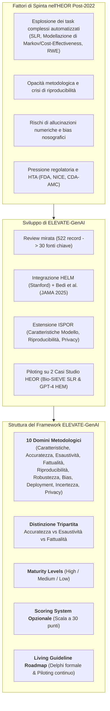
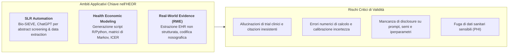
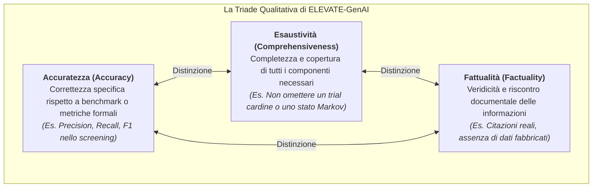
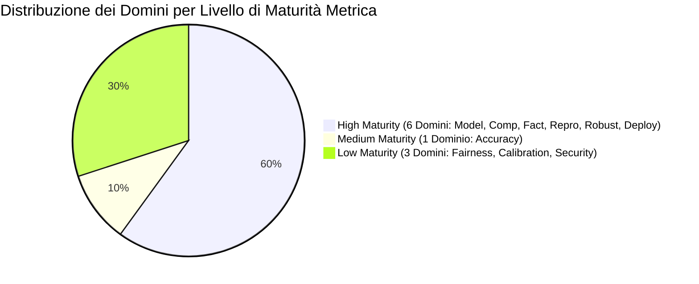
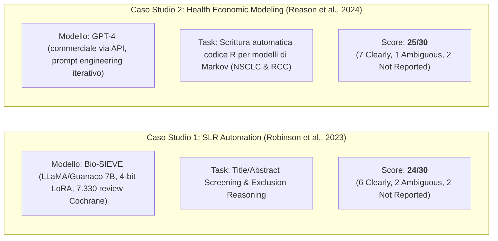

# ELEVATE-GenAI: Reporting Guidelines for the Use of Large Language Models in Health Economics and Outcomes Research (ISPOR Working Group / Fleurence et al., 2025)

## Definizione Operativa
- Il framework **ELEVATE-GenAI** (*Evidence, Transparency, and Efficiency for Generative AI*) rappresenta la prima linea guida internazionale e standardizzata per la rendicontazione metodologica dell'uso dei Large Language Models (LLM) e dell'Intelligenza Artificiale Generativa negli studi di Economia Sanitaria e Ricerca sugli Esiti Clinici (*Health Economics and Outcomes Research* - HEOR), pubblicata dall'**ISPOR Working Group on Generative AI** su *Value in Health* (2025; 28(11):1611–1625; doi: 10.1016/j.jval.2025.06.018).
- **Architettura a 10 Domini e Checklist:** Basandosi sui framework di valutazione fondazionali (Bedi et al., 2025; HELM benchmark di Stanford) e arricchito per rispondere alle esigenze metodologiche, regolatorie e decisionali di HEOR e Health Technology Assessment (HTA), ELEVATE-GenAI definisce **10 domini di reporting**, ciascuno corredato da quesiti guida operativi e da una classificazione del **livello di maturità metrica** (*High, Medium, Low*).
- **Finalità e Ambiti Applicativi:** Il framework è concepito per studi in cui la GenAI svolge un ruolo sostanziale nella generazione, sintesi o analisi delle evidenze — in particolare per Revisioni Sistematiche della Letteratura (SLR), Modellazione Economica Sanitaria (HEM) e Generazione di Real-World Evidence (RWE) — garantendo trasparenza, riproducibilità, tracciabilità delle allucinazioni e conformità etico-regolatoria.

## Evidenze dalla Letteratura

### 1. Inquadramento del Problema: L'Adozione Massiva di LLM nell'HEOR
L'avvento di modelli di fondazione come GPT-4, Claude, Gemini e LLaMA ha trasformato le pratiche di ricerca in economia sanitaria e HTA, accelerando attività tradizionalmente ad altissima intensità di lavoro manuale:
1. **Revisioni Sistematiche della Letteratura (SLRs):** Screening automatico di titoli e abstract, estrazione dati tabulari, valutazione del rischio di bias (es. ROBINS-I, RoB 2) e sintesi meta-analitica.
2. **Modellazione Economica Sanitaria (HEM):** Generazione automatica di script computazionali (es. in R o Python) per modelli di Markov a stati discreti, stima di transizione, calcolo degli *Incremental Cost-Effectiveness Ratios* (ICER) e analisi di sensitività probabilistica.
3. **Real-World Evidence (RWE):** Trasformazione di dati non strutturati estratti da Cartelle Cliniche Elettroniche (EHR), referti istopatologici, imaging e genomica in variabili analizzabili e fenotipi computazionali.

Nonostante il potenziale trasformativo, l'integrazione degli LLM pone minacce dirette alla validità scientifica a causa di **allucinazioni di citazioni e numeri**, instabilità stocastica delle risposte, opacità dei dati di pretraining e assenza di standard condivisi di peer review.

### 2. Metodologia di Sviluppo del Framework ELEVATE-GenAI
Lo sviluppo delle linee guida ha seguito un approccio multistep coordinato dall'**ISPOR Working Group on Generative AI**:
- **Revisione Mirata della Letteratura:** Condotta su PubMed (fino a gennaio 2025) e ArXiv (fino a dicembre 2024), unitamente al clearinghouse dell'EQUATOR Network. Su 522 record identificati, 32 sono stati esaminati full-text, includendo:
  - **15 studi di framework di valutazione e benchmarking** per LLM in sanità (tra cui Bedi et al., 2025; Liang et al., 2022 - HELM; AlSaad et al., 2024; Wysocka et al., 2024; Shi et al., 2024);
  - **6 linee guida di reporting preesistenti** su AI e ML in biomedicina (PRISMA-AI, TRIPOD+AI, TRIPOD-LLM, PALISADE, REFORMS, e successivamente DEAL);
  - **9 documenti di indirizzo e position statements** di autorità regolatorie e agenzie HTA (FDA draft guidance sull'AI, position statement NICE, Canada's Drug Agency / CDA-AMC, EMA reflection paper, NIST AI RMF, WHO guidelines, National Academy of Medicine).
- **Sintesi Strutturale e Integrazione ISPOR:** Mappando le 30 fonti, l'ISPOR Working Group ha adottato l'impalcatura del benchmark HELM e di Bedi et al., integrandovi **3 domini specifici e indispensabili per l'HEOR**: *Caratteristiche del Modello*, *Riproducibilità e Generalizzabilità*, e *Misure di Sicurezza e Privacy*.

### 3. I 10 Domini Metodologici di ELEVATE-GenAI
La tabella seguente sintetizza i 10 domini della checklist ELEVATE-GenAI, i requisiti di rendicontazione e il rispettivo livello di maturità metrica:

| Dominio | Descrizione Operativa | Item Chiave della Checklist | Livello di Maturità |
| :--- | :--- | :--- | :---: |
| **1. Model Characteristics** | Documentazione delle proprietà fondazionali dell'architettura e dell'accesso. | Nome del modello, versione/checkpoint, sviluppatore, data di rilascio, licenza (open-source vs commerciale), modalità di accesso (API, interfaccia web, on-premise), architettura transformer, dati di pretraining/fine-tuning (es. PubMed, Cochrane), e pipeline RAG. | **High** |
| **2. Accuracy Assessment** | Valutazione dell'allineamento dell'output con il risultato corretto o atteso. | Metriche task-specifiche (Precision, Recall, F1-Score, AUC, BLEU, GREEN) confrontate con gold standard umani o benchmark validati. | **Medium** *(necessita adattamento a task HEOR complessi)* |
| **3. Comprehensiveness Assessment** | Verifica che l'output copra in modo esaustivo e coerente tutti gli elementi del task. | Confronto con review pubblicate o modelli validati per escludere omissioni critiche di studi, stati di salute o prospettive economiche; validazione qualitativa da parte di esperti. | **High** |
| **4. Factuality Verification** | Controllo della veridicità e verificabilità dei contenuti rispetto a fonti primarie. | Protocolli di fact-checking contro fonti primarie; tracciamento e correzione di allucinazioni, citazioni fabbricate o dati inventati. | **High** |
| **5. Reproducibility & Generalizability** | Garanzia che metodi e risultati siano verificabili e applicabili ad altri contesti. | Condivisione di codice di training/inferenza, formulazione esatta dei prompt, iperparametri (temperatura, seed, top-p); valutazione dell'applicabilità ad altri quesiti decisionali. | **High** |
| **6. Robustness Checks** | Resilienza a variazioni di input, errori tipografici o formulazioni ambigue. | Test di sensitività con variazioni di prompt, typo injection, perturbazioni di input o prompt adversarial; documentazione delle fluttuazioni di performance. | **High** |
| **7. Fairness & Bias Monitoring** | Garanzia di equità e assenza di stereotipi o discriminazioni sociodemografiche. | Audit di bias su genere, età, etnia o status socioeconomico nell'erogazione di stime o decisioni; applicazione di metriche di equità (es. demographic parity, equalized odds). | **Low** *(metodologie HEOR in fase embrionale)* |
| **8. Deployment & Efficiency Metrics** | Descrizione del setup tecnico, risorse computazionali e sostenibilità. | Hardware (GPU/TPU es. NVIDIA A100/H100), framework software (PyTorch, Hugging Face, Docker), latenza di risposta, throughput, costi per token/query e rate limits API. | **High** |
| **9. Calibration & Uncertainty** | Espressione affidabile dell'incertezza e calibrazione della confidenza del modello. | Stima dell'Expected Calibration Error (ECE); soglie di confidenza per demandare casi ambigui a revisione umana manuale (*human-in-the-loop*). | **Low** *(metriche di incertezza poco diffuse nell'HEOR)* |
| **10. Security & Privacy Measures** | Salvaguardia dei dati sanitari protetti, proprietà intellettuale e compliance. | Protocolli di cifratura, anonimizzazione/de-identificazione di PHI, uso di dati sintetici/fittizi, conformità GDPR/HIPAA e rispetto del diritto d'autore. | **Low** *(linee guida specifiche per LLM in evoluzione)* |

### 4. Distinzione Concettuale Tripartita: Accuratezza vs Esaustività vs Fattualità
Uno dei contributi teorici più significativi di ELEVATE-GenAI risiede nella rigorosa demarcazione concettuale tra tre dimensioni di qualità dell'output spesso confuse nella letteratura:

- **Accuratezza vs Esaustività:** Una meta-analisi generata da LLM può descrivere con perfetta accuratezza statistica 5 trial inclusi, ma fallire completamente nell'esaustività se omette il sesto trial fondamentale pubblicato nello stesso periodo.
- **Accuratezza vs Fattualità:** Un sommario strutturato di HTA può presentare una forma impeccabile e parametri plausibili (apparentemente accurati), ma contenere riferimenti bibliografici interamente allucinati o numeri inventati (fallimento della fattualità).

### 5. Sistema di Scoring Opzionale e Validazione sui Casi Studio

#### A. Il Sistema di Punteggio a 30 Punti
ELEVATE-GenAI introduce un sistema di punteggio opzionale per l'autovalutazione della completezza del reporting:
- **3 punti:** *Clearly Reported* (oppure *Not Applicable* debitamente motivato);
- **2 punti:** *Ambiguous* (reporting parziale o privo di dettagli chiave);
- **1 punto:** *Not Reported* (informazione rilevante del tutto omessa).
- **Punteggio Totale:** Da 10 a 30 punti. 
> [!NOTE]
> Lo score riflette la **completezza del reporting**, non la qualità intrinseca o il rigore metodologico dello studio.

#### B. Applicazione Empirica a Due Casi Studio HEOR

1. **Caso Studio 1: Revisione Sistematica con Bio-SIEVE (Robinson et al., 2023):**
   - *Punti di forza:* Dettaglio impeccabile su architettura (LLaMA 7B 4-bit LoRA), pesi rilasciati su Hugging Face, metriche di screening (precision 0.85, recall 0.82) e validazione su subset Cochrane.
   - *Aree ambigue/non riportate:* Mancanza di analisi di bias sociodemografico (Fairness: *Not Reported*), assenza di quantificazione formale dell'incertezza/calibrazione (*Ambiguous*), omissione di dettagli hardware/memory context (*Ambiguous*), e assenza di disclosure su compliance regolatoria/copyright (*Not Reported*).
2. **Caso Studio 2: Generazione Modelli di Cost-Effectiveness con GPT-4 (Reason et al., 2024):**
   - *Punti di forza:* Replicazione di modelli Markoviani a 3 stati (progression-free, progressed, death) con ICER entro l'1% dai benchmark pubblicati; condivisione degli script R generati; uso di dummy data per prevenire data leakage verso server OpenAI.
   - *Aree ambigue/non riportate:* Mancata specificazione della release date/checkpoint esatto di GPT-4 (*Ambiguous*); assenza di metriche formali di fairness demografica (*Not Reported*) e quantificazione dell'incertezza (*Not Reported*).

### 6. Sfide Metodologiche e Roadmap "Living Guideline"

- **Dinamismo dei Sistemi Chiusi:** I modelli commerciali black-box (es. ChatGPT, Claude) subiscono continui aggiornamenti silenti lato server (*continuous updating*), rendendo l'esatta riproducibilità temporale una sfida irrisolta.
- **Assenza di Benchmark Specifici per l'HEOR:** A differenza del NLP generale, l'HEOR manca di gold-standard benchmark standardizzati per task quali la stima di utilità, l'identificazione degli stati di salute o l'estrazione RWE.
- **Evoluzione Verso Sistemi Agentici:** Con l'emergere di flussi di lavoro semi-autonomi o multi-agente ([[dsm5agentflow]], sistemi collaborativi), le future estensioni di ELEVATE-GenAI dovranno normare l'iteratività inter-agente e il logging dell'orchestrazione.
- **Roadmap ISPOR:** Il framework è concepito come **Living Guideline**: i prossimi passaggi includono un'ampia consultazione degli stakeholder, la validazione su coorti estese di studi RWE ed economici, e un **processo formale Delphi** per consolidare i singoli item.

## Implicazioni Metodologiche, Cliniche e di Governance

1. **Standardizzazione dei Dossier HTA:** Agenzie di rimborso e valutazione delle tecnologie sanitarie (NICE, CADTH, AIFA) possono adottare la checklist ELEVATE-GenAI come griglia di conformità per le evidenze sottomesse dall'industria farmaceutica e medtech.
2. **Supporto ai Peer Reviewer ed Editor:** Fornisce ai comitati editoriali di riviste sanitarie ed economico-sanitarie criteri oggettivi per giudicare se un manoscritto con GenAI rispetta i criteri minimi di trasparenza.
3. **Tutela della Sicurezza dei Dati Paziente:** Obbliga i ricercatori a documentare l'impiego di ambienti di calcolo sicuri (*private cloud / local deployment*) o tecniche di de-identificazione prima di inviare dati sanitari reali a servizi LLM esterni.

**Riferimenti Bibliografici:**
- Fleurence, R. L., Dawoud, D., Bian, J., Higashi, M. K., Wang, X., Xu, H., Chhatwal, J., & Ayer, T. (2025). ELEVATE-GenAI: Reporting Guidelines for the Use of Large Language Models in Health Economics and Outcomes Research: An ISPOR Working Group Report. *Value in Health*, 28(11), 1611–1625. https://doi.org/10.1016/j.jval.2025.06.018
- Bedi, S., Liu, Y., Orr-Ewing, L., et al. (2025). Testing and evaluation of health care applications of large language models: a systematic review. *JAMA*, 333(4), 319–328.
- Liang, P., Bommasani, R., Lee, T., et al. (2022). Holistic evaluation of language models. *arXiv preprint arXiv:2211.09110*.
- Cacciamani, G. E., Chu, T. N., Sanford, D. I., et al. (2023). PRISMA AI reporting guidelines for systematic reviews and meta-analyses on AI in healthcare. *Nature Medicine*, 29(1), 14–15.
- Gallifant, J., Afshar, M., Ameen, S., et al. (2025). The TRIPOD-LLM reporting guideline for studies using large language models. *Nature Medicine*, 31(1), 60–69.
- Padula, W. V., Kreif, N., Vanness, D. J., et al. (2022). Machine learning methods in health economics and outcomes research—the PALISADE checklist: a good practices report of an ISPOR task force. *Value in Health*, 25(7), 1063–1080.
- Huo, B., Collins, G. S., Chartash, D., et al. (2025). Reporting guideline for chatbot health advice studies: The CHART Statement. *JAMA Network Open*, 8(8), e2530220.
- Robinson, A., Thorne, W., Wu, B. P., et al. (2023). Bio-sieve: Exploring instruction tuning large language models for systematic review automation. *arXiv preprint arXiv:2308.06610*.
- Reason, T., Rawlinson, W., Langham, J., et al. (2024). Artificial intelligence to automate health economic modelling: a case study to evaluate the potential application of large language models. *PharmacoEconomics - Open*, 8(2), 191–203.

## Relazioni
- [[elevate-genai-framework]]
- [[heor-generative-ai-validation]]
- [[chart-reporting-guideline]]
- [[chart2025-1]]
- [[traffic-light-quality-appraisal-clinical-ai]]
- [[chai-blueprint-health-ai]]
- [[gdpr-governance-mental-health-ai]]
- [[large-language-models]]
- [[ai-research-ethics]]
- [[structured-literature-reviews]]
- [[human-in-the-reasoning]]
