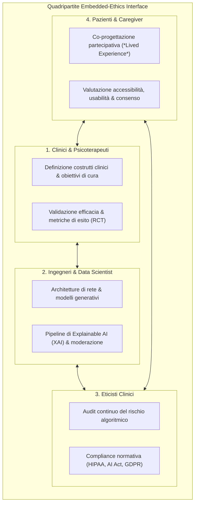

# Embedded-Ethics Interface (Interfaccia Etica Incorporata nell'IA Clinica)

## Definizione Operativa
- Modello operativo e metodologico di governance interdisciplinare continua per lo sviluppo di sistemi di Intelligenza Artificiale in sanità e salute mentale (McLennan et al., 2022; Cartolovni et al., 2022; Sohn et al., 2025), che integra eticisti clinici e portatori di interesse all'interno dei cicli di sviluppo ingegneristico (*"ethics from the workbench"*).
- **Utilità CBT e Clinica:** Fornisce allo psicoterapeuta e all'équipe clinica una struttura formale per monitorare in tempo reale l'allineamento terapeutico, prevenire allucinazioni iatrogene, mitigare bias algoritmici verso popolazioni vulnerabili o minoritarie e garantire la protezione dei dati sensibili e l'autonomia decisionale del paziente (inclusi minori e persone neurodivergenti).

---

## Evidenze dalla Letteratura

### 1. Fondamenti Teorici ed Efficacia della Co-Progettazione Etica
- **Modello "Ethics from the Workbench":** McLennan et al. (2022) dimostrano che l'inclusione diretta di esperti di bioetica negli sprint di sviluppo computazionale consente di intercettare vulnerabilità sistemiche (bias di campionamento, perdita di trasparenza, rischi di de-anonimizzazione) prima della fase di rilascio clinico.
- **Workflow "Ethics-by-Design":** Cartolovni et al. (2022) mappano i rischi dell'IA su quattro livelli interdipendenti (algoritmico, medico, paziente, organizzativo), evidenziando la necessità di audit continui e metriche di equità incorporate nella funzione di perdita (*fairness-constrained loss functions*).
- **Adattamento all'Età Evolutiva e alla Neurodivergenza:** Nella cura dei disturbi dello spettro autistico, la *Quadripartite Embedded-Ethics Interface* formalizzata da Sohn et al. (2025) assicura che il design dei prompt e le modalità di interazione (testo, voce, robotica, realtà aumentata) rispettino le specificità sensoriali e comunicative del bambino, garantendo il diritto di interruzione e la tutela dell'autonomia.

---

### 2. Disparità Globali, Bias Algoritmico e Rischi Documentati
- **Concentrazione Geografica e Divario LMIC:** La letteratura evidenzia una grave asimmetria nella ricerca sull'IA in sanità: la totalità delle evidenze empiriche recenti su GenAI e ASD deriva da paesi ad alto reddito (USA, Cina, Germania, Giappone), con una totale assenza di sperimentazioni nei paesi a basso e medio reddito (*Low- and Middle-Income Countries*, LMICs), rischiando di accentuare le disparità sanitarie globali (Sohn et al., 2025; Weissglass, 2022; Yu & Zhai, 2024).
- **Mancanza di Stratificazione Demografica:** Molti modelli generativi vengono addestrati su corpora prevalentemente anglofoni o demograficamente omogenei, determinando cali di accuratezza o sotto-diagnosi sistematica quando applicati a sottogruppi culturali, linguistici o di genere diversi (Fletcher et al., 2021; Kerasidou, 2021).
- **Privacy Pediatrica e Consenso Dinamico:** La raccolta di flussi multimodali continui (audio, video delle sedute, tracciamento oculare) espone i minori a rischi di compromissione della riservatezza; è tassativo l'allineamento a standard rigorosi (HIPAA, GDPR) e l'adozione di protocolli di consenso informato chiaro e progressivo per i caregiver e i minori (McMahon & Lee-Huber, 2001; Yang et al., 2023; Sohn et al., 2025).

---

## Riferimenti Bibliografici
- Cartolovni, A., Tomičić, A., & Lazić-Mosler, E. (2022). Ethical, legal, and social considerations of AI-based medical decision-support tools: A scoping review. *International Journal of Medical Informatics*, 161, 104738. https://doi.org/10.1016/j.ijmedinf.2022.104738
- Fletcher, R. R., Nakeshimana, A., & Olubeko, O. (2021). Addressing fairness, bias, and appropriate use of artificial intelligence and machine learning in global health. *Frontiers in Artificial Intelligence*, 3, 561802. https://doi.org/10.3389/frai.2020.561802
- Kerasidou, A. (2021). Ethics of artificial intelligence in global health: explainability, algorithmic bias and trust. *Journal of Oral Biology and Craniofacial Research*, 11(4), 612–614. https://doi.org/10.1016/j.jobcr.2021.09.004
- McLennan, S., Fiske, A., Tigard, D., Müller, R., Haddadin, S., & Buyx, A. (2022). Embedded ethics: a proposal for integrating ethics into the development of medical AI. *BMC Medical Ethics*, 23, 6. https://doi.org/10.1186/s12910-022-00746-3
- McMahon, E. B., & Lee-Huber, T. (2001). HIPAA privacy regulations: practical information for physicians. *Pain Physician*, 4(3), 280–284.
- Sohn, J.-S., Lee, E., Kim, J.-J., Oh, H.-K., & Kim, E. (2025). Implementation of generative AI for the assessment and treatment of autism spectrum disorders: a scoping review. *Frontiers in Psychiatry*, 16, 1628216. https://doi.org/10.3389/fpsyt.2025.1628216
- Weissglass, D. E. (2022). Contextual bias, the democratization of healthcare, and medical artificial intelligence in low- and middle-income countries. *Bioethics*, 36(2), 201–209. https://doi.org/10.1111/bioe.12927
- Yang, J., Chen, Y.-L., Por, L. Y., & Ku, C. S. (2023). A systematic literature review of information security in chatbots. *Applied Sciences*, 13(11), 6355. https://doi.org/10.3390/app13116355
- Yu, L., & Zhai, X. (2024). Use of artificial intelligence to address health disparities in low- and middle-income countries: A thematic analysis of ethical issues. *Public Health*, 234, 77–83. https://doi.org/10.1016/j.puhe.2024.05.029

---

## Relazioni
- Vedi anche: [[fpsyt-16-1628216]], [[genai-in-autism-spectrum-disorders]], [[accept-ai-and-pediatric-ethical-frameworks]], [[ai-research-ethics]], [[algorithmic-bias-and-digital-inequalities]], [[cross-cultural-bias-and-fairness-audits-ai]], [[consenso-dinamico-e-governance-dati-ia]], [[automated-clinical-ai-red-teaming]]
