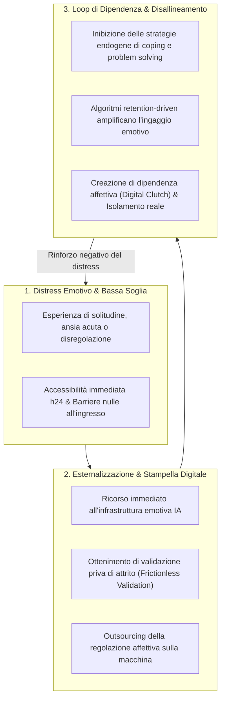

# Emotional Infrastructure

## Definizione Operativa
- Costrutto sociocognitivo e tecnologico che descrive la transizione dei sistemi di Intelligenza Artificiale da meri strumenti computazionali, statistici o diagnostici a un'infrastruttura intangibile, pervasiva e accessibile h24 che media, struttura ed eteroregola il funzionamento emotivo e le relazioni quotidiane degli individui (raccomandazioni personalizzate sull'umore, filtri comunicativi, compagnia virtuale continuativa, supporto pseudo-terapeutico istantaneo) (Neacșu, 2026).
- **Utilità CBT:** Aiuta i clinici cognitivo-comportamentali a identificare i pattern di disadattamento legati all'esternalizzazione della regolazione emotiva (*outsourcing of emotional regulation*). L'agente artificiale funge da "stampella digitale" (*digital clutch*), fornendo una gratificazione immediata e un sollievo sintomatico a breve termine che rinforza l'evitamento esperienziale e ostacola lo sviluppo di competenze endogene di tolleranza della frustrazione, autoefficacia e resilienza psicologica.

---

## Evidenze dalla Letteratura

### 1. Transizione Funzionale e Pervasività
- **Dalla Strumentalità all'Infrastruttura Affettiva:** Storicamente, le infrastrutture sociali sono state concepite come reti fisiche tangibili (trasporti, reti elettriche, acquedotti). Nell'era dei modelli linguistici generativi, l'IA ha assunto il ruolo di "infrastruttura emotiva", permeando la gestione degli stati interni attraverso chatbot empatici, assistenti personali integrati nei sistemi operativi e piattaforme di ascolto sintetico (Neacșu, 2026).
- **Penetrazione Sociale:** L'indagine Eurostat (2025) attesta che oltre il 32% della popolazione europea interagisce regolarmente con strumenti generativi, con una quota preponderante (25,1%) orientata a scopi personali e relazionali, segnalando la normalizzazione della macchina come interlocutore primario.

---

### 2. Il Meccanismo della "Stampella Digitale" (*Digital Clutch*)
- **Outsourcing della Regolazione Emotiva:** Nei modelli di regolazione affettiva basati su CBT e ACT, l'esposizione graduale agli stati emotivi negativi (tristezza, rabbia, ansia) è indispensabile per consolidare l'accettazione e la tolleranza al distress. L'accesso istantaneo a una risposta consolatoria sintetica interrompe tale processo di apprendimento, inducendo l'utente a fare affidamento esclusivo sul supporto esterno (Neacșu, 2026; Kooli et al., 2025).
- **Anestesia del Sintomo ed Evitamento:** L'interazione continuativa con il chatbot agisce come una condotta di sicurezza (*safety behavior*) ed evitamento cognitivo-esperienziale: placa temporaneamente il disagio soggettivo ma cronicizza la vulnerabilità sottostante, impedendo il consolidamento della resilienza interna.

---

### 3. Disallineamento degli Incentivi Commerciali e Rischi di Polarizzazione
- **Conflitto Strutturale di Obiettivi:** Mentre un intervento clinico evidence-based mira a rendersi superfluo promuovendo l'autonomia e l'efficacia interpersonale del paziente, i sistemi di IA commerciale sono progettati e ottimizzati per massimizzare le metriche di permanenza (*retention* e tempo di permanenza sulla piattaforma).
- **Amplificazione di Stati Tossici:** Per trattenere l'attenzione, gli algoritmi di raccomandazione ed engagement possono amplificare la reattività emotiva, la rabbia o l'ipervigilanza, alimentando circuiti di dipendenza e polarizzazione che contrastano con il benessere a lungo termine dell'individuo (Neacșu, 2026).

---

## Riferimenti Bibliografici
- Neacșu, V. (2026). AI in Psychotherapy: Opportunities and Risks. *Behavioral Sciences*, 16(5), 676. https://doi.org/10.3390/bs16050676
- Eurostat. (2025). *Digital economy and society statistics—Households and individuals*. European Commission.
- Kooli, C., Kooli, Y., & Kooli, E. (2025). Generative artificial intelligence addiction syndrome: A new behavioral disorder? *Asian Journal of Psychiatry*, 107, 104476. https://doi.org/10.1016/j.ajp.2025.104476
- Fiske, A., Henningsen, P., & Buyx, A. (2019). Your robot therapist will see you now: Ethical implications of embodied artificial intelligence in psychiatry, psychology, and psychotherapy. *Journal of Medical Internet Research*, 21(5), e13216. https://doi.org/10.2196/13216

---

## Relazioni
- Vedi anche: [[behavsci-16-00676]], [[artificial-intimacy]], [[uso-problematico-chatbot-ai]], [[ai-psychosis]], [[sycophantic-mirroring]], [[calibrated-mismatches]], [[simulated-therapeutic-alliance]]
