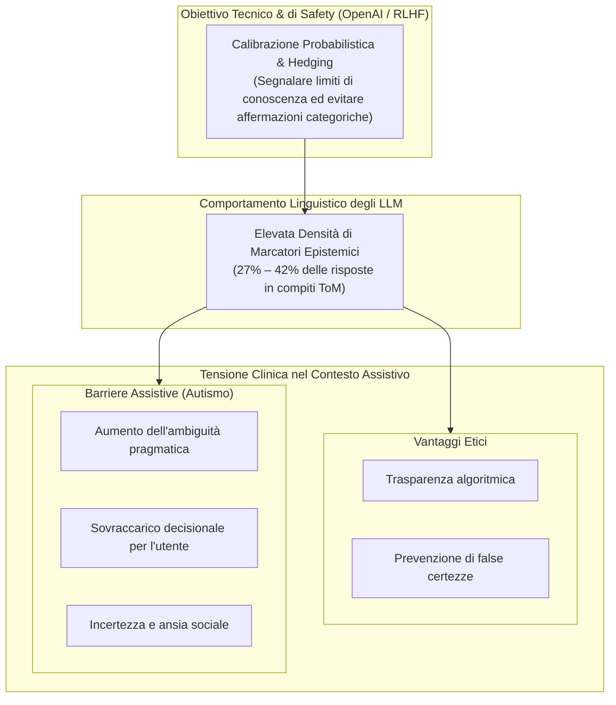

---
tags: [epistemic-markers, hedging, uncertainty-quantification, applied-tom, autism-spectrum, large-language-models, algorithmic-transparency, clinical-safety]
source_papers: ["2601.06032v1.pdf"]
---

# Marcatori Epistemici e Hedging nell'Intelligenza Artificiale (Epistemic Markers in AI)

## Definizione Operativa
- I **marcatori epistemici** (*epistemic markers* o *epistemic modalities*) e le strategie di cautela verbale (*hedging*) nell'Intelligenza Artificiale generativa rappresentano gli indicatori linguistici e sintattici (avverbi di probabilità come *"maybe"*, *"probably"*, *"possibly"*, *"vielleicht"*, *"wahrscheinlich"*, formule ipotetiche e forme verbali congiuntive/condizionali) attraverso cui un Large Language Model ([[large-language-models]]) esprime il proprio grado di certezza o incertezza probabilistica rispetto a un'affermazione o interpretazione sociale (Halliday, 1970; Holl-Etten et al., 2026).
- **Utilità Clinica e Assistiva:** Descrive il paradosso tra la trasparenza algoritmica (incoraggiata dai protocolli di allineamento e RLHF per evitare allucinazioni assertive o *overconfidence*) e le esigenze cliniche di utenti nello spettro autistico (*Autism Spectrum Condition*, ASC) o con deficit socio-comunicativi. Nei contesti assistivi, un eccesso di formulazioni ipotetiche o indecise trasferisce sull'utente l'onere cognitivo di discernere l'interpretazione corretta, rischiando di vanificare il supporto pratico nella decodifica delle interazioni quotidiane.

| Parametro di Analisi | Risposte Umane Neurotipiche | GPT-3.5 Turbo | GPT-4 |
| :--- | :---: | :---: | :---: |
| **Frequenza Media EpM (Faux Pas Test)** | Non misurata (bassa) | 29.8% (EN) – 34.6% (DE) | **35.9% (EN) – 41.7% (DE)** |
| **Frequenza Media EpM (Story Comprehension)** | **5.7% – 5.9%** | 14.2% (EN) – 50.0% (DE) | **30.0% (EN) – 27.1% (DE)** |
| **Fattori Trainanti** | Pragmatica ecologica umana spontanea | Limiti di comprensione e corpora minori | Policy di calibrazione e safety RLHF |
| **Impatto su Utenti Neurodivergenti** | Interazione naturale fluida | Rischio di disinformazione e incoerenza | **Sovraccarico cognitivo da iper-cautela** |

---

## Evidenze dalla Letteratura

### 1. La Discrepanza Quantitativa Uomo-Macchina
- Negli studi empirici sulla cognizione sociale applicata (Holl-Etten et al., 2026), emerge una marcata asimmetria tra la comunicazione umana e le risposte dei modelli linguistici:
  - Gli adolescenti e gli adulti neurotipici impiegano marcatori di incertezza solo nel **5.7% – 5.9%** delle spiegazioni sociali in compiti standardizzati (Vetter et al., 2013).
  - GPT-4 esibisce marcatori epistemici in circa **un terzo o più delle risposte** (27.1% – 41.7%), indipendentemente dall'effettiva accuratezza concettuale del compito.
  - GPT-3.5 Turbo raggiunge il **50.0%** di hedging nelle condizioni in lingua tedesca, riflettendo una combinazione di minore competenza sociale ed esitazione lessicale.

### 2. Cause Tecniche: Safety Training e Asimmetrie di Corpus
- **RLHF e Policy di Sicurezza:** Nelle generazioni recenti di modelli (GPT-4), l'incremento di marcatori epistemici è in parte indotto dalle direttive di OpenAI volte a segnalare all'utente che le risposte si basano su stime probabilistiche e non su certezze fattuali (Kalai et al., 2025; Lommel, 2024).
- **Effetto della Lingua di Input:** I prompt in tedesco generano un numero significativamente superiore di marcatori di incertezza rispetto all'inglese ($F(1,36) = 25.40, p < .001, \eta^2 = .23$). Questo fenomeno è attribuibile alla minore abbondanza di dati specifici nei corpora di pre-training non inglesi, che spinge il modello verso formulazioni più difensive o conservative (Zhou et al., 2024).

### 3. Il Paradosso Assistivo e Indicazioni per la Progettazione Clinica
- **Il Fabbisogno dell'Utente Autistico:** Le persone con disturbo dello spettro autistico traggono il massimo beneficio da interazioni strutturate, dirette, esplicite e univoche (Horstmann et al., 2022). Se un sistema di supporto sociale risponde proponendo ipotesi sfumate e dubitative (*"potrebbe essere che X intenda scherzare, oppure che si sia confuso..."*), l'utente si trova costretto a eseguire autonomamente la decodifica dell'ambiguità, azzerando il vantaggio assistivo dell'IA.
- **Linee Guida di Design per Assistenti Basati su IA:**
  1. *Architettura a Due Livelli:* Fornire una risposta principale chiara, assertiva e contestualmente calibrata, relegando le sfumature probabilistiche o le interpretazioni alternative a una sezione secondaria attivabile a richiesta.
  2. *Perspective-Taking Deterministico:* Utilizzare prompt strutturati che impongano all'agente di selezionare e spiegare l'intenzione più plausibile senza ricorrere a formule di indecisione superflue.
  3. *Adattamento al Profilo Utente:* Calibrare la densità di hedging in funzione delle preferenze e delle necessità cliniche specifiche del fruitore finale.

---

**Riferimenti Bibliografici:**
- Holl-Etten, A. K., Schnaderbeck, N., Kosareva, E., Prattke, L. A., Krüger, R., Warner, L. M., & Vetter, N. C. (2026). Applied Theory of Mind and Large Language Models – how good is ChatGPT at solving social vignettes? *arXiv preprint arXiv:2601.06032v1*, 1–40.
- Halliday, M. A. K. (1970). Functional diversity in language as seen from a consideration of modality and mood in English. *Foundations of Language*, 6(3), 322–361.
- Horstmann, A. C., Mühl, L., Köppen, L., Lindhaus, M., Storch, D., Bühren, M., et al. (2022). Important preliminary insights for designing successful communication between a robotic learning assistant and children with Autism spectrum disorder in Germany. *Robotics*, 11(6), 141.
- Kalai, A. T., Nachum, O., Vempala, S. S., & Zhang, E. (2025). Why language models hallucinate. *arXiv preprint arXiv:2509.04664*.
- Lommel, A. (2024). The rise of large language models informed by not so large corpora of training data. *Digital Translation*, 11(1), 73–84.
- Vetter, N. C., Leipold, K., Kliegel, M., Phillips, L. H., & Altgassen, M. (2013). Ongoing development of social cognition in adolescence. *Child Neuropsychology*, 19(6), 615–629.
- Zhou, K., Hwang, J. D., Ren, X., & Sap, M. (2024). Relying on the unreliable: The impact of language models’ reluctance to express uncertainty. *arXiv preprint arXiv:2401.06730*.

## Relazioni
- Vedi anche: [[2601-06032v1]], [[applied-theory-of-mind-llm]], [[large-language-models]], [[machine-psychology]], [[validita-psicometrica-llm]], [[ai-assisted-psychotherapy]], [[simulated-empathy-vs-authentic-presence]], [[modello-centauro-clinico]]
