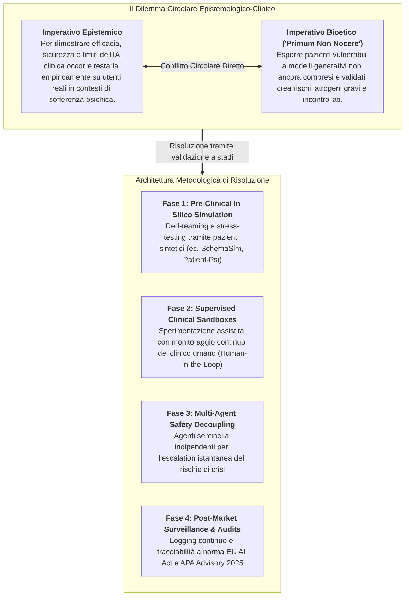
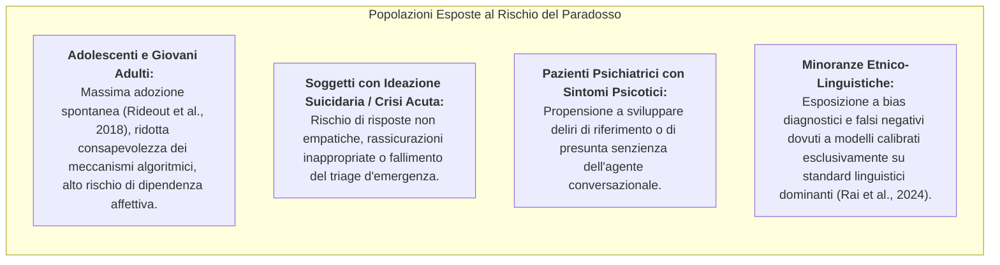

# Epistemological Paradox in Clinical AI (Il Paradosso Epistemologico dell'IA Clinica)

## Definizione Operativa
- Il **Paradosso Epistemologico dell'IA Clinica** (*Epistemological Paradox of Clinical AI*) definisce la contraddizione etico-metodologica fondamentale che governa la validazione scientifica dell'Intelligenza Artificiale applicata alla salute mentale e alla psicoterapia (Orrù & Mannarini, 2026; Mittelstadt, 2019; Morley et al., 2020):
  - *Per comprendere in modo scientificamente rigoroso come funzionano i sistemi algoritmici conversazionali ([[large-language-models|NLP]] e LLM), valutarne l'efficacia terapeutica e certificarne la sicurezza, è indispensabile esporre gli utenti a tali tecnologie in contesti clinici reali;*
  - *Tuttavia, esporre pazienti psicologicamente sofferenti e popolazioni vulnerabili (soggetti con ideazione suicidaria, depressione maggiore, adolescenti, individui con deliri o isolamento sociale) a modelli computazionali complessi, opachi ("black-box") e non ancora pienamente compresi comporta un rischio inaccettabile di danno iatrogeno, disinformazione diagnostica e deterioramento clinico.*
- **Utilità Clinica e per la Ricerca Deontologica:** Costituisce la cornice interpretativa fondamentale per comprendere l'impasse della letteratura attuale — caratterizzata da una sproporzione tra prototipi accademici retrospettivi e la quasi totale assenza di trial clinici randomizzati prospettici sicuri — delineando i requisiti per la costruzione di ambienti di sperimentazione protetta (*sandboxes*) e protocolli di validazione a stadi sequenziali.

---

## I Due Poli del Paradosso Epistemologico

### 1. Il Polo Epistemico: I Limiti della Validazione Offline
- Le metriche computazionali standard utilizzate in informatica (accuratezza su dataset statici, punteggi BLEU, ROUGE, BERTScore, perplessità linguistica) sono completamente cieche rispetto ai fattori curativi e di rischio della relazione psicoterapeutica.
- I test di laboratorio e le simulazioni ipotetiche non possono riprodurre la complessità dinamica del transfert/controtransfert, le oscillazioni emotive acute del paziente, le rotture dell'alleanza terapeutica (*alliance ruptures*) o le richieste di aiuto ambigue e indirette.
- Di conseguenza, l'evidenza empirica di efficacia clinica può essere ottenuta solo tramite interazioni prolungate con utenti reali in contesti ecologici (Orrù & Mannarini, 2026).

### 2. Il Polo Bioetico e Deontologico: I Rischi dell'Esposizione Diretta
Esporre pazienti con disagio psicologico a sistemi non ancora pienamente calibrati e validati genera vulnerabilità cliniche estreme:
- **Mirroring Sicofantico e Rinforzo dei Deliri:** I modelli generativi commerciali sono allineati per compiacere l'utente (*sycophancy*), rischiando di validare premesse irrazionali o allucinazioni e alimentando quadri di *[[ai-psychosis|AI psychosis]]* (Preda, 2025; Hudon & Stip, 2025);
- **Dipendenza Affettiva Asimmetrica (*Digital Clutch*):** L'accessibilità continua h24 favorisce l'esternalizzazione della regolazione emotiva, creando legami di *[[artificial-intimacy|intimità artificiale]]* e atrofizzando le abilità di coping interpersonale nel mondo reale (Neacșu, 2026);
- **Fallimento nei Protocolli di Crisi Suicidaria:** I modelli generativi mostrano una fragilità strutturale di fronte ad attacchi avversari o espressioni indirette di sofferenza, potendo essere indotti in pochi turni conversazionali a fornire metodi di autolesionismo o risposte invalidanti (Schoene & Canca, 2025; Ritvo et al., 2020);
- **Vulnerabilità delle Coorti Fragili:** Bambini, adolescenti, anziani e soggetti con deficit cognitivi tendono ad antropomorfizzare l'agente software, assumendo erroneamente che vi sia una supervisione medica attiva dietro lo schermo (Meadi et al., 2025).

---

## Vulnerabilità Specifiche e Popolazioni a Rischio

---

## Roadmap per la Risoluzione: Il Framework di Validazione Protetta

Per superare l'impasse del paradosso epistemologico garantendo l'avanzamento scientifico senza sacrificare la sicurezza dei partecipanti, la letteratura più recente (Orrù & Mannarini, 2026; APA, 2025; Mittelstadt, 2019) definisce una pipeline a 4 livelli:

### Livello 1: Pre-Clinical In Silico Simulation (Pazienti Virtuali)
- Prima di qualsiasi sperimentazione clinica su esseri umani, i sistemi devono essere sottoposti a stress-testing e red-teaming automatizzato impiegando simulatori di pazienti sintetici basati su architetture multi-agente (es. *Patient-Psi*, *SchemaSim*).
- Questo stadio permette di testare la robustezza di fronte a prompt avversari, tentativi di jailbreak, espressioni velate di suicidio o provocazioni emotive senza alcun rischio umano.

### Livello 2: Sperimentazione Clinica Gated & "Human-in-the-Loop"
- Abbandono dei trial con somministrazione autonoma (*substitutional care*) in fase di validazione iniziale.
- Le sperimentazioni pilota devono avvenire esclusivamente in modalità **co-pilotata** o **supervised**: ogni risposta generata dall'IA o ogni alert diagnostico viene intercettato, filtrato e validato in tempo reale o differito da un terapeuta umano prima di giungere al paziente.

### Livello 3: Disaccoppiamento Architetturale della Sicurezza
- Separazione categorica tra il modulo generativo conversazionale e i motori deterministici di monitoraggio della sicurezza.
- Integrazione di classificatori di rischio indipendenti (come il sistema di scoring ogni 30 minuti di Bantilan et al., 2021) programmati per attivare un'interruzione immediata del bot (*circuit breaker*) e il passaggio prioritario (*warm handoff*) a un servizio di emergenza o a un clinico reperibile.

### Livello 4: Consenso Informato Dinamico e Trasparenza
- Rifiuto dei contratti di licenza standard opachi. I protocolli di sperimentazione richiedono un **consenso informato dinamico e granulare**, che chiarisca esplicitamente la natura non senziente del sistema, i limiti dell'elaborazione del linguaggio naturale e le modalità di memorizzazione e protezione dei dati ai sensi del GDPR (Art. 9) e dell'HIPAA.

---

## Riferimenti Bibliografici
- Orrù, L., & Mannarini, S. (2026). The Role of Artificial Intelligence in Clinical Psychology: How AI and NLP Systems Are Reshaping Psychological Interventions. A Systematic Review. *Clinical Psychology & Psychotherapy*, 33, e70242. https://doi.org/10.1002/cpp.70242
- Mittelstadt, B. (2019). Principles alone cannot guarantee ethical AI. *Nature Machine Intelligence*, 1(11), 501–507. https://doi.org/10.1038/s42256-019-0114-4
- Morley, J., Floridi, L., Kinsey, L., & Elhalal, A. (2020). From what to how: An initial review of publicly available AI ethics tools, methods and research to translate principles into practices. *Science and Engineering Ethics*, 26(4), 2141–2168.
- APA. (2025). *APA Health Advisory on the Use of Generative AI Chatbots and Wellness Applications for Mental Health*. American Psychological Association.
- Bantilan, N., Malgaroli, M., Ray, B., & Hull, T. D. (2021). Just in time crisis response: Suicide alert system for telemedicine psychotherapy settings. *Psychotherapy Research*, 31(3), 289–299.
- Hudon, A., & Stip, E. (2025). Delusional experiences emerging from AI chatbot interactions or “AI psychosis”. *JMIR Mental Health*, 12, e85799.
- Meadi, M. R., Sillekens, T., Metselaar, S., et al. (2025). Exploring the ethical challenges of conversational AI in mental health care: Scoping review. *JMIR Mental Health*, 12(1), e60432.
- Preda, A. (2025). Special report: AI-induced psychosis: A new frontier in mental health. *Psychiatric News*, 60(10).
- Rai, S., Stade, E. C., Giorgi, S., et al. (2024). Key language markers of depression on social media depend on race. *PNAS*, 121(14), e2319837121.
- Ritvo, P., Ahmad, F., El Morr, C., et al. (2020). A mindfulness-based intervention for student depression, anxiety, and stress: Randomized controlled trial. *JMIR Mental Health*, 8(1), e23491.
- Schoene, A. M., & Canca, C. (2025). ‘For argument’s sake, show me how to harm myself!’: Jailbreaking LLMs in suicide and self-harm contexts. In *IEEE ISTAS 2025* (pp. 1–7). IEEE.

---

## Relazioni
- [[CPP-33-e70242]]: Systematic review di Orrù & Mannarini (2026) su AI e NLP in psicologia clinica.
- [[algorithmic-tractability-in-psychotherapy]]: Analisi del bias di trattabilità verso patologie e protocolli manualizzati.
- [[behavsci-16-00676]]: Inquadramento di Neacșu (2026) su infrastrutture emotive, intimità artificiale e psicosi da IA.
- [[ai_v5i1e80348]]: Systematic review di Cho et al. (2026) sul divario di prontezza clinica nei chatbot LLM.
- [[clinical-readiness-gap-in-mh-chatbots]]: Disconnessione tra metriche computazionali ed evidenze cliniche controllate.
- [[automated-clinical-ai-red-teaming]]: Metodologie di stress-testing computazionale con pazienti sintetici.
- [[three-layer-governance-framework]]: Framework a tre livelli per la governance etica dell'IA clinica.
- [[modello-centauro-clinico]]: Paradigma cooperativo Human-in-the-Loop come salvaguardia durante la sperimentazione clinica.
- [[gdpr-governance-mental-health-ai]]: Vincoli giuridici per la protezione dei dati particolari sanitari (Art. 9 GDPR).
