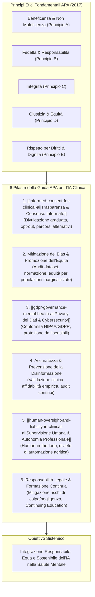
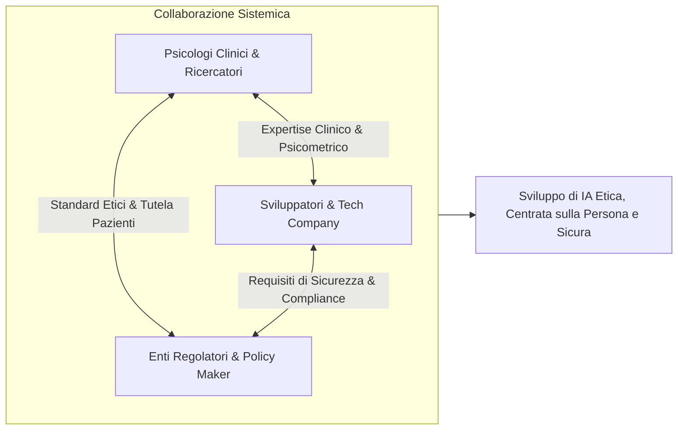

---
tags: [apa, ethics, clinical-psychology, health-service-psychology, informed-consent, bias-mitigation, data-privacy, human-in-the-loop, liability, continuing-education, ai-governance]
source_papers: ["ethical-guidance-professional-practice (1).pdf"]
---

# Ethical Guidance for AI in the Professional Practice of Health Service Psychology (APA, 2025)

## Definizione Operativa
- Documento di indirizzo etico e deontologico formulato dal **Mental Health Technology Advisory Committee (MHTAC)** dell'**American Psychological Association (APA)** e formalmente adottato dall'**APA Ethics Committee** (pubblicato nel giugno 2025, aggiornato a luglio 2025).
- **Finalità ed Inquadramento:** Delinea le linee guida fondamentali per orientare i professionisti della salute psicologica (*health service psychologists*) nell'adozione, integrazione e supervisione degli strumenti di Intelligenza Artificiale (IA) nei contesti clinici, assistenziali e organizzativi.
- **Principio Cardine:** L'IA deve operare esclusivamente come strumento di **potenziamento decisionale (*augmentation*)** e mai come sostituto del giudizio professionale umano (*replacement*). La responsabilità clinica, legale ed etica rimane interamente a carico del professionista umano.
- **Ancoraggio Deontologico:** Si fonda sui principi etici generali del *Codice di Condotta APA (2017)*:
  1. *Beneficenza e Non Maleficenza (Principio A)*
  2. *Fedeltà e Responsabilità (Principio B)*
  3. *Integrità (Principio C)*
  4. *Giustizia (Principio D)*
  5. *Rispetto per i Diritti e la Dignità delle Persone (Principio E)*

---

## I 6 Pilastri di Indirizzo Etico

### 1. Trasparenza e Consenso Informato (*Transparency & Informed Consent*)
- **Dovere di Trasparenza Multidirezionale:** L'impiego di strumenti di IA deve essere comunicato in modo trasparente e comprensibile a tutte le parti rilevanti: pazienti/clienti diretti, colleghi e team sanitari curanti, e terze parti istituzionali (es. tribunali o perizie medico-legali).
- **Divulgazione Graduata (*Proportional Disclosure*):**
  - *Usi Sottili/Accessori:* Applicazioni a basso impatto decisionale (es. completamento predittivo per la stesura delle note di seduta) richiedono una disclosure minima.
  - *Usi Sostanziali/Critici:* Interventi in cui l'IA incide sul triage, sulla formulazione diagnostica o sulla determinazione del piano terapeutico richiedono un approfondito confronto esplicito con il paziente, specificando lo strumento utilizzato, i meccanismi e i dati coinvolti.
- **Integrazione nel Modulo di Consenso Informato:** I professionisti devono esplicitare nei documenti di consenso informato *quando*, *come* e *quali* strumenti di IA vengono utilizzati nel percorso di cura.
- **Diritto di Recesso (*Opt-Out*) e Percorsi Terapeutici Alternativi:**
  - Il paziente mantiene il diritto incondizionato di rifiutare interventi guidati dall'IA.
  - Il clinico ha l'obbligo di illustrare percorsi alternativi praticabili (es. presa in carico tradizionale non mediata da IA con lo stesso terapeuta, permanenza in lista d'attesa, invio a un altro professionista), analizzando congiuntamente pro e contro.
- **Canale di Contatto per Chiarimenti:** Indicazione chiara di chi contattare per sollevare dubbi o ritirare il consenso all'uso dell'IA in qualsiasi momento.

---

### 2. Mitigazione dei Bias e Promozione dell'Equità (*Mitigating Bias & Promoting Equity*)
- **Prevenzione dell'Amplificazione delle Disparità:** I sistemi di IA non devono replicare né esacerbare le disuguaglianze sistemiche di accesso ed esito nella salute mentale (Principio E).
- **Valutazione della Normazione e dei Dati di Addestramento:**
  - I clinici devono verificare criticamente su quali popolazioni i modelli sono stati addestrati e normati, accertando l'inclusione di esperienze di vita eterogenee, minoranze etniche, culturali e di genere.
  - Evitare strumenti che rinforzano stereotipi patologizzanti o discriminazioni sistematiche.
- **Ruolo Attivo nella Co-Costruzione di Dataset:** La comunità psicologica è esortata a partecipare direttamente alla creazione di dataset sanitari rappresentativi e di alta qualità, supportando le infrastrutture sanitarie di contesti e regioni sotto-rappresentate affinché beneficino equamente dell'innovazione tecnologica.

---

### 3. Privacy dei Dati e Sicurezza Cibernetica (*Data Privacy & Security*)
- **Natura Ipersensibile dei Dati Comportamentali:** Le informazioni psicologiche e psichiatriche richiedono i massimi standard di riservatezza e sicurezza informatica, allineandosi ai principi di Beneficenza, Fedeltà e Rispetto della Dignità.
- **Conformità Normativa Rigorosa:** Obbligo di verificare la piena conformità delle piattaforme adottate con le normative vigenti in materia di dati sanitari (es. **HIPAA** negli USA, **GDPR** nell'Unione Europea).
- **Comprensione del Ciclo di Vita del Dato:** I professionisti devono comprendere le modalità di archiviazione, elaborazione, eventuale de-identificazione e condivisione dei dati dei pazienti con server terzi o fornitori cloud.
- **Sospensione Immediata per Vulnerabilità:** In caso di violazioni di sicurezza (*data breach*) o rischi per la confidenzialità, il professionista è tenuto a sospendere o dismettere l'utilizzo dello strumento.

---

### 4. Accuratezza e Rischio di Disinformazione (*Accuracy & Misinformation Risks*)
- **Validazione Empirica Prima dell'Implementazione:** L'integrazione di tool di IA deve poggiare su rigorose evidenze scientifiche e validazioni indipendenti condotte da esperti del settore sanitario.
- **Trasparenza dei Fornitori:** I clinici devono privilegiare sistemi i cui sviluppatori rendano pubblici e verificabili i dati di addestramento, i protocolli di test, le metriche di affidabilità e i tassi di allucinazione/errore.
- **Auditing Continuo delle Performance:** Adozione di strumenti che consentano il monitoraggio e l'auditing periodico delle performance cliniche per prevenire derive semantiche o cali di accuratezza.
- **Principio di Integrità Deontologica:** Qualora emergano errori sistematici, disinformazione o consigli clinicamente scorretti, il professionista ha l'obbligo etico di interrompere tempestivamente l'uso del sistema.

---

### 5. Supervisione Umana e Autonomia Professionale (*Human Oversight & Professional Judgment*)
- **Centralità del Paradigma Human-in-the-Loop:**
  - L'IA deve rimanere subordinata al ragionamento clinico umano.
  - È fatto espresso divieto di affidarsi ciecamente (*blind reliance*) agli output algoritmici.
- **Punti di Intervento Umano nei Flussi di Lavoro:** Definizione di checkpoint formali in cui il professionista esamina criticamente, approva, modifica o respinge le raccomandazioni generate dall'IA.
- **Autonomia Decisionale del Clinico:** Il terapeuta mantiene la piena autonomia di giudizio, fondata sulla letteratura scientifica, sulle linee guida di pratica clinica e sulla specificità del singolo paziente.
- **Competenza Tecnologica Obbligatoria:** I clinici hanno il dovere deontologico di acquisire e mantenere un'adeguata competenza operativa e concettuale sugli strumenti di IA che scelgono di impiegare.

---

### 6. Responsabilità Legale e Deontologica (*Liability & Ethical Responsibility*)
- **Non Delegabilità della Responsabilità:** L'impiego dell'IA non esonera il professionista dalla responsabilità per errori diagnostici, prescrizioni inappropriate o danni al paziente.
- **Rischio di Affidamento Negligente (*Negligent Reliance*):** L'utilizzo negligente di strumenti non validati o la mancata supervisione umana dei processi automatizzati espone il clinico a gravi profili di colpa professionale e contenzioso medico-legale.
- **Trasparenza e Competenza come Presidi Protettivi:** La trasparenza con il paziente e la padronanza metodologica costituiscono i pilastri primari per la gestione dei rischi legali.
- **Dovere di Formazione Continua (*Continuing Education - CE*):** I professionisti della salute mentale devono partecipare attivamente a percorsi di aggiornamento professionale continuo sull'evoluzione dell'IA applicata alla psicologia clinica.

---

## Implicazioni Sistemiche e Ruolo della Professione

1. **Partecipazione Interdisciplinare Attiva:** Gli psicologi non possono rimanere spettatori passivi dell'innovazione tecnologica. È essenziale collaborare attivamente con ingegneri, data scientist e organizzazioni di standardizzazione per evitare che decisioni cruciali sulla salute mentale siano prese senza adeguate competenze psicologiche.
2. **Bilanciamento tra Innovazione e Responsabilità:** Preservare la fiducia pubblica nella professione psicologica richiede di bilanciare le opportunità di efficienza e accessibilità offerte dall'IA con un rigoroso rispetto della deontologia e della sicurezza del paziente.

---

## Riferimenti Bibliografici
- American Psychological Association [APA] - Mental Health Technology Advisory Committee [MHTAC]. (2025). *Ethical Guidance for AI in the Professional Practice of Health Service Psychology*. Washington, D.C.: American Psychological Association.
- American Psychological Association [APA]. (2017). *Ethical Principles of Psychologists and Code of Conduct* (con emendamenti 2010 e 2016). Washington, D.C.: American Psychological Association.
- American Psychological Association [APA] Ethics Committee. (2024). *Frequently Asked Questions Regarding Ethical Issues related to the Use of Artificial Intelligence and Social Media in Psychology*. Washington, D.C.: APA.
- APA Office of Health Care Innovation. (2025). *Readiness Evaluation for AI-Mental Health Deployment and Implementation (READI)*. American Psychological Association.

---

## Relazioni
- Vedi anche: [[informed-consent-for-clinical-ai]], [[human-oversight-and-liability-in-clinical-ai]], [[gdpr-governance-mental-health-ai]], [[three-layer-governance-framework]], [[algorithmic-paternalism-in-ai-mental-health]], [[human-in-the-reasoning]], [[audit-bias-llm-clinici]], [[modello-centauro-clinico]], [[software-as-a-medical-device-salute-mentale]], [[ai-research-ethics]], [[five-axis-clinical-evaluation]]