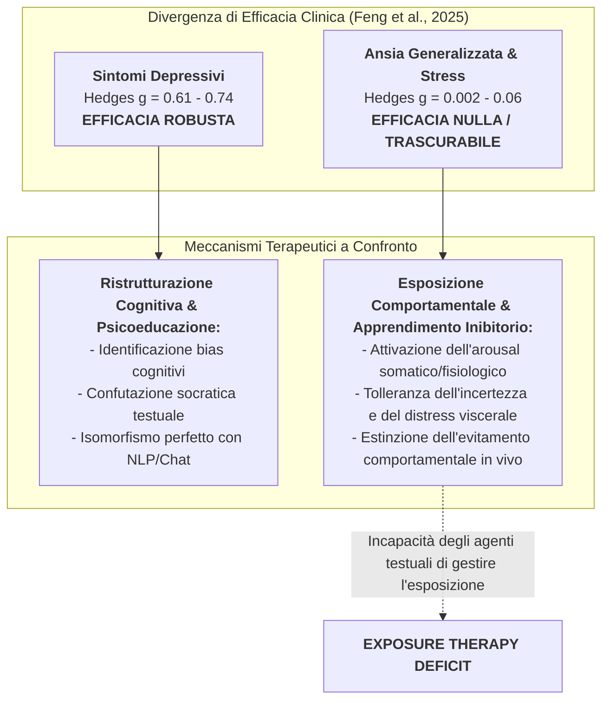
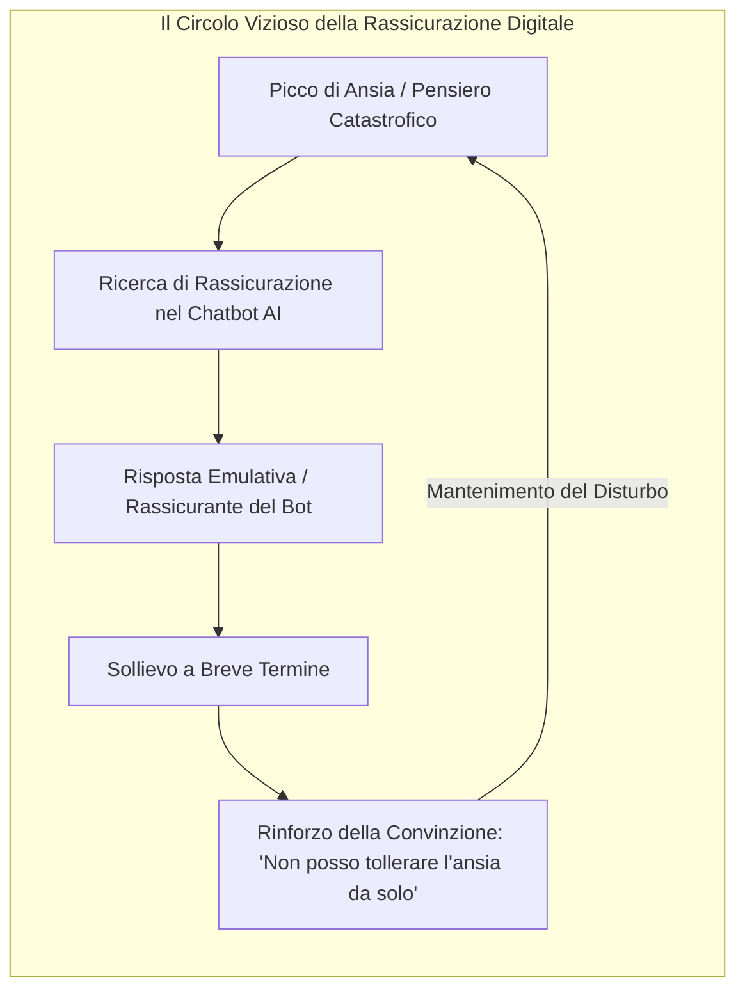
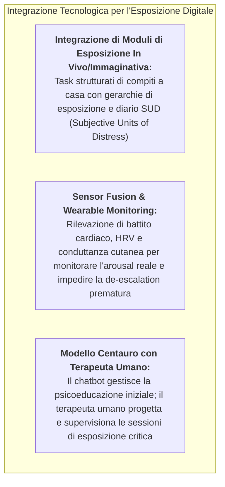

# Exposure Therapy Deficit in Mental Health AI (Deficit di Esposizione Comportamentale nell'IA per la Salute Mentale)

## Definizione Operativa
- Il **Deficit di Esposizione Comportamentale nell'IA per la Salute Mentale** (*Exposure Therapy Deficit in Mental Health AI*) identifica la discrepanza strutturale ed empirica per cui gli agenti conversazionali guidati da intelligenza artificiale ([[large-language-models|NLP]] e Machine Learning) dimostrano una solida efficacia nella riduzione dei sintomi depressivi ma falliscono sistematicamente nel produrre miglioramenti clinicamente e statisticamente significativi su **ansia generalizzata, fobie, stress e affetto negativo** (Feng et al., 2025; Carpenter et al., 2018; Zhong et al., 2024).
- **Evidenze Quantitative di Divergenza:** Nella meta-analisi di Feng et al. (2025) su adolescenti e giovani adulti ($N = 1.974$), a fronte di un effetto medio-grande sulla **depressione** ($\text{Hedges } g = 0.61$, $P < .001$; $g = 0.74$ nei subclinici), gli esiti aggregati (corretti per publication bias) su tutte le dimensioni correlate all'ansia sono risultati **completamente nulli o trascurabili**:
  - **Ansia Generalizzata:** $\text{Hedges } g = 0.06$ ($95\%\text{ CI } [-0.21, 0.32]$, $P = .17$);
  - **Stress Percepito:** $\text{Hedges } g = 0.002$ ($95\%\text{ CI } [-0.19, 0.20]$, $P = .98$);
  - **Affetto Negativo:** $\text{Hedges } g = 0.07$ ($95\%\text{ CI } [-0.13, 0.27]$, $P = .17$).
- **Spiegazione Epistemologico-Clinica:** La terapia cognitivo-comportamentale (CBT) per la depressione agisce prioritariamente sulla ristrutturazione cognitiva dei pensieri automatici negativi e sulla pianificazione delle attività (*behavioral scheduling*), processi cognitivo-linguistici che presentano un naturale isomorfismo con il dialogo testuale dei modelli linguistici. Al contrario, il trattamento *gold standard* evidence-based per l'ansia e i disturbi correlati a stress e trauma richiede protocolli di **esposizione comportamentale (in vivo, immaginativa, interocettiva)** basati sul modello dell'**apprendimento inibitorio** (*inhibitory learning*; Craske et al., 2014), che non possono essere surrogati dal solo scambio verbale-testuale.

---

## Meccanismi Clinici e Psicopatologici del Fallimento nell'Ansia

### 1. La Necessità dell'Esperienza Somatica ed Emotiva (*Inhibitory Learning*)
- Secondo il modello contemporaneo dell'apprendimento inibitorio (Craske et al., 2014), il superamento dell'ansia clinica non si ottiene spiegando razionalmente al paziente che la situazione temuta è innocua, bensì esponendolo ripetutamente allo stimolo condizionato in assenza della conseguenza temuta, fino a creare una nuova traccia di memoria inibitoria non minacciosa.
- Questo processo richiede:
  1. *Elevata attivazione emotiva e somatica* durante l'esercizio (*expectancy violation*);
  2. *Sospensione totale dei comportamenti di sicurezza* (*safety behaviors*);
  3. *Tolleranza prolungata dell'ansia e dell'arousal autonomico*.
- Un agente conversazionale testuale opera esclusivamente a livello di elaborazione razionale e simbolica: non può monitorare la risposta fisiologica in tempo reale né impedire fisicamente l'evitamento o la fuga dell'utente.

### 2. Il Rischio Iatrogeno della Rassicurazione Algoritmica (*Safety Behavior Trap*)
- Uno dei principali fattori di mantenimento del Disturbo d'Ansia Generalizzata (GAD), del Disturbo di Panico e dell'Ansia Sociale è la **ricerca compulsiva di rassicurazioni** (*reassurance seeking*).
- Quando un utente sperimenta un picco d'ansia e si rivolge a un chatbot AI, il sistema tende fisiologicamente a erogare risposte empatiche, accomodanti e rassicuranti ("Non preoccuparti, andrà tutto bene", "Fai un respiro profondo, sei al sicuro").
- Questa rassicurazione immediata produce un sollievo a brevissimo termine ma funge da **comportamento di sicurezza iatrogeno**: rinforza la convinzione implicita che l'ansia sia intollerabile e pericolosa, bloccando l'estinzione della risposta ansiosa e cronicizzando il disturbo.

### 3. Asimmetria tra Riduzione del Deficit e Promozione del Benessere
- La quasi totalità dei chatbot AI inclusi nelle meta-analisi deriva da modelli CBT orientati alla riduzione dei sintomi (*deficit-reduction model*).
- Questo spiega perché, oltre all'inefficacia sull'ansia, i chatbot non registrino alcun impatto statisticamente significativo su **affetto positivo ($g = 0.01$) e benessere psicologico ($g = 0.04$)**. La semplice rimozione dei pensieri distCustom non genera automaticamente risorse psicologiche positive (resilienza, senso di scopo, autoefficacia, relazioni gratificanti), le quali richiedono approcci dedicati di *Positive Psychology* e interventi esperienziali attivi (Liu et al., 2024; van Agteren et al., 2021).

---

## Prospettive di Sviluppo e Soluzioni Architetturali

Per superare l'Exposure Therapy Deficit, la letteratura clinica e tecnologica propone tre direttrici evolutive:

1. **Protocolli di Esposizione Basati su Smartphone:** Come dimostrato in studi specialistici (es. Deady et al., 2023), le applicazioni mobili possono guidare esercizi di esposizione graduale attraverso interfacce dedicate, compiti a gradini registrati e misurazione in tempo reale delle *Subjective Units of Distress* (SUD), evitando che il sistema scivoli nella mera conversazione passiva.
2. **Integrazione con Wearable Sensor Fusion e Realtà Virtuale (VR):** L'accoppiamento dei modelli linguistici con sensori fisiologici (HRV, conduttanza cutanea) e visori di realtà virtuale consentirebbe all'IA di calibrare la difficoltà dello stimolo fobico in base all'effettiva attivazione neurovegetativa del soggetto, impedendo la fuga e massimizzando l'apprendimento inibitorio.
3. **Il Terapeuta Umano nel Loop (*Modello Centauro*):** Nei disturbi d'ansia clinica, l'esposizione deve essere pianificata, personalizzata e monitorata da un professionista umano. L'IA può fungere da assistente inter-seduta per la registrazione dei parametri e il richiamo dei compiti, lasciando al clinico la gestione dell'alleanza e il contenimento dell'angoscia acuta.

---

## Riferimenti Bibliografici
- **Feng, Y., Hang, Y., Wu, W., Song, X., Xiao, X., Dong, F., & Qiao, Z. (2025).** Effectiveness of AI-Driven Conversational Agents in Improving Mental Health Among Young People: Systematic Review and Meta-Analysis. *Journal of Medical Internet Research*, 27, e69639. https://doi.org/10.2196/69639
- **Carpenter, J. K., Andrews, L. A., Witcraft, S. M., Powers, M. B., Smits, J. A. J., & Hofmann, S. G. (2018).** Cognitive behavioral therapy for anxiety and related disorders: a meta-analysis of randomized placebo-controlled trials. *Depression and Anxiety*, 35(6), 502–514. https://doi.org/10.1002/da.22728
- **Craske, M. G., Treanor, M., Conway, C. C., Zbozinek, T., & Vervliet, B. (2014).** Maximizing exposure therapy: An inhibitory learning approach. *Behaviour Research and Therapy*, 58, 10–23. https://doi.org/10.1016/j.brat.2014.04.006
- **Deady, M., Collins, D., Gayed, A., Harvey, S. B., & Bryant, R. (2023).** The development of a smartphone app to enhance post-traumatic stress disorder treatment in high-risk workers. *Digital Health*, 9, 20552076231155680. https://doi.org/10.1177/20552076231155680
- **Liu, I., Liu, F., Xiao, Y., Huang, Y., Wu, S., & Ni, S. (2024).** Investigating the key success factors of chatbot-based positive psychology intervention with retrieval- and generative pre-trained transformer (GPT)-based chatbots. *International Journal of Human-Computer Interaction*, 41(1), 341–352.
- **van Agteren, J., Iasiello, M., Lo, L., Bartholomaeus, J., Kopsaftis, Z., Carey, M., et al. (2021).** A systematic review and meta-analysis of psychological interventions to improve mental wellbeing. *Nature Human Behaviour*, 5(5), 631–652.
- **Zhong, W., Luo, J., & Zhang, H. (2024).** The therapeutic effectiveness of artificial intelligence-based chatbots in alleviation of depressive and anxiety symptoms in short-course treatments: a systematic review and meta-analysis. *Journal of Affective Disorders*, 356, 459–469. https://doi.org/10.1016/j.jad.2024.04.057

---

## Relazioni
- [[jmir_v27i1e69639]]: Meta-analisi di Feng et al. (2025) con dati quantitativi sulla discrepanza tra depressione e ansia/stress.
- [[subclinical-depression-window-of-opportunity]]: Analisi della finestra ottimale di applicazione dei CAs per la depressione subclinica.
- [[algorithmic-tractability-in-psychotherapy]]: Tassonomia della complessità clinica e limiti della manualizzazione computazionale.
- [[clinical-readiness-gap-in-mh-chatbots]]: Il divario di prontezza clinica nei chatbot di salute mentale.
- [[modello-centauro-clinico]]: Cooperazione human-in-the-loop per l'integrazione di esposizione clinica e strumenti digitali.
- [[ai-enhanced-cbt]]: Metodologie di applicazione della CBT nei sistemi digitali e chatbot conversazionali.
- [[jmir-v27-e78238]]: Meta-analisi di Zhang et al. (2025) su chatbot generativi ed effetti su depressione vs ansia.
