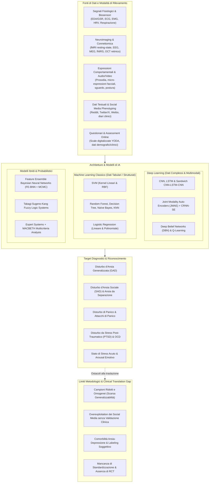
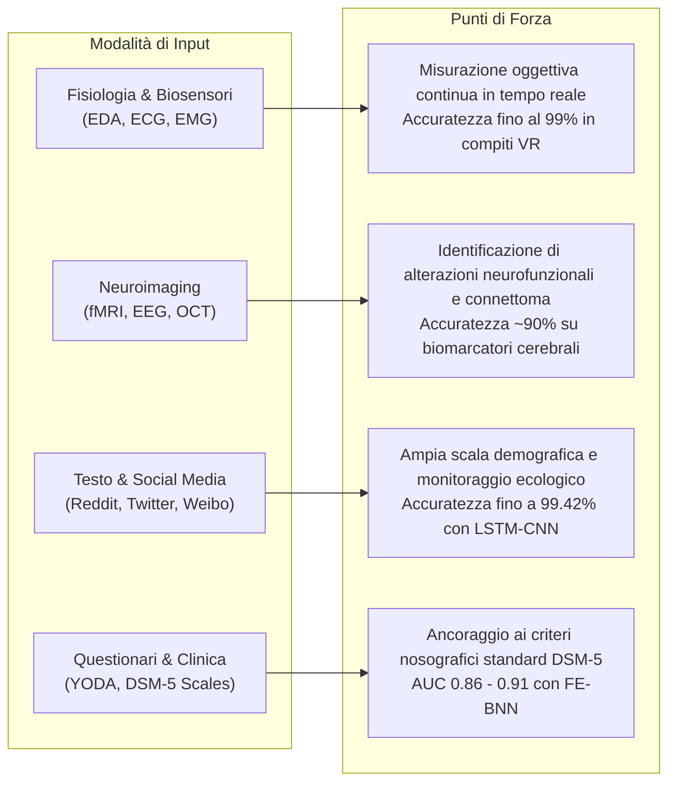
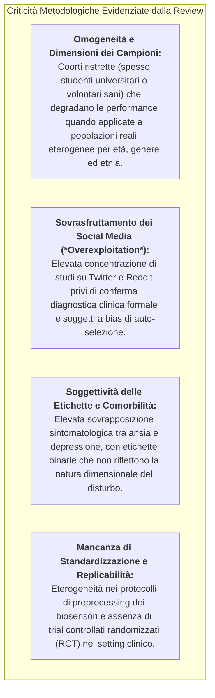

# Artificial Intelligence Techniques Applied to Anxiety Disorders Recognition: A Systematic Review (Degante-Aguilar et al., 2025)

## Definizione Operativa
- Revisione sistematica condotta secondo le linee guida **PRISMA 2020** e registrata su **PROSPERO (CRD420251026205)** da Edgar Degante-Aguilar, Roberto Angel Melendez-Armenta, Giovanni Luna-Chontal e Francisco Javier Fernandez-Dominguez (*Affective Computing and Educational Innovation Laboratory, Tecnológico Nacional de México*, Misantla, Veracruz; pubblicata su *Frontiers in Digital Health*, 2025, doi: 10.3389/fdgth.2025.1646724).
- **Inquadramento dello Studio:** Analizza in modo esaustivo 119 studi peer-reviewed (2019–2024) selezionati da *IEEE Xplore*, *PubMed*, *ScienceDirect* e *SpringerLink*, strutturati attorno al modello **PICO** per rispondere a due quesiti cardinali: (RQ1) quali architetture di Intelligenza Artificiale offrono le prestazioni più elevate nel riconoscere i disturbi d'ansia in popolazioni eterogenee, e (RQ2) quali metodologie e flussi di dati sono stati adottati per il training e la validazione empirica.
- **Utilità Clinica e CBT:** Mappa l'intero panorama della diagnostica computazionale per i disturbi d'ansia (Disturbo d'Ansia Generalizzata - GAD, Fobia Sociale / SAD, Disturbo di Panico, Ansia da Separazione, Disturbo Ossessivo-Compulsivo - OCD, Disturbo da Stress Post-Traumatico - PTSD), confrontando l'efficacia predittiva di biosensori fisiologici multimodali (EDA, ECG, EMG, HRV), neuroimaging funzionale (fMRI, EEG, fNIRS, OCT), natural language processing (NLP) e modelli ibridi rispetto ai test psicometrici tradizionali (BAI, BDI).

---

## Evidenze dalla Letteratura

### 1. Metodologia di Revisione Sistematica e Modello PICO
- **Protocollo di Selezione PRISMA:** Da un bacino iniziale di 293 studi identificati tramite stringhe di ricerca avanzate su quattro database accademici (IEEE Xplore, PubMed, ScienceDirect, SpringerLink) per il periodo gennaio 2019 – settembre 2024, sono stati rimossi 16 duplicati e 37 record non pertinenti tramite screening iniziale. Dei 256 report valutati a testo pieno, 119 studi hanno soddisfatto tutti i criteri di inclusione quantitativa e metodologica (escludendo studi puramente qualitativi, studi su modelli animali o privi di metriche di performance).
- **Articolazione PICO:**
  - *Popolazione (P):* Individui con diagnosi clinica accertata o sospetto di disturbo d'ansia;
  - *Intervento (I):* Applicazione di tecniche di Intelligenza Artificiale (ML, DL, NLP, computer vision);
  - *Comparatore (C):* Confronto tra diversi algoritmi di IA o tra modelli computazionali e strumenti diagnostici psicometrici tradizionali;
  - *Outcome (O):* Metriche oggettive di performance diagnostica (Accuracy, Sensibilità, Specificità, F1-score, Area Under Curve - AUC).
- **Distribuzione Geografica della Ricerca:** La produzione scientifica nell'ambito dell'IA applicata all'ansia è fortemente polarizzata:
  - **Cina (35 studi):** Focus su Deep Learning, NLP per il riconoscimento emotivo su Weibo, DNN per immagini e segnali fisiologici;
  - **Stati Uniti (22 studi):** Focus su neuroimaging (fMRI, MEG), social media mining e integrazione di cartelle cliniche elettroniche;
  - **India (17 studi):** Fusione gerarchica di feature multimodali e stress detection;
  - **Altri Paesi di Rilievo:** Olanda (9 studi, neuroimaging/NESDA cohort), Australia (7 studi), Regno Unito (6 studi), Brasile (6 studi), Canada (6 studi), Israele (4 studi), Arabia Saudita (4 studi), Pakistan (4 studi), Italia (3 studi), Spagna (3 studi), Norvegia (2 studi), Slovacchia (1 studio).

---

### 2. Tassonomia delle Fonti di Dati e Modalità di Sensing

1. **Segnali Fisiologici e Biosensori Indossabili:**
   - *Elettrodermica (EDA/GSR), Elettrocardiogramma (ECG/HRV) ed Elettromiografia (EMG):* Utilizzati per catturare l'iperattivazione del sistema nervoso simpatico associata all'ansia.
   - Nello studio di Orozco-Mora et al. (2022; Messico/Canada), la combinazione di feature estratte da ECG, EDA ed EMG durante sessioni di realtà virtuale (First Person Shooter VR a tre livelli di difficoltà) ha consentito a un classificatore KNN di raggiungere un'accuratezza del **99.0%** nel discriminare i livelli di stress e ansia rispetto allo stato di riposo.
   - Nello studio di Radhika et al. (2022; India), l'elaborazione nel dominio delle frequenze di segnali EDA ed ECG tramite autoencoder multimodali congiunti (JMAE) e classificatori CRNN-SE su quattro dataset benchmark (ASCERTAIN, CLAS, MAUS, WAUC) ha dimostrato un'elevata capacità di discriminazione degli stati di tensione emotiva.
2. **Neuroimaging Funzionale, Elettroencefalografia e Biomarcatori Oculari:**
   - *fMRI resting-state:* Bu et al. (2019) e Yang et al. (2019) hanno utilizzato SVM applicati ai parametri di risonanza magnetica funzionale per classificare pazienti con Disturbo Ossessivo-Compulsivo naïve al trattamento rispetto a controlli sani, raggiungendo un'accuratezza del **90%** (sensibilità 88%, specificità 85%).
   - *EEG e Potenziali Evocati (ERP):* Tian et al. (2024) hanno previsto l'ansia sociale mediante Deep Learning su feature ERP; Al-Ezzi et al. (2021, 2022) hanno impiegato modelli di connettività effettiva cerebrale ed entropia fuzzy su tracciati EEG per quantificare la severità del disturbo d'ansia sociale.
   - *Tomografia a Coerenza Ottica (OCT):* Tian et al. (2020) hanno sfruttato immagini OCT della retina con AlexNet e transfer learning combinati con SVM per identificare alterazioni microvascolari correlate a disturbi neuropsichiatrici.
3. **Dati Testuali e Digital Phenotyping su Social Media:**
   - *Reddit e Twitter/X:* Tariq et al. (2019; Pakistan) hanno impiegato algoritmi di co-training semi-supervisionato (Random Forest, SVM, Naïve Bayes) per classificare ansia, depressione, disturbo bipolare e ADHD su post di subreddit dedicati. Banna et al. (2023; UK) hanno sviluppato un'architettura ibrida **LSTM-CNN** raggiungendo un'accuratezza del **99.42%** nel rilevamento di contenuti correlati ad ansia e depressione durante la pandemia.
   - *Weibo:* Xu et al. (2021; Cina) hanno integrato la grounded theory e Word2Vec per costruire un lessico emotivo di 2.964 termini su un corpus di 1,01 milioni di post, categorizzando otto stati affettivi fondamentali tra cui l'ansia.
4. **Questionari Diagnostici Digitali e Dati Clinici:**
   - Xiong et al. (2021; India/Australia) hanno validato la rete neurale bayesiana a feature ensemble (**FE-BNN**) su tre dataset raccolti tramite lo strumento online *YODA* (*Youth Online Diagnostic Assessment*, coorte di bambini e adolescenti di età 6–16 anni con risposte fornite dai genitori):
     - *Separation Anxiety Disorder:* **AUC = 0.8683**;
     - *Generalized Anxiety Disorder (GAD):* **AUC = 0.8769**;
     - *Social Anxiety Disorder (SAD):* **AUC = 0.9091**.

---

### 3. Prestazioni Comparative: Deep Learning vs Machine Learning

| Anno | Paese | Approccio / Tecnica di IA | Tipologia Dati | Precisione / Accuratezza (%) | Sensibilità (%) | Specificità (%) | Target Clinico |
| :--- | :--- | :--- | :--- | :---: | :---: | :---: | :--- |
| **2020** | Cina | Deep Learning (DL) con deep features | Dati Clinici / Multimodali | **87.00%** | **85.00%** | **83.00%** | Riconoscimento Ansia |
| **2020** | Norvegia | Machine Learning (Sentiment Analysis) | Testo (Social Media Tweets) | **82.00%** | N/A | N/A | Reazioni Emotive COVID-19 |
| **2021** | Olanda | Machine Learning (SVM su Neuroimaging) | fMRI morfologico e funzionale | **90.00%** | **88.00%** | **85.00%** | Anomalie Neurocognitive / Ansia |
| **2022** | Taiwan | Deep Learning | Dati Clinici ed Elettronici | **72.40%** | N/A | **68.60%** | Diagnosi Clinica Ansia |
| **2023** | Slovacchia | Deep Learning (Reti Ricorrenti) | Segnali Fisiologici | **87.88%** (Arousal) **85.61%** (Valence) | N/A | **85.61%** | Riconoscimento Stati Affettivi |
| **2023** | UK | Ibrido Deep Learning (LSTM-CNN) | Testo Twitter (Dataset 140) | **99.42%** | N/A | N/A | Depressione e Ansia da Testo |
| **2023** | Messico/CA | Machine Learning (KNN / Random Forest) | Biosensori Fisiologici (ECG/EDA/EMG) | **99.00%** | N/A | N/A | Stress e Ansia in Setting VR |
| **2023** | India/AU | Feature Ensemble Bayesian NN (FE-BNN) | Questionari Online YODA (Genitori) | **AUC: 0.87 - 0.91** | N/A | N/A | GAD, SAD, Ansia da Separazione |

#### Vantaggi Relativi delle Architetture:
- **Deep Learning (CNN, LSTM, CNN-LSTM-CNN sandwich):** Efficienza superiore nella gestione di flussi continui non lineari, serie temporali ad alta frequenza (ECG, EDA, EEG) e dati non strutturati (video, audio, testo grezzo), grazie alla capacità di estrarre feature latenti gerarchiche senza feature engineering manuale.
- **Machine Learning Classico (SVM, Random Forest, Naïve Bayes):** Rimane la scelta d'elezione per dataset di dimensioni contenute, record clinici tabulari ed estrazioni di connettività fMRI, garantendo una maggiore interpretabilità decisionale e ridotto rischio di overfitting su piccoli campioni.
- **Modelli Bayesiani e Sistemi Ibridi (FE-BNN, Takagi-Sugeno, MACBETH):** Eccellono nella quantificazione dell'incertezza diagnostica, consentendo di integrare regole di produzione derivate dal DSM-5 con stime probabilistiche basate su campionamento MCMC.

---

### 4. Limiti Metodologici e Sfide di Traslazione Clinica

1. **Rappresentatività Demografica e Generalizzabilità:** La maggioranza degli studi inclusi è stata condotta su campioni demograficamente omogenei (frequentemente giovani adulti tra 18 e 25 anni o studenti di ingegneria), sollevando dubbi sulla trasferibilità dei modelli predittivi a popolazioni geriatriche, pediatriche o con differenti background socio-culturali.
2. **Qualità del Ground Truth e Rumore nei Dati:** I dati estratti da social media e self-report online presentano un significativo rischio di bias di attribuzione e rumorosità delle label. La mancanza di interviste cliniche strutturate (es. SCID-5) come comparatore diretto limita la validità ecologica di molti classificatori ad alta accuratezza nominale.
3. **Comorbilità Diagnostica e Sfida Dimensionale:** L'ansia si presenta raramente come entità isolata, manifestando un'elevata comorbilità con depressione maggiore, disturbi del sonno e somatizzazioni. Gli algoritmi addestrati su compiti di classificazione dicotomica faticano a gestire profili sintomatologici complessi o transizioni subcliniche.
4. **Assenza di Integrazione nei Flussi di Cura (EHR e Telemedicina):** Nonostante la proliferazione di prototipi algoritmici, pochissimi studi hanno testato l'implementazione pratica di questi sistemi all'interno di cartelle cliniche elettroniche o come supporto decisionale attivo per psicoterapeuti e psichiatri.

---

## Conclusioni e Direzioni Future

- **Integrazione Multimodale e Sensori Indossabili Passivi:** Il futuro della diagnostica computazionale dell'ansia risiede nella fusione continua di biosensori a basso carico cognitivo (smartwatch, smartband con monitoraggio di EDA e HRV) combinati con l'analisi ecologica momentanea (EMA).
- **Necessità di Standardizzazione dei Protocolli:** È urgente stabilire benchmark aperti e linee guida condivise per la raccolta, l'anonimizzazione e l'elaborazione dei biosegnali in salute mentale.
- **Collaborazione Interdisciplinare:** Il passaggio da prototipi di laboratorio a strumenti medici certificati (*Software as a Medical Device - SaMD*) richiede una stretta sinergia tra data scientist, ingegneri biomedici e clinici della salute mentale, garantendo l'equità algoritmica (*algorithmic fairness*), la trasparenza decisionale e la protezione della privacy.

---

## Riferimenti Bibliografici
- Degante-Aguilar, E., Melendez-Armenta, R. A., Luna-Chontal, G., & Fernandez-Dominguez, F. J. (2025). Artificial intelligence techniques applied to anxiety disorders recognition: a systematic review. *Frontiers in Digital Health*, 7, 1646724. https://doi.org/10.3389/fdgth.2025.1646724
- Banna, M. H. A., Ghosh, T., Nahian, M. J. A., Kaiser, M. S., Mahmud, M., Taher, K. A., et al. (2023). A hybrid deep learning model to predict the impact of COVID-19 on mental health from social media big data. *IEEE Access*, 11, 77009–77022.
- Bu, X., Hu, X., Zhang, L., Li, B., Zhou, M., Lu, L., et al. (2019). Investigating the predictive value of different resting-state functional MRI parameters in obsessive-compulsive disorder. *Translational Psychiatry*, 9, 17.
- Orozco-Mora, C. E., Oceguera-Cuevas, D., Fuentes-Aguilar, R. Q., & Hernandez-Melgarejo, G. (2022). Stress level estimation based on physiological signals for virtual reality applications. *IEEE Access*, 10, 68755–68767.
- Page, M. J., McKenzie, J. E., Bossuyt, P. M., Boutron, I., Hoffmann, T. C., Mulrow, C. D., et al. (2021). The PRISMA 2020 statement: an updated guideline for reporting systematic reviews. *BMJ*, 372, n71.
- Radhika, K., Subramanian, R., & Oruganti, V. R. M. (2022). Joint modality features in frequency domain for stress detection. *IEEE Access*, 10, 57201–57211.
- Tariq, S., Akhtar, N., Afzal, H., Khalid, S., Mufti, M. R., Hussain, S., et al. (2019). A novel co-training-based approach for the classification of mental illnesses using social media posts. *IEEE Access*, 7, 166165–166172.
- Xiong, H., Berkovsky, S., Romano, M., Sharan, R. V., Liu, S., Coiera, E., et al. (2021). Prediction of anxiety disorders using a feature ensemble based bayesian neural network. *Journal of Biomedical Informatics*, 123, 103921.
- Xu, L., Li, L., Jiang, Z., Sun, Z., Wen, X., Shi, J., et al. (2021). A novel emotion lexicon for Chinese emotional expression analysis on weibo: using grounded theory and semi-automatic methods. *IEEE Access*, 9, 92757–92768.

---

## Relazioni
- [[multimodal-anxiety-detection-ai]]
- [[social-media-phenotyping-anxiety]]
- [[wearable-sensor-fusion-adherence]]
- [[clinical-readiness-gap-in-mh-chatbots]]
- [[modello-centauro-clinico]]
- [[software-as-a-medical-device-salute-mentale]]
- [[open-data-scarcity-clinical-psychology]]
- [[multi-omics-ai-psychiatry]]
- [[video-observed-therapy-ai]]
- [[traffic-light-quality-appraisal-clinical-ai]]
