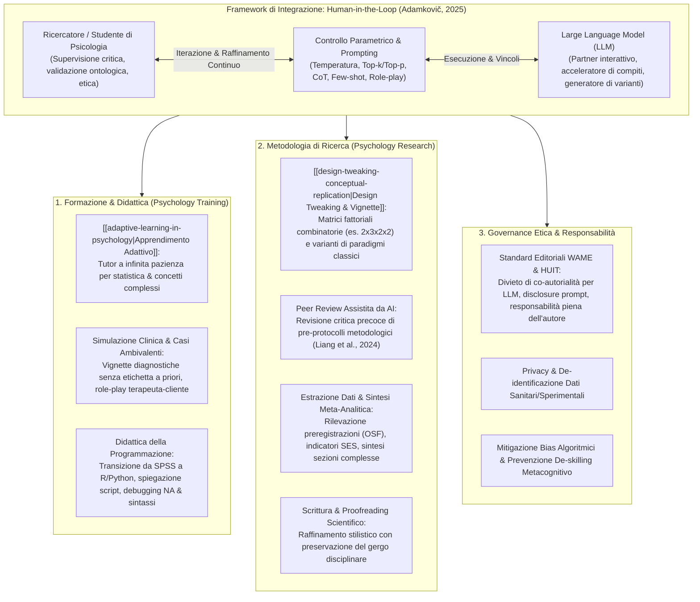

# Large Language Models in (Not Only) Psychology Training and Research: A Brief Introduction (Adamkovič, 2025)

## Definizione Operativa

- **Manuale Metodologico e Didattico Open-Access** (*Centre of Social and Psychological Sciences, Slovak Academy of Sciences*, 2025; ISBN: 978-80-8298-014-4; DOI: [10.31577/2025.9788082980144](https://doi.org/10.31577/2025.9788082980144)) redatto da **Matúš Adamkovič, PhD** (Slovak Academy of Sciences, Charles University, University of Jyväskylä).
- **Finalità dell'Opera:** Fornire una guida rigorosa, accessibile e pragmaticamente orientata per studenti universitari, docenti e ricercatori delle scienze del comportamento, delineando come i modelli linguistici di grandi dimensioni ([[large-language-models]]) possano essere impiegati per potenziare l'apprendimento adattivo, la simulazione clinica didattica, l'acquisizione di competenze di programmazione e le diverse fasi del ciclo di ricerca scientifica.
- **Tesi Centrale e Paradigma Guida:** L'integrazione dell'IA generativa nella psicologia non deve mirare alla sostituzione del giudizio umano, bensì alla cooperazione aumentata all'interno di un rigoroso framework **Human-in-the-Loop** ([[human-in-the-reasoning]]). L'efficacia e l'affidabilità scientifica degli LLM dipendono criticamente dalla competenza metodologica dell'utente nella formulazione dei prompt, nella calibrazione degli iperparametri di campionamento (temperatura, top-$k$, top-$p$), nella mitigazione attiva di allucinazioni (*hallucinations*) e trascuratezze logiche (*sloppiness*), e nell'adesione agli standard etici internazionali (WAME, Harvard HUIT).

## Evidenze dalla Letteratura

### Fondamenti Architetturali e Controllo dell'Output
Il manuale delinea il funzionamento probabilistico degli LLM, dove la finestra di contesto e gli iperparametri (temperatura, top-$k$, top-$p$) determinano il bilanciamento tra determinismo e creatività. La letteratura citata sottolinea l'importanza del prompting strutturato:
- **Zero-Shot:** Basato sulla conoscenza pregressa (Kojima et al., 2022).
- **Few-Shot:** Orientato da esempi (Brown et al., 2020).
- **Chain-of-Thought (CoT):** Scomposizione logica (Wei et al., 2022).
- **Role-Based:** Definizione di ruoli professionali (Kong et al., 2023).

### LLM nella Formazione (Psychology Training)
L'apprendimento adattivo funge da tutor per concetti complessi (es. statistica), mentre la simulazione clinica e il coding (R/Python) assistito permettono uno sviluppo di competenze che superano i limiti dei software tradizionali.

### LLM nella Ricerca Comportamentale (Psychology Research)
L'uso degli LLM si estende al perfezionamento del disegno sperimentale, alla revisione assistita (Liang et al., 2024) e alla meta-analisi tramite estrazione automatizzata di dati, pur richiedendo una supervisione costante contro allucinazioni e bias.

### Governance Etica
L'integrazione segue i principi WAME (Zielinski et al., 2023) e le linee guida Harvard HUIT (2025), ponendo l'accento sulla responsabilità umana, la privacy dei dati e la trasparenza (disclosure dei prompt).

**Riferimenti Bibliografici:**

- **Adamkovič, M. (2025).** *Large Language Models in (Not Only) Psychology Training and Research: A Brief Introduction*. Centre of Social and Psychological Sciences, Slovak Academy of Sciences. https://doi.org/10.31577/2025.9788082980144
- **Baek, J., Jauhar, S. K., Cucerzan, S., & Hwang, S. J. (2024).** ResearchAgent: Iterative research idea generation over scientific literature with large language models. *arXiv preprint*, arXiv:2404.07738.
- **Bharathi Mohan, G., Prasanna Kumar, R., Vishal Krishh, P., et al. (2024).** An analysis of large language models: their impact and potential applications. *Knowledge and Information Systems*, 66(9), 5047–5070.
- **Brown, T. B., Mann, B., Ryder, N., et al. (2020).** Language Models are Few-Shot Learners. *arXiv preprint*, arXiv:2005.14165.
- **Bubeck, S., Chandrasekaran, V., et al. (2023).** Sparks of Artificial General Intelligence: Early experiments with GPT-4. *arXiv preprint*, arXiv:2303.12712.
- **Cacciamani, G. E., Collins, G. S., & Gill, I. S. (2023).** ChatGPT: standard reporting guidelines for responsible use. *Nature*, 618(7964), 238–238.
- **Döderlein, J.-B., Acher, M., Khelladi, D. E., & Combemale, B. (2022).** Piloting Copilot and Codex: Hot temperature, cold prompts, or black magic? *arXiv preprint*, arXiv:2210.14699.
- **Guo, E., Gupta, M., Deng, J., et al. (2024).** Automated paper screening for clinical reviews using Large language models: Data analysis study. *Journal of Medical Internet Research*, 26, e48996.
- **Han, T., Adams, L. C., Bressem, K. K., et al. (2024).** Comparative analysis of multimodal large language model performance on clinical vignette questions. *JAMA*, 331(15), 1320.
- **Harvard University Information Technology (HUIT). (2025).** *Generative AI guidelines*. Harvard University.
- **Holmes, W., Bialik, M., & Fadel, C. (2019).** *Artificial Intelligence in Education: Promises and Implications for Teaching and Learning* (1st ed.). Center for Curriculum Redesign.
- **Huang, L., Yu, W., Ma, W., et al. (2024).** A survey on hallucination in large language models: Principles, taxonomy, challenges, and open questions. *ACM Transactions on Information Systems*.
- **Jobin, A., Ienca, M., & Vayena, E. (2019).** The global landscape of AI ethics guidelines. *Nature Machine Intelligence*, 1(9), 389–399.
- **Knoechel, T.-D., Konrad Schweizer, Acar, O. A., et al. (2024).** Principles for responsible AI usage in research. *PsyArXiv*. https://doi.org/10.31234/osf.io/g3m5f
- **Kojima, T., Gu, S. S., Reid, M., et al. (2022).** Large Language Models are Zero-Shot Reasoners. *arXiv preprint*, arXiv:2205.11916.
- **Konet, A., Thomas, I., Gartlehner, G., et al. (2024).** Performance of two large language models for data extraction in evidence synthesis. *Research Synthesis Methods*.
- **Kong, A., Zhao, S., Chen, H., et al. (2023).** Better zero-shot reasoning with role-play prompting. *arXiv preprint*, arXiv:2308.07702.
- **Liang, W., Zhang, Y., Cao, H., et al. (2024).** Can large language models provide useful feedback on research papers? A large-scale empirical analysis. *NEJM AI*, 1(8).
- **Masuadi, E., Mohamud, M., Almutairi, M., et al. (2021).** Trends in the usage of statistical software and their associated study designs in health sciences research: A bibliometric analysis. *Cureus*, 13(8), e12639.
- **Polak, M. P., & Morgan, D. (2024).** Extracting accurate materials data from research papers with conversational language models and prompt engineering. *Nature Communications*, 15(1).
- **Si, C., Yang, D., & Hashimoto, T. (2024).** Can LLMs generate novel research ideas? A large-scale human study with 100+ NLP researchers. *arXiv preprint*, arXiv:2409.04109.
- **Solanki, S. R., & Khublani, D. K. (2024).** Large language models. In *Generative Artificial Intelligence* (pp. 173–228). Apress.
- **Wei, J., Wang, X., Schuurmans, D., et al. (2022).** Chain-of-thought prompting elicits reasoning in large language models. *arXiv preprint*, arXiv:2201.11903.
- **Yang, J. (2024).** Rethinking Tokenization: Crafting Better Tokenizers for Large Language Models. *arXiv preprint*, arXiv:2403.00417.
- **Yenduri, G., Ramalingam, M., Chemmalar Selvi, G., et al. (2023).** Generative Pre-trained transformer: A comprehensive review on enabling technologies, potential applications, emerging challenges, and future directions. *arXiv preprint*, arXiv:2305.10435.
- **Zielinski, C., Winker, M. A., Aggarwal, R., et al. (2023).** Chatbots, generative AI, and scholarly manuscripts: WAME recommendations on chatbots and generative artificial intelligence in relation to scholarly publications. *World Association of Medical Editors*.

## Relazioni

- [[design-tweaking-conceptual-replication]]
- [[adaptive-learning-in-psychology]]
- [[prompting-in-psychology]]
- [[human-in-the-reasoning]]
- [[modello-centauro-clinico]]
- [[simulated-empathy-vs-authentic-presence]]
- [[clinical-decision-making-and-artificial-intelligence]]
- [[ai-research-ethics]]
- [[ai-literacy-in-academia]]
- [[large-language-models]]
- [[cognitive-offloading-e-diagnostic-deskilling]]
- [[stepwise-cot]]
- [[synthetic-psychopathology]]
- [[traffic-light-quality-appraisal-clinical-ai]]
