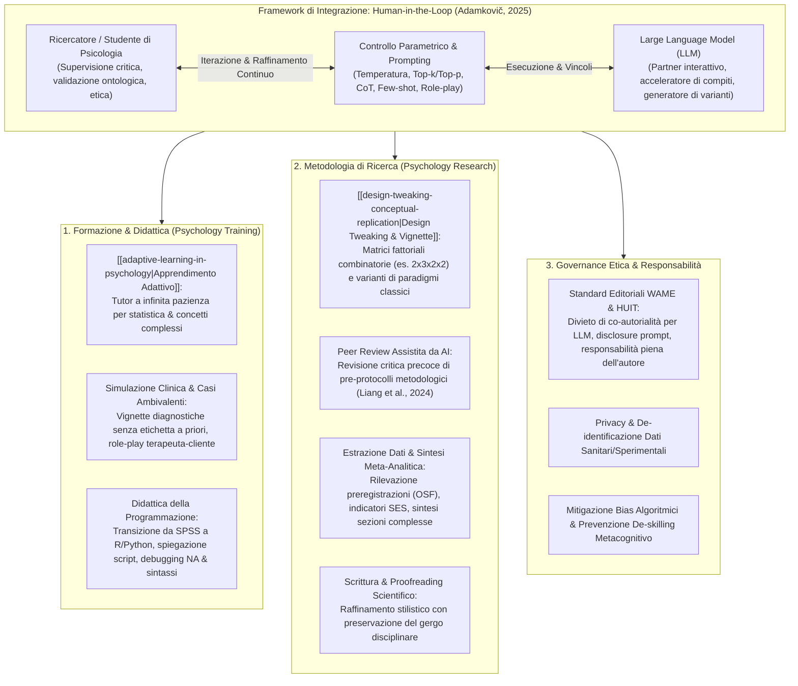
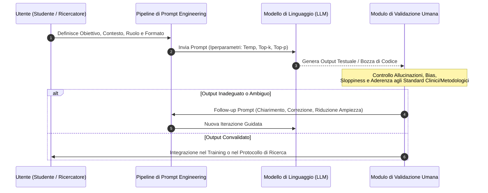
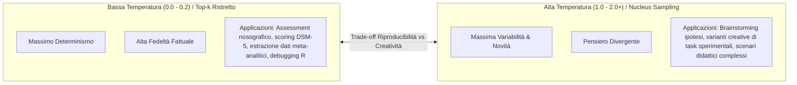
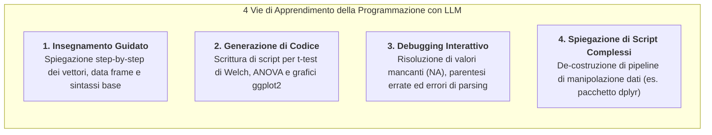
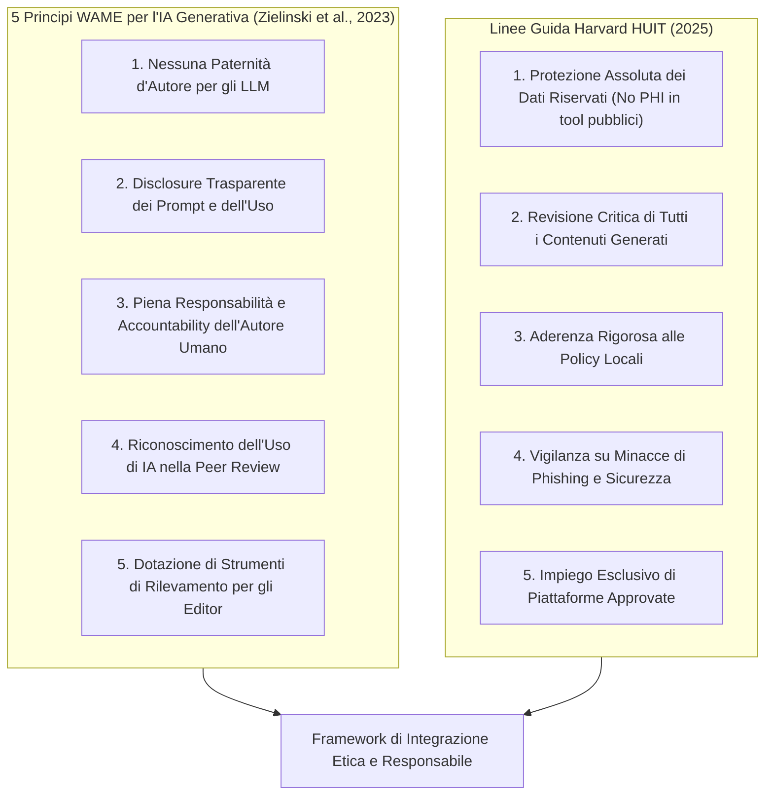

# Large Language Models in (Not Only) Psychology Training and Research: A Brief Introduction (Adamkovič, 2025)

## Definizione Operativa
- **Manuale Metodologico e Didattico Open-Access** (*Centre of Social and Psychological Sciences, Slovak Academy of Sciences*, 2025; ISBN: 978-80-8298-014-4; DOI: [10.31577/2025.9788082980144](https://doi.org/10.31577/2025.9788082980144)) redatto da **Matúš Adamkovič, PhD** (Slovak Academy of Sciences, Charles University, University of Jyväskylä).
- **Finalità dell'Opera:** Fornire una guida rigorosa, accessibile e pragmaticamente orientata per studenti universitari, docenti e ricercatori delle scienze del comportamento, delineando come i modelli linguistici di grandi dimensioni ([[large-language-models]]) possano essere impiegati per potenziare l'apprendimento adattivo, la simulazione clinica didattica, l'acquisizione di competenze di programmazione e le diverse fasi del ciclo di ricerca scientifica.
- **Tesi Centrale e Paradigma Guida:** L'integrazione dell'IA generativa nella psicologia non deve mirare alla sostituzione del giudizio umano, bensì alla cooperazione aumentata all'interno di un rigoroso framework **Human-in-the-Loop** ([[human-in-the-reasoning]]). L'efficacia e l'affidabilità scientifica degli LLM dipendono criticamente dalla competenza metodologica dell'utente nella formulazione dei prompt, nella calibrazione degli iperparametri di campionamento (temperatura, top-$k$, top-$p$), nella mitigazione attiva di allucinazioni (*hallucinations*) e trascuratezze logiche (*sloppiness*), e nell'adesione agli standard etici internazionali (WAME, Harvard HUIT).

---

## 1. Fondamenti Architetturali e Controllo dell'Output

### 1.1 Funzionamento degli LLM, Token e Finestre di Contesto
- **Predizione Probabilistica del Token Successivo:** Gli LLM (es. GPT-4o, Claude 3.5 Sonnet, Gemini) operano apprendendo distribuzioni di probabilità su miliardi di parametri a partire da vasti corpora testuali. Non effettuano un ragionamento ontologico diretto, ma predicono la continuazione statisticamente più plausibile di una data sequenza di token.
- **Dinamica dei Token e Finestra Contestuale (*Context Window*):**
  - I token rappresentano le unità minime di testo (parole, sotto-parole, caratteri o punteggiatura; cfr. Yang, 2024).
  - La finestra di contesto costituisce il limite rigido di token elaborabili e generabili in una singola sessione operativa (es. 128k token per GPT-4o con massimale di output a 2.048 token).
  - *Trade-off:* All'aumentare della finestra contestuale crescono la coerenza a lungo raggio e la capacità di referenziazione interna, ma aumentano il carico computazionale e il potenziale decadimento dell'attenzione su dettagli isolati al centro del contesto (*needle in a haystack*).
- **Interfaccia Grafica (UI) vs Interfaccia di Programmazione (API):**
  - *UI (Web Chat):* Ideale per l'esplorazione informale, il brainstorming, l'apprendimento concettuale e l'interazione qualitativa diretta senza competenze di codice.
  - *API:* Indispensabile per pipeline di estrazione dati su larga scala, replicabilità sperimentale, automazione algoritmica e standardizzazione rigorosa dei parametri.

---

### 1.2 Tassonomia del Prompting in Ambito Psicologico
L'autore individua quattro modalità principali di prompting, evidenziando il contrasto tra formulazioni generiche inadeguate e prompt professionali ad alta specificità:

| Tipologia di Prompt | Meccanismo Operativo | Esempio Inadeguato (*Bad Prompt*) | Esempio Efficace (*Good Prompt*) in Psicologia |
| :--- | :--- | :--- | :--- |
| **Zero-Shot** | Istruzione diretta senza esempi, basata sulla conoscenza pregressa del modello (Kojima et al., 2022). | *"Explain depression."* (Troppo vago, privo di target e vincoli di profondità). | *"Fornisci una sintesi concisa del Disturbo Depressivo Maggiore per studenti universitari di psicologia, includendo: 1) Criteri diagnostici cardine, 2) Tassi di prevalenza, 3) Due teorie eziologiche principali, 4) Approcci terapeutici comuni. Limita la risposta a circa 200 parole."* |
| **Few-Shot** | Inclusione di coppie input-output nel prompt per orientare formato e criteri di classificazione (Brown et al., 2020). | *"Classifica queste frasi come alta o bassa autostima: 1) Sono fiero dei miei successi. 2) Non valgo a nulla. Ora classifica: 'A volte sbaglio ma imparo.'"* (Mancano i criteri di classificazione e il razionale). | Fornisce la definizione del costrutto, due esempi etichettati con spiegazione del ragionamento e richiede la classificazione di nuovi item con esplicitazione della motivazione inferenziale. |
| **Chain-of-Thought (CoT)** | Guida il modello a scomporre compiti complessi in passaggi logici sequenziali (Wei et al., 2022). | *"Diagnostica questo caso: Un paziente riferisce di sentirsi triste e stanco tutto il tempo."* (Induce diagnosi affrettate e monolitiche). | *"Assumi il ruolo di uno psicologo clinico in fase di assessment. Il paziente lamenta tristezza e astenia costante. Sviluppa il ragionamento clinico step-by-step: 1) Ipotesi preliminari, 2) Criteri da verificare, 3) Diagnosi differenziali, 4) Strumenti psicometrici da somministrare, 5) Esclusione di cause organiche, 6) Impressione diagnostica provvisoria e passi successivi."* |
| **Role-Based (Ruolo)** | Assegnazione di un'identità professionale o di un profilo specifico con vincoli contestuali (Kong et al., 2023). | *"Comportati come un terapeuta e aiutami con l'ansia."* (Generico, privo di orientamento teorico e quadro clinico). | *"Assumi il ruolo di un terapeuta cognitivo-comportamentale con un paziente di 28 anni con Disturbo d'Ansia Generalizzata. Struttura l'intervento: check-in, 2-3 domande mirate sui trigger, spiegazione di una tecnica CBT (es. ristrutturazione cognitiva), guida pratica all'esercizio, assegnazione di un homework. Mantieni un tono professionale ed empatico."* |

---

### 1.3 Parametri di Controllo dell'Output: Il Continuum Determinismo-Creatività

1. **Temperatura:** Regola la casualità nel campionamento probabilistico dei token:
   - *Valori Bassi ($\approx 0.1 - 0.2$):* Concentrazione sui token a massima probabilità; risposte conservative, rigorosamente coerenti e riproducibili. Fondamentali per il test di criteri diagnostici e l'estrazione dati.
   - *Valori Moderati ($\approx 0.7 - 1.0$):* Equilibrio tra aderenza contestuale e fluidità narrativa.
   - *Valori Molto Alti ($> 2.0 - 10.0$):* Iper-diversificazione con progressiva degenerazione semantica e allucinatoria (es. l'esperimento carcerario di Stanford trasformato in una bizzarra "base lunare di formaggio fuso").
2. **Top-$k$ Sampling:** Limita la scelta ai $k$ token più probabili ad ogni passaggio, evitando l'introduzione di termini rari o fuorvianti nelle definizioni cliniche.
3. **Top-$p$ (Nucleus) Sampling:** Seleziona dinamicamente il sottoinsieme più ristretto di token la cui probabilità cumulata raggiunge la soglia $p$ (es. $p=0.9$), garantendo flessibilità contestuale senza cadere in derive estreme.
4. **Minimizzazione di Allucinazioni (*Hallucinations*) e Trascuratezze (*Sloppiness*):**
   - *Allucinazione:* Generazione di informazioni fattualmente inesistenti ma verosimili (es. articoli scientifici e codici PMID inventati; Huang et al., 2024).
   - *Sloppiness:* Produzione di argomentazioni vaghe, spiegazioni troncate o analisi superficiali dovute a prompt deboli o scarsa contestualizzazione.
   - *Strategie di Mitigazione:* Impiego di modelli allo stato dell'arte, prompt densi di contesto documentale, azzeramento della temperatura per task deterministici, routine di fact-checking e prompt di follow-up correttivi.

---

## 2. LLM nella Formazione e nel Training Psicologico (*Psychology Training*)

### 2.1 Apprendimento Adattivo (*Adaptive Learning*) e Tutoraggio Concettuale
- **Tutor Socratico a "Infinita Pazienza":** Gli LLM consentono agli studenti di richiedere spiegazioni personalizzate graduate sul proprio livello di partenza, superando l'ansia e il senso di inadeguatezza tipici delle materie quantitative.
- **De-costruzione dei Concetti Statistici:** Esempio cardine riportato nel testo: la progressione di prompt per comprendere la **regressione lineare**:
  1. *Richiesta iniziale:* Spiegazione generale del costrutto.
  2. *Adattamento:* Richiesta di spiegazione priva di formule algebriche per chi ha un background non matematico.
  3. *Approfondimento:* Differenziazione intuitiva tra coefficienti standardizzati ($\beta$) e non standardizzati ($b$) mediante analogie di vita reale.
  4. *Rappresentazione e Interpretazione:* Interpretazione contestuale di una tabella di regressione tratta da un articolo empirico.
- **Autoverifica Formativa:** Generazione automatica di quiz a risposta multipla e a risposta aperta con correzione immediata e spiegazione degli errori concettuali.

---

### 2.2 Simulazione Didattica e Generazione di Casi Clinici Ambivalenti
- **Superamento della Stereotipia Nosografica:** Nei contesti reali i pazienti non si presentano con elenchi ordinati di sintomi DSM-5. L'LLM può essere istruito a generare vignette cliniche realistiche caratterizzate da **ambiguità diagnostica, comorbilità sfumate e background psicosociale complesso**, omettendo volutamente l'etichetta finale per costringere lo studente a formulare ed esplicitare il proprio ragionamento differenziale.
- **Role-Playing Clinico ed Esperienziale:**
  - *Setting Psicoterapeutico:* Simulazione di un colloquio con un adolescente con ansia generalizzata e fobia scolare, in cui lo studente sperimenta tecniche di de-escalation e dialogo socratico ricevendo un debriefing pedagogico al termine dell'interazione.
  - *Setting Organizzativo e delle Risorse Umane:* Simulazione di mediazione di un conflitto tra colleghi in ambito lavorativo, con feedback focalizzato sulle tecniche di comunicazione e neutralità.

---

### 2.3 Didattica della Programmazione per la Ricerca Psicologica
- **Transizione dai Software Point-and-Click a R e Python:** Il passaggio da software proprietari basati su menù a tendina (SPSS) a linguaggi di programmazione aperti e riproducibili (R, Python, PsychoPy) rappresenta uno dei principali ostacoli nei curricula psicologici (Masuadi et al., 2021).
- **Le 4 Vie dell'Apprendimento del Codice Assistito da LLM:**

---

## 3. LLM nella Ricerca Comportamentale (*Psychology Research*)

### 3.1 Perfezionamento del Disegno Sperimentale e Replicazioni Concettuali
- **Generazione Sistematica di Scenari per Disegni Fattoriali a Vignette:**
  - L'ideazione manuale di decine di scenari combinatori per studi sperimentali è lenta e soggetta a errori di bilanciamento.
  - *Caso di Studio sul Biobanking:* Manipolazione ortogonale di 4 variabili indipendenti ($2 \times 3 \times 2 \times 2 = 24$ condizioni sperimentali: finalità informativa minima vs dettagliata; proprietà pubblica vs privata vs non specificata; presenza vs assenza di partner commerciali; presenza vs assenza di incentivi). L'LLM genera istantaneamente l'intera matrice di vignette garantendo consistenza lessicale.
  - *Test di Robustezza Linguistica:* Riformulazione sistematica delle vignette per verificare che le risposte dei partecipanti non dipendano da specifici artefatti verbali.
- **[[design-tweaking-conceptual-replication|Design Tweaking]] (Varianti Creative di Paradigmi Classici):**
  - Utilizzo degli LLM (con temperatura elevata, $\text{Temp} = 2.0 - 5.0$) per introdurre modifiche inedite a paradigmi consolidati, favorendo replicazioni concettuali innovative.
  - *Esempi sul Digit Span Test:* Digit Origami (piegatura della carta a forma di numero), Gravity Reversed (scrittura dei numeri capovolti), Digital Ecosystem (associazione di cifre a elementi naturali in evoluzione), Emotion-Fueled Recall (ancoraggio affettivo dei numeri).
- **Peer Review Assistita da AI per Pre-Protocolli di Ricerca:**
  - Utilizzo dei modelli linguistici come revisori critici indipendenti prima della registrazione del protocollo o della sottomissione a colleghi.
  - Citando lo studio su larga scala di **Liang et al. (2024, *NEJM AI*)**, l'autore evidenzia come il feedback degli LLM sulla chiarezza dell'impianto teorico, sui potenziali confounder e sul piano d'analisi risulti spesso qualitativamente comparabile o persino più puntuale di quello fornito da revisori umani nelle fasi embrionali della ricerca.

---

### 3.2 Estrazione Dati per Rassegne Sistematiche e Meta-Analisi
- **Automazione dell'Estrazione dei Metadati:**
  - Identificazione rapida della presenza di **preregistrazione** (OSF, AsPredicted, ClinicalTrials.gov) all'interno di centinaia di articoli scientifici ($\text{Temp} = 0.2$).
  - Estrazione e tabulazione di tutte le misure e gli indicatori operativi utilizzati per uno specifico costrutto (es. status socioeconomico, Cantril's ladder, reddito percepito).
- **Sintesi Strutturata e Approfondimento Metodologico:**
  - Riassunto personalizzato delle sezioni di analisi statistica complesse (es. network analysis in psicopatologia, misure di *strength* ed *expected influence*).
  - *Vincolo Metodologico:* Le sintesi dell'LLM devono costituire un ausilio alla lettura critica e non un surrogato cieco, richiedendo sempre una fase di verifica contro il testo sorgente.

---

### 3.3 Scrittura Accademica, Proofreading e Conservazione del Gergo
- **Supporto all'Internazionalizzazione dei Ricercatori Non Madrelingua:** Correzione stilistica, grammaticale e sintattica dei manoscritti.
- **Vincoli Lessicali e Terminologici Rigidi:** Istruire l'LLM a non alterare lemmi specialistici o costrutti chiave (es. *"verisimilitude"*, *"meta-synthesis"*, *"problematic gaming"*), preservando l'integrità concettuale dell'opera originale.

---

## 4. Considerazioni Etiche, Deontologiche e Governance Accademica

### 4.1 I 5 Principi WAME e le Linee Guida Harvard HUIT
1. **Paternità d'Autore Non Riconoscibile agli Algoritmi:** Gli LLM non possiedono personalità giuridica, responsabilità etica o capacità di sottoscrivere conflitti di interesse; pertanto non possono figurare tra gli autori di pubblicazioni accademiche.
2. **Trasparenza Metodologica e Prompt Sharing:** Gli autori devono dichiarare esplicitamente come e dove l'IA è stata utilizzata, allegando nel materiale supplementare i prompt integrali impiegati per la generazione o l'analisi.
3. **Accountability Umana:** L'autore risponde integralmente di qualsiasi imprecisione, allucinazione o violazione del diritto d'autore generata dallo strumento.

### 4.2 Riservatezza dei Dati, Bias e Impatto Relazionale
- **Tutela della Privacy:** Divieto assoluto di inserire trascritti clinici contenenti informazioni personali identificabili (PII) o dati sanitari protetti in interfacce LLM commerciali aperte che utilizzano gli input per il riaddestramento.
- **Amplificazione dei Bias Socio-Culturali:** I modelli linguistici riflettono i pregiudizi demografici, etnici e di genere insiti nei dati di pretraining. La ricerca e la didattica richiedono un auditing sistematico degli output per garantire equità rappresentativa.
- **Salvaguardia della Relazione Terapeutica:** Gli LLM devono rimanere strumenti ausiliari; non possono surrogare la presenza autentica, la risonanza affettiva e l'intenzionalità clinica del terapeuta umano ([[simulated-empathy-vs-authentic-presence]]).
- **Prevenzione del De-skilling Metacognitivo:** L'eccessiva delega cognitiva all'IA rischia di erodere il pensiero critico e la capacità di risoluzione autonoma dei problemi negli studenti di psicologia.

---

## 5. Tavola Sinottica: Applicazioni, Parametri e Controlli Chiave

| Area Applicativa | Task Specifico | Strategia di Prompting | Impostazione Temperatura | Controlli Critici e Rischi |
| :--- | :--- | :--- | :---: | :--- |
| **Formazione Statistica** | Spiegazione regressione / output | Zero-shot guidato + Follow-up iterativo | $\text{Temp} \approx 0.3 - 0.5$ | Verificare la correttezza formale delle definizioni; evitare spiegazioni iper-semplificate errate. |
| **Simulazione Didattica** | Caso clinico con sintomi ambigui | Role-Based + Vincolo di non-svelamento | $\text{Temp} \approx 0.6 - 0.8$ | Evitare stereotipi diagnostici; chiarire sempre allo studente la natura sintetica del caso. |
| **Role-Play Terapeutico** | Simulazione paziente con ansia | Role-Based + Profilo clinico contestuale | $\text{Temp} \approx 0.7$ | Non confondere la simulazione testuale con l'esperienza relazionale in vivo con un paziente reale. |
| **Didattica Coding** | Debugging script R (`NA`, dplyr) | Zero-shot con inserimento codice ed errori | $\text{Temp} = 0.0 - 0.2$ | Eseguire il codice generato incrementalmente; verificare la compatibilità delle versioni dei pacchetti. |
| **Disegno Sperimentale** | Generazione matrici a vignette | Few-shot + Matrice di variabili $2\times 3\times 2\times 2$ | $\text{Temp} \approx 0.5 - 0.7$ | Verificare l'ortogonalità delle variabili manipolate e l'assenza di scivolamenti semantici (*semantic drift*). |
| **Varianti Sperimentali** | Tweaking creativo (es. Digit Span) | Zero-shot aperto / Divergente | $\text{Temp} \approx 1.5 - 2.0+$ | Valutare la plausibilità metodologica; verificare che il twist non comprometta la validità di costrutto. |
| **Revisione Protocolli** | Peer review preliminare di studio | Role-Based (Senior Reviewer) + CoT | $\text{Temp} \approx 0.3$ | Integrare sempre la valutazione con docenti ed esperti del dominio disciplinare specifico. |
| **Estrazione Dati** | Verifica preregistrazione e SES | Few-shot con formato vincolato (Yes/No; `;`) | $\text{Temp} \approx 0.1 - 0.2$ | Fact-checking su un sottocampione manuale; attenzione ai layout su due colonne nei PDF. |
| **Proofreading** | Raffinamento stilistico articolo | Guided Generation con conservazione termini | $\text{Temp} \approx 0.3$ | Verificare che il modello non alteri il significato originale o introduca allucinazioni bibliografiche. |

---

## Riferimenti Bibliografici

- **Adamkovič, M. (2025).** *Large Language Models in (Not Only) Psychology Training and Research: A Brief Introduction*. Centre of Social and Psychological Sciences, Slovak Academy of Sciences. https://doi.org/10.31577/2025.9788082980144
- **Baek, J., Jauhar, S. K., Cucerzan, S., & Hwang, S. J. (2024).** ResearchAgent: Iterative research idea generation over scientific literature with large language models. *arXiv preprint*, arXiv:2404.07738.
- **Bharathi Mohan, G., Prasanna Kumar, R., Vishal Krishh, P., et al. (2024).** An analysis of large language models: their impact and potential applications. *Knowledge and Information Systems*, 66(9), 5047–5070.
- **Brown, T. B., Mann, B., Ryder, N., et al. (2020).** Language Models are Few-Shot Learners. *arXiv preprint*, arXiv:2005.14165.
- **Bubeck, S., Chandrasekaran, V., et al. (2023).** Sparks of Artificial General Intelligence: Early experiments with GPT-4. *arXiv preprint*, arXiv:2303.12712.
- **Cacciamani, G. E., Collins, G. S., & Gill, I. S. (2023).** ChatGPT: standard reporting guidelines for responsible use. *Nature*, 618(7964), 238–238.
- **Döderlein, J.-B., Acher, M., Khelladi, D. E., & Combemale, B. (2022).** Piloting Copilot and Codex: Hot temperature, cold prompts, or black magic? *arXiv preprint*, arXiv:2210.14699.
- **Guo, E., Gupta, M., Deng, J., et al. (2024).** Automated paper screening for clinical reviews using Large language models: Data analysis study. *Journal of Medical Internet Research*, 26, e48996.
- **Han, T., Adams, L. C., Bressem, K. K., et al. (2024).** Comparative analysis of multimodal large language model performance on clinical vignette questions. *JAMA*, 331(15), 1320.
- **Harvard University Information Technology (HUIT). (2025).** *Generative AI guidelines*. Harvard University.
- **Holmes, W., Bialik, M., & Fadel, C. (2019).** *Artificial Intelligence in Education: Promises and Implications for Teaching and Learning* (1st ed.). Center for Curriculum Redesign.
- **Huang, L., Yu, W., Ma, W., et al. (2024).** A survey on hallucination in large language models: Principles, taxonomy, challenges, and open questions. *ACM Transactions on Information Systems*.
- **Jobin, A., Ienca, M., & Vayena, E. (2019).** The global landscape of AI ethics guidelines. *Nature Machine Intelligence*, 1(9), 389–399.
- **Knoechel, T.-D., Konrad Schweizer, Acar, O. A., et al. (2024).** Principles for responsible AI usage in research. *PsyArXiv*. https://doi.org/10.31234/osf.io/g3m5f
- **Kojima, T., Gu, S. S., Reid, M., et al. (2022).** Large Language Models are Zero-Shot Reasoners. *arXiv preprint*, arXiv:2205.11916.
- **Konet, A., Thomas, I., Gartlehner, G., et al. (2024).** Performance of two large language models for data extraction in evidence synthesis. *Research Synthesis Methods*.
- **Kong, A., Zhao, S., Chen, H., et al. (2023).** Better zero-shot reasoning with role-play prompting. *arXiv preprint*, arXiv:2308.07702.
- **Liang, W., Zhang, Y., Cao, H., et al. (2024).** Can large language models provide useful feedback on research papers? A large-scale empirical analysis. *NEJM AI*, 1(8).
- **Masuadi, E., Mohamud, M., Almutairi, M., et al. (2021).** Trends in the usage of statistical software and their associated study designs in health sciences research: A bibliometric analysis. *Cureus*, 13(8), e12639.
- **Polak, M. P., & Morgan, D. (2024).** Extracting accurate materials data from research papers with conversational language models and prompt engineering. *Nature Communications*, 15(1).
- **Si, C., Yang, D., & Hashimoto, T. (2024).** Can LLMs generate novel research ideas? A large-scale human study with 100+ NLP researchers. *arXiv preprint*, arXiv:2409.04109.
- **Solanki, S. R., & Khublani, D. K. (2024).** Large language models. In *Generative Artificial Intelligence* (pp. 173–228). Apress.
- **Wei, J., Wang, X., Schuurmans, D., et al. (2022).** Chain-of-thought prompting elicits reasoning in large language models. *arXiv preprint*, arXiv:2201.11903.
- **Yang, J. (2024).** Rethinking Tokenization: Crafting Better Tokenizers for Large Language Models. *arXiv preprint*, arXiv:2403.00417.
- **Yenduri, G., Ramalingam, M., Chemmalar Selvi, G., et al. (2023).** Generative Pre-trained transformer: A comprehensive review on enabling technologies, potential applications, emerging challenges, and future directions. *arXiv preprint*, arXiv:2305.10435.
- **Zielinski, C., Winker, M. A., Aggarwal, R., et al. (2023).** Chatbots, generative AI, and scholarly manuscripts: WAME recommendations on chatbots and generative artificial intelligence in relation to scholarly publications. *World Association of Medical Editors*.

---

## Related Pages
- [[design-tweaking-conceptual-replication]]
- [[adaptive-learning-in-psychology]]
- [[prompting-in-psychology]]
- [[human-in-the-reasoning]]
- [[modello-centauro-clinico]]
- [[simulated-empathy-vs-authentic-presence]]
- [[CHART2025]]
- [[Clinical_decision_making_and_artificial_intelligence]]
- [[ai-research-ethics]]
- [[ai-literacy-in-academia]]
- [[large-language-models]]
- [[cognitive-offloading-e-diagnostic-deskilling]]
- [[stepwise-cot]]
- [[synthetic-psychopathology]]
- [[traffic-light-quality-appraisal-clinical-ai]]
