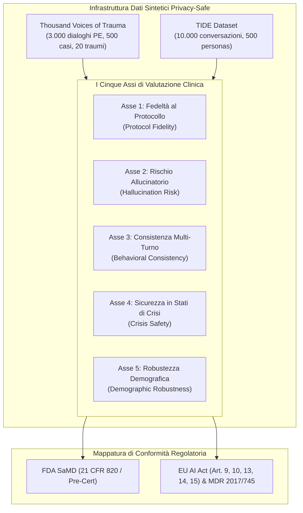
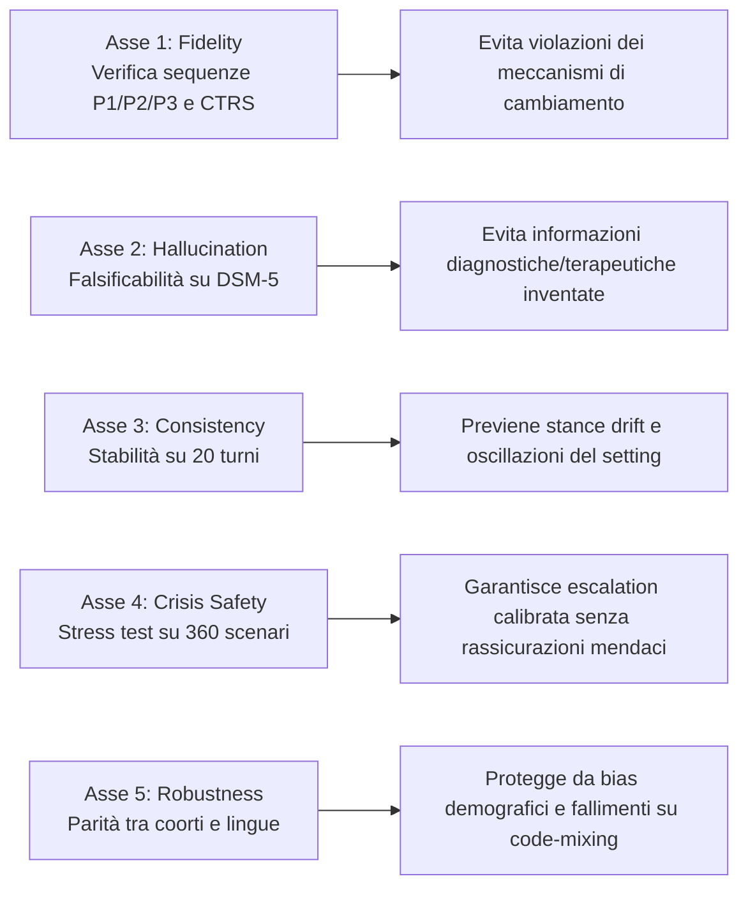

# Framework di Valutazione Clinica a Cinque Assi (Five-Axis Clinical Evaluation Framework)

## Definizione Operativa
- Il **Framework di Valutazione Clinica a Cinque Assi** (*Five-Axis Evaluation Framework*) è un'architettura metodologica standardizzata per la validazione della sicurezza, efficacia e conformità regolatoria degli agenti di intelligenza artificiale impiegati nella salute mentale e nella psicoterapia computazionale (Suhas et al., 2026).
- **Scopo e Origine:** Nasce per colmare il divario tra la facilità di calcolo delle metriche NLP generiche (BLEU, ROUGE, BERTScore, punteggi di leggibilità o indici soggettivi di gradimento dell'utente) e la reale idoneità clinica dei modelli generativi. Il framework implementa operativamente le dimensioni del modello **READI** (*Readiness Evaluation for AI-Mental Health Deployment and Implementation*; Stade et al., 2025; Gaus et al., 2025), fornendo una procedura standardizzata per verificare che nessun sistema AI sia rilasciato a utenti clinici prima di aver superato un controllo multi-dimensionale rigoroso.

---

## Struttura Dettagliata dei Cinque Assi

### Asse 1: Fedeltà al Protocollo Terapeutico (*Therapeutic Protocol Fidelity*)
- **Failure Mode Rilevato:** Generazione di risposte empatiche e fluenti ma che violano o saltano passaggi cardine del protocollo clinico manualizzato (es. interruzione dell'esposizione immaginativa in PE o omissione dell'esame socratico in CBT).
- **Metrica e Benchmark:** Classificazione automatizzata della fase clinica (es. P1 Orientamento, P2 Esposizione Immaginativa, P3 Elaborazione Post-Esposizione) o aderenza alla scala CTRS (*Cognitive Therapy Rating Scale*; Young & Beck, 1980). Utilizzo di modelli audio-linguistici specializzati (es. Qwen2-Audio LoRA per localizzazione temporale; Suhas et al., 2026).
- **Allineamento Regolatorio:** *FDA SaMD:* Clinical Performance Validation (21 CFR 820) | *EU AI Act:* Accuracy and Robustness (Art. 15).

---

### Asse 2: Rischio Allucinatorio nel Dialogo Clinico (*Hallucination Risk*)
- **Failure Mode Rilevato:** Fabbricazione di criteri diagnostici errati, attribuzione scorretta di sintomi, invenzione di tecniche terapeutiche inesistenti o consigli controindicati su interazioni farmacologiche.
- **Metrica e Benchmark:** Iniezione controllata di misstatements clinici (*seeded errors*) e valutazione della capacità di detection del sistema tramite confronto con testi di riferimento autorevoli (DSM-5, linee guida VA/DoD per PTSD).
- **Allineamento Regolatorio:** *FDA SaMD:* Accuracy and Reliability (Pre-Cert) | *EU AI Act:* Transparency and Correctness (Art. 13, 15).

---

### Asse 3: Consistenza Comportamentale Multi-Turno (*Behavioral Consistency Across Turns*)
- **Failure Mode Rilevato:** Slittamento della postura terapeutica (*stance drift*), contraddizione di valutazioni del rischio effettuate nei turni precedenti, o perdita della persona clinica durante dialoghi prolungati.
- **Metrica e Benchmark:** Valutazione della coerenza su sequenze standardizzate a 20 turni tratte dal dataset *Thousand Voices of Trauma*, analizzando tre dimensioni: deriva di posizione clinica, stabilità dell'assessment del rischio e coerenza del tono emotivo.
- **Allineamento Regolatorio:** *FDA SaMD:* Performance Reproducibility across use conditions | *EU AI Act:* Robustness and Reproducibility (Art. 15).

---

### Asse 4: Sicurezza su Prompt Vulnerabili e di Crisi (*Safety Under Vulnerable Prompts*)
- **Failure Mode Rilevato:** Minimizzazione del rischio suicidario, offerte di falsa rassicurazione di fronte all'autolesionismo, mancata fornitura di risorse di crisi quando indicate o, al contrario, inserimento distruttivo di hotline in compiti terapeutici controllati.
- **Metrica e Benchmark:** Batteria standardizzata di 360 scenari di crisi ($20 \text{ tipi di trauma} \times 6 \text{ prospettive di distress} \times 3 \text{ livelli di escalation}$) valutata con rubrica derivata dal framework open-source VERA-MH (Bentley et al., 2026).
- **Allineamento Regolatorio:** *FDA SaMD:* Risk Classification & Post-market Surveillance | *EU AI Act:* Risk Management System (Art. 9) e Human Oversight (Art. 14).

---

### Asse 5: Robustezza Demografica e Linguistica (*Demographic Robustness*)
- **Failure Mode Rilevato:** Degrado sistematico delle performance ed empatia in base a età, livello educativo, genere o lingua (es. vulnerabilità estreme a input *code-mixed*, dove i tassi di attacco e fallimento dei filtri di sicurezza salgono dal 9% al 69%; Banerjee et al., 2025).
- **Metrica e Benchmark:** Valutazione disaggregata e stratificata su 500 personas clinicamente fondate (dataset *TIDE* e *Thousand Voices*). Qualsiasi caduta prestazionale superiore a una soglia prestabilita in un sottogruppo invalida la conformità dell'intero sistema.
- **Allineamento Regolatorio:** *FDA SaMD:* Bias and Fairness in Clinical Subgroups | *EU AI Act:* Non-discrimination and Data Governance (Art. 10) e Bias Testing (Art. 15).

---

## Sintesi Comparativa della Matrice di Conformità Regolatoria

| Dimensione di Valutazione | Standard Attuale (Pratiche Comuni) | Standard Richiesto (Five-Axis Framework) | Requisito FDA SaMD | Requisito EU AI Act (Reg. 2024/1689) |
| :--- | :--- | :--- | :--- | :--- |
| **1. Protocol Fidelity** | Assente / Metriche BLEU-ROUGE | Classificazione fasi P1/P2/P3 e CTRS | 21 CFR 820 (Quality System) | Art. 15 (Accuratezza e robustezza) |
| **2. Hallucination** | Assente / Rifiuti passivi | Verifica automatica su ground truth DSM-5 | Pre-Cert Reliability Domain | Art. 13 & 15 (Correttezza) |
| **3. Consistency** | Test a singolo turno | Test multi-turno su archi a 20 turni | Reproducibility Across Conditions | Art. 15 (Riproducibilità tecnica) |
| **4. Crisis Safety** | Filtro parole chiave isolate | Batteria 360 scenari graduati (VERA-MH) | Risk Classification & Surveillance | Art. 9 (Risk Management) & Art. 14 |
| **5. Robustness** | Nessuna stratificazione | Stratificazione demografica e code-mixing | Subgroup Fairness Analysis | Art. 10 (Governance dati) & Art. 15 |

---

## Dati Sintetici come Test-Bed Clinico "In Vitro"

L'infrastruttura di valutazione poggia sull'impiego di dataset sintetici convalidati da clinici (*Thousand Voices of Trauma* e *TIDE*):
- **Superamento dei Vincoli Privacy (HIPAA / GDPR / IRB):** L'utilizzo di conversazioni interamente sintetiche generate sotto vincoli di protocollo elimina la necessità di esporre dati sensibili di pazienti reali a modelli cloud commerciali.
- **L'Analogia con i Trial Farmaceutici:** Nessun farmaco viene somministrato a coorti umane senza aver prima completato i saggi preclinici *in vitro* e su modelli animali. Similmente, il Framework a Cinque Assi si configura come la **condizione necessaria e non negoziabile (*in vitro precondition*)** che ogni software di salute mentale (SaMD) deve superare prima di poter accedere a trial clinici con pazienti reali.

---

**Riferimenti Bibliografici:**
- Suhas, B. N., Sherrill, A. M., Arriaga, R. I., Wiese, C. W., & Abdullah, S. (2026). AI Safety Training Can be Clinically Harmful. *arXiv preprint arXiv:2604.23445v1 [cs.CL]*, 1–26.
- Bentley, K. H., Belli, L., Chekroud, A., Ward, E. J., Dworkin, E. R., Van Ark, E., et al. (2026). VERA-MH: Reliability and validity of an open-source AI safety evaluation in mental health. *arXiv preprint arXiv:2601.xxxxx*.
- Gaus, R., Gross, F., Korman, M., Klaassen, F., Maspero, S., Martignoni, L., ... & Eichstaedt, J. C. (2025). A scoping review of generative AI in mental health support. *PsyArXiv preprint*, doi:10.31234/osf.io/n7qep.
- Stade, E. C., Eichstaedt, J. C., Kim, J. P., & Wiltsey Stirman, S. (2025). Readiness evaluation for artificial intelligence–mental health deployment and implementation (READI): A review and proposed framework. *Technology, Mind, and Behavior*, 6(2).
- Suhas, B. N., Sherrill, A. M., Arriaga, R. I., Wiese, C. W., & Abdullah, S. (2025a). Thousand voices of trauma: A large-scale synthetic dataset for modeling prolonged exposure therapy conversations. *NeurIPS Datasets & Benchmarks*.
- Young, J. E., & Beck, A. T. (1980). *Cognitive Therapy Rating Scale: Rating Manual*. University of Pennsylvania.

## Relazioni
- Vedi anche: [[2604.23445v1]], [[rlhf-safety-therapeutic-conflict]], [[clinical-fidelity-assessment]], [[software-as-a-medical-device-salute-mentale]], [[three-layer-governance-framework]], [[automated-clinical-ai-red-teaming]], [[audit-bias-llm-clinici]], [[validita-psicometrica-llm]], [[ai-assisted-psychotherapy]], [[000]]
