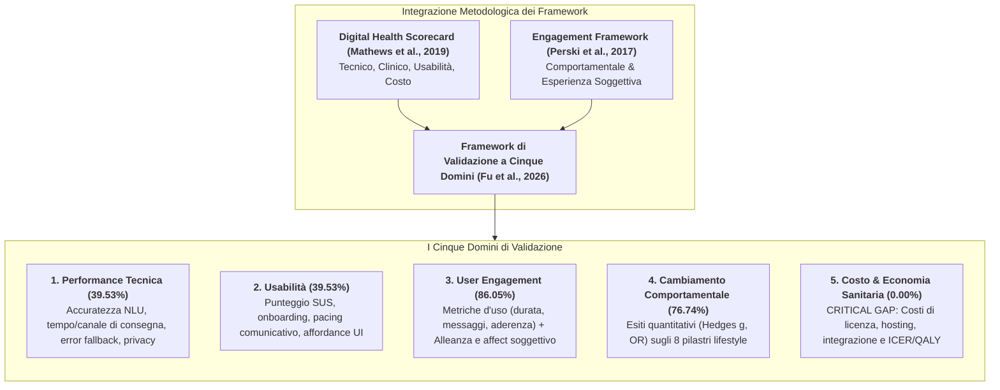
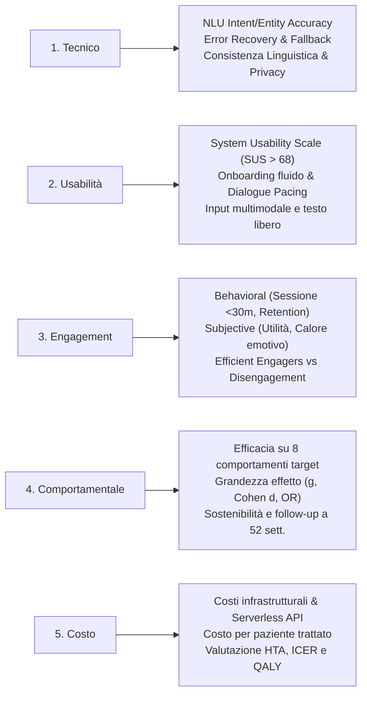
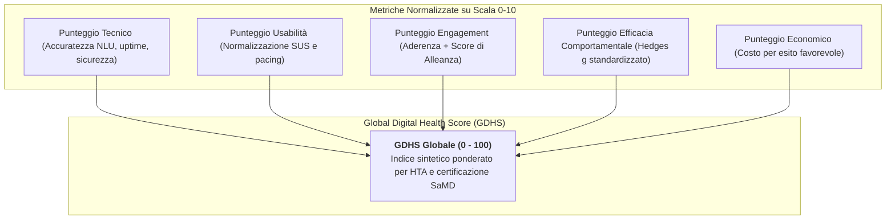

# Framework di Validazione a Cinque Domini per Chatbot di Salute Comportamentale (Five-Domain Validation Framework for Health Behavior Chatbots)

## Definizione Operativa
- Il **Framework di Validazione a Cinque Domini** (*Five-Domain Validation Framework*) è un modello integrato e standardizzato per la valutazione olistica degli agenti conversazionali basati su intelligenza artificiale impiegati negli interventi di cambiamento dei comportamenti di salute (*Health Behavior Change*), formalizzato da Fu et al. (*Journal of Medical Internet Research - JMIR*, 2026).
- **Origine e Integrazione Teorica:** Il modello nasce dalla sintesi metodologica di due framework cardine della sanità digitale:
  1. Il **Digital Health Scorecard Framework** (Mathews et al., 2019; *NPJ Digital Medicine*), che articola la validazione su 4 dimensioni: tecnica, clinica, usabilità e costo;
  2. Il **Framework di Engagement nei Digital Behavior Change Interventions** (Perski et al., 2017; *Translational Behavioral Medicine*), che scorpora l'ingaggio utente nelle sue componenti comportamentali (*behavioral*) ed esperienziali soggettive (*subjective*).
- **Scopo:** Superare la frammentazione delle metriche empiriche e fornire una guida strutturata per la validazione pre-clinica, il monitoraggio in-trial e il benchmarking comparativo attraverso la definizione di un **Global Digital Health Score (GDHS)**.

---

## I Cinque Domini di Validazione nel Dettaglio

### 1. Prestazioni Tecniche (*Technical Performance*)
- **Scopo:** Verificare se il sistema conversazionale soddisfa le funzionalità algoritmiche dichiarate con accuratezza, tempestività, robustezza e sicurezza.
- **Metriche Chiave:**
  - *Accuratezza NLU/NLP:* Precisione nel riconoscimento di intenti (*intent classification*) ed estrazione di entità cliniche (*entity extraction*);
  - *Tempestività e Canale di Erogazione:* Latenza di risposta e appropriatezza del medium (SMS, instant messaging, app dedicata);
  - *Error Management:* Capacità di gestire input incomprensibili, fuori dominio (*out-of-scope*) o ambigui senza interruzioni di flusso;
  - *Consistenza Linguistica e Localizzazione:* Adozione di registri linguistici chiari, comprensibilità sintattica e adattamento a idiomi o dialetti locali;
  - *Privacy e Sicurezza:* Crittografia end-to-end, conformità GDPR/HIPAA e protezione dei log conversazionali sensibili.

### 2. Usabilità (*Usability*)
- **Scopo:** Valutare la facilità d'uso del chatbot, l'intuitività dell'interfaccia e il carico cognitivo minimo richiesto per completare i task.
- **Metriche Chiave:**
  - *System Usability Scale (SUS):* Punteggio standardizzato su 100 punti. Nello scoping review, il 75% degli studi che hanno misurato il SUS ha superato la soglia di eccellenza industriale ($>68$), toccando picchi di $88.2$ e $84.8$;
  - *Facilità di Apprendimento e Onboarding:* Tempo e attrito necessari per iniziare la prima sessione;
  - *Pacing della Conversazione e Lunghezza dei Turni:* Calibrazione dei tempi tra invio e risposta per evitare sia ritardi frustranti sia risposte istantanee innaturali che generano sovraccarico informativo;
  - *UI Multimediale:* Integrazione di pulsanti rapidi, card interattive, video esplicativi e supporto al testo libero (*free-text*).

### 3. User Engagement (Bi-Dimensionale)
L'engagement cattura gli aspetti relazionali e motivazionali dell'interazione uomo-macchina, articolandosi su due livelli complementari:
- **Engagement Comportamentale (*Behavioral Engagement*):**
  - *Dosaggio ed Esposizione:* Durata media per sessione (generalmente $<30$ minuti, con medie tipiche tra $5$ e $21$ minuti);
  - *Volume Conversazionale:* Numero totale di messaggi scambiati lungo l'intervento (da $245$ a $547$ messaggi per utente);
  - *Metriche di Flusso:* Reclutamento ($55\% - 82\%$), aderenza ai check-in programmati ($61\% - 77\%$) e retention finale ($>90\%$).
- **Esperienza Soggettiva (*Subjective Engagement*):**
  - *Percezione Positiva:* Utilità percepita, soddisfazione, piacevolezza, stimolazione intellettuale e apertura all'autorivelazione (*self-disclosure*);
  - *Percezione Negativa (Segnali di Rischio):* Mancanza di autenticità, tono robotico, assenza di risonanza affettiva, risposte stereotipate o invalidanti;
  - *Il Fenomeno degli "Efficient Engagers":* Utenti che mantengono un'interazione quantitativamente ridotta ma sviluppano un'elevata [[digital-therapeutic-alliance|alleanza terapeutica digitale]], ottenendo esiti di riduzione del distress nettamente superiori ($g = -0.60$) rispetto a chi usa il bot in modo intensivo ma disconnesso ($g = -0.25$).

### 4. Esiti di Cambiamento Comportamentale (*Health Behavior Change*)
- **Scopo:** Misurare quantitativamente l'impatto clinico e comportamentale sugli 8 comportamenti di salute target della medicina dello stile di vita.
- **Metriche e Grandezze di Effetto:**
  - Standardizzazione tramite $\text{Hedges } g$, $\text{Cohen } d$ o $\text{Odds Ratio (OR)}$;
  - *Soglia di Rilevanza Clinica:* Identificazione degli effetti moderati o grandi ($\ge 0.50$), presenti solo nel $35.83\%$ dei confronti;
  - *Valutazione della Durata e Follow-up:* Verifica della tenuta del cambiamento a medio e lungo termine ($12, 24, 48, 52$ settimane).

### 5. Costo ed Economia Sanitaria (*Cost-Effectiveness*)
- **Scopo:** Quantificare l'impatto finanziario complessivo dell'intervento digitale e valutarne la sostenibilità per il servizio sanitario.
- **Metriche Necessarie:**
  - Costi di sviluppo software, manutenzione delle pipeline AI e chiamate API LLM;
  - Costi di onboarding e integrazione con le cartelle cliniche elettroniche (EHR);
  - Rapporto costo-efficacia incrementale (**ICER**), costo per anno di vita corretto per la qualità (**QALY**) o disabilità evitata (**DALY**);
  - *Stato Attuale della Letteratura:* **Gap sistemico totale ($0\%$ di evidenze)**; nessuno studio nel corpus ha documentato dati economici.

---

## Proposta per il Global Digital Health Score (GDHS)

Per superare la frammentazione e permettere decisioni informate prima del deployment, Fu et al. propongono la creazione di un indice standardizzato aggregato:

- **Soglia di Benchmark:** Definizione di regole di conversione empiriche (es. $\ge 75\%$ di feedback utente favorevole sull'utilità = accuratezza 10/10);
- **Applicazione Regolatoria:** Supporto all'iter di conformità per Software as a Medical Device (SaMD / MDR 2017/745) e conformità all'Art. 14-15 dell'**EU AI Act**.

---

## Confronto con Altri Framework di Validazione Clinica e Digitale

| Dimensione | Five-Domain Framework (Fu et al., 2026) | Five-Axis Evaluation (Suhas et al., 2026) | READI Framework (Stade et al., 2025) | HEOR Validation (Health Economics) |
| :--- | :--- | :--- | :--- | :--- |
| **Focus Primario** | Chatbot per la salute comportamentale e stili di vita | Sicurezza clinica e rischio allucinatorio in psicoterapia GenAI | Prontezza all'implementazione in salute mentale | Valutazione economica, rimborsabilità e QALY |
| **Punti di Forza** | Integrazione unica di engagement soggettivo/oggettivo e BCT | Benchmark sintetici su scenari di crisi e trauma | Valutazione della governance etica e clinica | Modellizzazione farmaco-economica formale |
| **Area Critica** | Mancanza storica di dati sul dominio dei costi | Meno focalizzato su aderenza e abitudini di vita | Orientamento qualitativo pre-deployment | Non valuta le metriche conversazionali NLU |

---

## Collegamenti Strutturali con la Knowledge Base

- **Studio Fondativo:** [[jmir_v28i1e79677|Scoping Review JMIR 2026 (Fu et al.)]].
- **Dinamica Posologica:** Si articola con [[routine-coach-vs-on-demand-assistant|Routine Coach vs On-Demand Assistant]].
- **Valutazione Clinica Avanzata:** Completa il [[five-axis-clinical-evaluation|Five-Axis Clinical Evaluation Framework]] per la sicurezza in psicoterapia.
- **Valutazione Economico-Sanitaria:** Si integra con [[heor-generative-ai-validation|HEOR Generative AI Validation]].
- **Fattori Relazionali e di Ingaggio:** Si collega a [[digital-therapeutic-alliance|Alleanza Terapeutica Digitale]] e [[social-oriented-vs-task-oriented-chatbots|Social-Oriented vs Task-Oriented Chatbots]].
- **Integrazione Sensori:** Si collega a [[wearable-sensor-fusion-adherence|Wearable Sensor Fusion Adherence]].

---
*Fonte Primaria: Fu L, Burns R, Xie Y, Shen J, Zhe S, Estabrooks P, Bai Y. "The Development and Use of AI Chatbots for Health Behavior Change: Scoping Review." Journal of Medical Internet Research (JMIR), 2026; 28:e79677. DOI: 10.2196/79677.*
