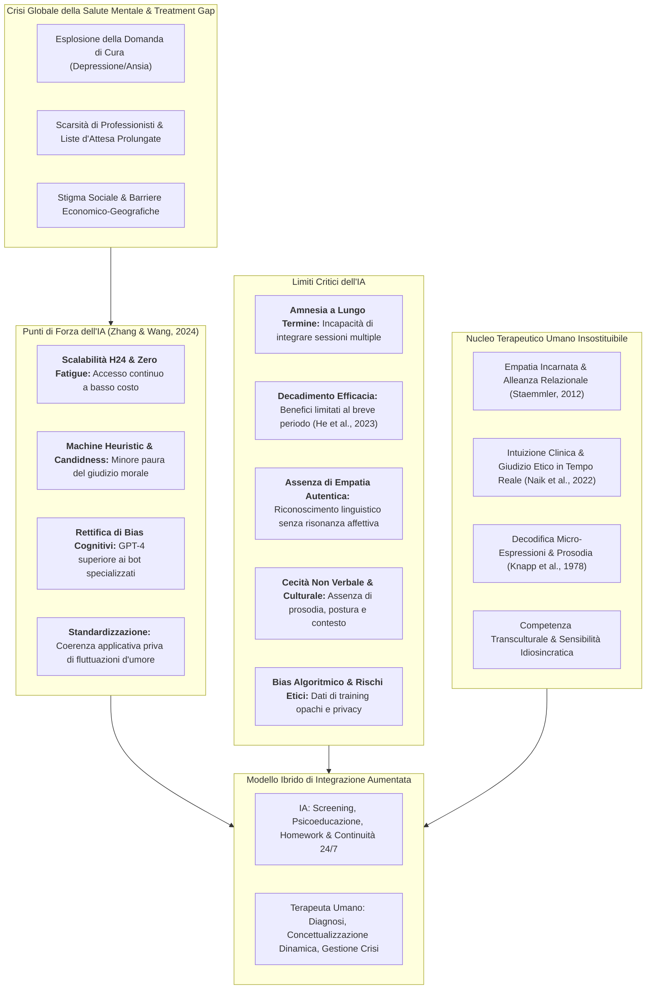

---
tags: [artificial-intelligence, psychotherapy, mental-health-care, chatgpt-4, gpt-4o, gpt-5, algorithmic-bias, machine-heuristic, patient-candidness, cognitive-bias-rectification, emotional-awareness-scale, clinical-intuition, burnout-reduction, frontiers-in-psychiatry]
source_papers: ["fpsyt-15-1444382.pdf"]
---

# Can AI Replace Psychotherapists? Exploring the Future of Mental Health Care (Zhang & Wang, 2024)

## Definizione Operativa
- **Saggio di opinione clinico-concettuale** (*Opinion Article*) pubblicato su *Frontiers in Psychiatry* da Zhihui Zhang (*Yunnan Agricultural University* e *Universitat Politècnica de Catalunya*) e Jing Wang (*Shenzhen Second People's Hospital*; 2024, Vol. 15, Art. 1444382; DOI: [10.3389/fpsyt.2024.1444382](https://doi.org/10.3389/fpsyt.2024.1444382)).
- **Oggetto e Obiettivo:** Esamina in modo critico e sistematico la questione se l'Intelligenza Artificiale (in particolare i Large Language Model come ChatGPT, GPT-4, GPT-4o e le prospettive di GPT-5) possa sostituire le funzioni tradizionalmente svolte dagli psicoterapeuti umani nell'assistenza alla salute mentale globale.
- **Inquadramento Clinico e CBT:** Struttura un confronto multidimensionale tra le competenze computazionali emergenti (elaborazione emotiva testuale, correzione di bias cognitivi, elaborazione massiva di dati, scalabilità H24, superamento dello stigma tramite la *machine heuristic*) e i limiti strutturali e clinici irriducibili dell'IA (amnesia a lungo termine, decadimento dell'efficacia nel tempo, bias algoritmico, assenza di empatia autentica incarnata, cecità alla comunicazione non verbale, carenza di intuizione professionale e competenza culturale).
- **Paradigma Conclusivo:** Rifiuta l'ipotesi della sostituzione totale (*replacement*) a favore di un modello di **integrazione aumentata** (*Augmentation Paradigm / Human-in-the-Loop*), in cui l'IA agisce come moltiplicatore di efficienza per colmare il divario globale di cura (*treatment gap*) preservando la centralità insostituibile della relazione terapeutica umana.

---

## Evidenze dalla Letteratura

### 1. Evoluzione Storica dell'IA in Psicoterapia
L'integrazione tecnologica nella cura della salute mentale ha attraversato quattro fasi evolutive cardinali:
1. **Anni '60 (ELIZA):** Joseph Weizenbaum sviluppa il primo agente conversazionale (1966) che simulava una consultazione psicoterapeutica rogersiana mediante semplici regole sintattiche e riformulazioni a specchio (*pattern matching*).
2. **Anni '80 (Sistemi Esperti):** Tentativi di formalizzare la conoscenza clinica in motori inferenziali basati su regole per la diagnosi e il supporto decisionale (Tai, 2020; Luxton, 2014).
3. **Fine XX Secolo (Computerized CBT - cCBT):** Introduzione di programmi digitali strutturati di Psicoterapia Cognitivo-Comportamentale per erogare interventi evidence-based standardizzati a distanza (Blackwell & Heidenreich, 2021).
4. **Era dei Foundation Models e Generative AI:** Con l'avvento dell'architettura Transformer e di modelli multimodali come ChatGPT (GPT-4, GPT-4o) e le future iterazioni (GPT-5), l'IA acquisisce la capacità di comprendere contesti emotivi complessi, elaborare linguaggio naturale altamente sfumato e gestire interazioni audio-video in tempo reale (Amin et al., 2023; OpenAI, 2024; Priyanka et al., 2024).

---

### 2. Consapevolezza Emotiva e Rettifica dei Bias Cognitivi
- **Emotional Awareness e Scale Psicometriche:**
  - Nello studio di Elyoseph et al. (2023), valutato mediante la *Levels of Emotional Awareness Scale* (LEAS), ChatGPT ha dimostrato capacità di identificare e articolare verbalmente le emozioni in scenari ipotetici con punteggi analoghi o superiori a quelli della popolazione generale.
  - Gli autori sottolineano una distinzione epistemologica fondamentale: l'"intelligenza emotiva" dell'IA è fondata sul riconoscimento di pattern statistici e sul modellamento linguistico (*linguistic pattern matching*), e non costituisce una comprensione o risonanza emotiva autentica (*simulated empathy*).
- **Riconoscimento e Correzione di Bias Cognitivi:**
  - Studi recenti (Rzadeczka et al., 2024) hanno documentato che i modelli fondazionali generalisti di grandi dimensioni (GPT-4, Gemini Pro) **surclassano nettamente i chatbot terapeutici dedicati** di prima generazione (come Wysa e Youper) nella capacità di identificare e correggere bias cognitivi e distorsioni attribuzionali (quali *overtrust*, *fundamental attribution error* e *just-world hypothesis*).
  - GPT-4 ha ottenuto i punteggi di rettifica più elevati, mentre i chatbot dedicati hanno fatto registrare le performance peggiori a causa della loro rigidità algoritmica scriptata.
- **Screening e Triage del Rischio:**
  - ChatGPT-4 è stato testato con successo in studi pilota per il rilevamento precoce di segnali di allarme clinico, incluse ideazioni suicidarie e crisi acute (Levkovich & Elyoseph, 2023), offrendo prime risposte psicoeducative e di de-escalation.

---

### 3. Limiti Strutturali del Terapeuta Umano
La spinta all'adozione dell'IA è alimentata da vincoli intrinseci dell'operatore umano:
1. **Vincoli di Risorse e Capacità di Carico (*Resource Constraints*):**
   - Il setting terapeutico tradizionale, imperniato su colloqui individuali da 30 a 60 minuti, pone un tetto rigido al numero di pazienti gestibili giornalmente.
   - Nelle aree ad alta domanda e bassa disponibilità di specialisti, ciò comporta liste d'attesa di mesi, con conseguente deterioramento clinico e cronicizzazione dei disturbi dell'umore e d'ansia (Trusler et al., 2006; van Dijk et al., 2023).
2. **Lavoro Emotivo e Burnout Professionale (*Emotional Labor & Burnout*):**
   - L'esposizione continuativa alla sofferenza psicologica severa richiede un elevato investimento affettivo, predisponendo a esaurimento emotivo, depersonalizzazione e affaticamento da compassione (*compassion fatigue*).
   - Il burnout degrada l'attenzione e la sintonizzazione empatica dell'operatore, aumentando il rischio di errori clinici e il turnover nei servizi sanitari (Simionato & Simpson, 2018; Varma, 1997; Deutsch, 1984).
3. **Limiti di Memoria e Personalizzazione Longitudinale:**
   - La memoria di lavoro umana e i bias cognitivi impliciti (es. bias legati allo status socioeconomico, al genere o al controtransfert) possono ostacolare la sintesi coerente di storie anamnestiche decennali e sfumature comportamentali sottili (Markin & Kivlighan, 2007; Dougall & Schwartz, 2011; Smith, 1980).

---

### 4. Vantaggi dell'IA sul Clinico Umano
- **Scalabilità Illimitata e Riduzione dei Costi:** Operatività continua H24, assenza di fatica, raggiungibilità globale e drastico abbattimento delle barriere economiche (Saxena et al., 2007; Olawade et al., 2024; Abbasi & Hswen, 2024).
- **Maggiore Sincerità del Paziente (*Enhanced Candidness & Machine Heuristic*):**
  - Numerosi studi documentano che gli utenti mostrano maggiore disponibilità a rivelare informazioni intime, pensieri stigmatizzati e comportamenti vergognosi quando interagiscono con una macchina rispetto a un terapeuta umano (Sundar & Kim, 2019; Chaudhry & Debi, 2024; Fulmer et al., 2018).
  - La percezione della macchina come entità oggettiva, neutra e priva di giudizio morale (*machine heuristic*) abbatte l'ansia da valutazione e facilita l'espressione spontanea del disagio (vedi [[patient-candidness-in-ai-interaction]]).
- **Consistenza e Imparzialità di Trattamento:** L'algoritmo applica i medesimi standard procedurali e protocolli terapeutici a prescindere dall'orario o dalla stanchezza, con il potenziale di ignorare variabili arbitrarie se adeguatamente calibrato (Wahl et al., 2018; Lin et al., 2021).

---

### 5. Limiti Critici dell'IA e Superiorità Irriducibile dell'Umano

1. **Amnesia e Mancanza di Memoria a Lungo Termine:** Sebbene gli LLM abbiano una potente memoria a breve termine nella finestra di contesto, non possiedono una memoria episodica nativa a lungo termine per mantenere la continuità anamnestica su orizzonti multi-seduta, rendendo necessari moduli esterni come MemoryBank o sintesi ricorsive (Zhong et al., 2024; Wang et al., 2023; Bai et al., 2023).
2. **Decadimento dell'Efficacia a Lungo Termine:** Meta-analisi su agenti conversazionali (He et al., 2023) rivelano che i miglioramenti sintomatici iniziali su ansia e depressione tendono a svanire nel tempo, evidenziando l'incapacità dell'IA di adattarsi all'evoluzione dinamica e non lineare dei bisogni psichici del paziente.
3. **Bias Algoritmico e Problematiche Etiche:** I modelli ereditano e possono amplificare i pregiudizi demografici, etnici e socioeconomici insiti nei dataset di addestramento (Akter et al., 2021). Inoltre, l'uso di biomarcatori e dati ultrasensibili solleva dilemmi critici di privacy, trasparenza e autonomia (Walsh et al., 2020; Li et al., 2022; Fusar-Poli et al., 2022).
4. **Le 5 Dimensioni di Superiorità Umana:**
   - **Empatia Autentica:** L'alleanza terapeutica poggia sulla risonanza emotiva vissuta; l'IA emette testo privo di stato interiore cosciente (Staemmler, 2012; Miller et al., 2020).
   - **Intuizione Clinica e Giudizio Etico:** Navigazione in tempo reale di emergenze e complessità etiche mediante saggezza pratica (Naik et al., 2022).
   - **Comunicazione Non Verbale:** Decodifica di postura, prosodia, micro-espressioni e sguardi, inaccessibili a sistemi puramente testuali (Knapp et al., 1978).
   - **Competenza Culturale:** Comprensione di codici simbolici e identitari specifici (Aggarwal et al., 2016).
   - **Continuità di Cura e Personalizzazione Idiosincratica** (Joyce et al., 2004).

---

## Tabella Comparativa: Terapeuta Umano vs Sistemi di IA

| Dimensione Clinico-Operativa | Psicoterapeuta Umano | Intelligenza Artificiale (LLM) |
| :--- | :--- | :--- |
| **Disponibilità & Scalabilità** | Limitata (sedute 1:1, orari diurni, liste d'attesa) | Illimitata (H24/7, globale, costo marginale zero) |
| **Rischio di Burnout** | Elevato (affaticamento da empatia, esaurimento) | Nullo (inattaccabile da fatica fisiologica o emotiva) |
| **Apertura del Paziente (*Candidness*)** | Frenata da stigma, vergogna e timore del giudizio | Massimizzata da neutralità percepita (*machine heuristic*) |
| **Correzione Bias Cognitivi** | Guidata da perizia ed esperienza clinica | Elevata e sistematica nei modelli generalisti (GPT-4) |
| **Memoria Longitudinale** | Integrazione qualitativa della storia del paziente | Limitata al contesto immediato (richiede RAG/MemoryBank) |
| **Efficacia a Lungo Termine** | Stabile e consolidata nella relazione clinica | Decadimento documentato dopo la fase iniziale (He et al.) |
| **Empatia & Risonanza Affettiva** | Autentica, incarnata e intersoggettiva | Emulata, testuale e puramente statistica |
| **Comunicazione Non Verbale** | Decodifica fine in tempo reale (viso, voce, corpo) | Assente o parziale (limitata alle feature computabili) |
| **Giudizio Etico & Intuizione** | Flessibile, deontologico e orientato al contesto | Rigido, basato su guardrail pre-programmati |

---

## Riferimenti Bibliografici
- Zhang, Z., & Wang, J. (2024). Can AI replace psychotherapists? Exploring the future of mental health care. *Frontiers in Psychiatry*, 15, 1444382. https://doi.org/10.3389/fpsyt.2024.1444382
- Akter, S., McCarthy, G., Sajib, S., Michael, K., Dwivedi, Y. K., D'Ambra, J., et al. (2021). Algorithmic bias in data-driven innovation in the age of AI. *International Journal of Information Management*, 60, 102387.
- Elyoseph, Z., Hadar-Shoval, D., Asraf, K., & Lvovsky, M. (2023). ChatGPT outperforms humans in emotional awareness evaluations. *Frontiers in Psychology*, 14, 1199058.
- Fulmer, R., Joerin, A., Gentile, B., Lakerink, L., & Rauws, M. (2018). Using psychological artificial intelligence (Tess) to relieve symptoms of depression and anxiety: randomized controlled trial. *JMIR Mental Health*, 5(4), e9782.
- Fusar-Poli, P., Manchia, M., Koutsouleris, N., Leslie, D., Woopen, C., Calkins, M. E., et al. (2022). Ethical considerations for precision psychiatry: a roadmap for research and clinical practice. *European Neuropsychopharmacology*, 63, 17–34.
- He, Y., Yang, L., Qian, C., Li, T., Su, Z., Zhang, Q., et al. (2023). Conversational agent interventions for mental health problems: systematic review and meta-analysis of randomized controlled trials. *Journal of Medical Internet Research*, 25, e43862.
- Levkovich, I., & Elyoseph, Z. (2023). Suicide risk assessments through the eyes of ChatGPT-3.5 versus ChatGPT-4: vignette study. *JMIR Mental Health*, 10, e51232.
- Rzadeczka, M., Sterna, A., Stolińska, J., Kaczyńska, P., & Moskalewicz, M. (2024). The efficacy of conversational artificial intelligence in rectifying the theory of mind and autonomy biases: Comparative analysis. *arXiv preprint arXiv:2406.13813*.
- Sundar, S. S., & Kim, J. (2019). Machine heuristic: When we trust computers more than humans with our personal information. In *Proceedings of the 2019 CHI Conference on Human Factors in Computing Systems* (pp. 1–9). ACM.
- Zhong, W., Guo, L., Gao, Q., Ye, H., & Wang, Y. (2024). MemoryBank: Enhancing large language models with long-term memory. In *Proceedings of the AAAI Conference on Artificial Intelligence*, 38(17), 19724–19731.

---

## Relazioni
- [[patient-candidness-in-ai-interaction]]
- [[cognitive-bias-rectification-in-llms]]
- [[machine-heuristics-in-therapy]]
- [[simulated-empathy-vs-authentic-presence]]
- [[clinical-readiness-gap-in-mh-chatbots]]
- [[modello-centauro-clinico]]
- [[digital-therapeutic-alliance]]
- [[memory-augmented-therapeutic-dialogue]]
- [[between-session-continuity-ai]]
- [[three-layer-governance-framework]]
- [[ai-assisted-psychotherapy]]
- [[ethical-guidance-professional-practice-1]]