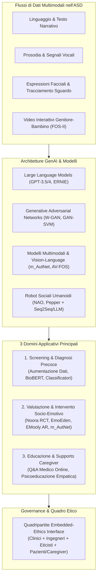
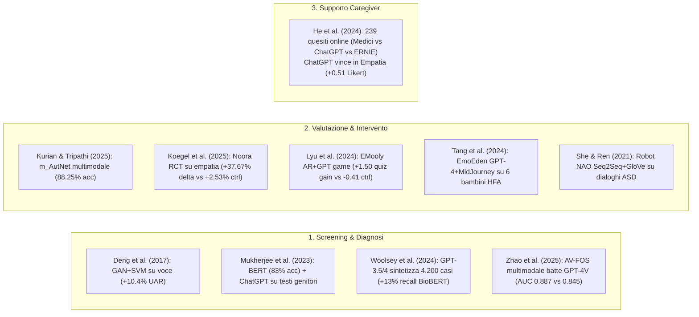
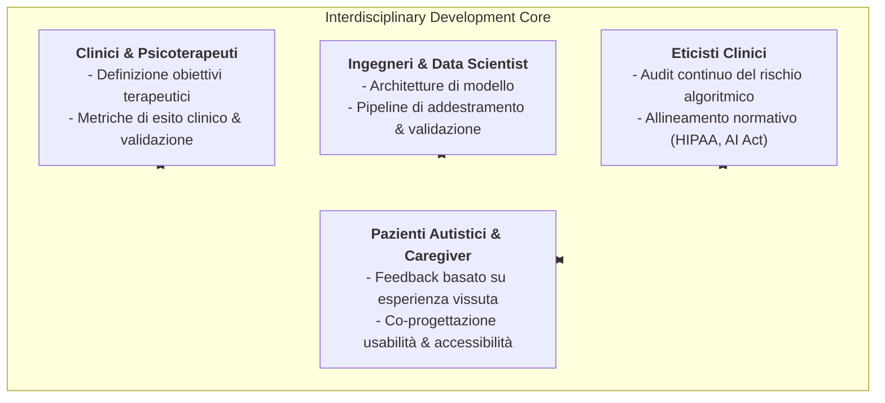

# Implementation of Generative AI for the Assessment and Treatment of Autism Spectrum Disorders: A Scoping Review (Sohn et al., 2025)

## Definizione Operativa
- Prima revisione sistematica esplorativa (*scoping review* conforme a PRISMA-ScR; OSF: `10.17605/OSF.IO/4GSYJ`) condotta da Jun-Seok Sohn, Eojin Lee, Jae-Jin Kim, Hyang-Kyeong Oh e Eunjoo Kim (Yonsei University College of Medicine & Gangnam Severance Hospital, 2025; *Frontiers in Psychiatry*), che mappa sistematicamente la letteratura empirica (2014–2025) sull'applicazione dell'Intelligenza Artificiale Generativa (LLM, GAN, modelli multimodali, robotica sociale e realtà aumentata) nella cura dei Disturbi dello Spettro Autistico (ASD).
- **Utilità Clinica e CBT:** Struttura il panorama applicativo dell'IA generativa nell'ASD in tre macro-domini clinici: (1) **Screening e Diagnosi Precoce** (classificatori basati su transformer, aumentazione di dataset rari tramite GAN e LLM, analisi multimodale degli stili interattivi); (2) **Valutazione e Intervento Terapeutico** (riconoscimento affettivo multimodale, storie sociali personalizzate con GenAI/AR, chatbot per il training empatico, robot sociali conversazionali); (3) **Supporto Psicoeducativo e Q&A per i Caregiver** (assistenza informativa on-demand ed elevata empatia percepita). Formalizza inoltre la *Quadripartite Embedded-Ethics Interface* per garantire sicurezza, interpretabilità e co-progettazione etica neurodivergente.

---

## Evidenze dalla Letteratura

### 1. Metodologia di Revisione e Criteri di Selezione
- **Processo di Selezione PRISMA-ScR:** Su 553 record identificati attraverso cinque banche dati (Embase $n=95$, PsycINFO $n=10$, PubMed $n=85$, Scopus $n=278$, Web of Science $n=85$) pubblicati tra il 1° gennaio 2014 (introduzione delle GAN) e il 28 febbraio 2025, 301 sono stati sottoposti a screening dopo deduplicazione e 162 a lettura integrale; **10 studi empirici** hanno soddisfatto tutti i criteri di inclusione (Sohn et al., 2025).
- **Affidabilità tra Valutatori:** L'accordo inter-rater ha raggiunto un valore Kappa di Cohen di $0.79$ su titoli/abstract e $0.86$ sui testi integrali (accordo quasi perfetto), con qualità metodologica valutata tramite il *Mixed Methods Appraisal Tool* (MMAT 2018).
- **Distribuzione Geografica:** Le affiliazioni dei primi autori riflettono una forte concentrazione in nazioni ad alto reddito (Stati Uniti $n=3$, Cina $n=3$, India $n=2$, Germania $n=1$, Giappone $n=1$), evidenziando una totale assenza di studi originati da paesi a basso e medio reddito (LMICs).

---

### 2. Sintesi delle Evidenze nei Tre Domini Clinici

#### A. Screening e Diagnosi Precoce
1. **Analisi del Parlato e Aumentazione con GAN:** Deng et al. (2017) hanno utilizzato le Generative Adversarial Networks (GAN) per estrarre rappresentazioni acustiche da oltre 6.380 vocalizzazioni di 102 bambini (disturbo autistico, PDD-NOS, disturbo specifico del linguaggio e sviluppo tipico); l'accoppiamento GAN + SVM ha raggiunto un *Unweighted Average Recall* (UAR) del 44.06%, con un incremento relativo del +10.40% rispetto alla baseline lineare.
2. **NLP su Narrazioni Genitoriali:** Mukherjee et al. (2023) hanno addestrato un modello BERT su narrazioni di genitori raccolte da community online, raggiungendo l'83% di accuratezza (precisione 0.87 per testi positivi a sintomi ASD, F1 0.79). L'impiego congiunto di ChatGPT (text-davinci-003) ha consentito di calcolare la similarità cosenica con librerie di sintomi DSM-5 per formulare raccomandazioni personalizzate.
3. **Generazione di Dati Clinici Sintetici:** Woolsey et al. (2024) hanno impiegato GPT-3.5-Turbo e GPT-4 per generare 4.200 frammenti testuali sintetici rappresentativi dei criteri comportamentali DSM-5 per l'ASD, ovviando alla scarsità di dati annotati (dati di sorveglianza CDC dell'Arizona). L'83% dei campioni sintetici è stato validato come clinicamente accurato da clinici esperti; l'integrazione di questi dati nell'addestramento di BioBERT ha incrementato la sensibilità/recall del +13%, pur comportando un calo del 16% nella precisione a causa dell'introduzione di rumore semantico.
4. **Analisi Multimodale degli Stili Interattivi (AV-FOS vs GPT-4V):** Zhao et al. (2025) hanno sviluppato **AV-FOS**, un'architettura transformer audio-visiva per la codifica automatizzata delle interazioni genitore-bambino secondo la *Family Observation Schedule* (FOS-II) su 216 registrazioni video di 83 bambini. AV-FOS ha ottenuto accuratezza di 0.8590, F1 di 0.5936 e AUC di 0.8868, superando modelli generici di Vision-Language come GPT-4V, reti SlowFast e Vision Transformer (ViT), dimostrando che i modelli specialistici *domain-specific* superano i VLM generici nei compiti clinici fini.

#### B. Valutazione e Intervento Terapeutico
1. **Riconoscimento Emotivo Multimodale (m_AutNet):** Kurian e Tripathi (2025) hanno sviluppato il framework m_AutNet che fonde feature facciali (CNN) e vocali con allineamento tramite Wasserstein GAN su 75 bambini con comportamenti stereotipati (stimming, head-banging, spinning), ottenendo un'accuratezza dell'88.25% nel riconoscimento affettivo in tempo reale.
2. **Training Empatico con Chatbot LLM (Noora - RCT):** Koegel et al. (2025) hanno condotto un trial controllato randomizzato (RCT) di 4 settimane con 30 adolescenti e adulti autistici (11–35 anni) utilizzando **Noora**, un sistema basato su GPT-4-0613 che offre feedback immediato sulle risposte empatiche. Il gruppo sperimentale ha registrato un miglioramento medio del **+37.67%** (delta pre-post) rispetto al **+2.53%** del gruppo di controllo in lista d'attesa; il 71% dei partecipanti ha mostrato trend positivi significativi con generalizzazione alle interazioni sociali quotidiane.
3. **Realtà Aumentata e Social Stories Generative (EMooly):** Lyu et al. (2024) hanno ideato **EMooly**, un gioco su tablet in 5 fasi che combina GPT-3.5/4 e AR per l'apprendimento socio-emotivo collaborativo tra bambini autistici (età media 6 anni, $N=24$) e caregiver. Il gruppo con EMooly ha mostrato un incremento di +1.50/10 nei quiz di riconoscimento emotivo rispetto a un decremento di -0.41 nel gruppo di controllo basato su presentazioni tradizionali.
4. **Narrazione Interattiva Personalizzata (EmoEden):** Tang et al. (2024) hanno integrato GPT-4 e MidJourney (niji-5) in **EmoEden** per generare storie sociali illustrate dinamiche su 6 bambini con autismo ad alto funzionamento (8–12 anni) per 22 giorni, evidenziando arricchimento del lessico emotivo e maggiore disponibilità all'espressione delle emozioni.
5. **Robotica Sociale Umanoide (NAO & Pepper):** She e Ren (2021) hanno implementato nel robot umanoide NAO un modello di dialogo Seq2Seq con attenzione e transfer learning da dialoghi infantili a dialoghi con bambini autistici, superando le baseline su metriche BLEU (0.23 vs 0.15) e valutazioni cliniche umane (punteggio qualità 3.23 vs 1.83). Bertacchini et al. (2023) hanno documentato la fattibilità dell'accoppiamento del robot Pepper con ChatGPT per sessioni psicoeducative strutturate.

#### C. Educazione dei Caregiver e Q&A Medico
1. **Confronto Medici vs Chatbot LLM:** He et al. (2024) hanno valutato 239 domande reali poste da 100 famiglie su piattaforme cinesi di consultazione medica online, confrontando ChatGPT-4, ERNIE Bot e risposte di medici specialisti.
2. **Esito della Valutazione tra Pari:** I medici sono stati preferiti nel 46.86% dei casi (rispetto al 34.87% per ChatGPT e 18.27% per ERNIE) per rilevanza, accuratezza clinica e utilità operativa.
3. **Il Vantaggio Empatico dell'LLM:** ChatGPT ha superato significativamente i medici nel punteggio di **empatia percepita** (+0.51 punti su scala Likert a 5 punti), indicando che i modelli linguistici possono fungere da eccellenti mediatori relazionali e psicoeducativi di prima linea, a patto di operare sotto stretta supervisione medica per prevenire imprecisioni fattuali (He et al., 2024; Sohn et al., 2025).

---

### 3. Tabella Sinottica delle Evidenze Comparative (Head-to-Head)

| Studio | Task Clinico | Approccio GenAI | Comparatore / Baseline | Metrica di Valutazione | $\Delta$ vs Miglior Comparatore |
| :--- | :--- | :--- | :--- | :--- | :---: |
| **Deng et al. (2017)** | Diagnosi vocale ASD | GAN + SVM | Linear SVM, RBF-SVM, MLP | Unweighted Average Recall (UAR) | **+3.09 pp** (vs MLP); **+10.40% rel.** |
| **Zhao et al. (2025)** | Riconoscimento stile interattivo (FOS-II) | AV-FOS (Transformer Multimodale) | GPT-4V, SlowFast, ViT | Accuracy / F1 Score / AUC | **+3.0 pp** acc (vs SlowFast); **+4.9 pp** F1 (vs ViT); **+4.2 pp** AUC |
| **Woolsey et al. (2024)** | Sintesi dati per BioBERT | Dati sintetici GPT-3.5/4 + BioBERT | BioBERT (senza aumentazione) | Recall / Precision | **+13 pp** recall / **-16 pp** precision |
| **Koegel et al. (2025)** | Training empatico | Chatbot basato su GPT-4 | Controllo lista d'attesa | Proporzione risposte empatiche corrette | **+35.14 pp** guadagno netto (+37.67% vs +2.53%) |
| **Lyu et al. (2024)** | Riconoscimento emotivo con AR | Contenuti GPT-4 + EMooly AR | Lezione tradizionale con diapositive | Variazione punteggio quiz pre-post (scala 10) | **+1.91 punti** guadagno netto (+1.50 vs -0.41) |
| **He et al. (2024)** | Q&A online per caregiver | ChatGPT-4 / ERNIE Bot | Risposte di medici specialisti | Preferenza valutatori / Empatia Likert | **-12.0 pp** preferenza globale / **+0.51** empatia (ChatGPT) |

---

## Vantaggi, Limiti Critici e Sfide di Implementazione

### Vantaggi Chiave
- **Iper-Personalizzazione e Adattabilità Dinamica:** I modelli linguistici e generativi gestiscono input non strutturati (trascritti di seduta, diari, narrazioni) e generano materiali terapeutici e storie sociali adattate agli interessi specifici e al livello evolutivo del paziente neurodivergente, prevenendo la noia da memorizzazione meccanica (Sohn et al., 2025).
- **Scalabilità e Continuità Assistenziale 24/7:** Possibilità di erogare supporto continuo a basso costo incrementale, abbattendo le barriere geografiche ed economiche per le famiglie in attesa di presa in carico specialistica.
- **Flessibilità Multi-Dominio e Multimodale:** Un'unica infrastruttura generativa può essere adattata a compiti eterogenei (screening, feedback empatico, generazione visiva con MidJourney, interfaccia robotica con NAO/Pepper).

### Limiti Tecnici ed Etici
- **Opacità Computazionale e Mancanza di Vera Interpretabilità (XAI):** A differenza degli alberi di decisione, gli LLM non esplicitano i marker linguistici o comportamentali precisi che hanno determinato una classificazione di rischio ASD; le spiegazioni generate a posteriori rappresentano plausibilità testuale e non il reale processo inferenziale interno (Sohn et al., 2025; Thirunavukarasu et al., 2023).
- **Rischio di Allucinazioni e Errori Diagnostici:** Falsi positivi o falsi negativi generati da prompt inadeguati o dati out-of-distribution rischiano di indurre interventi inappropriati o ritardi terapeutici dannosi.
- **Disparità Demografiche e Bias Algoritmico:** Evidenze derivate esclusivamente da coorti occidentali o asiatiche ad alto reddito, con grave sottorappresentazione culturale, linguistica e di genere (es. camouflaging/mascheramento femminile).
- **Privacy dei Dati Pediatrici e Consenso Informato:** Vulnerabilità legate alla memorizzazione di registrazioni audio-video e note cliniche sensibili in infrastrutture cloud; necessità di garantire l'autonomia del minore e il diritto di interruzione dell'interazione con l'agente artificiale.

---

## La Quadripartite Embedded-Ethics Interface

Per superare le criticità etiche e cliniche, Sohn et al. (2025) introducono e raccomandano l'adozione di una **Quadripartite Embedded-Ethics Interface** (ispirata ai modelli di *embedded ethics* di McLennan et al., 2022 e Cartolovni et al., 2022):

1. **Clinici:** Guidano la definizione dei costrutti psicopatologici, gli obiettivi dell'intervento e i criteri di sicurezza.
2. **Ingegneri:** Implementano vincoli architetturali, tecniche di Explainable AI (XAI) e filtri di moderazione.
3. **Eticisti Clinici:** Eseguono audit in tempo reale sui bias e allineano i sistemi ai framework di protezione dei dati.
4. **Pazienti Autistici e Caregiver:** Partecipano alla co-progettazione attiva (*participatory design*), garantendo il rispetto delle peculiarità sensoriali, comunicative e dei bisogni di autodeterminazione.

---

## Roadmap d'Azione per la Ricerca Futura (10 Priorità)

Sohn et al. (2025) formalizzano un'agenda operativa strutturata in 10 direttrici prioritarie:
1. **Integrazione Multimodale e Multidominio:** Sviluppo di warehouse pubbliche condivise che sincronizzino voce, tracciamento oculare, cinematica e biomarcatori.
2. **Trasparenza e Explainable AI (XAI):** Mappe di attivazione concettuale e spiegazioni controfattuali adattate ai fenotipi clinici dell'ASD.
3. **Interfacce Etiche Incorporate (*Ethics-by-Design*):** Sprint di sviluppo interdisciplinari con "GenAI-ethics rounds".
4. **Mitigazione dei Bias ed Equità Globale:** Raccolta dati mirata in cliniche di paesi a basso-medio reddito (LMICs) e stratificazione delle performance per genere ed etnia.
5. **Trial Clinici Longitudinali e Multi-Centrici:** Registrazione preventiva di protocolli RCT su larga scala per valutare il mantenimento dei guadagni funzionali a lungo termine.
6. **Esperienza Utente e Aderenza Prolungata:** Co-progettazione delle *persona* dei chatbot per massimizzare la retention oltre i 6 mesi.
7. **Formazione e Adozione Professionale:** Percorsi di micro-credenziali per aumentare la self-efficacy degli operatori sanitari e prevenire la paura di sostituzione tecnologica.
8. **Integrazione nel Flusso di Lavoro Clinico e Rimborsabilità:** Modellizzazione di costo-efficacia e mappatura delle tariffe assicurative/pubbliche.
9. **Ottimizzazione dell'Interazione Uomo-IA:** Prompt engineering sensibile alla neurodivergenza e regolazione adattiva dello sguardo robotico (*gaze-aversion*).
10. **Aumentazione dei Dati e Architetture Specifiche per ASD:** Dataset sintetici benchmark con metadati di provenienza e modelli di diffusione per video-scenari sociali.

---

## Riferimenti Bibliografici
- Sohn, J.-S., Lee, E., Kim, J.-J., Oh, H.-K., & Kim, E. (2025). Implementation of generative AI for the assessment and treatment of autism spectrum disorders: a scoping review. *Frontiers in Psychiatry*, 16, 1628216. https://doi.org/10.3389/fpsyt.2025.1628216
- Deng, J., Cummins, N., Schmitt, M., Qian, K., Ringeval, F., & Schuller, B. (2017). Speech-based diagnosis of autism spectrum condition by generative adversarial network representations. In *Proceedings of the 2017 International Conference on Digital Health* (pp. 53–57). ACM. https://doi.org/10.1145/3079452.3079463
- He, W., Zhang, W., Jin, Y., Zhou, Q., Zhang, H., & Xia, Q. (2024). Physician versus large language model chatbot responses to web-based questions from autistic patients in Chinese: cross-sectional comparative analysis. *Journal of Medical Internet Research*, 26, e54706. https://doi.org/10.2196/54706
- Koegel, L. K., Ponder, E., Bruzzese, T., Wang, M., Semnani, S. J., Chi, N., et al. (2025). Using artificial intelligence to improve empathetic statements in autistic adolescents and adults: A randomized clinical trial. *Journal of Autism and Developmental Disorders*. https://doi.org/10.1007/s10803-025-06734-x
- Kurian, A., & Tripathi, S. (2025). M_AutNet–a framework for personalized multimodal emotion recognition in autistic children. *IEEE Access*, 13, 1651–1662. https://doi.org/10.1109/ACCESS.2024.3403087
- Lyu, Y., Liu, D., An, P., Tong, X., Zhang, H., Katsuragawa, K., et al. (2024). EMooly: supporting autistic children in collaborative social-emotional learning with caregiver participation through interactive AI-infused and AR activities. *Proceedings of the ACM on Interactive, Mobile, Wearable and Ubiquitous Technologies*, 8(3), 1–36. https://doi.org/10.1145/3699738
- McLennan, S., Fiske, A., Tigard, D., Müller, R., Haddadin, S., & Buyx, A. (2022). Embedded ethics: a proposal for integrating ethics into the development of medical AI. *BMC Medical Ethics*, 23, 6. https://doi.org/10.1186/s12910-022-00746-3
- Mukherjee, P., GR, S., Sadhukhan, S., Godse, M., & Chakraborty, B. (2023). Detection of autism spectrum disorder (ASD) from natural language text using BERT and ChatGPT models. *International Journal of Advanced Computer Science and Applications*, 14(11), 1–36. https://doi.org/10.14569/IJACSA.2023.0141041
- She, T., & Ren, F. (2021). Enhance the language ability of humanoid robot NAO through deep learning to interact with autistic children. *Electronics*, 10(19), 2393. https://doi.org/10.3390/electronics10192393
- Tang, Y., Chen, L., Chen, Z., Chen, W., Cai, Y., Du, Y., et al. (2024). EmoEden: applying generative artificial intelligence to emotional learning for children with high-function autism. In *Proceedings of the 2024 CHI Conference on Human Factors in Computing Systems* (pp. 1–20). ACM. https://doi.org/10.1145/3613904.3642899
- Woolsey, C. R., Bisht, P., Rothman, J., & Leroy, G. (2024). Utilizing large language models to generate synthetic data to increase the performance of BERT-based neural networks. *Proceedings of the AMIA Joint Summits on Translational Science*, 2024, 429–438.
- Zhao, Z., Chung, E., Chung, K. M., & Park, C. H. (2025). AV-FOS: A transformer-based audio-visual multi-modal interaction style recognition for children with autism based on the family observation schedule (FOS-II). *IEEE Journal of Biomedical and Health Informatics*. https://doi.org/10.1109/JBHI.2025.3542066

---

## Relazioni
- Vedi anche: [[genai-in-autism-spectrum-disorders]], [[embedded-ethics-interface]], [[ai-assistive-autism-communication]], [[simulazione-pazienti-ai]], [[modello-centauro-clinico]], [[large-language-models]], [[digital-therapeutics-ai]], [[automated-clinical-ai-red-teaming]]
