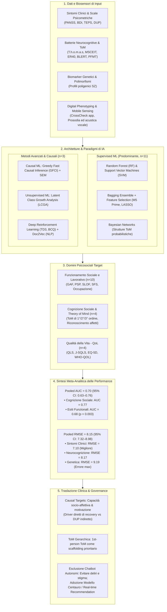
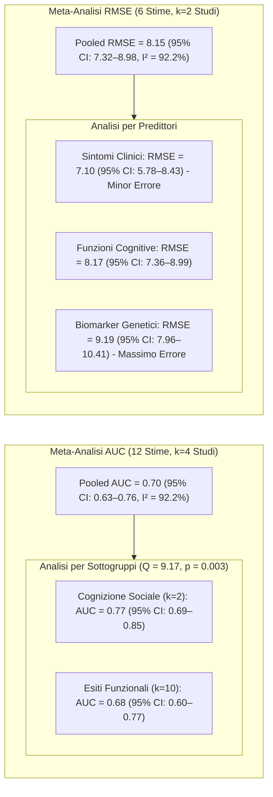

# Application of Artificial Intelligence and Psychosocial Functioning in Psychosis: A Systematic Review and Meta-Analysis (Mok, Cheng & Chu, 2025)

## Definizione Operativa
- Prima revisione sistematica e meta-analisi condotta secondo le linee guida **PRISMA 2020** e registrata su **PROSPERO (CRD420251051952)** da Chloe Ho Yee Mok, Calvin Pak Wing Cheng e Menza Hon Wai Chu (*Department of Psychiatry, The University of Hong Kong* e *Occupational Therapy Department, Kwai Chung Hospital*, Hong Kong; pubblicata su *Frontiers in Psychiatry*, novembre 2025, doi: 10.3389/fpsyt.2025.1692177).
- **Inquadramento dello Studio:** Esamina in modo rigoroso 14 studi empirici peer-reviewed (2010–2025) selezionati da *PubMed*, *Scopus* e *ACM Digital Library* per mappare l'applicazione dell'Intelligenza Artificiale (IA) e del Machine Learning (ML) alla valutazione, predizione ed esplorazione meccanicistica del **funzionamento psicosociale** nei disturbi dello spettro psicotico (schizofrenia cronica, psicosi all'esordio / FEP, disturbo schizoaffettivo).
- **Utilità Clinica e CBT:** Segna un cambio di paradigma rispetto alla letteratura precedente (prevalentemente focalizzata sulla diagnosi binaria o sulla classificazione mediante neuroimaging acuto), indirizzando l'IA verso gli indicatori determinanti per la *recovery* e gli esiti terapeutici a lungo termine: funzionamento interpersonale e lavorativo, cognizione sociale (*Theory of Mind* - ToM, riconoscimento delle emozioni facciali) e qualità della vita (QoL). Delinea inoltre i modelli di *Causal Machine Learning* per individuare i target terapeutici primari e motiva l'esclusione di agenti conversazionali autonomi a favore di sistemi di raccomandazione a supporto del terapeuta umano.

---

## Evidenze dalla Letteratura e Risultati Meta-Analitici

### 1. Metodologia di Selezione e Tassonomia delle Tecniche di IA
- **Processo di Selezione PRISMA:** Da un pool iniziale di 711 record identificati (database PubMed, Scopus e ACM Digital Library; 2010–2025), 37 articoli completi sono stati esaminati e **14 studi empirici** hanno soddisfatto pienamente i criteri di inclusione (9 condotti in paesi occidentali, 5 in paesi asiatici, di cui 3 basati sulla medesima coorte taiwanese di 302 pazienti con schizofrenia).
- **Ripartizione delle Tecnologie di IA:**
  - *Supervised Machine Learning (n=11):* È l'approccio ampiamente prevalente. L'algoritmo **Random Forest (RF)** è risultato il più frequente (4 studi; Li et al., 2022; Shibata et al., 2023; Wang et al., 2020; Miley et al., 2024), seguito dalle **Support Vector Machines (SVM)** (3 studi; de Nijs et al., 2021; Walter et al., 2024; Wang et al., 2020), da modelli di *Bagging ensemble* combinati con reti neurali multistrato (*MFNN*) o regressione lineare (Lin et al., 2021a, 2021b), *boosting* (AdaBoost, XGBoost), modelli regolarizzati (*LASSO*, *Elastic Net*), *k-NN*, *Stochastic Gradient Descent (SGD)* e *Reti Bayesiane* (Bosco et al., 2024).
  - *Feature Selection:* L'integrazione di tecniche di selezione delle feature (es. *M5 Prime*, *LASSO*, *Recursive Feature Elimination - RFE*, *Gini Importance*) è risultata cruciale per incrementare l'accuratezza e ridurre la dimensionalità in dataset clinici complessi.
  - *Unsupervised Machine Learning (n=1):* Impiego della *Latent Class Growth Analysis (LCGA)* per identificare traiettorie longitudinali eterogenee di risposta al training di cognizione sociale (Miley et al., 2024).
  - *AutoML (n=1):* Utilizzo del *Tree-based Pipeline Optimization Tool (TPOT)* per automatizzare la selezione delle pipeline ottimali di classificazione della cognizione sociale (Lin et al., 2024).
  - *Causal Machine Learning (n=1):* Applicazione dell'algoritmo *Greedy Fast Causal Inference (GFCI)* integrato con *Structural Equation Modeling (SEM)* per svelare catene causali e driver diretti del funzionamento psicosociale (Miley et al., 2023).
  - *Deep Reinforcement Learning (DRL) & NLP (n=1):* Sviluppo di un sistema di raccomandazione in tempo reale per la psicoterapia mediante *Deep Deterministic Policy Gradient (DDPG)*, *Twin Delayed DDPG (TD3)*, *Batch Constrained Q-Learning (BCQ)* e vettorizzazione testuale con *Doc2Vec* (Lin et al., 2023).

---

### 2. Domini Psicosociali e Strumenti di Misurazione

| Dominio Psicosociale | N° Studi | Strumenti di Misurazione Adottati | Algoritmi con Prestazioni Superiori |
| :--- | :---: | :--- | :--- |
| **Funzionamento Sociale e Lavorativo** | 10 | GAF (*Global Assessment of Functioning*), PSP (*Personal and Social Performance*), SLOF (*Specific Levels of Functioning*), SFS (*Social Functioning Scale*), GF-S (*Global Functioning-Social*), Tasso di Occupazione | **Random Forest (RF)** con LASSO (Acc: 79.5%, AUC: 0.867); **Bagging Ensemble** con M5 Prime |
| **Cognizione Sociale & Theory of Mind (ToM)** | 4 | T.h.o.m.a.s (*Theory of Mind Assessment Scale*), ER40 (*Penn Emotion Recognition*), BLERT (*Brief Living Face Emotional Recognition*), PFMT, MSCEIT, EA (*Empathic Accuracy*) | **Reti Bayesiane** (Acc: 86.4% nella discriminazione SZ vs Controlli); **RF / AdaBoost** con Gini Importance (AUC: 0.83–0.86) |
| **Qualità della Vita (QoL)** | 4 | QLS (*Quality of Life Scale*), J-SQLS (*Japanese Schizophrenia Quality of Life Scale*), EQ-5D, WHO-QOL | **Bagging Ensemble** con RF/Regressione (RMSE: 6.43); k-NN e RF su feature vocali |

---

### 3. Prestazioni Quantitative: Risultati della Meta-Analisi

- **Discriminazione e Classificazione (AUC):**
  - Il modello a effetti casuali ha prodotto un **AUC aggregato di 0.70** (95% CI: 0.63–0.76), indicando un'accuratezza discriminativa complessivamente moderata.
  - L'eterogeneità statistica tra gli studi è risultata molto elevata ($I^2 = 92.2\%$), imputabile alla diversità degli strumenti psicometrici e delle popolazioni cliniche.
  - L'analisi per sottogruppi ha rivelato una discrepanza statisticamente significativa ($Q_{\text{between}} = 9.17$, $df = 1$, $p = 0.003$): i modelli focalizzati sulla **cognizione sociale** (riconoscimento delle emozioni facciali, ToM) hanno ottenuto un'accuratezza nettamente superiore (**AUC = 0.77**, 95% CI: 0.69–0.85) rispetto a quelli mirati a complessi esiti funzionali e lavorativi nel mondo reale (**AUC = 0.68**, 95% CI: 0.60–0.77).
  - L'analisi di sensibilità *Leave-One-Out (LOO)* ha confermato la solidità delle stime (AUC stabile tra 0.68 e 0.71). L'esclusione dell'unico studio ad alto rischio di bias ha elevato l'AUC a **0.71** (95% CI: 0.64–0.78).
- **Stima dell'Errore di Predizione (RMSE):**
  - Il **RMSE aggregato è stato pari a 8.15** (95% CI: 7.32–8.98; $I^2 = 92.2\%$).
  - La stratificazione per dominio predittivo ha evidenziato che i modelli alimentati da **sintomi clinici** (PANSS, scale affettive) presentano la massima precisione predittiva (**RMSE = 7.10**, 95% CI: 5.78–8.43), seguiti dalle batterie neurocognitive classiche (**RMSE = 8.17**, 95% CI: 7.36–8.99). Al contrario, i profili basati esclusivamente su **biomarker genetici** hanno mostrato il livello di errore più elevato (**RMSE = 9.19**, 95% CI: 7.96–10.41).

---

### 4. Esplorazione Meccanicistica: Causal Discovery e Gerarchia della ToM
- **Causal Machine Learning per i Target Psicosociali (Miley et al., 2023):** L'applicazione dell'algoritmo di scoperta causale *GFCI* accoppiato a modelli *SEM* ha permesso di superare le mere correlazioni statistiche, isolando i reali driver causali del funzionamento lavorativo e sociale nella psicosi all'esordio:
  - La **capacità socio-affettiva** (*social affective capacity*, ovvero il piacere sociale e la responsività emotiva) e la **motivazione intrinseca** esercitano un'influenza causale **diretta** sulle capacità funzionali e lavorative.
  - Il deficit neurocognitivo generale e la durata della psicosi non trattata (*Duration of Untreated Psychosis - DUP*), storicamente considerati predittori primari, **non costituiscono cause dirette**, ma agiscono come fattori distali mediati dalle variabili affettivo-motivazionali.
- **Modellazione Computazionale Bayesiana della Theory of Mind (Bosco et al., 2024):** L'utilizzo delle Reti Bayesiane applicate alla scala *T.h.o.m.a.s* ha rivelato una precisa architettura causale gerarchica:
  - La **ToM di prima persona di primo ordine** (*first-order first-person ToM*, consapevolezza introspettiva dei propri stati mentali) rappresenta il pilastro fondante che condiziona causalmente le abilità ToM più complesse.
  - Nella schizofrenia, i deficit più severi e invalidanti si concentrano nella **ToM di secondo ordine** (credenze ricorsive) e nella **ToM allocentrica di terza persona** (*third-person ToM*, comprendere gli stati mentali altrui in modo decontestualizzato).

---

### 5. Monitoraggio Continuo, Digital Phenotyping e Recommendation
- **Passive Mobile Sensing & Audio Acoustics:**
  - *CrossCheck App (Wang et al., 2020):* Utilizzo di sensori passivi su smartphone (geolocalizzazione, sblocco schermo, microfono ambientale, accelerometro) per stimare il punteggio della *Social Functioning Scale (SFS)* con un errore medio assoluto (*MAE*) di 2.17–2.79 (~10% di errore). Le performance risultano ottimali nella sottoscala di indipendenza funzionale e minime nelle attività ricreative.
  - *Analisi Acustica della Prosodia Vocale (Shibata et al., 2023):* Modelli k-NN e Random Forest estraggono parametri prosodici (frequenza fondamentale $F_0$, jitter, formanti) dal parlato spontaneo per stimare la qualità di vita soggettiva (*J-SQLS*), evidenziando una maggiore accuratezza nel monitoraggio longitudinale intra-individuale.
- **Real-Time Recommendation Systems per la Psicoterapia (Lin et al., 2023):** L'impiego del Deep Reinforcement Learning offline (*Batch Constrained Q-Learning - BCQ*) permette di suggerire ai clinici argomenti di conversazione e tecniche terapeutiche in tempo reale durante la seduta, ottenendo un'accuratezza del **64%** rispetto alle scelte di terapeuti esperti, salvaguardando l'alleanza terapeutica.
- **Perché i Chatbot Generativi Autonomi Sono Inadatti alla Psicosi:** La review sottolinea l'assenza e la netta sconsigliatura di chatbot clinici autonomi basati su LLM (es. Woebot, ChatGPT) nel trattamento della psicosi:
  1. *Pregiudizi e Stigma nei Dati di Addestramento:* I grandi modelli linguistici riflettono bias sociali e visioni stigmatizzanti sui pazienti con schizofrenia (Alliende et al., 2024);
  2. *Rischio di Alimentare Deliri (AI Psychosis):* La natura compiacente e sicofantica dei chatbot rischia di validare deliri persecutori o megalomanici;
  3. *Bassa Accettabilità e Perdita di Empatia:* Il 50% dei pazienti dichiara maggiore comfort nel dialogare con esseri umani e nessuno percepisce il chatbot come più professionale (Arbanas et al., 2025).

---

### 6. Valutazione Metodologica, Bias e Certezza GRADE

| Strumento di Valutazione | Ambito Applicato | Giudizio Complessivo & Note Metodologiche |
| :--- | :--- | :--- |
| **NOS / NOS Adattata** | Studi di Coorte e Cross-Sectional (n=12) | **Qualità Buona (Low Risk of Bias)** nella maggioranza degli studi; 2 studi valutati come "Fair" per campionamento limitato. |
| **PROBAST** | Prediction Model / Proof-of-Concept (n=1) | **Basso Rischio di Bias** in tutti i domini di sviluppo e validazione computazionale (Lin et al., 2023). |
| **RoB 2.0 (Cochrane)** | Randomized Controlled Trial (n=1) | **Alto Rischio di Bias Complessivo** (Walter et al., 2024) dovuto a dati di outcome mancanti e attrition bias nel campione di intervento. |
| **GRADE Framework** | Sintesi Quantitativa (AUC & RMSE) | **Certezza 'Bassa' (Low)** per AUC (downgrade per eterogeneità elevata $I^2=92\%$ e indirectness); **'Molto Bassa' (Very Low)** per RMSE (downgrade per imprecisione dovuta alla dipendenza da un'unica coorte). |

---

## Implicazioni Cliniche e CBT

1. **Stratificazione Precoce del Rischio Funzionale:** L'impiego combinato di *Random Forest* e *Bagging con feature selection (M5 Prime)* consente di identificare precocemente i pazienti con psicosi all'esordio o cronica a rischio di declino occupazionale e isolamento, permettendo l'avvio tempestivo di interventi specialistici di riabilitazione psicosociale.
2. **Prioritizzazione dei Target Causali negli Interventi CBT:** Poiché la scoperta causale (*GFCI*) dimostra che la *capacità socio-affettiva* e la *motivazione intrinseca* guidano direttamente gli esiti funzionali nel mondo reale, i protocolli CBT devono dare priorità a interventi esperienziali mirati sul piacere anticipatorio/consumatorio (attivazione comportamentale per anedonia, tecniche di amplificazione emotiva positiva) rispetto al semplice addestramento cognitivo astratto.
3. **Scaffolding Gerarchico nella Riabilitazione della ToM (Social Cognition Training - SCT):** Basandosi sull'evidenza bayesiana, il training metacognitivo e sociale deve consolidare prima la consapevolezza introspettiva in prima persona (*1st-person ToM*), per poi progredire gradualmente verso il decentramento prospettico e la ToM allocentrica di terzo ordine.
4. **Adozione del Paradigma "Centauro Clinico" (Human-in-the-Loop):** Rifiuto categorico della sostituzione del clinico con chatbot non supervisionati; adozione di modelli di IA co-pilota e sistemi di raccomandazione in tempo reale (*Lin et al., 2023*) per supportare il terapeuta umano preservando il legame empatico e la sicurezza relazionale.

---

## Riferimenti Bibliografici
- Mok, C. H. Y., Cheng, C. P. W., & Chu, M. H. W. (2025). Application of artificial intelligence and psychosocial functioning in psychosis: a systematic review and meta-analysis. *Frontiers in Psychiatry*, 16, 1692177. https://doi.org/10.3389/fpsyt.2025.1692177
- Alliende, L. M., Sands, B. R., & Mittal, V. A. (2024). Chatbots and stigma in schizophrenia: the need for transparency. *Schizophrenia Bulletin*, 50(5), 957–960. https://doi.org/10.1093/schbul/sbae105
- Arbanas, G., Periša, A., Biliškov, I., Sušac, J., Badurina, M., & Arbanas, D. (2025). Patients prefer human psychiatrists over chatbots: a cross-sectional study. *Croatian Medical Journal*, 66(1), 13–19. https://doi.org/10.3325/cmj.2025.66.13
- Badal, V. D., Depp, C. A., Hitchcock, P. F., Penn, D. L., Harvey, P. D., & Pinkham, A. E. (2021). Computational methods for integrative evaluation of confidence, accuracy, and reaction time in facial affect recognition in schizophrenia. *Schizophrenia Research: Cognition*, 25, 100196. https://doi.org/10.1016/j.scog.2021.100196
- Bosco, F. M., Colle, L., Salvini, R., & Gabbatore, I. (2024). A machine-learning approach to investigating the complexity of theory of mind in individuals with schizophrenia. *Heliyon*, 10(6), e30693. https://doi.org/10.1016/j.heliyon.2024.e30693
- de Nijs, J., Burger, T. J., Janssen, R. J., Kia, S. M., van Opstal, D. P. J., de Koning, M. B., et al. (2021). Individualized prediction of three- and six-year outcomes of psychosis in a longitudinal multicenter study: a machine learning approach. *npj Schizophrenia*, 7(1), 34. https://doi.org/10.1038/s41537-021-00162-3
- Leighton, S. P., Upthegrove, R., Krishnadas, R., Benros, M. E., Broome, M. R., Gkoutos, G. V., et al. (2019). Development and validation of multivariable prediction models of remission, recovery, and quality of life outcomes in people with first episode psychosis: a machine learning approach. *The Lancet Digital Health*, 1(6), e261–e270. https://doi.org/10.1016/S2589-7500(19)30121-9
- Li, C., Wang, W., Guo, Q., Jiang, L., Qiao, K., Hu, Y., et al. (2022). Deep learning system for brain image-aided diagnosis of multiple major mental disorders. *bioRxiv*, 2022-06. https://doi.org/10.1101/2022.06.01.22275855
- Lin, B., Cecchi, G., & Bouneffouf, D. (2023). Psychotherapy AI companion with reinforcement learning recommendations and interpretable policy dynamics. In *Companion Proceedings of the ACM Web Conference 2023 (WWW '23)* (pp. 932–939). ACM. https://doi.org/10.1145/3543873.3587623
- Lin, E., Lin, C. H., & Lane, H. Y. (2021a). Applying a bagging ensemble machine learning approach to predict the functional outcome of schizophrenia with clinical symptoms and cognitive functions. *Scientific Reports*, 11, 6922. https://doi.org/10.1038/s41598-021-86382-0
- Lin, E., Lin, C. H., & Lane, H. Y. (2021b). Prediction of functional outcomes of schizophrenia with genetic biomarkers using a bagging ensemble machine learning method. *Scientific Reports*, 11, 10179. https://doi.org/10.1038/s41598-021-89540-6
- Lin, E., Lin, C. H., & Lane, H. Y. (2024). Inference of social cognition in schizophrenia patients with neurocognitive domains and neurocognitive tests using automated machine learning. *Asian Journal of Psychiatry*, 91, 103866. https://doi.org/10.1016/j.ajp.2023.103866
- Miley, K., Meyer-Kalos, P., Ma, S., Bond, D. J., Kummerfeld, E., & Vinogradov, S. (2023). Causal pathways to social and occupational functioning in the first episode of schizophrenia: uncovering unmet treatment needs. *Psychological Medicine*, 53(5), 2041–2049. https://doi.org/10.1017/S0033291721003780
- Miley, K., Bronstein, M. V., Ma, S., Lee, H., Green, M. F., Ventura, J., et al. (2024). Trajectories and predictors of response to social cognition training in people with schizophrenia: A proof-of-concept machine learning study. *Schizophrenia Research*, 266, 92–99. https://doi.org/10.1016/j.schres.2024.02.027
- Shibata, Y., Victorino, J. F., Natsuyama, T., Okamoto, N., Yoshimura, R., & Shibata, T. (2023). Estimation of subjective quality of life in schizophrenic patients using speech features. *Frontiers in Rehabilitation Sciences*, 4, 1121034. https://doi.org/10.3389/fresc.2023.1121034
- Walter, N., Wenzel, J., Haas, S. S., Squarcina, L., Bonivento, C., Ruef, A., et al. (2024). A multivariate cognitive approach to predict social functioning in recent onset psychosis in response to computerized cognitive training. *Progress in Neuro-Psychopharmacology and Biological Psychiatry*, 128, 110864. https://doi.org/10.1016/j.pnpbp.2023.110864
- Wang, W., Mirjafari, S., Harari, G., Ben-Zeev, D., Brian, R., Choudhury, T., et al. (2020). Social sensing: Assessing social functioning of patients living with schizophrenia using mobile phone sensing. In *Proceedings of the 2020 CHI Conference on Human Factors in Computing Systems* (pp. 1–15). ACM. https://doi.org/10.1145/3313831.3376855

---

## Relazioni
- Vedi anche: [[ai-psychosocial-functioning-in-psychosis]], [[causal-discovery-psychosocial-targets]], [[applied-theory-of-mind-llm]], [[ai-psychosis]], [[modello-centauro-clinico]], [[synthetic-psychopathology]], [[multimodal-anxiety-detection-ai]], [[social-media-phenotyping-anxiety]], [[clinical-ai-simulation]], [[supervisione-clinica-ai]]
